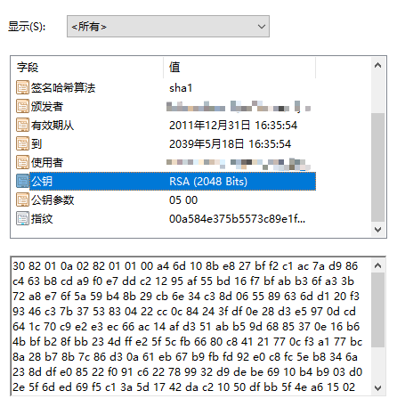
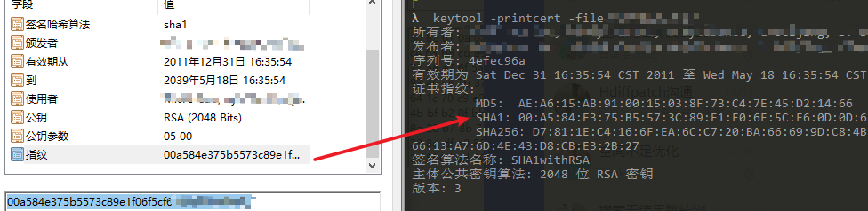
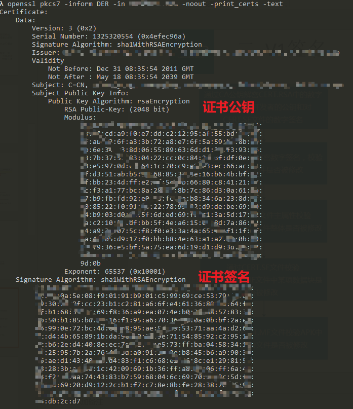

# APK签名机制

# 1、什么是apk签名

android应用在安装过程中会对apk进行签名校验，主要用于验证apk的可靠性、安全性以及唯一性，保证apk是有可信性的发布者发布，防止发布后被篡改；另外在apk升级时除了包名一致，签名也要一致。要了解签名和验签过程需要先了解以下几个基本概念。

## 1.1、基本概念

### 1.1.1、数字摘要 

数字摘要就是采用单向Hash函数将需要加密的明文“摘要”成一串固定长度（128位）的密文这一串密文又称为数字指纹，它有固定的长度，而且不同的明文摘要成密文，其结果总是不同的，而同样的明文其摘要必定一致。常用的数字摘要技术（Digital Digest）也称作为安全HASH编码法（SHA：Secure Hash Algorithm）。对所要传输的数据进行运算生成信息摘要，它并不是一种加密机制，但却能产生信息的数字"指纹"，它的目的是为了确保数据没有被修改或变化，保证信息的完整性不被破坏。

### 1.1.2、数字签名

数字签名的作用就是保证信息传输的完整性、发送者的身份认证、防止交易中的抵赖发生。**数字签名技术是将摘要信息用发送者的私钥加密**，与原文一起传送给接收者。接收者只有**用发送者的公钥才能解密被加密的摘要信息然后用HASH函数对收到的原文产生一个摘要信息，与解密的摘要信息对比**。如果相同，则说明收到的信息是完整的，在传输过程中没有被修改，否则说明信息被修改过，因此数字签名能够验证信息的完整性。

### 1.1.3、数字证书

数字证书是由权威公证的第三方认证机构（即CA，Certificate Authority）负责签发和管理的、个人或企业的网络数字身份证明。A的数字签名可以类比为现实世界中的签名，用来证明一个文件或者消息是A签署的，通常是使用A的私钥对消息摘要加密而得到，其他人可以使用A的公钥对数字签名进行验证。但是怎么才能信任A的公钥呢？让A自己证明自己是一件很难的事情，因此就需要第三方来证明，这就是数字证书的意义所在。

## 1.2、apk签名和验签原理


### 1.2.1、APK签名过程

1. 计算摘要：使用数字摘要算法计算出apk的摘要；
2. 签名：通过私钥对摘要进行加密，加密后的信息就是签名；
3. 写入签名：将签名信息、证书以及公钥写入到文件中。

### 1.2.2、APK验签过程

1. 解密签名：通过公钥解密签名信息获得摘要；
2. 计算摘要：使用摘要算法从接收的数据中计算摘要；
3. 比较摘要：比较解密出的摘要和通过文件计算的摘要，若一致，则校验通过。

接下来介绍下现有的几种apk签名的方式。

# 2、v1 签名

V1签名又称为JAR签名，是对jar包进行签名的一种机制，由于jar包apk本质上都是zip包，所以可以应用到对apk的签名。解压apk后，META-INF目录中存放的就是签名相关的文件。

## 2.1 META-INF

META-INF 文件夹下有三个文件：MANIFEST.MF、CERT.SF、CERT.RSA。它们就是签名过程中生成的文件，作用如下。

### 2.1.1、MANIFEST.MF

对APK中所有文件计算摘要保存到该文件中。

```
Manifest-Version: 1.0
Created-By: 1.8.0_212 (Oracle Corporation)

Name: AndroidManifest.xml
SHA1-Digest: GpiU1HOPO9rxpTPh43kG1XVG8iw=

Name: META-INF/BdTuringSdk_cnRelease.kotlin_module
SHA1-Digest: PVHPdoZ9+09Zq0PF+eJz0yRVf10=
...
```

### 2.1.2、CERT.SF

- SHA1-Digest-Manifest-Main-Attributes：对 MANIFEST.MF 头部计算摘要。
- SHA1-Digest-Manifest：对 MANIFEST.MF 文件计算摘要。
- SHA1-Digest：对 MANIFEST.MF 的各个条目计算摘要。

```
Signature-Version: 1.0
SHA1-Digest-Manifest-Main-Attributes: TN5zBsqBLAij6alOeMWe+Ejwd4g=
SHA1-Digest-Manifest: PBUX5Kag9TIOJy4jZ57vwuAur1Y=
Created-By: 1.8.0_45-internal (Oracle Corporation)

Name: res/layout/ac.xml
SHA1-Digest: mYQig54fsd3pTRQTmTwMD2oO5CM=
```

### 2.1.3、CERT.RSA

**对CERT.SF 文件的摘要通过私钥加密生成校验串**, 然后将**数字签名**以及包含**数字证书**一同写入 CERT.RSA 中保存。很多文章将校验串描述成签名，这样的理解是不准确的

**公钥：**



**签名信息：** keytool -printcert -file xxx.RSA




**证书信息：**

```
openssl pkcs7 -inform DER -in XXX.RSA -noout -print_certs -text

openssl x509 -in xxx.pem -text -noout
```



具体过程可参考[apksigner源码](https://android.googlesource.com/platform/build/+/7e447ed/tools/signapk/SignApk.java)

 keytool -printcert -file FUNNYGAL.RSA

# 2、V2签名

2.1 APK的文件结构


2.2 v2 签名过程


2.3 v2 验签过程

# 3、V3签名

# 4、v4签名


