# APK签名机制

# 1、什么是apk签名

android应用在安装过程中会对apk进行签名校验，主要用于验证apk的可靠性、安全性以及唯一性，保证apk是有可信性的发布者发布，防止发布后被篡改；另外在apk升级时除了包名一致，签名也要一致。要了解签名和验签过程需要先了解以下几个基本概念。

## 1.1、基本概念

### 1.1.1、数字摘要 

数字摘要就是采用单向Hash函数将需要加密的明文“摘要”成一串固定长度（128位）的密文这一串密文又称为数字指纹，它有固定的长度，而且不同的明文摘要成密文，其结果总是不同的，而同样的明文其摘要必定一致。常用的数字摘要技术（Digital Digest）也称作为安全HASH编码法（SHA：Secure Hash Algorithm）。对所要传输的数据进行运算生成信息摘要，它并不是一种加密机制，但却能产生信息的数字"指纹"，它的目的是为了确保数据没有被修改或变化，保证信息的完整性不被破坏。

### 1.1.2、数字签名

数字签名的作用就是保证信息传输的完整性、发送者的身份认证、防止交易中的抵赖发生。**数字签名技术是将摘要信息用发送者的私钥加密**，与原文一起传送给接收者。接收者只有**用发送者的公钥才能解密被加密的摘要信息然后用HASH函数对收到的原文产生一个摘要信息，与解密的摘要信息对比**。如果相同，则说明收到的信息是完整的，在传输过程中没有被修改，否则说明信息被修改过，因此数字签名能够验证信息的完整性。

### 1.1.3、数字证书

数字证书是由权威公证的第三方认证机构（即CA，Certificate Authority）负责签发和管理的、个人或企业的网络数字身份证明。A的数字签名可以类比为现实世界中的签名，用来证明一个文件或者消息是A签署的，通常是使用A的私钥对消息摘要加密而得到，其他人可以使用A的公钥对数字签名进行验证。但是怎么才能信任A的公钥呢？让A自己证明自己是一件很难的事情，因此就需要第三方来证明，这就是数字证书的意义所在。

## 1.2、apk签名和验签原理

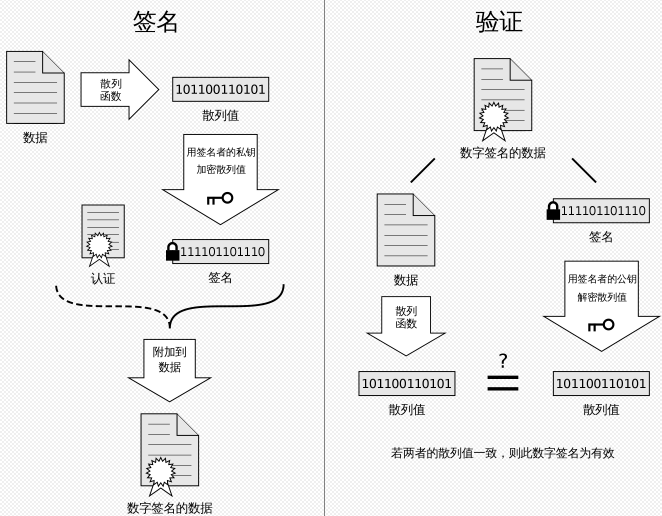

### 1.2.1、APK签名

1. 计算摘要：使用数字摘要算法计算出apk的摘要；
2. 签名：通过私钥对摘要进行加密，加密后的信息就是签名；
3. 写入签名：将签名信息、证书以及公钥写入到文件中。

### 1.2.2、APK验签

1. 解密签名：通过公钥解密签名信息获得摘要；
2. 计算摘要：使用摘要算法从接收的数据中计算摘要；
3. 比较摘要：比较解密出的摘要和通过文件计算的摘要，若一致，则校验通过。

接下来介绍下现有的4种apk签名的方式。

# 2、v1 签名

V1签名又称为JAR签名，是对jar包进行签名的一种机制，由于jar包apk本质上都是zip包，所以可以应用到对apk的签名。解压apk后，META-INF目录中存放的就是签名相关的文件。

## 2.1 v1签名过程

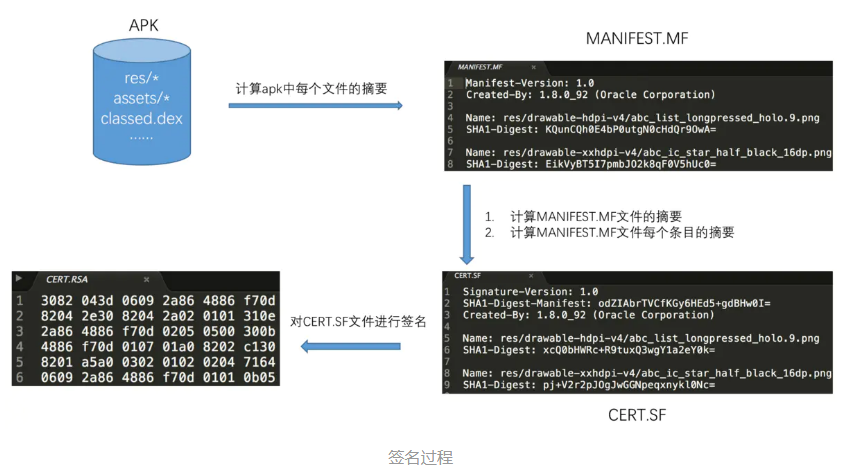

MANIFEST.MF、CERT.SF、CERT.RSA是签名过程中生成的文件（[apksigner源码](https://android.googlesource.com/platform/build/+/7e447ed/tools/signapk/SignApk.java)），作用如下：

### 2.1.1、MANIFEST.MF

对APK中所有文件计算摘要保存到该文件中。

```java
Manifest-Version: 1.0
Created-By: 1.8.0_212 (Oracle Corporation)

Name: AndroidManifest.xml //apk各个文件的摘要
SHA1-Digest: GpiU1HOPO9rxpTPh43kG1XVG8iw=

Name: META-INF/BdTuringSdk_cnRelease.kotlin_module
SHA1-Digest: PVHPdoZ9+09Zq0PF+eJz0yRVf10=
...
```

### 2.1.2、CERT.SF

- SHA1-Digest-Manifest-Main-Attributes：MANIFEST.MF主属性的数据摘要。
- SHA1-Digest-Manifest： MANIFEST.MF 文件计算摘要。
- SHA1-Digest：MANIFEST.MF 的各个条目摘要。

```java
Signature-Version: 1.0
SHA1-Digest-Manifest-Main-Attributes: TN5zBsqBLAij6alOeMWe+Ejwd4g= //主属性记录了MANIFEST.MF文件所有主属性的数据摘要
SHA1-Digest-Manifest: PBUX5Kag9TIOJy4jZ57vwuAur1Y= //整个MANIFEST.MF文件的数据摘要
Created-By: 1.8.0_45-internal (Oracle Corporation)

Name: res/layout/ac.xml
SHA1-Digest: mYQig54fsd3pTRQTmTwMD2oO5CM= //MANIFEST.MF 各个条目的摘要
```

### 2.1.3、CERT.RSA

**对CERT.SF 文件的摘要通过私钥加密生成校验串**, 然后和**数字签名、公钥、数字证书**一同写入 CERT.RSA 中保存。很多文章将校验串描述成签名，这样的理解是不准确的。可以比较2个同一个公司出品的apk的RSA文件，你会发现可能除了结尾部分不太一样外，其他部分基本相同，原因其实就是同一个公司出品的apk，它的签名，证书，公钥通常都是相同的，只有通过私钥加密的CERT.SF的摘要不同。 如下图：

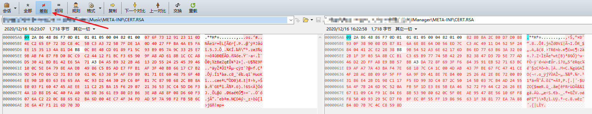

#### 1、查看证书与公钥

1、将.rsa 后缀改为.p7b文件，双击直接打开

2、openssl 命令查看证书信息（公钥在证书信息中）

```
// 查看.RSA文件中证书信息
openssl pkcs7 -inform DER -in XXX.RSA -noout -print_certs -text

// 查看本地证书的公钥和私钥
keytool -list -rfc --keystore test.jks | openssl x509 -inform pem -pubkey
```

通过一个实例去理解一下这两种方式的区别和联系。

1. 使用AS或keytool生成一个.jks签名文件； [Android studio 如何生成jks签名文件](https://www.jianshu.com/p/b28a5be05029)
2. 使用签名文件对apk进行签名；
3. 通过相关命令查看.jks文件以及解压apk中的.rsa 文件。

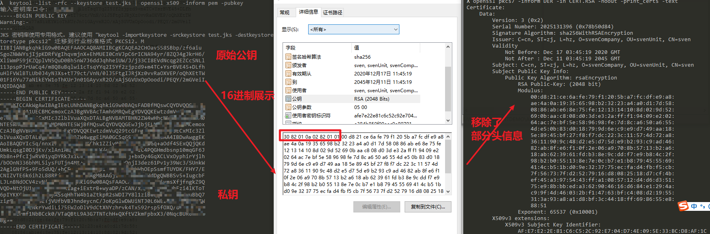

#### 2、查看签名

其实能看到也是签名的摘要，不是真正的签名。

1. 将.rsa 后缀改为.p7b文件，双击直接打开
2. 使用keytool的命令查看.RSA文件

```
keytool -printcert -file xxx.RSA
```

**证书信息：**

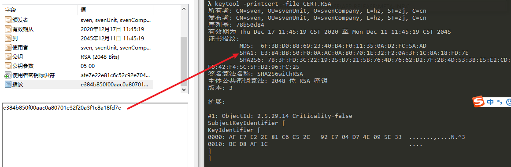

## 2.2、[v1验签过程](https://android.googlesource.com/platform/frameworks/base/+/android-5.1.1_r38/services/core/java/com/android/server/pm/PackageManagerService.java)

1. **首先校验cert.sf文件的签名**

   计算cert.sf文件的摘要，与通过签名者公钥解密CERT.RSA文件得到的摘要进行对比，如果一致则进入下一步；

2. **校验manifest.mf文件的完整性**

   计算manifest.mf文件的摘要，与cert.sf主属性中记录的摘要进行对比，如一致则逐一校验mf文件各个条目的完整性；

3. **校验apk中每个文件的完整性**

   逐一计算apk中每个文件（META-INF目录除外）的摘要，与mf中的记录进行对比，如全部一致，刚校验通过；

4. **校验签名的一致性**

   如果是升级安装，还需校验证书签名是否与已安装app一致。

## 2.3、v1签名的劣势

1. 签名校验速度慢

   校验过程中需要对apk中所有文件进行摘要计算，在apk资源很多、性能较差的机器上签名校验会花费较长时间，导致安装速度慢；

2. 完整性保障不够

   META-INF目录用来存放签名，自然此目录本身是不计入签名校验过程的，可以随意在这个目录中添加文件，比如一些快速批量打包方案就选择在这个目录中添加渠道文件。

   为了解决这两个问题，Android 7.0推出了全新的签名方案V2，下面介绍下v2签名。

# 2、v2签名

## 2.1、ZIP文件结构

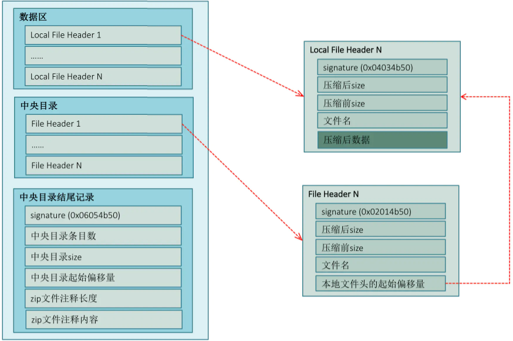


zip文件分为3部分：

1. **数据区**

   主要存放压缩的文件数据

2. **中央目录**

   存放数据区压缩文件的索引

3. **中央目录结尾记录**

   存放中央目录的文件索引

查找压缩文件中数据可以先中央目录起始偏移量和size即可定位到中央目录，再遍历中央目录条目，根据本地文件头的起始偏移量即可在数据区中找到相应数据。

## 2.2、v2签名原理

JAR签名是在apk文件中添加META-INF目录，即需要修改数据区、中央目录，此外，添加文件后会导致中央目录大小和偏移量发生变化，还需要修改中央目录结尾记录。

v2方案为加强数据完整性保证，不在数据区和中央目录中插入数据，选择在 数据区和中央目录之间插入一个APK签名分块，从而保证了原始数据的完整性。


APK 签名方案 v2 负责保护第 1、3、4 部分的完整性，以及第 2 部分包含的“APK 签名方案 v2 分块”中的 `signed data` 分块的完整性。第 1、3 和 4 部分的完整性通过其内容的一个或多个摘要来保护，这些摘要存储在 `signed data` 分块中，而这些分块则通过一个或多个签名来保护。

### 2.2.1、APK摘要计算

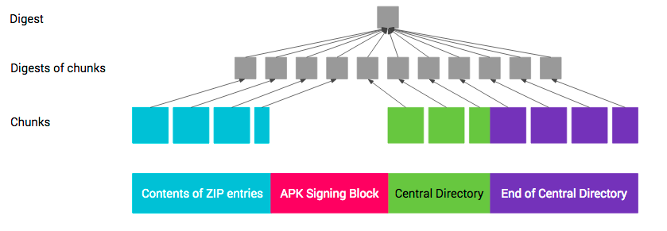

第 1、3 和 4 部分的摘要采用以下计算方式：

1. 将APK拆分成多个大小为 1 MB大小的连续块，最后一个块可能小于1M。之所以分块，是为了可以通过并行计算摘要以加快计算速度；
2. 计算块的摘要，以字节 0xa5 + 块的长度（字节数） + 块的内容 进行计算；
3. 计算整体摘要，字节 0x5a + 块数 + 块的摘要的连接（按块在 APK 中的顺序）进行计算。

## 2.3、签名过程

介绍APK签名过程前，需要先了解下使用apk签名块的结构和v2签名块的结构。

### 2.3.1、APKSigning Block 

APK签名分块包含了4部分：分块长度、ID-VALUE序列、分块长度、固定magic值。其中APK 签名方案 **v2分块**存放在ID为**0x7109871a**的ID-VALUE区中。

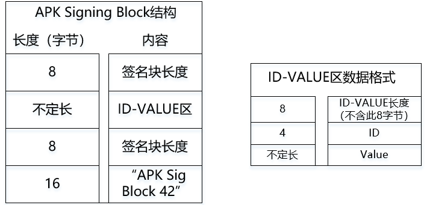

### 2.3.2、v2 Block

v2分块主要由签名数据，数字签名以及公钥组成，具体结构如下。

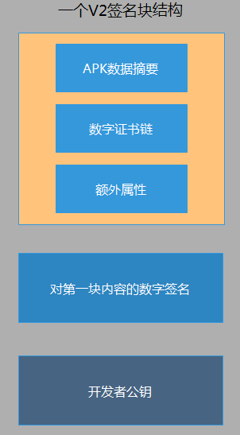

### 2.3.3、签名过程

V2签名块的生成可参考[ApkSignerV2](https://android.googlesource.com/platform/build/+/dd910c5/tools/signapk/src/com/android/signapk/ApkSignerV2.java)，整体结构和流程如下图所示：

1. 根据多个签名算法，计算出整个APK的数据摘要，组成左上角的**APK数据摘要集**；
2. 把最左侧一列的`数据摘要`、`数字证书`和`额外属性`组装起来，形成类似于V1签名的“MF”文件（第二列第一行）；
3. 再用相同的私钥，不同的签名算法，计算出“MF”文件的数字签名，形成类似于V1签名的“SF”文件（第二列第二行）；
4. 把第二列的`类似MF文件`、`类似SF文件`和`开发者公钥`一起组装成通过单个keystore签名后的v2签名块（第三列第一行）。
5. 把多个keystore签名后的签名块组装起来，就是完整的V2签名块了（Android中允许使用多个keystore对apk进行签名）。

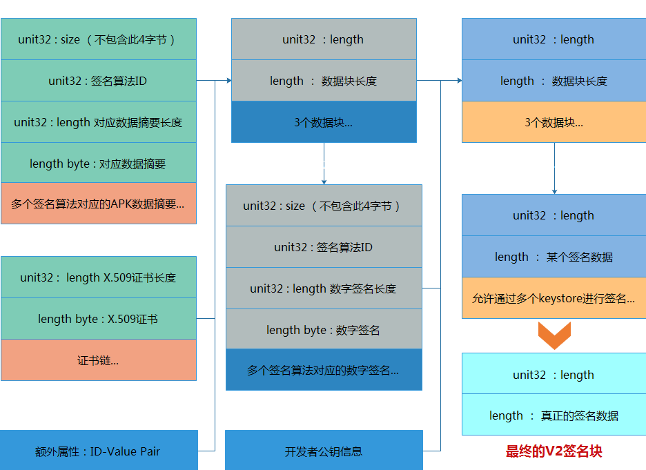


## 2.4、v2验签过程

在 Android 7.0 及更高版本中，可以根据 APK 签名方案 v2+ 或 JAR 签名（v1 方案）验证 APK。更低版本的平台会忽略 v2 签名，仅验证 v1 签名。

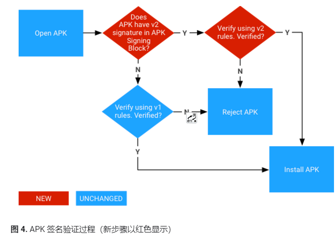

### 2.4.1、v2 验证过程

1. 找到“APK 签名分块”并验证以下内容：

   1. “APK 签名分块”的两个大小字段包含相同的值。
   2. “ZIP 中央目录结尾”紧跟在“ZIP 中央目录”记录后面。
   3. “ZIP 中央目录结尾”之后没有任何数据。

2. 找到“APK 签名分块”中的第一个“APK 签名方案 v2 分块”。如果 v2 分块存在，则继续执行第 3 步。否则，回退至[使用 v1 方案](https://source.android.com/security/apksigning/v2#v1-verification)验证 APK。

3. 对“APK 签名方案 v2 分块”中的每个`signer`

   执行以下操作：

   1. 从 `signatures` 中选择安全系数最高的受支持 `signature algorithm ID`。安全系数排序取决于各个实现/平台版本。
   2. 使用 `public key` 并对照 `signed data` 验证 `signatures` 中对应的 `signature`。（现在可以安全地解析 `signed data` 了。）
   3. 验证 `digests` 和 `signatures` 中的签名算法 ID 列表（有序列表）是否相同。（这是为了防止删除/添加签名。）
   4. 使用签名算法所用的同一种摘要算法[计算 APK 内容的摘要](https://source.android.com/security/apksigning/v2#integrity-protected-contents)。
   5. 验证计算出的摘要是否与 `digests` 中对应的 `digest` 一致。
   6. 验证 `certificates` 中第一个 `certificate` 的 SubjectPublicKeyInfo 是否与 `public key` 相同。

4. 如果找到了至少一个 `signer`，并且对于每个找到的 `signer`，第 3 步都取得了成功，APK 验证将会成功。

**注意**：如果第 3 步或第 4 步失败了，则不得使用 v1 方案验证 APK。

### 2.4.2、防回滚保护

1. 经过V2签名的APK中同时带有JAR签名，攻击者可能将APK的V2签名删除，使得Android系统只校验JAR签名。为防范此类攻击，V2方案规定：带 v2 签名的 APK 如果还带 v1 签名，其 META-INF/*.SF 文件的主要部分中必须包含 X-Android-APK-Signed 属性。该属性的值是一组以英文逗号分隔的 APK 签名方案 ID（v2 方案的 ID 为 2）。**在验证 v1 签名时，对于此组中验证程序首选的 APK 签名方案（例如，v2 方案），如果 APK 没有相应的签名，APK 验证程序必须要拒绝这些 APK**。

2. 攻击者可能会试图从“APK 签名方案 v2 分块”中删除安全系数较高的签名。

   为了防范此类攻击，对 APK 进行签名时使用的签名算法 ID 的列表会存储在通过各个签名保护的 `signed data` 分块中。

# 3、[v3签名](https://source.android.com/security/apksigning/v3.html)

v3和v2一样签名块存储在中央目录区之前，v3 签名会存储的ID为**0xf05368c0**，新增了 ID为**0x3ba06f8c** 的proof-of-rotation 结构中用来支持应用替换签名证书。在 Android 9 及更高版本中，可以根据 APK 签名方案 v3、v2 或 v1 验证 APK。较旧的平台会忽略 v3 签名而尝试验证 v2 签名，然后尝试验证 v1 签名。

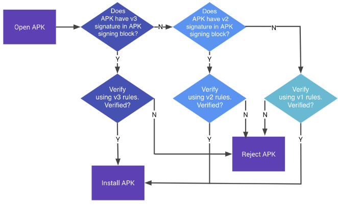


# 4、v4签名

Android 11 通过 APK 签名方案 v4 支持与流式传输兼容的签名方案（来支持增量安装APK）。v4 签名基于根据 APK 的所有字节计算得出的 Merkle 哈希树。

[https://](https://source.android.google.cn/security/apksigning/v4)[source.android.google.cn/security/apksigning/v4](https://source.android.google.cn/security/apksigning/v4) 

# 5、多渠道打包原理

同一个app，需要上线各种平台，比如：小米，华为，百度等，我们多数称之为渠道，如果发的渠道多，可能有上百个渠道。

针对每个渠道，我们希望可以获取各个渠道的一些独立的统计信息，比如：下载量等。

**那么，如何区分各个渠道呢？**

Gradle Plugin为我们提供了一个自动化的方案，我们可以利用占位符，然后在build.gradle中去配置多个渠道信息，这样就可以将枯燥重复的任务自动化了。

这样的方式最大的问题，就是效率问题，每个渠道包，都要执行一遍构建流程，打包效率太低，目前市面比较出名的方案有美团[Walle](https://tech.meituan.com/2017/01/13/android-apk-v2-signature-scheme.html)，腾讯的[VasDolly](https://github.com/Tencent/VasDolly)所谓万变不离其宗，下面就介绍下市面上多渠道打包方案的基本原理。

## 5.1、v1方案

### 5.1.1、EOCD

我们知道要在apk中定位某个文件的位置必须要先解析出EOCD的结果，根据EOCD的结构推断出中央目录区，再根据中央目录区定位到v2签名块或者文件的情况。下面是EOCD的结构，主要包括几部分：

1. 魔数 0x06054B50，标记EOCD
2. 中央目录信息（起始位置，记录数，长度）
3. 注释区长度n（前2个字节）以及注释内容（Comment）

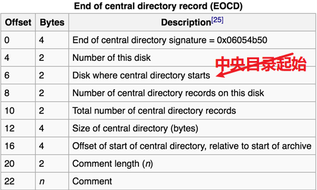

### 5.1.2、v1方案

根据之前的V1签名和校验机制可知，v1签名只会检验第一部分的所有压缩文件，而不理会后两部分内容。因此，我们可以向注释区中写入渠道。写入过程如下：

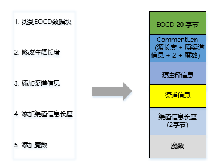

这里添加魔数的好处是方便从后向前读取数据，定位渠道信息。因此，读取渠道信息包括以下几步：

1. 定位到魔数；
2. 向前读两个字节，确定渠道信息的长度LEN；
3. 继续向前读LEN字节，就是渠道信息了。

## 5.2、v2方案

对于v2签名，Android系统只会关注ID为**0x7109871a**的v2签名块，并且忽略其他的ID-Value，同时v2签名只会保护APK本身，不包含签名块。所以可以将渠道写入到ID-Value键值对区。写入过程如下：

1. 从apk文件结尾，通过ID **0x06054B50定**位到**EOCD**；

2. 通过EOCD找到**中央目录结尾起始偏移**；

3. 获取已有的ID-Value Pair
4. **添加包含渠道信息的ID-Value**
5. 基于所有的ID-Value生成新的签名
6. 修改EOCD的中央目录的偏移量(修改EOCD的中央目录偏移量，不会导致数据摘要校验失败）

读取过程和写入过程基本相同，忽略。

## 5.3、v3 方案

v3和v2的方案基本相同，但是v3签名限制了签名块大小是4096的倍数，在不写入渠道时读取下APK Singing Block，其大小刚好是4096。若写入渠道后不满足该条件，如果不是的话，就会去生成一个ByteBuffer来填充签名块，其ID为0x42726577。所以写入渠道后，可以通过修改**0x42726577**的value的大小保证签名块长度是4096的倍数即可。源码：

[generateApkSigningBlock](https://android.googlesource.com/platform/tools/apksig/+/master/src/main/java/com/android/apksig/internal/apk/ApkSigningBlockUtils.java)

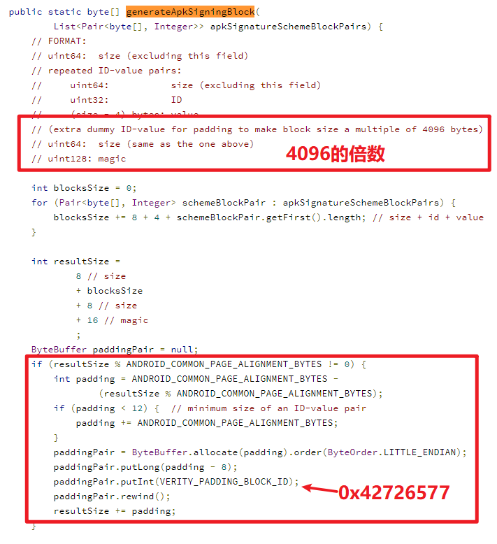

# 参考

https://www.jianshu.com/p/286d2b372334

https://juejin.cn/post/6844903473310334984

https://zhuanlan.zhihu.com/p/108036144

https://mp.weixin.qq.com/s/709mXKfEzSuLrd0WCqrmbghttps://github.com/Meituan-Dianping/walle)