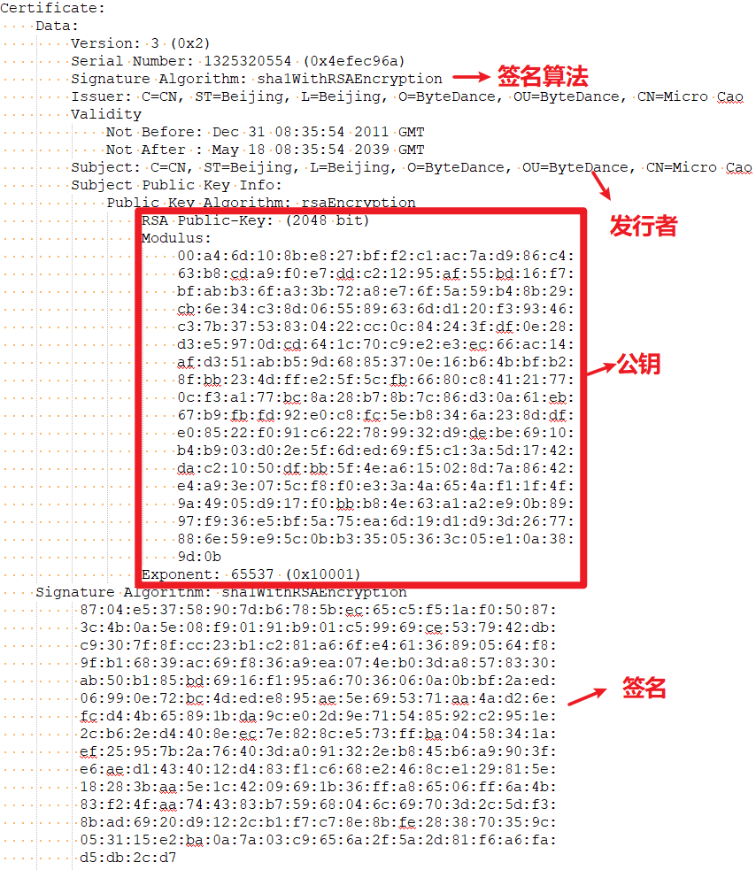

# APK签名机制

# 1、什么是apk签名

android应用在安装过程中会对apk进行签名校验，主要用于验证apk的可靠性、安全性以及唯一性，保证apk是有可信性的发布者发布，防止发布后被篡改，另外在apk升级时除了包名一致，签名也要一致。

## 1.1、摘要 

## 1.2、签名

## 1.3、证书

# 1、v1 签名

## 1.1 META-INF

META-INF 文件夹下有三个文件：MANIFEST.MF、CERT.SF、CERT.RSA。它们就是签名过程中生成的文件，它们的作用如下。

**SHA1WithRSA:用SHA算法进行签名，用RSA算法进行加密。**

## 1、MANIFEST.MF

用 SHA1（或者 SHA256）消息摘要算法提取出**该文件的摘要然后进行 BASE64 编码**后，作为「SHA1-Digest」属性的值写入到 MANIFEST.MF 文件中的一个块中。

```
Manifest-Version: 1.0
Created-By: 1.8.0_212 (Oracle Corporation)

Name: AndroidManifest.xml
SHA1-Digest: GpiU1HOPO9rxpTPh43kG1XVG8iw=

Name: META-INF/BdTuringSdk_cnRelease.kotlin_module
SHA1-Digest: PVHPdoZ9+09Zq0PF+eJz0yRVf10=
...
```

## 2、CERT.SF

- SHA1-Digest-Manifest-Main-Attributes：对 MANIFEST.MF 头部的块做 SHA1（或者SHA256）后再用 Base64 编码。
- SHA1-Digest-Manifest：对整个 MANIFEST.MF 文件做 SHA1（或者 SHA256）后再用 Base64 编码。
- SHA1-Digest：对 MANIFEST.MF 的各个条目做 SHA1（或者 SHA256）后再用 Base64 编码。

```
Signature-Version: 1.0
SHA1-Digest-Manifest-Main-Attributes: TN5zBsqBLAij6alOeMWe+Ejwd4g=
SHA1-Digest-Manifest: PBUX5Kag9TIOJy4jZ57vwuAur1Y=
Created-By: 1.8.0_45-internal (Oracle Corporation)

Name: res/layout/ac.xml
SHA1-Digest: mYQig54fsd3pTRQTmTwMD2oO5CM=
```

## 3、CERT.RSA

把之前生成的 **CERT.SF 文件 + 私钥 == 数字签名,** 然后将**数字签名**以及包含**公钥信息的数字证书**一同写入 CERT.RSA 中保存。

**证书信息：**

```
openssl pkcs7 -inform DER -in FUNNYGAL.RSA -noout -print_certs -text
```




1、数字证书中包含公钥和数字签名

​     通过**公钥**解密**数字签名**得到.SF的摘要和 计算出.SF摘要进行比较

2、公钥解密数字签名

3、

1.2 v1 签名过程


1.3 v1 验签过程

# 2、V2签名

2.1 APK的文件结构


2.2 v2 签名过程


2.3 v2 验签过程

# 3、V3签名

# 4、v4签名


