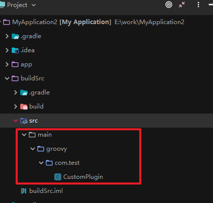
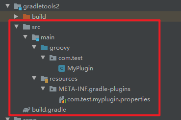

# Android Gradle权威指南


## 一、Gradle入门

### 1.1 Gradle版 Hello World

```groovy
task hello {
	doLast {
		println 'Hello world'
	}
}
```

执行gradle 命令时，会默认加载当前目录下的build.gradle脚本文件。

```
gradle hello

输出：
> Task :hello
Hello world
```

task 是构建脚本定义的一个任务，任务名为hello，官方名称是Action，其实是一段groovy语言实现的闭包。doLast可以理解为在task执行完毕后要执行的回调。

### 1.2 Gradle Wrapper

Wrapper顾名思义，其实就是对gradle的一层封装，便于团队在开发过程中统一Gradle构建版本，避免因为gradle版本不统一导致的不必要问题。

####  1.2.1 生成Wrapper

```
gradle wrapper
```

生成的gradlew 和 gradlew.bat 分别是Linux和Windows下的脚本，用法和gradle一致，开发过程中建议使用gradlew命令。

#### 1.2.2 Wrapper 配置

```
gradle wrapper --gradle-version 指定使用gradle版本
```

#### 1.2.3 gradle-wraper.propertie

指定gradle 下载的文件目录等

```
distributionBase=GRADLE_USER_HOME
distributionPath=wrapper/dists
distributionUrl=https\://services.gradle.org/distributions/gradle-5.4.1-bin.zip
zipStoreBase=GRADLE_USER_HOME
zipStorePath=wrapper/dists
```

## 1.3 Gradle日志

#### 1.3.1 日志级别

| 级别                  | 说明     |
| --------------------- | -------- |
| ERROR                 | 错误信息 |
| QUIET                 | 重要消息 |
| WARN                  | 警告消息 |
| LIFECYCLE（默认级别） | 进度消息 |
| INFO                  | 信息消息 |
| DEBUG                 | 调试消息 |

可以使用内置的loogger，输出指定级别及以上的日志

```
task hello {
	doLast {
		println 'Hello world'
		logger.quiet('quiet 日志信息')
		logger.error('error 日志信息')
		logger.warn('warn 日志信息')
		logger.lifecycle('lifecycle 日志信息')
		logger.info('info 日志信息')
		logger.debug('debug 日志信息')
		}
}

gradlew -w task

输出：
Hello world
quiet 日志信息
error 日志信息
warn 日志信息
```

#### 1.3.2 打印堆栈信息

| 命令行     | 含义               |
| ---------- | ------------------ |
| gradlew -s | 打印堆栈信息       |
| gradlew -S | 打印详细的堆栈信息 |

## 1.4 Gradle 命令行

#### 1.4.1 使用帮助

```
gradlew -h / --help
```

#### 1.4.2 查看任务

```
gradlew tasks
```

#### 1.4.3 查看任务使用信息

```
gradlew help --task hello

> Task :help
Detailed task information for hello

Path
     :hello

Type
     Task (org.gradle.api.Task)

Description
     -

Group
     -
```

## 二、Groovy基础

### 2.1 字符串

单引号和双引号包含的内容

### 2.2 集合

#### 2.2.1 List

定义& 访问

```
task printlnList {

	def numList = [1,2,3,4,5,6]
	println numList.getClass().name
	
	println numList[1] // 访问第二个元素
	
	println numList[-1] // 访问倒数第一个元素
}

输出：
java.util.ArrayList
2
6
```

#### 2.2.2 Map

定义时值为k:v方式，访问时可以试用map[key]或者map.key方式；迭代使用map.each。

```
task printMap {

	def map = ["width":1,"height":2]
	println map.getClass().name
	
	println map["width"] 
	println map.width 
	
	map.each {
		println	"key = ${it.key} , value = ${it.value}"
	}

}

输出：
java.util.LinkedHashMap
1
1
key = width , value = 1
key = height , value = 2
```

### 2.3 方法

#### 2.3.1 括号可以省略

```
task invokeMethod {
	method1(1,2)
	method1 1,2
}

def method1(int a, int b) {
 	println a+b
}
```

#### 2.3.2 return 可以不写

```groovy
task printMethodReturn {
    def add1 = method2 1,2
    def add2 = method2 5,3
    
    println "add1:${add1}, add2:${add2}"
}

def method2(int a, int b){
    if(a > b){
        a  
    } else {
        b
    }
}
```

#### 2.3.3 代码块可以作为参数传递

其实就是闭包，以迭代列表为例：

```
// 1.原始的写法
numList.each({
	print it
})

// 2.如果方法的最后一个参数是闭包可以写到方法外面
numList.each() {
	print it
}

// 3.方法可以省略括号，常见的写法
numList.each {
	print it
}
```

#### 2.3.4 JavaBean

```
task helloJavaBean {
	Person p = new Person();
	p.name = "haha"
	p.age = 10 // Cannot set readonly property: age for class: Person
	
	print "name : ${p.name}"
	
	print "name : ${p.age}"
}

class Person {
	private String name;
	
	public int getAge() {
	 	12
	}
}
```

Groovy 中不一定非要定义属性才能作为类访问变量，可以直接使用getter和setter方法，当做属性访问。但是只定义了setter或getter，那就不能使用访问或赋值。

#### 2.3.5 闭包

闭包的定义：

```

def aClosure = {//闭包是一段代码，所以需要用花括号括起来..
    Stringparam1, int param2 ->  //这个箭头很关键。箭头前面是参数定义，箭头后面是代码
    println"this is code" //这是代码，最后一句是返回值，
   //也可以使用return，和Groovy中普通函数一样
}
```

闭包没定义参数的话，则隐含有一个参数，这个参数名字叫it，和this的作用类似。it代表闭包的参数。

[深入理解Android之Gradle](https://blog.csdn.net/innost/article/details/48228651) 3.4节

[Groovy 的闭包](https://juejin.im/post/5ccd2ee7e51d453a4a357e3f)

#### 2.3.6 DSL含义

特定领域语言

## 三、Gradle构建脚本基础

### 3.1 Settings 文件

用于初始化和工程树配置，配置子工程的目录位置等。

```
include ':app'
include ':appstore_manage'
include ':appstore_search'
include ':appstore_clean'
```

### 3.2 Build文件

Project的build文件，针对Project的配置，配置子模块共同的依赖。比如可以通过allProjects和subprojects分别配置所有工程和子工程的共同属性。

```
allprojects {
    repositories {
        jcenter()
        mavenCentral()
        google()
    }
}

subprojects {
    apply plugin: 'com.bbk.appstore'
}
```

### 3.3 Projects及tasks

一个Project包含多个Task，每个task都是一个操作。

### 3.4 Tasks

task 其实是Project的一个函数，原型为create（String name， Closure configClosure）。name为函数名，configClosure为闭包，常见写法为：

```
task customTask1 {
	doLast {
		println "customTask ： doLast"
	}
}
```

#### 3.4.1任务依赖

dependsOn 是task类的一个方法，一个任务可以同时依赖多个任务

```
task exHello {
	println "hello"
}

// 第一种写法
task world (dependsOn : exHello){
	println "world"
}

//第二种写法
task world{
    dependsOn : exHello
	doLast {
		println "world"
	}
}
```

### 3.5 自定义属性

使用ext属性可以在Project 和 Task中添加额外的自定义属性。自定义属性有更广泛的作用域，可以跨Project和Task访问这些自定义属性。只要能访问到这些属性的对象，就能使用这些属性。

```groovy
ext.age = 18

ext {
	phone = 123456
	address = "beijing"
}

task printExt {
	println "${age}"
	println "${phone}"
	println "${address}"	
}
```

## 四、Gradle 任务

### 4.1 创建任务的4种方式

#### 4.1.1 任务名创建任务

这种创建方式其实是调用Project对象中的task（String name）方法，该方法接受一个name（任务名称作为参数），返回一个task对象。

```groovy
def Task exCreateTask1 = task(exCreateTaskName)

exCreateTaskName.doLast { // 执行时，识别任务名
	println "create 1" + 
}
```

#### 4.1.2 任务名称 + 对任务配置的map

对应的创建方法原型是 task（String name， Map<String, ?>）， 第二种方式可配置的任务有限。

```
def Task exCreateTask2 = task(exCreateTask2, action:{println "haha"})

exCreateTask2.doLast {
	println "exCreateTask2"
}
```

Map 可用配置如下：

| 配置项      | 描述                                | 默认值      |
| ----------- | ----------------------------------- | ----------- |
| type        | 基于一个存在的task 创建，类似于继承 | DefaultTask |
| overwrite   | 是否替换存在的task，和type配合使用  | false       |
| dependsOn   | 基于这个配置的依赖                  | []          |
| action      | 添加到任务中的一个闭包              | null        |
| description | 任务描述                            | null        |
| group       | 任务分组                            | null        |

#### 4.1.3 任务名 + 闭包

可以通过闭包方式进行配置。

```
task exCreateTask3 {
	description "演示任务创建"
	doLast {
		println "${description}"
	}
}
```

#### 4.1.4 TaskContainer

tasks 是Project的属性，类型为TaskContainer，可以直接使用它来创建任务。

```
tasks.create('exCreateTask4') {
	description "演示任务创建"
	doLast {
		println "${description}"
	}
}
```

### 4.2 访问任务

#### 4.2.1 通过任务名访问

任务都是Project的属性，属性名就是任务名，可以直接通过任务名称访问任务

```
task exAccessTask

exAccessTask1.doLast {
	println "exAccessTask1 "
}
```

#### 4.2.2 通过TaskContainer 访问

```
task exAccessTask2
exAccessTask2.group = "access"

tasks['exAccessTask2'].doLast {
	println tasks.findByPath(":/exAccessTask2")
	println tasks.findByName("exAccessTask2")
	// println tasks.getByName("not exist")
}
```

| 路径访问                   | 名称访问                   |
| -------------------------- | -------------------------- |
| tasks.findByPath(taskpath) | tasks.findByName(taskName) |
| tasks.getByPath(taskpath)  | tasks.getByName(taskName)  |

- findXXX 找不到任务时返回null，getXXX方式会抛出异常

- 路径访问方式的参数可以是任务名，但是名称访问不能为路径

- a[b] 对应的是findByName（）


### 4.3 任务分组和描述

任务分组的目的是为了对任务进行归类和整理；描述就是解释任务的作用。

```
task taskAccess3 {
	group = "access"
	description = "任务描述"
	println "分组与描述"
}
```

### 4.4 << 操作符

<< 其实是doLast的短标记形式。

```
task taskAccess4 << {
	println "taskAccess4 doLast"
}
```

### 4.5 任务执行

doFirst & doLast，在任务的最前和最后执行

```
task taskAccess5 {
	doFirst {
		println "taskAccess4 doFirst"
	}
	
	doLast {
		println "taskAccess4 doLast"
	}
}
```

### 4.6 任务排序

不通过强依赖方式，控制任务的执行顺序

shouldRunAfter : 应该在某个任务执行后执行

mustRunAfter : 必须在某个任务执行后执行

### 4.7 任务的启用与禁用

```
task taskB {
	doLast {
		println "taskB doLast"
	}
}
taskB.enabled = false

输出：
Task :taskB SKIPPED
```

### 4.8 任务与onlyIf断言

Task 有一个onlyIf方法，接受一个闭包作为参数，可以用来控制渠道包的打包过程，-P表示的是Project ，-PK-V 属性的键值对。

```
final String BUILD_SHOUFA = "shoufa"
final String BUILD_PROPERTY = "build_apps"
task exSF {
	doLast{
		  println "打出首发包"
	}
}

exSF.onlyIf {
	def execute = false
	if(project.hasProperty(BUILD_PROPERTY)) {
		Object buildApps = project.property(BUILD_PROPERTY)
		logger.quiet("BUILD_PROPERTY = " + buildApps)
		if(BUILD_SHOUFA.equals(buildApps)) {
			execute = true
		}
	} 
	println "执行结果 ${execute}"
	execute
}

// gradlew -Pbuild_apps=shoufa exSF

输出：
> Task :exSF
buildApps = shoufa
执行结果 true
打出首发包
```

### 4.9 任务规则

 当依赖或者执行的一个任务不存在时，Gradle会执行失败，提示任务不存在。我们可以使用规则对齐进行改进，执行的任务不存在时不会失败，而是打印提示信息。

```
tasks.addRule("添加规则"){
	String taskName ->
		task(taskName) {
			println "任务不存在 ${taskName}"
		}
}
```

## 五、Gradle 插件

### 5.1 应用插件

#### 5.1.1 应用二进制插件

二进制插件一般是被打到jar包里，Gradle自带的插件

```
apply plugin ： 'java'
```

#### 5.1.2 应用脚本插件

加载一个本地配置的脚本，主要的用途是脚本模块化，将一些公共配置

```groovy
apply from ：'version.gradle'
task print {
	doLast {
	 	println "${versionName}, ${versionCode}" 
	}
}


version.gradle

ext {
	versionName = '1.0.0'
	versionCode = 1
}
```

#### 5.1.3 应用第三方发布的插件

应用第三方的插件时，必须要在buildscript{}里配置相应的classPath， 比如在app中是使用application插件，不要先添加依赖。

```
// app/build.gradle

apply plugin: 'com.android.application'

// project/build.gradle

buildscript {
    repositories {
        jcenter()
    }
    dependencies {
        classpath 'com.android.tools.build:gradle:3.5.1'
    }
}
```

#### 5.1.4 使用plugins DSL应用插件

如果插件已经托管在https://plugins/gradle.org/ 上的话，可以使用这种方式，这样就不需要在buildscript 配置依赖了。

```
plugins {
	id 'java'
}
```

### 5.2 自定插件的3种方式

参考：[Gradle 自定义插件](https://juejin.im/post/5cce895f51882541e27b0cae)

#### 5.2.1 build.gradle 中编写插件

```
//使用插件 
apply plugin: CustomPlugin 

//自定义插件：实现Plugin类接口，重写apply方法 
class CustomPlugin implements Plugin<Project> {
    @Override
    void apply(Project project) {
        project.task('CustomPluginTask') {
            doLast {
                println "大家好,我是一个自定义插件，在这里写下你的具体功能"
            }
        }
    }
}
```

#### 5.2.2 buildSrc工程项目

1.建立buildSrc目录，创建目录$projectDir/buildSrc/src/main/groovy



2.创建groovy插件 CustomPlugin

```
import org.gradle.api.Plugin;
import org.gradle.api.Project;

class CustomPlugin implements Plugin<Project> {
    void apply(Project project) {
        project.task('CustomPluginTask') {
            doLast {
                println "自定义插件"
            }
        }
    }
}
```

3.这样在其他的build.gradle 中就可以使用这个插件了，比如在app/build.gradle 中引用插件，执行命令 gradlew CustomPlugin

```
apply plugin: CustomPlugin

gradlew CustomPlugin
输出：
> Task :app:CustomPluginTask
自定义插件
```

#### 5.2.3 独立项目中编写

以android项目为例

1.新建plugin module，删除所有文件，只保留build.gradle，增加如下依赖和引用

```
apply plugin: 'groovy'
apply plugin: 'maven'

repositories {
    mavenCentral()
}

dependencies {
    implementation gradleApi()
    implementation localGroovy()
}
```

2.创建groovy工程目录并编写groovy文件




```
package com.test

import org.gradle.api.Plugin
import org.gradle.api.Project

class MyPlugin implements Plugin<Project> {
    @Override
    void apply(Project project) {
        println("beginning of plugin 'MyPlugin'")
    }
}
```

3.创建resources目录，并在META_INF/gradle-plugins增加配置插件属性文件com.test.myplugin.properties

```
#插件的路径
implementation-class=com.test.MyPlugin
```

4.plugin/build.gradle 中增加uploadArchives，生成本地插件目录

```
uploadArchives {
    repositories.mavenDeployer {
        //本地仓库路径，放到项目根目录下的 repo 的文件夹
        repository(url: uri('../repo'))

        //groupId 自行定义
        pom.groupId = 'com.test'

        //artifactId
        pom.artifactId = 'company'

        //插件版本号
        pom.version = '1.0.0'
    }
}
```


5.app/build.gradle中引用插件

```
// 这个是properties的文件名，必须要完全匹配
apply plugin: 'com.test.myplugin'

buildscript {
    repositories {
        maven {//本地Maven仓库地址
            url uri('./repo')
        }
    }
    dependencies {
        // 文件路径 repo/com/test/company/
        classpath 'com.test:company:1.0.0'
    }
}
```

## 七、Android Gradle 插件

Android Gradle 的插件主要有以下3种：

1. App 插件id：com.android.application
2. Library 插件id：com.android.library

3. Test 插件id：com.android.test


## 八、自定义Gradle工程

一个buildVariant = BuildType * ProductFlavor，gradle 的task都是基于BuildType + ProductFlavor生成的。


### 8.1 ProductFlavor 

productflavor理解为渠道，比如各个厂商。主要是配置各个不同的的包名、应用名等属性。

#### 8.1.1 defaultConfig默认配置

default 是Android对象中的一个配置块，ProductFlavor属性，负责定义所有的默认配置。

```
android {
    compileSdkVersion 29
    buildToolsVersion "29.0.2"
    
    defaultConfig {
        applicationId "com.test.myapplication" // 应用包名，默认为null，构建时会从AndroidManifest中读取
        testApplicationId applicationId + ".test" // 测试App包名
     
        minSdkVersion 15 // 最低支持的版本号
        targetSdkVersion 29 // 基于哪个sdk开发的
        versionCode 1 // 版本号，未配置从manifest中读取
        versionName "1.0" // 版本名
        testInstrumentationRunner "androidx.test.runner.AndroidJUnitRunner" // 单元测试使用的Runner
        
        proguardFile(path)

        proguardFiles(path1, path2)
        
        }
}
```

#### 8.1.2 动态配置manifest

使用manifestPlaceholders 结合ProductFlavor使用，build 过程中要根据渠道打包

```
flavorDimensions("version")
productFlavors {
    dev {
        dimension "version"
        manifestPlaceholders = [
                appName: "dev",
        ]
    }
    user {
    dimension "version"
    manifestPlaceholders = [
            appName: "user",
    ]
	}
}
mainfest中：
        android:label="${appName}"
```

#### 8.1.3 自定义BuildConfig 

gradle中可以定义buildConfig的属性，方便访问和使用

```
flavorDimensions("version")
productFlavors {
    dev {
        dimension "version"
        buildConfigField('String', 'WEB_URL', '"https://www.baidu.com"')
    }
    user {
    	dimension "version"
    	buildConfigField('String', 'WEB_URL', '"https://www.google.com"')
	}
}
```

#### 8.1.4 自定义资源

resValue可以在BuildType和ProductFlavor里使用，针对不同的构建类型和渠道自定义构建资源。生成文件的目录。

```
\build\generated\res\resValues\user\debug\values\gradleResValues.xml
```

```
flavorDimensions("version")

productFlavors {
    user {
        dimension "version"
        manifestPlaceholders = [
                appName: "user",
        ]
        buildConfigField('String', 'WEB_URL', '"https://www.google.com"')
        resValue('string', 'channel_tips', 'google渠道欢迎你')
	}
}

<resources>
    <!-- Automatically generated file. DO NOT MODIFY -->
    <!-- Values from product flavor: user -->
    <string name="channel_tips" translatable="false">google渠道欢迎你</string>

</resources>
```

### 8.2  BuildType 构建应用类型

buildType主要是配置调试或者正式包的属性，是否混淆等等。

1. 每增加一个buildType会自动生成一个assembleXXtask
2. 自定义的buildType不能命名为main和androidTest，这2个已经被系统占用，同时也不能存在同名的buildType

#### 8.2.1 BuildType 属性

```
buildTypes {
    debug {
        applicationIdSuffix ".debug" //apk后缀
        debuggable true //是否可调试
        jniDebuggable true // jni 调试开关
        multiDexEnabled false // 方法数超过65535时，是否拆分多个dex

        zipAlignEnabled true // 整理apk文件
        shrinkResources false // 是否自动清理未使用的资源文
        minifyEnabled false // 混淆开关
        proguardFile("/d/proguard") // 混淆配置
    }
}
```

#### 8.2.2 使用混淆

getDefaultProguardFile 对应的混淆文件是在 \Sdk\tools\proguard\目录下。

```
buildTypes {
    release {
        minifyEnabled false
        proguardFiles getDefaultProguardFile('proguard-android-optimize.txt'), 'proguard-rules.pro'
      件
    }
```

### 8.3 签名

app只有在签名后才能被发布、安装、使用，签名是保护app的方式，标记app的唯一性。signConfigs是一个NamedDomainContainer，我们在signConfig{}中的定义都是一个SigningConfig。

debug模式使用的签名位于$HOME/.android/debug.keystore，一般情况下不需要单独配置debug模式的信息。

```
android {
	...
    defaultConfig {
      ...
    }
    signingConfigs {
        release {
            //签名文件的路径
            storeFile file('debug.keystore')
            //签名文件密码
            storePassword 'android'
            //别名
            keyAlias 'androiddebygkey'
            //key的密码
            keyPassword 'android'
        }
    }
}
```


## 九、Gradle高级自定义 

### 9.1 共享库

android 中的共享库主要包含3种，标准的sdk共享库、 add-ons 以及optional 库。

add-ons ：android gradle 会自动解析，添加到classpath中

```
useLibrary 'org.apache.http.legacy'
```

optional ：需要手动添加classPath

### 9.2 修改apk文件名

gradle 3.0之前

```
applicationVariants.all { variant ->
        variant.outputs.each { output ->
            if (output.outputFile != null && output.outputFile.name.endsWith('.apk')) {
                def apkName = "apptest_${flavorName}_${variant.versionName}_${buildTime()}.apk"
                output.outputFile = new File(output.outputFile.getParent(), apkName)
            }
        }
    }
```

gradle 3.0之后

```
applicationVariants.all { variant ->
        variant.outputs.all { 
            outputFileName = "apptest_${flavorName}_${variant.versionName}_${buildTime()}.apk"
    
        }
    }
    
    def buildTime() {
    def date = new Date()
    def formatDate = date.format("yyyyMMdd")
    return formatDate
}
```

### 9.3 标记apk信息

生成apk的时候可通过git获取最后一次提交信息

```
def cmd = 'git rev-parse --short HEAD'
def gitVersion = cmd.execute().text.trim()
android {
...
	applicationVariants.all { variant ->
        variant.outputs.all {
            outputFileName = "apptest_${flavorName}_${variant.versionName}_${gitVersion}.apk"
        }
    }
 ...
 }
```

### 9.4 Java编译选项

对jdk版本进行调优或限制

```    compileOptions {
compileOptions {
    encoding "UTF-8"
    sourceCompatibility JavaVersion.VERSION_1_7
    targetCompatibility JavaVersion.VERSION_1_7
}
```

### 9.5 adb操作配置

adb 属性

```
adbOptions {
    timeOutInMs 5 * 1000
    installOptions('-r -t')
}
```

-l：锁定应用程序

-r: replace existing application 

-t: allow test packages 

-d: allow version code downgrade (debuggable packages only) 

-p: partial application install (install-multiple only) 

-g: grant all runtime permissions

### 9.6 Dex 选项配置

打包成apk时，dx命令会将字节码文件优化成DEX文件。

```
dexOptions {
    javaMaxHeapSize "4g" //配置执行dx命令时分配的最大内存
}
```

### 9.7 资源优化

https://developer.android.com/studio/build/shrink-code?hl=zh-cn

```groovy
android {
        buildTypes {
            release {
                // Enables code shrinking, obfuscation, and optimization for only
                // your project's release build type.
                minifyEnabled true

                // Enables resource shrinking, which is performed by the
                // Android Gradle plugin.
                shrinkResources true

                // Includes the default ProGuard rules files that are packaged with
                // the Android Gradle plugin. To learn more, go to the section about
                // R8 configuration files.
                proguardFiles getDefaultProguardFile(
                        'proguard-android-optimize.txt'),
                        'proguard-rules.pro'
            }
        }
        ...
    }
```

[splits配置](https://juejin.im/post/5ddfe513e51d45027e2a7e96)

```gradle
android {
    splits {
        density {
            enable true
            exclude 'ldpi', 'mdpi'
            compatibleScreens 'normal', 'large', 'xlarge'
        }
        abi {
            enable true
            reset()
            include 'x86', 'x86_64', 'armeabi-v7a', 'arm64-v8a' //select ABIs to build APKs for
            universalApk true //generate an additional APK that contains all the ABIs
        }
        language {
			enable = true
			include "fr", "zh", "en"
		}
    }
}
```

## 十、库项目发布

https://blog.csdn.net/xmxkf/article/details/80674232