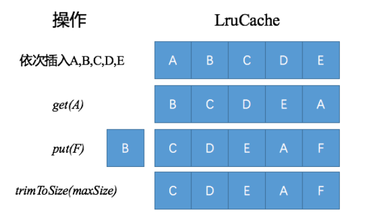

# LruCache原理分析

[TOC]

## 一、原理介绍

LruCache的核心算法是通过LinkedHashMap实现，注意要将LinkedHashMap的最后一个参数accessOrder设置为true，表示按照访问顺序排列，否则按照插入顺序排序。也就是说，**最近访问的元素排在Map的最后，当需要删除元素时，将会从头部开始删除**。正是这个特性，使得通过LinkedHashMap可以实现LRU算法。关于LinkedHashMap实现的LRU算法，下一篇分析。



## 二、LruCache的创建

LruCache常见的创建方式如下，以缓存Bitmap为例：

```
LruCache<String, String> mMemLruCache = new LruCache<String, Bitmap>(size){
	@Override
	protected int sizeOf(String key, Bitmap value) {
		return value.getByteCount();
	}
};
```

创建时的关键参数有2个：

- maxSize ，缓存阈值上限，超过就会触发回收策略。 

- sizeOf  计算单个元素的占用空间大小。sizeOf要和maxSize配合起来使用，所有元素占用的空间大小就是sizeOf之和。

​       LRU还有还有一种创建方式，不复写sizeOf方法，使用默认值1，此时maxSize限制的含义就是元素的个数。

总结一下：创建时要保持sizeOf和maxSize的单位是一致的。

## 三、LruCache的CRUD

### 1.put

put的过程主要有4个：

1.  size = size + 当前元素占用的空间大小
2. put to Map，如果有返回值，表示之前的key是有对象的，相当于是更新，那么size 减去原有元素占用的大小
3. entryRemoved ，移除元素的回调

4. trimToSize整理元素，put新的元素后导致size超过maxsize

```
public final V put(K key, V value) {
    if (key == null || value == null) {
        throw new NullPointerException("key == null || value == null");
    }

    V previous;
    synchronized (this) {
        putCount++;
        size += safeSizeOf(key, value);
        previous = map.put(key, value);
        if (previous != null) {
            size -= safeSizeOf(key, previous);
        }
    }

    if (previous != null) {
        entryRemoved(false, key, previous, value);
    }

    trimToSize(maxSize);
    return previous;
}
```

### 2.get

```
public final V get(K key) {
    if (key == null) {
        throw new NullPointerException("key == null");
    }

    V mapValue;
    synchronized (this) {
    // 1.从map里取值，若值不为空，直接放回
        mapValue = map.get(key);
        if (mapValue != null) {
            hitCount++;
            return mapValue;
        }
        missCount++;
    }

    /*
     * Attempt to create a value. This may take a long time, and the map
     * may be different when create() returns. If a conflicting value was
     * added to the map while create() was working, we leave that value in
     * the map and release the created value.
     */
	// 2.值如果为空，尝试创建，createdValue这个方法是暴露给调用者使用的，比如一些数据库对象缓存对象，如果为空了，我们可以通过查询数据库再次创建
    V createdValue = create(key);
    if (createdValue == null) {
        return null;
    }

    synchronized (this) {
        createCount++;
        //3.刚创建值putToMap时，若有返回值，那么说明在创建过程中，同一个key有新的对象被put进来，那么要使用最新的对象，即最后put进入的对象。
        mapValue = map.put(key, createdValue);

        if (mapValue != null) {
            // There was a conflict so undo that last put
            // 3.1 这里不需要再更新size，因为put时size已经被更新过了
            map.put(key, mapValue);
        } else {
            // 3.2 size += 新创建的元素大小
            size += safeSizeOf(key, createdValue);
        }
    }
	// 4.1 mapValue != null，说明一定是创建过的，那么对创建的value发送一次移除的回调
    if (mapValue != null) {
        entryRemoved(false, key, createdValue, mapValue);
        return mapValue;
    } else {
    // 4.2 如果put的是新创建的值，整理下数据
        trimToSize(maxSize);
        return createdValue;
    }
}
```

### 3.remove

```
public final V remove(K key) {
    if (key == null) {
        throw new NullPointerException("key == null");
    }

    V previous;
    synchronized (this) {
    	// 1. 从hashMap中删除元素
        previous = map.remove(key);
        if (previous != null) {
        // 2. size减去移除元素的大小
            size -= safeSizeOf(key, previous);
        }
    }
    // 3.回调元素被移除
    if (previous != null) {
        entryRemoved(false, key, previous, null);
    }

    return previous;
}
```

### 4.trim

```
public void trimToSize(int maxSize) {
    while (true) {
        K key;
        V value;
        synchronized (this) {
            if (size < 0 || (map.isEmpty() && size != 0)) {
                throw new IllegalStateException(getClass().getName()
                        + ".sizeOf() is reporting inconsistent results!");
            }
			// 1.size < maxSize，什么都不做
            if (size <= maxSize) {
                break;
            }
			// 2.头部元素不为空，map.eldest 指的就是当前第一个元素
            Map.Entry<K, V> toEvict = map.eldest();
            if (toEvict == null) {
                break;
            }

			//3.移除第一个元素
            key = toEvict.getKey();
            value = toEvict.getValue();
            map.remove(key);
            size -= safeSizeOf(key, value);
            evictionCount++;
        }
        //4.通知元素被移除
        entryRemoved(true, key, value, null);
    }
}
```

## 四、其他

### 1.命中率

LruCache的toString方法比较有意思，可以初略计算get方法命中率。命中率 = 命中 / 命中 + 丢失

```
private int putCount; // put元素个数
private int createCount; // 创建的元素
private int evictionCount; // trim是被移除的元素，不是所有移除的元素
private int hitCount; // get时命中的个数
private int missCount; // get时没有命中的元素

@Override 
public synchronized final String toString() {
	int accesses = hitCount + missCount;
	int hitPercent = accesses != 0 ? (100 * hitCount / accesses) : 0;
	return String.format("LruCache[maxSize=%d,hits=%d,misses=%d,hitRate=%d%%]",
                maxSize, hitCount, missCount, hitPercent);
}
```

### 2.entryRemoved

LruCache通常复写的方法有3个，这里总结下。

1. sizeOf ：单个元素占用的空间大小

2. createValue ：get时创建对象
3. entryRemoved ：元素被移除时进行回调。

除了这些方法以外，trim这些方法也都是可被复写的，定制性非常强。

## 五、总结

LruCache通常用来做内存缓存，比如lmageLoader的三级缓存中，内存缓存内部的封装就是使用了LRUcache。

LruCache通常的封装方式也比较灵活，继承和组合都和使用。

整体看来是一个非常轻量级且定制性极强的框架。

### 参考

[Android LruCache源码分析](https://juejin.im/entry/5a20c1026fb9a0452b490707)

[LruCache原理和用法与LinkedHashMap](https://blog.csdn.net/qq_25806863/article/details/77548468)