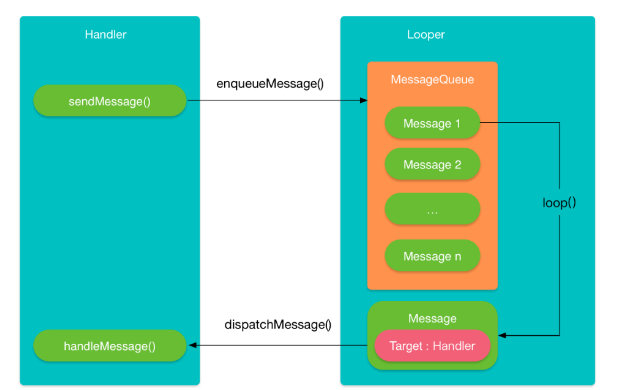

# Android Handler消息机制

Handler是Android中一种线程间传递消息的机制。主要应用的场景，将子线程中待更新的UI信息传递到主线程。本文将从以下几个方面介绍Handler：

1. Handler的消息发送和分发过程
2. Looper，Message 以及和Handler的关系
4. Message组成和类型以及复用机制
4. IdleHandler等一些不常见的知识

下面正式开始，故事从sendMessage开始讲起。

# 一、消息分发过程

## 1.1、从sendMessage开始

Handler常见的用法如下，主线程中创建Handler，子线程中使用sendMessage发送消息。

```java
public class MainActivity extends AppCompatActivity {
    private Handler mHandler;
    @Override
    protected void onCreate(Bundle savedInstanceState) {
        mHandler = new Handler(){
            @Override
            public void handleMessage(Message msg) {
                //收到消息后，更新 ui
                }
        };
        
        new Thread(new Runnable() {
                @Override
                public void run() {
                    //发送消息
                    mHandler.sendMessage();
                }
            }).start();
        }
}
```

除了上面这种写法外，常见的写法还有post这种：

```java
mHandler = new Handler();
new Thread(new Runnable() {
       @Override
       public void run() {
            mHandler.post(new Runnable() {
                @Override
                public void run() {
                    //ui操作
                }
            }); 
       }
   }).start();
...
```

以上2种方式最终都是殊途同归，最终调用的都是Handler的**sendMessageAtTime**方法。
```java
public boolean sendMessageAtTime(Message msg, long uptimeMillis) {
    MessageQueue queue = mQueue;
    if (queue == null) {
        RuntimeException e = new RuntimeException(
                this + " sendMessageAtTime() called with no mQueue");
        Log.w("Looper", e.getMessage(), e);
        return false;
    }
    return enqueueMessage(queue, msg, uptimeMillis);
}
```

不同地方在于post 将Runnable赋值给msg.callback，

```java
public final boolean post(Runnable r){
   return  sendMessageDelayed(getPostMessage(r), 0);
}

private static Message getPostMessage(Runnable r) {
    Message m = Message.obtain();
    m.callback = r;
    return m;
}
```

最后在dispatchMessage处理消息时，post方式msg.callback不为空，会执行handleCalback，最终回调Runnable的run方法。

```java
public void dispatchMessage(Message msg) {
    // post的执行
    if (msg.callback != null) {
        handleCalback(msg);
    } else {
        // sendMessage的执行
        if (mCallback != null) {
            if (mCallback.handleMessage(msg)) {
                return;
            }
        }
        handleMessage(msg);
    }
}

private static void handleCallback(Message message) {
    message.callback.run();
}
```
细心的读者可能会问mCallback又是什么呢？其实mCallback就是你在new Handler时可以传的一个参数，如果你像下面这样在Handler.Callback中返回true，就可以拦截消息不让消息在Handler的handler的handleMessage中处理。
```java
Handler handler1 = new Handler(new Handler.Callback() {
    @Override
    public boolean handleMessage(@NonNull Message msg) {
        return true;
    }
});
```

## 1.2、发送消息

sendMessageAtTime后发生了什么？继续分析sendMessageAtTime方法

```java
public boolean sendMessageAtTime(@NonNull Message msg, long uptimeMillis) {
    MessageQueue queue = mQueue;
    if (queue == null) {
        RuntimeException e = new RuntimeException(
                this + " sendMessageAtTime() called with no mQueue");
        Log.w("Looper", e.getMessage(), e);
        return false;
    }
    return enqueueMessage(queue, msg, uptimeMillis);
}

private boolean enqueueMessage(@NonNull MessageQueue queue, @NonNull Message msg,
            long uptimeMillis) {
        // 将Handler赋值给msg.target,消息分发的时候会用到
        msg.target = this;
        msg.workSourceUid = ThreadLocalWorkSource.getUid();

        if (mAsynchronous) {
            msg.setAsynchronous(true);
        }
        return queue.enqueueMessage(msg, uptimeMillis);
    }
```

经过一系列的调用sendMessageAtTime最终调用到了MessagQueue.enqueueMessage。

enqueueMessage将所有收到的消息按发送时间进行排序，加入到MessageQueue（消息队列）中，MessageQueue更多的细节后面再讲。

```java
boolean enqueueMessage(Message msg, long when) {
        if (msg.target == null) {
            throw new IllegalArgumentException("Message must have a target.");
        }
  synchronized (this) {
        if (msg.isInUse()) {
            throw new IllegalStateException(msg + " This message is already in use.");
        }

        if (mQuitting) {
            IllegalStateException e = new IllegalStateException(
                    msg.target + " sending message to a Handler on a dead thread");
            Log.w(TAG, e.getMessage(), e);
            msg.recycle();
            return false;
        }

        msg.markInUse();
        msg.when = when;
        //1、拿到队列头部消息
        Message p = mMessages;
        boolean needWake;
        //2、如果消息不需要延时，或者消息的执行时间比头部消息早，插到队列头部
        if (p == null || when == 0 || when < p.when) {
            // New head, wake up the event queue if blocked.
            msg.next = p;
            mMessages = msg;
            needWake = mBlocked;
        } else {
            // Inserted within the middle of the queue.  Usually we don't have to wake
            // up the event queue unless there is a barrier at the head of the queue
            // and the message is the earliest asynchronous message in the queue.
            needWake = mBlocked && p.target == null && msg.isAsynchronous();
            Message prev;
            // 3、根据时间，将消息插到队列中合适的位置
            for (;;) {
                prev = p;
                p = p.next;
                if (p == null || when < p.when) {
                    break;
                }
                if (needWake && p.isAsynchronous()) {
                    needWake = false;
                }
            }
            msg.next = p; // invariant: p == prev.next
            prev.next = msg;
        }

        // We can assume mPtr != 0 because mQuitting is false.
        // 4、唤醒机制
        if (needWake) {
            nativeWake(mPtr);
        }
    }
    return true;
}
```

22 - 24行：对收到的消息按发送时间进行排序，如果当前消息不需要延时，放到头部；若是延时消息，则根据发送时间放到队列合适位置。

**总结一下：sendMessage就是讲消息加到MessageQueue的队列中。**

至此，消息的发送过程全部结束了，什么！那消息是怎么分发的呢？我们先给出答案，是通过Looper.loop。

## 1.3、消息分发

刚才说了Handler的消息分发是通过Looper.loop，接下来看下代码，上车！

```java
    public static void loop() {
        final Looper me = myLooper();
        if (me == null) {
            throw new RuntimeException("No Looper; Looper.prepare() wasn't called on this thread.");
        }
        // 1、从Looper中消息队列
        final MessageQueue queue = me.mQueue;

        for (;;) {
            // 2、从消息队列中取出消息
            Message msg = queue.next(); // might block
            if (msg == null) {
                // No message indicates that the message queue is quitting.
                return;
            }
			// 省略 ...
            try {
                // 3、调用handler.dispatchMessage
                msg.target.dispatchMessage(msg);
                end = (slowDispatchThresholdMs == 0) ? 0 : SystemClock.uptimeMillis();
            } finally {
                if (traceTag != 0) {
                    Trace.traceEnd(traceTag);
                }
            }
        
			//省略 ...
            msg.recycleUnchecked();
        }
    }
```

主要步骤如下：

6行：从Looper中取出消息队列

9行：开启死循环，然后不断地调用的MessageQueue的next()方法，这个next()方法就是消息队列的出队方法。如果当前MessageQueue中存在待处理的消息，就将这个消息出队，否则就进入一个阻塞状态，一直等到有新的消息入队。

19行：消息分发msg.target的dispatchMessage()方法中，那这里msg.target又是什么呢？其实就是handler，回头看下enqueueMessage。

```java
/**
 * Handle system messages here.
 */
public void dispatchMessage(@NonNull Message msg) {
    if (msg.callback != null) {
        handleCallback(msg);
    } else {
        if (mCallback != null) {
            if (mCallback.handleMessage(msg)) {
                return;
            }
        }
        handleMessage(msg);
    }
}
```

28行：消息回收过程，这里涉及到Message的回收和复用，后面再讲。

**总结一下：Handler通过sendMessage将消息加入到消息队列中，最后在通过Looper.loop从消息队列中逐个取出消息执行。**整体原理如下图所示：



好了，Handler的消息分发机制就介绍完了。如果只是想简单了解下Handler机制，到这里就可以了。

就这？当然不！上述介绍过程中涉及到几个概念Looper，MessageQueue，还没详细说呢？我们先来看下Looper。

# 二、Looper

通过以上的介绍我们知道Looper是handler中消息分发的核心，那它是怎么来的？我们先来看下Handler的构造函数。

```java
public Handler(@Nullable Callback callback, boolean async) {
	// loop赋值
    mLooper = Looper.myLooper();
    if (mLooper == null) {
        throw new RuntimeException(
            "Can't create handler inside thread " + Thread.currentThread()
                    + " that has not called Looper.prepare()");
    }
    mQueue = mLooper.mQueue;
    mCallback = callback;
    mAsynchronous = async;
}

public static @Nullable Looper myLooper() {
    return sThreadLocal.get();
}
```

Looper的赋值是通过looper.myLooper()，最终调到了sThreadLocal.get()。这个sThreadLocal又是什么？

```java
// sThreadLocal.get() will return null unless you've called prepare().
@UnsupportedAppUsage
static final ThreadLocal<Looper> sThreadLocal = new ThreadLocal<Looper>();
```

这个sThreadLocal是一个ThreadLocal对象，存的是Looper对象。什么？ThreadLocal也不懂？来来来，先记住个概念，后面再解释：ThreadLocal提供了线程的局部变量，每个线程都可以通过set()和get()来对这个局部变量进行操作，但不会和其他线程的局部变量进行冲突，实现了线程的数据隔离。也就说通**过ThreadLocal可以存取当前线程的Looper对象**。

仔细看sThreadLocal的注释，除非您已调用prepare()，否则sThreadLocal.get()将返回null。那就看下loop.prepare吧。

## 2.1、loop.prepare

```java
public static void prepare() {
    prepare(true);
}

private static void prepare(boolean quitAllowed) {
    // 每个线程只能初始化一次looper
    if (sThreadLocal.get() != null) {
        throw new RuntimeException("Only one Looper may be created per thread");
    }
    sThreadLocal.set(new Looper(quitAllowed));
}

private Looper(boolean quitAllowed) {
   // 注意，这是messageQueue初始化的地方
   mQueue = new MessageQueue(quitAllowed);
   mThread = Thread.currentThread();
}
```

10行：新建一个Looper对象并存到sThreadLocal中。

14行：注意这里，handler中的MessageQuee就是Looper初始化时构造出来的。

也就是说，new Hanlder 之前必须要调用 Looper.prepare方法，那为何在主线程中使用是不需要呢？其实Android在程序启动的时候，通过ActivityThread帮我们创建主线程时已经初始化好了，代码如下:

```java
public static void main(String[] args) {
    //省略...
    // 1、 主线程Looper.parpare!
    Looper.prepareMainLooper();
    ActivityThread thread = new ActivityThread();
    thread.attach(false);
    if (sMainThreadHandler == null) {
        sMainThreadHandler = thread.getHandler();
    }
    if (false) {
        Looper.myLooper().setMessageLogging(new
                LogPrinter(Log.DEBUG, "ActivityThread"));
    }
    // 2、看这里looper.loop
    Looper.loop();
    //省略...
}
```

3行：调用了 Looper.prepareMainLooper()，再调用到Looper的prepare。

14行：**Looper.looper，开启循环，不停取出消息。主线程中其实先开启循环不停取消息，再才是发送消息。**

```java
/**
 * Initialize the current thread as a looper, marking it as an
 * application's main looper. See also: {@link #prepare()}
 *
 * @deprecated The main looper for your application is created by the Android environment,
 *   so you should never need to call this function yourself.
 */
public static void prepareMainLooper() {
    prepare(false);
    synchronized (Looper.class) {
        if (sMainLooper != null) {
            throw new IllegalStateException("The main Looper has already been prepared.");
        }
        sMainLooper = myLooper();
    }
}
```

注意prepareMainLooper的注释，prepare只能调用一次，ActivityThread中已经调用过了，再调用到这里会报异常（12行）。到这里我们已经搞明白主线程中的looper是怎么来的。刚才遗留了一个问题ThreadLocal是怎么存取Loope，下面就来介绍下ThreadLocal。

## 2.2、ThreadLocal

先来看下ThreadLocal的set过程。

```java
class ThreadLocal<T> {  
    // 省略...
    public void set(T value) {
        // 1、获取当前线程
        Thread t = Thread.currentThread();
        // 2、获取当前线程的ThreadMap对象
        ThreadLocalMap map = getMap(t);
        if (map != null)
            // 2.1、map不为空存value到map中
            map.set(this, value);
        else
            // 2.2、map为空则创建map并value存进去
            createMap(t, value);
    }
                              
    ThreadLocalMap getMap(Thread t) {
        return t.threadLocals;
    }  
    
    void createMap(Thread t, T firstValue) {
        t.threadLocals = new ThreadLocalMap(this, firstValue);
    }

    static class ThreadLocalMap {
        // ThreadLocalMap存储的值是弱引用
        static class Entry extends WeakReference<ThreadLocal<?>> {
            /** The value associated with this ThreadLocal. */
            Object value;

            Entry(ThreadLocal<?> k, Object v) {
                super(k);
                value = v;
            }
        }
    
    }
}
```

主要步骤有2点：

1. 获取当前线程的ThreadMap对象 , ThreadMap其实是Thread的一个成员变量，但是是通过ThreadLocal来维护的。Thread.threadLocals为空时先创建。

```ava
/* ThreadLocal values pertaining to this thread. This map is maintained
 * by the ThreadLocal class. */
ThreadLocal.ThreadLocalMap threadLocals = null;
```

2. 将value值存到ThreadMap中，key是当前threadLocal对象，也就是说一个Thread可以存多个不同ThreadLocal的值，一个ThreadLocal只能存一个值。

我们再理解下Looper.myLooper对应的get过程，先获取线程的threadLocals（ThreadMap对象），再通过get（key是当前ThreadLocal对象）获取到looper。

```java
public static @Nullable Looper myLooper() {
    return sThreadLocal.get();
}
class ThreadLocal<T> {  
    public T get() {
        Thread t = Thread.currentThread();
        ThreadLocalMap map = getMap(t);
        if (map != null) {
            ThreadLocalMap.Entry e = map.getEntry(this);
            if (e != null) {
                @SuppressWarnings("unchecked")
                T result = (T)e.value;
                return result;
            }
        }
        return setInitialValue();
    }
    
    ThreadLocalMap getMap(Thread t) {
        return t.threadLocals;
    }
}
```

**总结一下：Looper通过prepare会初始化一个Looper对象，通过ThreadLocal将Thread和Looper对象绑定在一起。Looper.loop会从MessageQueue中不断取出消息，进行分发。**

# 三、MessageQueue

MessagQueue，顾名思义，消息队列，在Looper的介绍中，我们提到了MessageQueue其实是在Looper构造创建生成的，Handler中的mQueue其实就是Looper.mQueue，Looper和MessageQueue是一一对应的。

```java
public Handler(@Nullable Callback callback, boolean async) {
    mLooper = Looper.myLooper();
    if (mLooper == null) {
        throw new RuntimeException(
            "Can't create handler inside thread " + Thread.currentThread()
                    + " that has not called Looper.prepare()");
    }
    // 看这里
    mQueue = mLooper.mQueue;
    mCallback = callback;
    mAsynchronous = async;
}
```

在前面章节我们讲了sengMessage最终会调用到MessageQueue.enqueueMessage，下面具体分析enqueueMessage的代码。

## 3.1、消息入队

关于enqueueMessage消息入队逻辑在1.2节已经介绍过了；除此之外，消息加入队列时，两种情况会唤醒looper.loop，为什么要唤醒，后面再说：

1. （队列为空，消息无需延时或消息执行时间比队列头部消息早) && (线程处于挂起状态时（mBlocked = true）)
2. 【线程挂起（mBlocked = true）&& 消息循环处于同步屏障状态】，这时如果插入的是一个异步消息，则需要唤醒。

```java
  boolean enqueueMessage(Message msg, long when) {
           
            boolean needWake;
           //1、队列为空，消息无需延时或消息执行时间比队列头部消息早) && (线程处于挂起状态时（mBlocked = true）)
            if (p == null || when == 0 || when < p.when) {
                // New head, wake up the event queue if blocked.
                msg.next = p;
                mMessages = msg;
                needWake = mBlocked;
            } else {
                // Inserted within the middle of the queue.  Usually we don't have to wake
                // up the event queue unless there is a barrier at the head of the queue
                // and the message is the earliest asynchronous message in the queue.
                // 2、线程挂起（mBlocked = true）&& 消息循环处于同步屏障状态】，这时如果插入的是一个异步消息，则需要唤醒。
                needWake = mBlocked && p.target == null && msg.isAsynchronous();
                Message prev;
                for (;;) {
                    prev = p;
                    p = p.next;
                    if (p == null || when < p.when) {
                        break;
                    }
                    if (needWake && p.isAsynchronous()) {
                        needWake = false;
                    }
                }
                msg.next = p; // invariant: p == prev.next
                prev.next = msg;
            }

            // We can assume mPtr != 0 because mQuitting is false.
            if (needWake) {
                nativeWake(mPtr);
            }
        }
        return true;
    }
```

## 3.2、消息出队

在1.3节我们介绍过Looper.Looper负责消息出队，其实是通过Queue.next()取队列中的消息。

```java
Message next() {    
    // Return here if the message loop has already quit and been disposed.
    // This can happen if the application tries to restart a looper after quit
    // which is not supported.
    // 1、通过Looper.quit调用到Message.quit后会执行到这里
    final long ptr = mPtr;
    if (ptr == 0) {
        return null;
    }

    int pendingIdleHandlerCount = -1; // -1 only during first iteration
    int nextPollTimeoutMillis = 0;
    for (;;) {
        if (nextPollTimeoutMillis != 0) {
            Binder.flushPendingCommands();
        }
        // 2、nextPollTimeoutMillis = -1 阻塞
        nativePollOnce(ptr, nextPollTimeoutMillis);

        synchronized (this) {
            // Try to retrieve the next message.  Return if found.
            final long now = SystemClock.uptimeMillis();
            Message prevMsg = null;
            Message msg = mMessages;
            if (msg != null && msg.target == null) {
                // 3、屏障消息
                // Stalled by a barrier.  Find the next asynchronous message in the queue.
                do {
                    prevMsg = msg;
                    msg = msg.next;
                } while (msg != null && !msg.isAsynchronous());
            }
            if (msg != null) {
                if (now < msg.when) {
                    // 4、时间没到，设定下次唤醒的时间
                    // Next message is not ready.  Set a timeout to wake up when it is ready.
                    nextPollTimeoutMillis = (int) Math.min(msg.when - now, Integer.MAX_VALUE);
                } else {
                    // Got a message.
                    mBlocked = false;
                    if (prevMsg != null) {
                        prevMsg.next = msg.next;
                    } else {
                        mMessages = msg.next;
                    }
                    msg.next = null;
                    if (DEBUG) Log.v(TAG, "Returning message: " + msg);
                    msg.markInUse();
                    return msg;
                }
            } else {
                // No more messages.
                nextPollTimeoutMillis = -1;
            }

            // Process the quit message now that all pending messages have been handled.
            if (mQuitting) {
                dispose();
                return null;
            }
           // If first time idle, then get the number of idlers to run.
           // Idle handles only run if the queue is empty or if the first message
           // in the queue (possibly a barrier) is due to be handled in the future.
          	// 第一次执行时，确定IdleHandler的数目
           if (pendingIdleHandlerCount < 0
                   && (mMessages == null || now < mMessages.when)) {
               pendingIdleHandlerCount = mIdleHandlers.size();
           }
           if (pendingIdleHandlerCount <= 0) {
               // No idle handlers to run.  Loop and wait some more.
               mBlocked = true;
               continue;
           }

           if (mPendingIdleHandlers == null) {
               mPendingIdleHandlers = new IdleHandler[Math.max(pendingIdleHandlerCount, 4)];
           }
           mPendingIdleHandlers = mIdleHandlers.toArray(mPendingIdleHandlers);
        }

        // Run the idle handlers.
        // We only ever reach this code block during the first iteration.
        // 遍历执行idleHandler
        for (int i = 0; i < pendingIdleHandlerCount; i++) {
            final IdleHandler idler = mPendingIdleHandlers[i];
            mPendingIdleHandlers[i] = null; // release the reference to the handler

            boolean keep = false;
            try {
                keep = idler.queueIdle();
            } catch (Throwable t) {
                Log.wtf(TAG, "IdleHandler threw exception", t);
            }

            if (!keep) {
                synchronized (this) {
                    // 非keep的执行完后移除掉
                    mIdleHandlers.remove(idler);
                }
            }
        }

        // Reset the idle handler count to 0 so we do not run them again.
        // idleHandler
        pendingIdleHandlerCount = 0;
        
        // While calling an idle handler, a new message could have been delivered
        // so go back and look again for a pending message without waiting.
        nextPollTimeoutMillis = 0;
    }
}
```

主要的步骤：

1. 判断MessageQueue是不是退出了，如果退出，整个Looper.loop都退出，通常是通过调用Looper.quit退出。

2. nativePollOnce，我们知道Looper.looper是一个死循环，如果没有消息，还会继续执行吗？显然不可能，在消息队列为空的时候，Looper实际上处于休眠状态，当nextPollTimeoutMillis =-1 时阻塞，CPU进入休眠；对于deleyMessage，nextPollTimeoutMillis>0，时间到了后唤醒。Message Queue共有2种情况唤醒：1.加入消息新消息时唤醒（上一节介绍过） ；2.delayMsg时间到了唤醒。

   那么是怎么实现的呢？这里涉及到linux的epoll机制，handler这里就不展开讲了，参考（https://mp.weixin.qq.com/s/H8mHoYHyTe6oOaUwfYh6_g）。

3. 屏障消息和idleHandler相关，后面介绍。

**总结一下：MessageQueue负责消息的存取，Looper的looper并不会一直执行，当nativePollOnce的参数nextPollTimeoutMillis=-1时会休眠，唤醒有2种方式一种是队列有新消息入队时；另一种是delayMsg时刻到了。**

#  四、Message

先看下Message的数据结构：

```java
public final class Message implements Parcelable {
    public int what;
    public int arg1;
    public int arg2;
    public Object obj;
    public Messenger replyTo; // Messager对象
	public long when; //消息发送时间
    /*package*/ int flags; // 标记消息消息类型是否是异步
    /*package*/ Handler target; //指向接收消息的handler
    /*package*/ Message next; //指向下一个消息
    private static Message sPool; // Message内部复用队列的指针
}
```

Message对象都有一个同类型的next字段，这个next字段指向的就是下一个可用的Message，最后Message的next为空，组成Message链表，sPool 永远指向的是整个链表的第一个元素。

## 4.1、Message的复用机制

通常我们获取一个Message都是通过Message的obtain方法：

```java
public final class Message implements Parcelable {
    ...
    // sometimes we store linked lists of these things
    /*package*/ Message next;
    private static final Object sPoolSync = new Object();
    private static Message sPool;
    private static int sPoolSize = 0;
    private static final int MAX_POOL_SIZE = 50;

    /**
      * Return a new Message instance from the global pool. Allows us to
      * avoid allocating new objects in many cases.
      */
     public static Message obtain() {
        synchronized (sPoolSync) {
            if (sPool != null) {
                Message m = sPool;
                sPool = m.next;
                m.next = null;
                m.flags = 0; // clear in-use flag
                sPoolSize--;
                return m;
            }
        }
        return new Message();
    }
    ...
}
```
17 - 18行，当使用obtain方法获取一个Message对象时，其实获取的就是链表中的第一个元素，同时将sPool在指向下一个Message。

那么这些Message对象是在什么时候被放到链表中的呢，在Message类的说明中有这样一句话：

```
 While the constructor of Message is public, the best way to getone of these is to call {@link #obtain Message.obtain()} or one of the methods, which will pull them from a pool of recycled objects。
```

原来在创建Message时不会将Message放入队列而是在recycle时才会加入到队列，让我们先来看下recylce方法：

```java
public void recycle() {
    if (isInUse()) {
        if (gCheckRecycle) {
            throw new IllegalStateException("This message cannot be recycled because it "
                    + "is still in use.");
        }
        return;
    }
    recycleUnchecked();
}

/**
 * Recycles a Message that may be in-use.
 * Used internally by the MessageQueue and Looper when disposing of queued Messages.
 */
void recycleUnchecked() {
    // Mark the message as in use while it remains in the recycled object pool.
    // Clear out all other details.
    flags = FLAG_IN_USE;
    what = 0;
    arg1 = 0;
    arg2 = 0;
    obj = null;
    replyTo = null;
    sendingUid = -1;
    when = 0;
    target = null;
    callback = null;
    data = null;

    synchronized (sPoolSync) {
        if (sPoolSize < MAX_POOL_SIZE) {
            next = sPool;
            sPool = this;
            sPoolSize++;
        }
    }
}
```

12- 8行：判断Message是否在被使用中，如果没有，则执行回收操作。

19-35行：回收先清空Message的各字段，并将flag置为FLAG_IN_USE，这个flag在obtain时会被置为0。然后继续判断是否要将该消息放17到回收池中，如果池的大小小于MAX_POOL_SIZE（50），那么就进行链表操作，将这个Message放到链表的表头。

总结一下：Message 通过在内部构建一个链表维护一个被回收的Message对象的对象池，当用户调用obtain函数时优先从池中获取，如果池中没有可以复用的对象则创建一个新的Message对象。这些新创建的Message对象再被使用完之后会被回收到这个对象池中，当下次再调用obtain函数时，他们就会被复用。
结合的Looper.loop方法，在使用完一个Message对象后就将会将它回收，避免系统中创建太多Message对象。

## 4.2、同步消息、屏障消息和异步消息

在Handler构造函数，如果看到的足够仔细的话

```java
public Handler(@Nullable Callback callback, boolean async) 
```

我们会发现构造参数里有个async，异步？这个参数代表什么意思？

其实在MessageQueue中消息有三种类型：同步消息，异步消息以及屏障消息。

### 4.1.1、同步消息

默认的消息类型，同步消息在MessageQueue里的存和取完全就是按照时间（msg.when）排序的。

### 4.1.2、异步消息

异步消息有2种构造方式：

1. handler构造参数指定 async =true
2. Message构造时，指定setAsynchronous（true）

在sendMessage中，我们可以看到这2者的关系

```java
private boolean enqueueMessage(@NonNull MessageQueue queue, @NonNull Message msg,
        long uptimeMillis) {
    msg.target = this;
    msg.workSourceUid = ThreadLocalWorkSource.getUid();
	// mAsynchronous 就是构造参数中的 async 
    if (mAsynchronous) {
        msg.setAsynchronous(true);
    }
    return queue.enqueueMessage(msg, uptimeMillis);
}
```

若Handler的构造参数中的async设置为true，该Handler所有的消息都会被设置为异步消息。

### 4.1.3、屏障消息

屏障(Barrier) 是一种特殊的Message，它最大的特征就是target为null(只有屏障的target可以为null，如果我们自己设置Message的target为null的话会报异常)，

```java
boolean enqueueMessage(Message msg, long when) {
    if (msg.target == null) {
        throw new IllegalArgumentException("Message must have a target.");
    }
}
```

并且arg1属性被用作屏障的标识符来区别不同的屏障。屏障的作用是用于拦截队列中同步消息，放行异步消息。

那么屏障消息是怎么被添加和删除的呢？ 我们可以看到在MessageQueue里有添加和删除屏障消息的方法。

```java
private int postSyncBarrier(long when) {
    // Enqueue a new sync barrier token.
    // We don't need to wake the queue because the purpose of a barrier is to stall it.
    synchronized (this) {
        final int token = mNextBarrierToken++;
        final Message msg = Message.obtain();
        msg.markInUse();
        msg.when = when;
        msg.arg1 = token;

        Message prev = null;
        Message p = mMessages;
         // 根据时间找到第一个比屏障消息晚的消息，将屏障消息插入到该消息之前；
         // 屏障只会影响到队列中它之后的消息
        if (when != 0) {
            while (p != null && p.when <= when) {
                prev = p;
                p = p.next;
            }
        }
        if (prev != null) { // invariant: p == prev.next
            msg.next = p;
            prev.next = msg;
        } else {
            // 如果prev是null,屏障消息插入到消息队列的头部
            msg.next = p;
            mMessages = msg;
        }
        return token;
    }
}

 public void removeSyncBarrier(int token) {
        // Remove a sync barrier token from the queue.
        // If the queue is no longer stalled by a barrier then wake it.
        synchronized (this) {
            Message prev = null;
            Message p = mMessages;
        // 前面在插入屏障消息后会生成一个token，这个token就是用来删除该屏障消息用的。
        // 所以这里通过判断target和token来找到该屏障消息，从而进行删除操作
            while (p != null && (p.target != null || p.arg1 != token)) {
                prev = p;
                p = p.next;
            }
            if (p == null) {
                throw new IllegalStateException("The specified message queue synchronization "
                        + " barrier token has not been posted or has already been removed.");
            }
            final boolean needWake;
            // 删除屏障消息，原理是链表的删除
            if (prev != null) {
                prev.next = p.next;
                needWake = false;
            } else {
                mMessages = p.next;
                needWake = mMessages == null || mMessages.target != null;
            }
            p.recycleUnchecked();

            // If the loop is quitting then it is already awake.
            // We can assume mPtr != 0 when mQuitting is false.
            // 屏障消息删除后可再次之前的同步消息
            if (needWake && !mQuitting) {
                nativeWake(mPtr);
            }
        }
    }
```

介绍完屏障消息的插入和删除，那么屏障消息的作用是什么？和同步及异步消息有何关系呢？ 我们可以看到MessageQueue的next方法里有这么一段：

```java
// 当前消息是屏障消息时（msg.target==null）, 如果存在屏障消息，那么在它之后进来的消息中，只放行异步消息
if (msg != null && msg.target == null) {
    // Stalled by a barrier.  Find the next asynchronous message in the queue.
    do {
        prevMsg = msg;
        msg = msg.next;
    } while (msg != null && !msg.isAsynchronous());
}
```

插入屏障消息后，只放行队列中的异步消息，在Android系统里面为了更快响应UI刷新在**ViewRootImpl.scheduleTraversals**也有应用：

```java
    void scheduleTraversals() {
        if (!mTraversalScheduled) {
            mTraversalScheduled = true;
            // 1、为主线程的MessageQueue设置了个消息屏障
            mTraversalBarrier = mHandler.getLooper().getQueue().postSyncBarrier();
            // 2、这里发送了个异步消息mTraversalRunnable，这个mTraversalRunnable最终会执行doTraversal(),也就是会触发View的绘制流程
            mChoreographer.postCallback(
                    Choreographer.CALLBACK_TRAVERSAL, mTraversalRunnable, null);
     		
        }
    }
    // postCallback 经过层层调用到这里Choreographer.postCallbackDelayedInternal
    private void postCallbackDelayedInternal(int callbackType,
            Object action, Object token, long delayMillis) {
      		// 省略...
            if (dueTime <= now) {
                scheduleFrameLocked(now);
            } else {
                Message msg = mHandler.obtainMessage(MSG_DO_SCHEDULE_CALLBACK, action);
                msg.arg1 = callbackType;
                // 设置为异步消息
                msg.setAsynchronous(true);
                mHandler.sendMessageAtTime(msg, dueTime);
            }
    }
```

scheduleTraversals时通过设置屏障消息，会把主线程的同步消息先阻塞，优先执行View绘制这个异步消息进行界面绘制。让界面绘制的任务优先执行，避免出现界面卡顿。

另外App层如果发送同步屏障postSyncBarrier需要反射才能使用，Android不建议使用，主线程中滥用的话就是和界面绘制抢资源了。

```java
  public void postSyncBarrier() {
	   Method method = MessageQueue.class.getDeclaredMethod("postSyncBarrier");
	   token = (int) method.invoke(Looper.getMainLooper().getQueue());
   }

   public void removeSyncBarrier() {
	   Method method = MessageQueue.class.getDeclaredMethod("removeSyncBarrier", int.class);
	    method.invoke(Looper.getMainLooper().getQueue(), token);}
   }
```

# 五、IdleHandler

IdleHandler，空闲的处理器（就是说我是在消息队列空闲的时候才会执行的，如果消息队列里有其他非IdleHandler消息在执行，则我先不执行），它其实就是一个接口，我们就认为它是空闲消息吧，只不过它不是存在MessageQueue里，而是以数组的形式保存的。

```
    /**
     * Callback interface for discovering when a thread is going to block
     * waiting for more messages.
     */
    public static interface IdleHandler {
        /**
         * Called when the message queue has run out of messages and will now
         * wait for more.  Return true to keep your idle handler active, false
         * to have it removed.  This may be called if there are still messages
         * pending in the queue, but they are all scheduled to be dispatched
         * after the current time.
         */
        boolean queueIdle();
    }
```

MessageQueue有添加和删除IdleHandler的方法，IdleHandler被保存在一个ArrayList里：

```java
private final ArrayList<IdleHandler> mIdleHandlers = new ArrayList<IdleHandler>();

...

public void addIdleHandler(@NonNull IdleHandler handler) {
    if (handler == null) {
        throw new NullPointerException("Can't add a null IdleHandler");
    }
    synchronized (this) {
        mIdleHandlers.add(handler);
    }
}

public void removeIdleHandler(@NonNull IdleHandler handler) {
    synchronized (this) {
        mIdleHandlers.remove(handler);
    }
}
```

那么，它是怎么实现在消息队列空闲的间隙得到执行的呢？细心的同学应该注意到了，也是在MessageQueue.next()方法中。

```java
    Message next() {
        // 省略...
        // 1、这个参数很重要，控制
        int pendingIdleHandlerCount = -1; // -1 only during first iteration

        for (;;) {
            if (nextPollTimeoutMillis != 0) {
                Binder.flushPendingCommands();
            }

            nativePollOnce(ptr, nextPollTimeoutMillis);

            synchronized (this) {
              	// 省略...

                // If first time idle, then get the number of idlers to run.
                // Idle handles only run if the queue is empty or if the first message
                // in the queue (possibly a barrier) is due to be handled in the future.
                // 首次for循环 && 消息队列处于空闲 当前消息队列没有消息或者要执行的消息晚于当前时间
                if (pendingIdleHandlerCount < 0
                        && (mMessages == null || now < mMessages.when)) {
                    // 赋值
                    pendingIdleHandlerCount = mIdleHandlers.size();
                }
                if (pendingIdleHandlerCount <= 0) {
                    // No idle handlers to run.  Loop and wait some more.
                    mBlocked = true;
                    continue;
                }

                if (mPendingIdleHandlers == null) {
                    mPendingIdleHandlers = new IdleHandler[Math.max(pendingIdleHandlerCount, 4)];
                }
                mPendingIdleHandlers = mIdleHandlers.toArray(mPendingIdleHandlers);
            }

            // Run the idle handlers.
            // We only ever reach this code block during the first iteration.
            for (int i = 0; i < pendingIdleHandlerCount; i++) {
                final IdleHandler idler = mPendingIdleHandlers[i];
                mPendingIdleHandlers[i] = null; // release the reference to the handler

                boolean keep = false;
                try {
                    // 如果queueIdle返回true，则该空闲消息不会被自动删除，在下次执行next的时候，如果还出现队列空闲，会再次执行。
                    keep = idler.queueIdle();
                } catch (Throwable t) {
                    Log.wtf(TAG, "IdleHandler threw exception", t);
                }

                // 如果返回false，则该空闲消息会在执行完后，被自动删除掉。
                if (!keep) {
                    synchronized (this) {
                        mIdleHandlers.remove(idler);
                    }
                }
            }

            // Reset the idle handler count to 0 so we do not run them again.
            // 这里把空闲消息标志置为0，而不置为-1，防止一直执行；一直到下一次调用 MessageQueue.next() 方法.
            pendingIdleHandlerCount = 0;
            
            // 当执行了 IdleHander 之后, 会消耗一段时间, 这时候消息队列里可能已经有消息到达可执行时间, 所以重置 nextPollTimeoutMillis 回去重新检查消息队列.
            nextPollTimeoutMillis = 0;
        }
    }
```

总结一下：IdleHandler是在MessageQueuer队列空闲时执行的且只会执行一次，但如果将queueIdle的返回值改为true，会在每一次MessageQueue.next方法执行时在执行一次，也就是说如果队列中有新的消息到达就会再次执行。

# 六、常见问题

## 6.1、子线程中更新UI的方法

除了Handler的sendMessage和post之外，我们还有以下2种方法可以在子线程中进行UI操作，一句话解释完，请看注释！！！

### 6.1.1、View的post()方法
```java
/**
 * <p>Causes the Runnable to be added to the message queue.
 * The runnable will be run on the user interface thread.</p>
 */
public boolean post(Runnable action) {
    final AttachInfo attachInfo = mAttachInfo;
    if (attachInfo != null) {
        return attachInfo.mHandler.post(action);
    }

    // Postpone the runnable until we know on which thread it needs to run.
    // Assume that the runnable will be successfully placed after attach.
    getRunQueue().post(action);
    return true;
}
```

### 6.1.2、Activity的runOnUiThread()方法
```java
/**
* Runs the specified action on the UI thread. If the current thread is the UI
* thread, then the action is executed immediately. If the current thread is
* not the UI thread, the action is posted to the event queue of the UI thread.
*
* @param action the action to run on the UI thread
*/
   public final void runOnUiThread(Runnable action) {
       if (Thread.currentThread() != mUiThread) {
           mHandler.post(action);
       } else {
           action.run();
       }
   }
```

## 6.2、主线程中Looper.Loop的不会卡死？
1、Looper.Loop会调用到MessageQueue.next()方法，没有消息时会阻塞在nativePollOnce，此时主线程会释放CPU进入休眠状态，并不会消耗CPU资源。直到有下个消息到达，这里依赖的是Linux pipe/epoll机制。

2、ANR的原理，任务再特定时间内没有执行完。以Service ANR原理为例，首先startService之后，经过一系列的调用，最终会调用到AMS的startService相关方法，发送一个SERVICE_TIMEOUT_MSG的延时消息；紧接着再通过消息机制调用到ActivityThread.H.handleMessag中先执行Service的onCreate，再回到AMS找中，执行serviceDoneExecuting，移除SERVICE_TIMEOUT_MSG消息。也就是说如果onCreate执行时间过长导致SERVICE_TIMEOUT_MSG消息没有被及时移除，就会触发ANR。这里涉及到2个handler，一个ActivityThread，一个是AMS的，ActivityThread的Handler是和应用主线程绑定的；而AMS.MainHandler是SystemServer的ServerThread绑定的，用于处理service、process、provider的超时问题。另外input的超时处理过程并非发生在ActivityManager线程，而是inputDispatcher线程发生的。

# 总结
- Looper 作为消息循环的核心，其内部包含了一个消息队列 MessageQueue ，用于记录所有待处理的消息；Handler通过sendMessage添加消息，通过Looper.loop()不断地从MessageQueue中抽取Message，按分发机制将消息分发给目标处理者，可以看成是消息泵。注意，线程切换就是在这一步完成的。
- MessageQueue 则作为一个消息队列，则包含了一系列链接在一起的 Message ；不要被这个Queue的名字给迷惑了，就以为它是一个队列，但其实内部通过单链表的数据结构来维护消息列表，等待Looper的抽取。
- Message 则是消息体，内部又包含了一个目标处理器 target ，这个 target 正是最终处理它的 Handler。
- **Looper和Thread以及MessageQueue是一一对应的**，**而一个Handler只能关联一个Looper，一个Looper可以关联多个Handler**, Handler的messagequeue就是Looper的messagequeue。  


**参考资料：**
http://blog.csdn.net/guolin_blog/article/details/9991569

https://juejin.cn/post/6844904068129751047

https://mp.weixin.qq.com/s/H8mHoYHyTe6oOaUwfYh6_g

https://mp.weixin.qq.com/s/71OV_K7YJas7pLtsPY-jeQ


