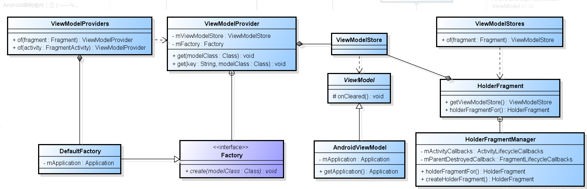
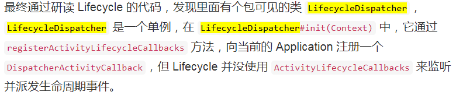
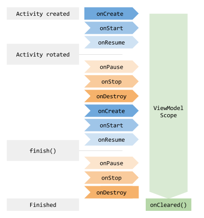

## ViewModel

1.使用ViewModel共享Fragments的数据

2.不要在viewmodel中使用Contexts，引起内存泄露。需要的话继承自AndroidViewModel

3.ViewModel 不可以替代onSaveInstanceState

## 一、创建流程（以Activity为例）.

    MyViewModel viewModel = ViewModelProviders.of(this).get(MyViewModel.class);

## 2.1 ViewModelProviders.of(this)

    public static ViewModelProvider of(@NonNull FragmentActivity activity) {
        return of(activity, null);
    }
    
    public static ViewModelProvider of(@NonNull FragmentActivity activity,
            @Nullable Factory factory) {
        Application application = checkApplication(activity);
        if (factory == null) {
            factory = ViewModelProvider.AndroidViewModelFactory.getInstance(application);
        }
        return new ViewModelProvider(ViewModelStores.of(activity), factory);
    }

第9行：初始化 ViewModel的factory（AndroidViewModelFactory）
    
## 2.2 ViewModelStores.of(activity)
获取组件对应的ViewModelStore，如果组件是ViewModelStoreOwner，直接获取
如果Activity不是，创建一个holderFragment和Activity绑定。

    public static ViewModelStore of(@NonNull FragmentActivity activity) {
        if (activity instanceof ViewModelStoreOwner) {
            return ((ViewModelStoreOwner) activity).getViewModelStore();
        }
        return holderFragmentFor(activity).getViewModelStore();
    }

## 2.3 HolderFragment.holderFragmentFor(activity)

    HolderFragment holderFragmentFor(FragmentActivity activity) {
            FragmentManager fm = activity.getSupportFragmentManager();
            HolderFragment holder = findHolderFragment(fm);
            if (holder != null) {
                return holder;
            }
            holder = mNotCommittedActivityHolders.get(activity);
            if (holder != null) {
                return holder;
            }
    
            if (!mActivityCallbacksIsAdded) {
                mActivityCallbacksIsAdded = true;
                activity.getApplication().registerActivityLifecycleCallbacks(mActivityCallbacks);
            }
            holder = createHolderFragment(fm);
            mNotCommittedActivityHolders.put(activity, holder);
            return holder;
        }

## 2.4 ViewModelProvider.get()

    public <T extends ViewModel> T get(@NonNull Class<T> modelClass) {
        String canonicalName = modelClass.getCanonicalName();
        if (canonicalName == null) {
            throw new IllegalArgumentException("Local and anonymous classes can not be ViewModels");
        }
        return get(DEFAULT_KEY + ":" + canonicalName, modelClass);
    }
    
    public <T extends ViewModel> T get(@NonNull String key, @NonNull Class<T> modelClass) {
        ViewModel viewModel = mViewModelStore.get(key);
    
        if (modelClass.isInstance(viewModel)) {
            //noinspection unchecked
            return (T) viewModel;
        } else {
            //noinspection StatementWithEmptyBody
            if (viewModel != null) {
                // TODO: log a warning.
            }
        }
    
        viewModel = mFactory.create(modelClass);
        mViewModelStore.put(key, viewModel);
        //noinspection unchecked
        return (T) viewModel;
    }

12-23行：根据类名获取对应的viewModel，先尝试从ViewStore中获取，如果没有，则通过factory创建
    
## 2.5 创建具体的viewModel

    public static class AndroidViewModelFactory extends ViewModelProvider.NewInstanceFactory {
        ...
        public AndroidViewModelFactory(@NonNull Application application) {
            mApplication = application;
        }
        @NonNull
        @Override
        public <T extends ViewModel> T create(@NonNull Class<T> modelClass) {
            if (AndroidViewModel.class.isAssignableFrom(modelClass)) {
                //noinspection TryWithIdenticalCatches
                try {
                    return modelClass.getConstructor(Application.class).newInstance(mApplication);
                } catch (NoSuchMethodException e) {
                    throw new RuntimeException("Cannot create an instance of " + modelClass, e);
                } catch (IllegalAccessException e) {
                    throw new RuntimeException("Cannot create an instance of " + modelClass, e);
                } catch (InstantiationException e) {
                    throw new RuntimeException("Cannot create an instance of " + modelClass, e);
                } catch (InvocationTargetException e) {
                    throw new RuntimeException("Cannot create an instance of " + modelClass, e);
                }
            }
            return super.create(modelClass);
        }
    }

## 二、销毁时机
## 2.1 HolderFragment.onDestroy()

    @Override
    public void onDestroy() {
        super.onDestroy();
        mViewModelStore.clear();
    }
## 2.2 LifecycleDispatcher.onDestroy

参考：
[Android架构组件（三）——ViewModel](https://blog.csdn.net/zhuzp_blog/article/details/78910535)init
[Lifecycle](https://www.jianshu.com/p/bd800c5dae30)