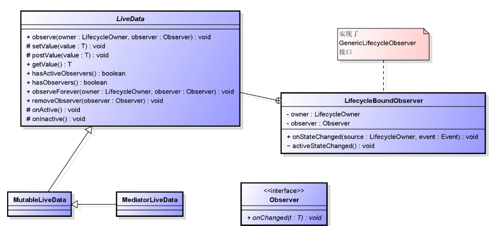
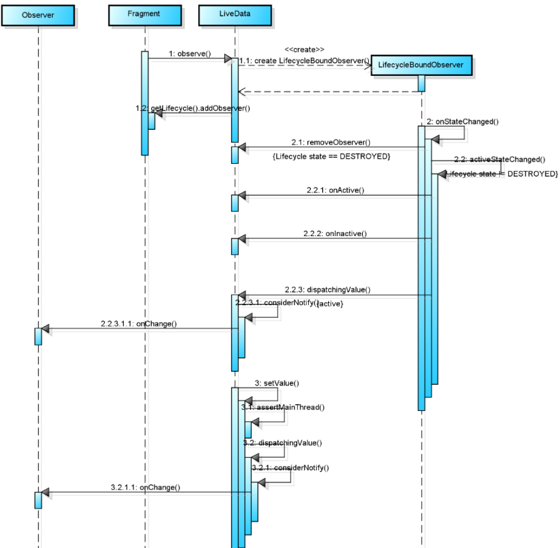

## LiveData

## 一、什么是LiveData

LiveData是一个数据持有类。它具有以下特点：

- 数据可以被观察者订阅；
- 能够感知组件（Fragment、Activity、Service）的生命周期；
- 只有在组件出于激活状态才会通知观察者有数据更新；

## 二、LiveData能为我们做什么

- 能够保证数据和UI统一,LiveData采用了观察者模式，LiveData是被观察者，当数据有变化时会通知UI。
- 减少内存泄漏,LiveData能够感知到组件的生命周期，当组件处于DESTROYED状态时，观察者对象会被清除,当Activity停止时不会导致Crash,因为组件处于非激活状态时，不会收到LiveData中数据变化的通知。
- 不需要额外的手动处理来响应生命周期的变化，因为LiveData能够感知组件的生命周期，所以就完全不需要在代码中告诉LiveData组件的生命周期状态。
- 组件和数据相关的内容能实时更新,组件在前台的时候能够实时收到数据改变的通知，当组件从后台到前台来时，LiveData能够将最新的数据通知组件，因此保证了组件中和数据相关的内容能够实时更新。
若果横竖屏切换（configuration change）时，不需要额外的处理来保存数据,当屏幕方向变化时，组件会被recreate，然而系统并不能保证你的数据能够被恢复的。当我们采用LiveData保存数据时，因为数据和组件分离了。当组件被recreate，数据还是存在LiveData中，并不会被销毁。
- 资源共享。

## 三、工作原理

添加observer有2种方式，分别对应2个不同的observer AlwaysActiveObserver 和 LifecycleBoundObserver
1.observeForever() ->  AlwaysActiveObserver 
如果是observeForever方式，当数据改变时不管组件处于什么状态都会收到回调。

    @MainThread
    public void observeForever(@NonNull Observer<T> observer) {
        AlwaysActiveObserver wrapper = new AlwaysActiveObserver(observer);
        ObserverWrapper existing = mObservers.putIfAbsent(observer, wrapper);
        if (existing != null && existing instanceof LiveData.LifecycleBoundObserver) {
            throw new IllegalArgumentException("Cannot add the same observer"
                    + " with different lifecycles");
        }
        if (existing != null) {
            return;
        }
        wrapper.activeStateChanged(true);
    }
    
    private class AlwaysActiveObserver extends ObserverWrapper {
        AlwaysActiveObserver(Observer<T> observer) {
            super(observer);
        }
        @Override
        boolean shouldBeActive() {
            return true;
        }
    }
第20行：无论组件是什么状态，都认为组件是活跃的。considerNotify中会使用到这个判断

### 3.2 observe() -> LifecycleBoundObserver 
加入到对应的组件的生命周期管理类中管理，当组件的生命周期发生变化时，会回调给liveData；当组件的生命周期结束后，移除对应的observer监听。

    @MainThread
    public void observe(@NonNull LifecycleOwner owner, @NonNull Observer<T> observer) {
        if (owner.getLifecycle().getCurrentState() == DESTROYED) {
            // ignore
            return;
        }
        LifecycleBoundObserver wrapper = new LifecycleBoundObserver(owner, observer);
        ObserverWrapper existing = mObservers.putIfAbsent(observer, wrapper);
        if (existing != null && !existing.isAttachedTo(owner)) {
            throw new IllegalArgumentException("Cannot add the same observer"
                    + " with different lifecycles");
        }
        if (existing != null) {
            return;
        }
        // owner就是对应的Activity或者Fragment 
        owner.getLifecycle().addObserver(wrapper);
    }

##5. LifecycleBoundObserver工作原理
5.1 onStateChanged

    class LifecycleBoundObserver extends ObserverWrapper implements GenericLifecycleObserver {
       ...
       @Override
        boolean shouldBeActive() {
           // 判断 state 是不是 >= 0
           return mOwner.getLifecycle().getCurrentState().isAtLeast(STARTED);
        }
        @Override
        public void onStateChanged(LifecycleOwner source, Lifecycle.Event event) {
            if (mOwner.getLifecycle().getCurrentState() == DESTROYED) {
                removeObserver(mObserver);
                return;
            }
            activeStateChanged(shouldBeActive());
        }
        ...
    }
第6行：如果组件当前的状态是活跃的，那么就分发状态。
第10行：当组件生命周期发生变化时，如果组件被销毁了，移除当前的监听器。

4.3 activeStateChanged

    void activeStateChanged(boolean newActive) {
    	// 新状态和之前的状态相同，不处理
        if (newActive == mActive) {
            return;
        }
        // immediately set active state, so we'd never dispatch anything to inactive
        // owner
        mActive = newActive;
        boolean wasInactive = LiveData.this.mActiveCount == 0;
        LiveData.this.mActiveCount += mActive ? 1 : -1;
        if (wasInactive && mActive) {
            onActive();
        }
        if (LiveData.this.mActiveCount == 0 && !mActive) {
            onInactive();
        }
        if (mActive) {
            dispatchingValue(this);
        }
    }

第18行：如果当前的组件的状态是活跃的，没有被destroy，那么调用dispatchingValue。ps：onActive()和onInactive()都是空实现的方法，继承类可以选择去实现。

4.3 dispatchingValue

    private void dispatchingValue(@Nullable ObserverWrapper initiator) {
        if (mDispatchingValue) {
            mDispatchInvalidated = true;
            return;
        }
        mDispatchingValue = true;
        do {
            mDispatchInvalidated = false;
            if (initiator != null) {
                considerNotify(initiator);
                initiator = null;
            } else {
                for (Iterator<Map.Entry<Observer<T>, ObserverWrapper>> iterator =
                        mObservers.iteratorWithAdditions(); iterator.hasNext()considerNotify; ) {
                    considerNotify(iterator.next().getValue());
                    if (mDispatchInvalidated) {
                        break;
                    }
                }
            }
        } while (mDispatchInvalidated);
        mDispatchingValue = false;
    }

第9行：如果当前的observer不为空，那么尝试将状态分发给这个observer；如果为空，遍历所有的observer列表分发该状态。ps在setValue时 会传递一个空的observer，这样就会将状态分发给所有监听这个Livedata的对象。

4.4 considerNotify

    private void considerNotify(ObserverWrapper observer) {
        if (!observer.mActive) {
            return;
        }
        // Check latest state b4 dispatch. Maybe it changed state but we didn't get the event yet.
        //
        // we still first check observer.active to keep it as the entrance for events. So even if
        // the observer moved to an active state, if we've not received that event, we better not
        // notify for a more predictable notification order.
        if (!observer.shouldBeActive()) {
            observer.activeStateChanged(false);
            return;
        }
        if (observer.mLastVersion >= mVersion) {
            return;
        }
        observer.mLastVersion = mVersion;
        //noinspection unchecked
        observer.mObserver.onChanged((T) mData);
    }

对于LiveData，其初始的version是-1，当我们调用了其setValue或者postValue，其vesion会+1；对于每一个观察者的封装ObserverWrapper，其初始version也为-1，也就是说，每一个新注册的观察者，其version为-1；当LiveData设置这个ObserverWrapper的时候，如果LiveData的version大于ObserverWrapper的version，LiveData就会强制把当前value推送给Observer。所以LiveDataBus每注册一个新的订阅者，这个订阅者立刻会收到一个回调，即使这个设置的动作发生在订阅之前。
##五、改变数据
LiveData提供了两种改变数据的方法：setValue()和postValue()。setValue()在主线程中调用，而postValue()既可在主线程也可在子线程中调用。

### 5.1 PostValue
postValue 最终会在主线程中调用setValue方法

    protected void postValue(T value) {
        boolean postTask;
        synchronized (mDataLock) {
            postTask = mPendingData == NOT_SET;
            mPendingData = value;
        }
        if (!postTask) {
            return;
        }
        ArchTaskExecutor.getInstance().postToMainThread(mPostValueRunnable);
    }
    
    private final Runnable mPostValueRunnable = new Runnable() {
         @Override
         public void run() {
             Object newValue;
             synchronized (mDataLock) {
                 newValue = mPendingData;
                 mPendingData = NOT_SET;
             }
             //noinspection unchecked
             setValue((T) newValue);
         }
    };

### 5.2 setValue

    @MainThread
    protected void setValue(T value) {
        assertMainThread("setValue");
        mVersion++;
        mData = value;
        dispatchingValue(null);
    }

第6行：调用到dispatchingValue 
    
总结：
Livedata通过observe()方法将数据源的生命周期和组件（Fragment/Activity）关联起来。当组件的生命周期发生变化或者数据源发生变化（调用postValue或者setValue），onStateChanged()方法会被调用。

## 参考：
[LiveDataBus](http://www.10tiao.com/html/244/201807/2651748475/4.html)
[liveData源码分析](http://www.10tiao.com/html/597/201809/2651943621/1.html)