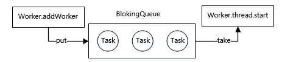

ThreadPoolExecutor 线程池原理

# 一、为什么要使用线程池？

平时讨论多线程处理，大佬们必定会说使用线程池，那为什么要使用线程池？其实，这个问题可以反过来思考一下，不使用线程池会怎么样？

- 当需要多线程并发执行任务时，只能不断的通过new Thread创建线程，每创建一个线程都需要在堆上分配内存空间，同时需要分配虚拟机栈、本地方法栈、程序计数器等线程私有的内存空间。
- 当这个线程对象被可达性分析算法标记为不可用时被GC回收，这样频繁的创建和回收需要大量的额外开销。
- 再者说，JVM的内存资源是有限的，如果系统中大量的创建线程对象，JVM很可能直接抛出OutOfMemoryError异常，还有大量的线程去竞争CPU会产生其他的性能开销，更多的线程反而会降低性能，所以必须要限制线程数。

**使用线程池有哪些好处：**

- **降低资源消耗**：线程池可以复用池中的线程，不需要每次都创建新线程，减少创建和销毁线程的开销。
- **提高响应速度**：任务到达时，无需等待线程创建即可立即执行。
- **提高线程的可管理性**：线程是稀缺资源，如果无限制创建，不仅会消耗系统资源，还会因为线程的不合理分布导致资源调度失衡，降低系统的稳定性。使用线程池可以进行统一的分配、调优和监控。
- **线程池可实现线程环境的隔离**，例如分别定义支付功能相关线程池和优惠券功能相关线程池，当其中一个运行有问题时不会影响另一个。
- **提供更多更强大的功能**：线程池具备可拓展性，允许开发人员向其中增加更多的功能。比如延时定时线程池ScheduledThreadPoolExecutor，就允许任务延期执行或定期执行。

Java中的线程池核心实现类是ThreadPoolExecutor，下面来分析下它的基本原理。

# 二、7大核心参数

ThreadPoolExecutor定义了七大核心属性，这些属性是线程池实现的基石。

```java
public ThreadPoolExecutor(int corePoolSize,
                          int maximumPoolSize,
                          long keepAliveTime,
                          TimeUnit unit,
                          BlockingQueue<Runnable> workQueue,
                          ThreadFactory threadFactory,
                          RejectedExecutionHandler handler) {
    if (corePoolSize < 0 ||
        maximumPoolSize <= 0 ||
        maximumPoolSize < corePoolSize ||
        keepAliveTime < 0)
        throw new IllegalArgumentException();
    if (workQueue == null || threadFactory == null || handler == null)
        throw new NullPointerException();
    this.corePoolSize = corePoolSize;
    this.maximumPoolSize = maximumPoolSize;
    this.workQueue = workQueue;
    this.keepAliveTime = unit.toNanos(keepAliveTime);
    this.threadFactory = threadFactory;
    this.handler = handler;
}
```

1. **coreSize**

   默认情况下，在创建了线程池后，线程池中的线程数为0，当有任务来之后，就会创建一个线程去执行任务，当线程池中的线程数目达到corePoolSize后，就会把到达的任务放到任务队列当中。线程池将长期保证这些线程处于存活状态，即使线程已经处于闲置状态。除非配置了allowCoreThreadTimeOut=true，核心线程数的线程也将不再保证长期存活于线程池内，在空闲时间超过keepAliveTime后被销毁。

2. **maximumPoolSize**

   线程池内的最大线程数量，线程池内维护的线程不得超过该数量，大于核心线程数量小于最大线程数量的线程将在空闲时间超过keepAliveTime后被销毁。当阻塞队列存满后，将会创建新线程执行任务，线程的数量不会大于maximumPoolSize。maximumPoolSize的上限是

$$
2^n -1 (n = 29)
$$

3. **keepAliveTime** 

   存活时间，若线程数超过了corePoolSize，线程闲置时间超过了存活时间，该线程将被销毁。除非配置了allowCoreThreadTimeOut=true，核心线程数的线程也将不再保证长期存活于线程池内，在空闲时间超过keepAliveTime后被销毁。

4. **unit**

   线程存活时间的单位，例如TimeUnit.SECONDS表示秒。

5. **workQueue**

   线程池中保存等待执行的任务的阻塞队列。通过execute方法提交的Runable对象都会“存储”在该队列中，能够通过实现BlockingQueue接口来自定义我们所需要的阻塞队列

6. **threadFactory**

   创建线程的工厂，默认是DefaultThreadFactory，可以定义线程名称，分组，优先级等。

7. **RejectedExecutionHandler**

   拒绝策略（饱和策略），当任务队列存满并且线程池个数达到maximunPoolSize后采取的策略。ThreadPoolExecutor中提供了四种拒绝策略。

   | 可选值              | 说明                                                   |
   | ------------------- | ------------------------------------------------------ |
   | AbortPolicy         | 直接抛出RejectedExecutionException异常，默认拒绝策略。 |
   | DiscardPolicy       | 不进行处理也不抛出异常。                               |
   | DiscardOldestPolicy | 丢弃队列里最前的任务，执行当前任务。                   |
   | CallerRunsPolicy    | 由调用线程执行该任务。                                 |

# 三、工作原理

ThreadPoolExecutor运行机制如下图所示：


线程池在内部实际上构建了一个生产者消费者模型，将线程和任务两者解耦，并不直接关联，从而良好的缓冲任务，复用线程。线程池的运行主要分成两部分：任务管理、线程管理。

- 任务管理部分充当生产者的角色，当任务提交后，线程池会判断该任务后续的流转：（1）直接申请线程执行该任务；（2）缓冲到队列中等待线程执行；（3）拒绝该任务。

- 线程管理部分是消费者，它们被统一维护在线程池内，根据任务请求进行线程的分配，当线程执行完任务后则会继续获取新的任务去执行，最终当线程获取不到任务的时候，线程就会被回收。

我们会按照以下三个部分去详细讲解线程池运行机制：

1. 线程池如何维护自身状态。
2. 线程池如何管理任务。
3. 线程池如何管理线程。

## 3.1、线程池状态管理

线程池内部使用一个变量**ctl**维护运行状态(runState)和线程数量 (workerCount)，是一个32位二进制数，其中前3位表示线程池状态，后29位表示线程数。

```java
private final AtomicInteger ctl = new AtomicInteger(ctlOf(RUNNING, 0));
private static final int COUNT_BITS = Integer.SIZE - 3;
private static final int CAPACITY   = (1 << COUNT_BITS) - 1;
// runState is stored in the high-order bits
private static final int RUNNING    = -1 << COUNT_BITS;
private static final int SHUTDOWN   =  0 << COUNT_BITS;
private static final int STOP       =  1 << COUNT_BITS;
private static final int TIDYING    =  2 << COUNT_BITS;
private static final int TERMINATED =  3 << COUNT_BITS;
// Packing and unpacking ctl
private static int runStateOf(int c)     { return c & ~CAPACITY; }
private static int workerCountOf(int c)  { return c & CAPACITY; }
private static int ctlOf(int rs, int wc) { return rs | wc; }
```

线程池状态：

| 状态       | 前3位值 | 描述                                                         |
| ---------- | ------- | ------------------------------------------------------------ |
| RUNNING    | 111     | 能接受新提交的任务，也能处理阻塞队列中的任务。               |
| SHUTDOWN   | 000     | 关闭状态，不再接受新提交的任务，单可以继续执行已添加到阻塞队列中的任务。 |
| STOP       | 001     | 不能接受新任务，也不能处理队列中的任务，会中断正在执行的任务的线程。 |
| TIDYING    | 010     | 所有的任务都已经终止，workerCount（有效线程数）为0           |
| TERMINATED | 011     | 在terminated()方法执行完后进入该状态                         |

生命周期的转换如下图：


线程池运行的状态，并不是用户显式设置的，而是伴随着线程池的运行，由内部来维护。

## 3.2、任务管理

### 3.2.1、任务提交

向线程池中提交一个任务后，线程池的处理流程如下：


1. 如果线程池中的数量未达到核心线程的数量，则直接会启动一个核心线程来执行任务。
2. 如果线程池中的数量已经达到或超过核心线程的数量，则任务会被插入到任务队列中等待执行。

3. 如果任务队列已满，且线程数未达到最大线程数，则会启动一个非核心线程来执行任务。

4. 如果线程数已达到最大值，按照饱和策略执行该任务。

具体代码实现execute方法中：

```java
public void execute(Runnable command) {
    if (command == null)
        throw new NullPointerException();
    int c = ctl.get();
    if (workerCountOf(c) < corePoolSize) {
        // 1、如果线程池中的数量未达到核心线程的数量，则直接会启动一个核心线程来执行任务
        if (addWorker(command, true))
            return;
        c = ctl.get();
    }
    // 2、如果线程池中的数量已经达到或超过核心线程的数量，则任务会被插入到任务队列中等待执行
    if (isRunning(c) && workQueue.offer(command)) {
        int recheck = ctl.get();
        if (! isRunning(recheck) && remove(command))
            reject(command);
        else if (workerCountOf(recheck) == 0)
            addWorker(null, false);
    }
    // 3、如果任务队列已满，且线程数未达到最大线程数，则会启动一个非核心线程来执行任务。
    else if (!addWorker(command, false))
        // 4、如果线程数已达到最大值，按照饱和策略执行该任务。
        reject(command);
}
```

### 3.2.2、任务缓冲

任务缓冲模块是线程池能够管理任务的核心部分，依靠阻塞队列（BlockingQueue）来实现。任务先提交到阻塞队列中，再由工作线程从阻塞队列中获取任务。



使用不同的队列可以实现不一样的任务存取策略，常见的阻塞队列有：


## 3.3、Worker线程管理

## 1、addWorker

```java
private boolean addWorker(Runnable firstTask, boolean core) {
    retry:
    for (;;) {
        int c = ctl.get();
        int rs = runStateOf(c);

        // Check if queue empty only if necessary.
        if (rs >= SHUTDOWN &&
            ! (rs == SHUTDOWN &&
               firstTask == null &&
               ! workQueue.isEmpty()))
            return false;

        for (;;) {
            int wc = workerCountOf(c);
            if (wc >= CAPACITY ||
                wc >= (core ? corePoolSize : maximumPoolSize))
                return false;
            if (compareAndIncrementWorkerCount(c))
                break retry;
            c = ctl.get();  // Re-read ctl
            if (runStateOf(c) != rs)
                continue retry;
            // else CAS failed due to workerCount change; retry inner loop
        }
    }

    boolean workerStarted = false;
    boolean workerAdded = false;
    Worker w = null;
    try {
        w = new Worker(firstTask);
        final Thread t = w.thread;
        if (t != null) {
            final ReentrantLock mainLock = this.mainLock;
            mainLock.lock();
            try {
                // Recheck while holding lock.
                // Back out on ThreadFactory failure or if
                // shut down before lock acquired.
                int rs = runStateOf(ctl.get());

                if (rs < SHUTDOWN ||
                    (rs == SHUTDOWN && firstTask == null)) {
                    if (t.isAlive()) // precheck that t is startable
                        throw new IllegalThreadStateException();
                    workers.add(w);
                    int s = workers.size();
                    if (s > largestPoolSize)
                        largestPoolSize = s;
                    workerAdded = true;
                }
            } finally {
                mainLock.unlock();
            }
            if (workerAdded) {
                t.start();
                workerStarted = true;
            }
        }
    } finally {
        if (! workerStarted)
            addWorkerFailed(w);
    }
    return workerStarted;
}
```

2 - 26行：检查线程状态，尝试增加线程

## 3、worker

```java
private final class Worker
    extends AbstractQueuedSynchronizer
    implements Runnable
{
    /** Thread this worker is running in.  Null if factory fails. */
    final Thread thread;
    /** Initial task to run.  Possibly null. */
    Runnable firstTask;

    /**
     * Creates with given first task and thread from ThreadFactory.
     * @param firstTask the first task (null if none)
     */
    Worker(Runnable firstTask) {
        setState(-1); // inhibit interrupts until runWorker
        this.firstTask = firstTask;
        // 重点在这里
        this.thread = getThreadFactory().newThread(this);
    }

    /** Delegates main run loop to outer runWorker. */
    public void run() {
        runWorker(this);
    }
  // 省略...
}
```

## 4、runWorker

```java
final void runWorker(Worker w) {
    Thread wt = Thread.currentThread();
    Runnable task = w.firstTask;
    w.firstTask = null;
    w.unlock(); // allow interrupts
    boolean completedAbruptly = true;
    try {
        while (task != null || (task = getTask()) != null) {
            w.lock();
            // If pool is stopping, ensure thread is interrupted;
            // if not, ensure thread is not interrupted.  This
            // requires a recheck in second case to deal with
            // shutdownNow race while clearing interrupt
            if ((runStateAtLeast(ctl.get(), STOP) ||
                 (Thread.interrupted() &&
                  runStateAtLeast(ctl.get(), STOP))) &&
                !wt.isInterrupted())
                wt.interrupt();
            try {
                beforeExecute(wt, task);
                Throwable thrown = null;
                try {
                    task.run();
                } catch (RuntimeException x) {
                    thrown = x; throw x;
                } catch (Error x) {
                    thrown = x; throw x;
                } catch (Throwable x) {
                    thrown = x; throw new Error(x);
                } finally {
                    afterExecute(task, thrown);
                }
            } finally {
                task = null;
                w.completedTasks++;
                w.unlock();
            }
        }
        completedAbruptly = false;
    } finally {
        processWorkerExit(w, completedAbruptly);
    }
}
```

## 5、getTask

```java
private Runnable getTask() {
    boolean timedOut = false; // Did the last poll() time out?

    for (;;) {
        int c = ctl.get();
        int rs = runStateOf(c);

        // Check if queue empty only if necessary.
        if (rs >= SHUTDOWN && (rs >= STOP || workQueue.isEmpty())) {
            decrementWorkerCount();
            return null;
        }

        int wc = workerCountOf(c);

        // Are workers subject to culling?
        boolean timed = allowCoreThreadTimeOut || wc > corePoolSize;

        if ((wc > maximumPoolSize || (timed && timedOut))
            && (wc > 1 || workQueue.isEmpty())) {
            if (compareAndDecrementWorkerCount(c))
                return null;
            continue;
        }

        try {
            Runnable r = timed ?
                workQueue.poll(keepAliveTime, TimeUnit.NANOSECONDS) :
                workQueue.take();
            if (r != null)
                return r;
            timedOut = true;
        } catch (InterruptedException retry) {
            timedOut = false;
        }
    }
}
```


​    


### 2.BlockingQueue<Runnable> workQueue
workQueue：任务队列，主要用来存储已经提交但未被执行的任务，不同的线程池采用的排队策略不一样，java中提供的workQueue：

    1.ArrayBlockingQueue：是一个基于数组结构的有界阻塞队列，此队列按 FIFO（先进先出）原则对元素进行排序。
    2.LinkedBlockingQueue：一个基于链表结构的阻塞队列，此队列按FIFO （先进先出） 排序元素，吞吐量通常要高于ArrayBlockingQueue(容量Integer.MaxValue)
    3.SynchronousQueue：一个不存储元素的阻塞队列。每个插入操作必须等到另一个线程调用移除操作，否则插入操作一直处于阻塞状态，吞吐量通常要高于LinkedBlockingQueue，
    4.PriorityBlockingQueue：一个具有优先级的无限阻塞队列。
    5.DelayedWorkQueue：等待队列，因为这些任务是带有延迟的，而每次执行都是取第一个任务执行，因此在DelayedWorkQueue中任务必然按照延迟时间从短到长来进行排序的。

### 

    


## 2.4、线程回收

## 三、ExecutorService 


### 1、newFixedThreadPool

该模式全部由核心线程去实现，并不会被回收，没有超时限制和任务队列的限制，会创建一个定长线程池，可控制线程最大并发数，超出的线程会在队列中等待。
        

```java
ExecutorService fixedThreadPool = Executors.newFixedThreadPool(5);
```

### 2、newCachedThreadPool

该模式下线程数量不定的线程池，只有非核心线程，最大值为Integer.MAX_VALUE，会创建一个可缓存线程池，如果线程池长度超过处理需要，可灵活回收空闲线程，若无可回收，则新建线程。

```java
  ExecutorService cachedThreadPool = Executors.newCachedThreadPool();
```

### 3、newSingleThreadExecutor

该模式下线程池内部只有一个核心线程，所有的任务都在一个线程中执行，会创建一个单线程化的线程池，它只会用唯一的工作线程来执行任务，保证所有任务按照指定顺序(FIFO, LIFO, 优先级)执行。实现代码如下：

```java
ExecutorService singleThreadPool = Executors.newSingleThreadExecutor();
```

### 4、newScheduledThreadPool

该模式下核心线程是固定的，非核心线程没有限制，非核心线程闲置时会被回收。会创建一个定长线程池，执行定时任务和固定周期的任务。

```java
  ScheduledExecutorService scheduledThreadPool = Executors.newScheduledThreadPool(5);
```

### 5、newSingleThreadScheduledExecutor()

该模式下返回一个可以控制线程池内线程定时或周期性执行某任务的线程池。只不过和上面的区别是该线程池大小为1，而上面的可以指定线程池的大小
    

```java
ScheduledExecutorService singleThreadScheduledPool = Executors.newSingleThreadScheduledExecutor();
```

#### ScheduledExecutorService可调用方法的说明

```java
1.schedule(Runnable command, long delay, TimeUnit unit)
延迟delay时间后执行，只执行一次。
         
2.scheduleAtFixedRate(Runnable command, long initialDelay, long period, TimeUnitunit)
if(线程执行时间＞period）
    执行周期 = 线程执行时间。
 else
    执行周期 = period（延迟）。
    
3.scheduleWithFixedDelay(Runnable command, long initialDelay, long delay,TimeUnit unit)
执行周期 = 线程执行时间+delay
```


3.五种线程池分别用的lockingQueue：

1、newFixedThreadPool()—>LinkedBlockingQueue 
2、newSingleThreadExecutor()—>LinkedBlockingQueue 
3、newCachedThreadPool()—>SynchronousQueue 
4、newScheduledThreadPool()—>DelayedWorkQueue 
5、newSingleThreadScheduledExecutor()—>DelayedWorkQueue 等待队列


## 5.线程池其他常用功能

1.shutDown()  关闭线程池，不影响已经提交的任务
2.shutDownNow() 关闭线程池，并尝试去终止正在执行的线程
3.allowCoreThreadTimeOut(boolean value) 允许核心线程闲置超时时被回收
4.submit() 一般情况下我们使用execute来提交任务，但是有时候可能也会用到submit，使用submit的好处是submit有返回值

    public void submit(View view) {
        List<Future<String>> futures = new ArrayList<>();
        ThreadPoolExecutor threadPoolExecutor = new ThreadPoolExecutor(3, 5, 1,
                TimeUnit.SECONDS, new LinkedBlockingDeque<Runnable>());
        for (int i = 0; i < 10; i++) {
            Future<String> taskFuture = threadPoolExecutor.submit(new MyTask(i));
            //将每一个任务的执行结果保存起来
            futures.add(taskFuture);
        }
        try {
            //遍历所有任务的执行结果
            for (Future<String> future : futures) {
                Log.d("google_lenve_fb", "submit: " + future.get());
            }
        } catch (InterruptedException e) {
            e.printStackTrace();
        } catch (ExecutionException e) {
            e.printStackTrace();
        }
    }
    
    class MyTask implements Callable<String> {
        private int taskId;
        
        public MyTask(int taskId) {
            this.taskId = taskId;
        }
        @Override
        public String call() throws Exception {
            SystemClock.sleep(1000);
            //返回每一个任务的执行结果
            return "call()方法被调用----" + Thread.currentThread().getName() + "-------" + taskId;
        }
    }

参考资料：
http://blog.csdn.net/u010687392/article/details/49850803
《Android开发艺术探索》

https://www.cnblogs.com/franson-2016/p/13291591.html

https://www.cnblogs.com/zhangziqiu/archive/2011/03/30/ComputerCode.html