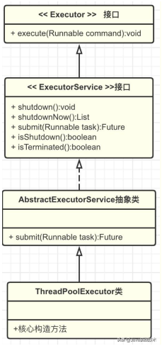
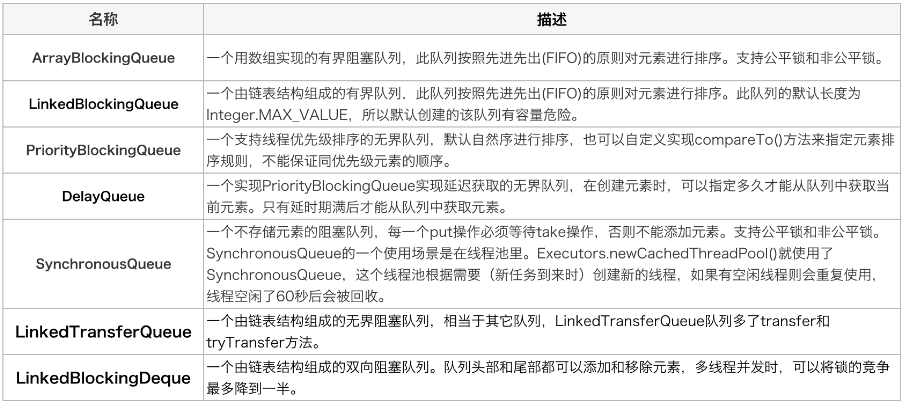
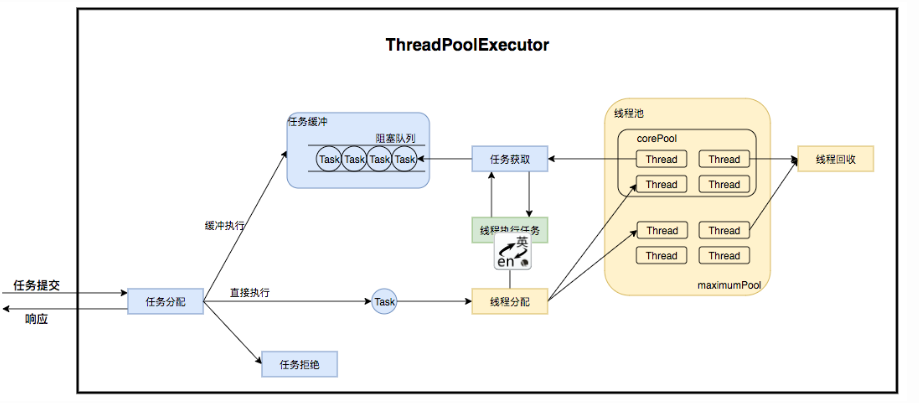
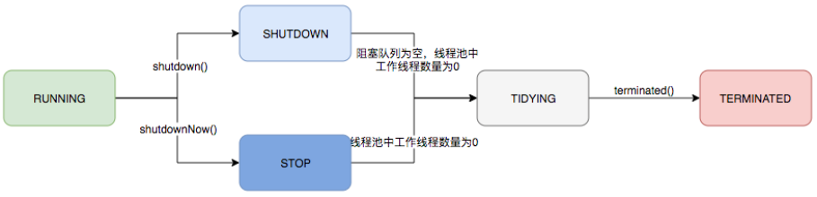
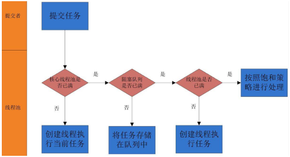
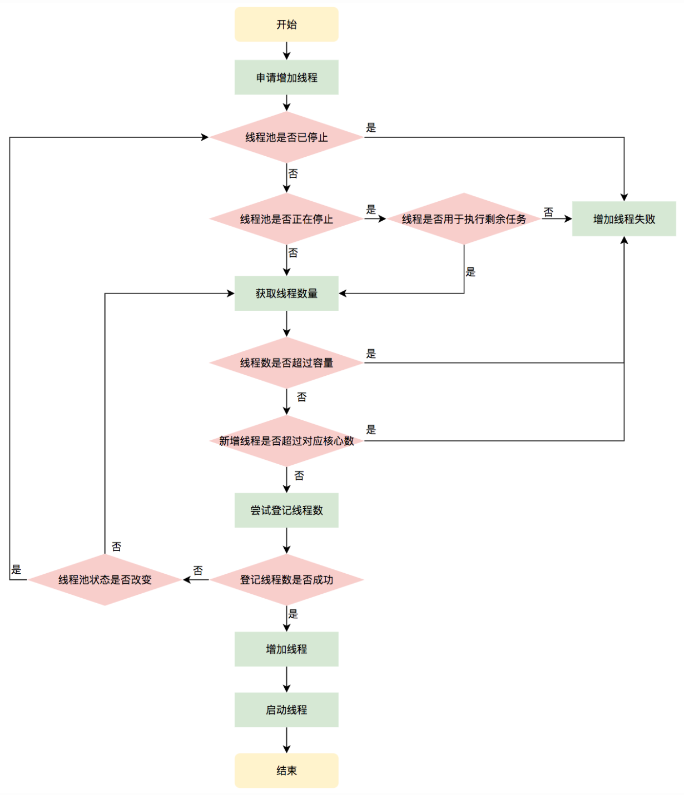
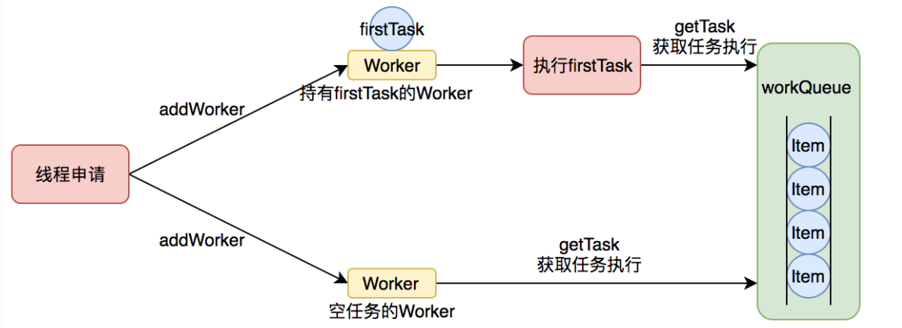
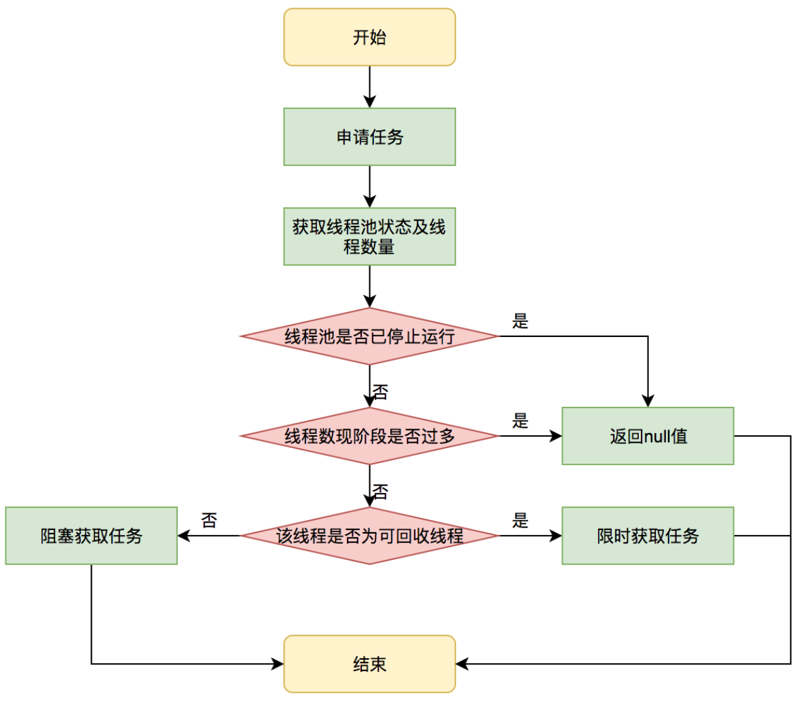
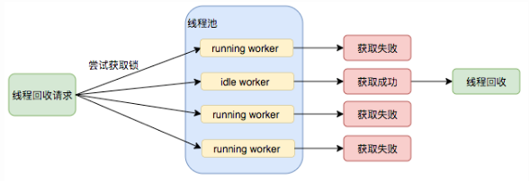

# ThreadPoolExecutor 线程池原理

# 一、为什么要使用线程池？

平时讨论多线程处理，大佬们必定会说使用线程池，那为什么要使用线程池？其实，这个问题可以反过来思考一下，不使用线程池会怎么样？

- 当需要多线程并发执行任务时，只能不断的通过new Thread创建线程，每创建一个线程都需要在堆上分配内存空间，同时需要分配虚拟机栈、本地方法栈、程序计数器等线程私有的内存空间。
- 当这个线程对象被可达性分析算法标记为不可用时被GC回收，这样频繁的创建和回收需要大量的额外开销。
- 再者说，JVM的内存资源是有限的，如果系统中大量的创建线程对象，JVM很可能直接抛出OutOfMemoryError异常，还有大量的线程去竞争CPU会产生其他的性能开销，更多的线程反而会降低性能，所以必须要限制线程数。

**使用线程池有哪些好处：**

- **降低资源消耗**：线程池可以复用池中的线程，不需要每次都创建新线程，减少创建和销毁线程的开销。
- **提高响应速度**：任务到达时，无需等待线程创建即可立即执行。
- **提高线程的可管理性**：线程是稀缺资源，如果无限制创建，不仅会消耗系统资源，还会因为线程的不合理分布导致资源调度失衡，降低系统的稳定性。使用线程池可以进行统一的分配、调优和监控。
- **线程池可实现线程环境的隔离**，例如分别定义支付功能相关线程池和优惠券功能相关线程池，当其中一个运行有问题时不会影响另一个。
- **提供更多更强大的功能**：线程池具备可拓展性，允许开发人员向其中增加更多的功能。比如延时定时线程池ScheduledThreadPoolExecutor，就允许任务延期执行或定期执行。

Java中的线程池核心实现类是ThreadPoolExecutor，下面来分析下它的基本原理。

# 二、如何构造线程池？

## 2.1、线程池类的设计

我们首先来看一下ThreadPoolExecutor的UML类图，了解下ThreadPoolExecutor的继承关系。



1. Executor：ThreadPoolExecutor的顶层接口，Executor只定义了一个接口execute
2. ExecutorService：继承自Executor，扩展了Executor的接口，增加了有返回值的接口submit以及主动退出线程池shutDown的方法。
3. AbstractExecutorService：实现了ExecutorService中的部分方法，比如submit。
4. ThreadPoolExecutor：线程池最核心的类，一方面维护自身的生命周期，另一方面同时管理线程和任务，使两者良好的结合从而执行并行任务。

## 2.2、7大核心参数

ThreadPoolExecutor构造方法中定义了7个参数，下面具体看下各个参数的含义。

```java
public ThreadPoolExecutor(int corePoolSize,
                          int maximumPoolSize,
                          long keepAliveTime,
                          TimeUnit unit,
                          BlockingQueue<Runnable> workQueue,
                          ThreadFactory threadFactory,
                          RejectedExecutionHandler handler) {
    if (corePoolSize < 0 ||
        maximumPoolSize <= 0 ||
        maximumPoolSize < corePoolSize ||
        keepAliveTime < 0)
        throw new IllegalArgumentException();
    if (workQueue == null || threadFactory == null || handler == null)
        throw new NullPointerException();
    this.corePoolSize = corePoolSize;
    this.maximumPoolSize = maximumPoolSize;
    this.workQueue = workQueue;
    this.keepAliveTime = unit.toNanos(keepAliveTime);
    this.threadFactory = threadFactory;
    this.handler = handler;
}
```

1. **coreSize**

   默认情况下，在创建了线程池后，线程池中的线程数为0，当有任务来之后，就会创建一个线程去执行任务，当线程池中的线程数目达到corePoolSize后，就会把到达的任务放到任务队列当中。线程池将长期保证这些线程处于存活状态，即使线程已经处于闲置状态。除非配置了allowCoreThreadTimeOut=true，核心线程数的线程也会在空闲时间超过keepAliveTime后被销毁。

2. **maximumPoolSize**

   线程池内的最大线程数量，线程池内维护的线程不得超过该数量，大于核心线程数量的线程将在空闲时间超过keepAliveTime后被销毁。当阻塞队列存满后，将会创建新线程执行任务，线程的数量不会大于maximumPoolSize。maximumPoolSize的上限是

$$
2^n -1 (n = 29)
$$

3. **keepAliveTime** 

   存活时间，若线程数超过了corePoolSize，线程闲置时间超过了存活时间，该线程将被销毁。除非配置了allowCoreThreadTimeOut=true，核心线程数的线程也将不再保证长期存活于线程池内，在空闲时间超过keepAliveTime后被销毁。

4. **unit**

   线程存活时间的单位，例如TimeUnit.SECONDS表示秒。

5. **workQueue**

   线程池中保存等待执行的任务的阻塞队列。通过execute方法提交的Runable对象都会“存储”在该队列中，能够通过实现BlockingQueue接口来自定义我们所需要的阻塞队列。使用不同的队列可以实现不一样的任务存取策略，常见的阻塞队列有：

   

6. **threadFactory**

   创建线程的工厂，默认是DefaultThreadFactory，可以定义线程名称，分组，优先级等。

7. **RejectedExecutionHandler**

   拒绝策略（饱和策略），当任务队列存满并且线程池个数达到maximunPoolSize后采取的策略。ThreadPoolExecutor中提供了四种拒绝策略如下：

   | 可选值              | 说明                                                   |
   | ------------------- | ------------------------------------------------------ |
   | AbortPolicy         | 直接抛出RejectedExecutionException异常，默认拒绝策略。 |
   | DiscardPolicy       | 不进行处理也不抛出异常。                               |
   | DiscardOldestPolicy | 丢弃队列里最前的任务，执行当前任务。                   |
   | CallerRunsPolicy    | 由调用线程执行该任务。                                 |

# 三、线程池的工作原理？

ThreadPoolExecutor运行机制如下图所示：



线程池在内部实际上构建了一个生产者消费者模型，将线程和任务两者解耦，并不直接关联，从而良好的缓冲任务，复用线程。线程池的运行主要分成两部分：任务管理、线程管理。

- 任务管理部分充当生产者的角色，当任务提交后，线程池会判断该任务后续的流转：（1）直接申请线程执行该任务；（2）缓冲到队列中等待线程执行；（3）拒绝该任务。

- 线程管理部分是消费者，它们被统一维护在线程池内，根据任务请求进行线程的分配，当线程执行完任务后则会继续获取新的任务去执行，最终当线程获取不到任务的时候，线程就会被回收。

我们会按照以下四个部分去详细讲解线程池运行机制：

1. 线程池的状态管理。
2. 任务提交。
3. 任务执行。
4. Worker和线程回收

## 3.1、线程池状态管理

线程池内部使用一个变量**ctl**维护运行状态(runState)和线程数量 (workerCount)，是一个32位二进制数，其中前3位表示线程池状态，后29位表示线程数。

```java
private final AtomicInteger ctl = new AtomicInteger(ctlOf(RUNNING, 0));
private static final int COUNT_BITS = Integer.SIZE - 3;
private static final int CAPACITY   = (1 << COUNT_BITS) - 1;
// runState is stored in the high-order bits
private static final int RUNNING    = -1 << COUNT_BITS;
private static final int SHUTDOWN   =  0 << COUNT_BITS;
private static final int STOP       =  1 << COUNT_BITS;
private static final int TIDYING    =  2 << COUNT_BITS;
private static final int TERMINATED =  3 << COUNT_BITS;
// Packing and unpacking ctl
private static int runStateOf(int c)     { return c & ~CAPACITY; }
private static int workerCountOf(int c)  { return c & CAPACITY; }
private static int ctlOf(int rs, int wc) { return rs | wc; }
```

线程池状态：

| 状态       | 前3位值 | 描述                                                         |
| ---------- | ------- | ------------------------------------------------------------ |
| RUNNING    | 111     | 能接受新提交的任务，也能处理阻塞队列中的任务。               |
| SHUTDOWN   | 000     | 关闭状态，不再接受新提交的任务，但可以继续执行已添加到阻塞队列中的任务。 |
| STOP       | 001     | 不能接受新任务，也不能处理队列中的任务，会中断正在执行的任务的线程。 |
| TIDYING    | 010     | 所有的任务都已经终止，workerCount（有效线程数）为0           |
| TERMINATED | 011     | 在terminated()方法执行完后进入该状态                         |

状态转换如下图：




线程池运行的状态，并不是用户显式设置的，而是伴随着线程池的运行，主要由内部来维护。

## 3.2、任务提交

### 3.2.1、提交任务

向线程池中提交一个任务后，线程池的处理流程如下：



1. 如果线程池中的数量未达到核心线程的数量，则直接会启动一个核心线程来执行任务。
2. 如果线程池中的数量已经达到或超过核心线程的数量，则任务会被插入到任务队列中等待执行。

3. 如果任务队列已满，且线程数未达到最大线程数，则会启动一个非核心线程来执行任务。

4. 如果线程数已达到最大值，按照饱和策略执行该任务。

具体代码实现在execute方法中：

```java
public void execute(Runnable command) {
    if (command == null)
        throw new NullPointerException();
    int c = ctl.get();
    if (workerCountOf(c) < corePoolSize) {
        // 1、如果线程池中的数量未达到核心线程的数量，则直接会启动一个核心线程来执行任务
        if (addWorker(command, true))
            return;
        c = ctl.get();
    }
    // 2、如果线程池中的数量已经达到或超过核心线程的数量，则任务会被插入到任务队列中等待执行
    if (isRunning(c) && workQueue.offer(command)) {
        // 再次检查线程池的状态
        int recheck = ctl.get();
        // 2.1、线程池已经终止运行且任务可以从线程池中移除掉，执行拒绝策略
        if (! isRunning(recheck) && remove(command))
            reject(command);
        // 2.2、线程池中无线程，创建线程执行
        else if (workerCountOf(recheck) == 0)
            addWorker(null, false);
    }
    // 3、如果任务队列已满，且线程数未达到最大线程数，则会启动一个非核心线程来执行任务。
    else if (!addWorker(command, false))
        // 4、如果线程数已达到最大值，按照饱和策略执行该任务。
        reject(command);
}
```

execute中定义了任务的执行规则，而线程的创建和任务执行都是在addWorker中，后面再讲。

### 3.2.2、创建Worker

addWorker创建Worker并执行Worker的任务。Worker对象中封装了thread和firstTask，addWorker方法有两个参数：firstTask、core。

- firstTask：用于指定新增的线程执行的第一个任务，该参数可以为空；
- core：用于判断新增线程时的阈值是corePoolSize还是maximumPoolSize；

代码如下：

```java
private boolean addWorker(Runnable firstTask, boolean core) {
    retry:
    for (;;) {
        int c = ctl.get();
        int rs = runStateOf(c);

        // Check if queue empty only if necessary.
        // 1、检查线程池是否不可创建任务
        if (rs >= SHUTDOWN &&
            // 下面的每个条件都要满足才return false
            ! (rs == SHUTDOWN &&
               firstTask == null &&
               ! workQueue.isEmpty()))
            return false;

        for (;;) {
            int wc = workerCountOf(c);
            // 2、检查线程数是否超过阈值
            if (wc >= CAPACITY ||
                wc >= (core ? corePoolSize : maximumPoolSize))
                return false;
            // 3、增加线程数是否成功
            if (compareAndIncrementWorkerCount(c))
                break retry;
            c = ctl.get();  // Re-read ctl
            // 4、重新检查线程池状态，防止添加任务过程中，线程池状态被SHUTDOWN
            if (runStateOf(c) != rs)
                continue retry;
            // else CAS failed due to workerCount change; retry inner loop
        }
    }

    boolean workerStarted = false;
    boolean workerAdded = false;
    Worker w = null;
    try {
        // 5、创建Worker
        w = new Worker(firstTask);
        final Thread t = w.thread;
        if (t != null) {
            final ReentrantLock mainLock = this.mainLock;
            mainLock.lock();
            try {
                // Recheck while holding lock.
                // Back out on ThreadFactory failure or if
                // shut down before lock acquired.
                int rs = runStateOf(ctl.get());
                // 6、检查线程状态，线程池在running或是正在退出时，若线程已经运行中则抛出异常。
                if (rs < SHUTDOWN ||
                    (rs == SHUTDOWN && firstTask == null)) {
                    if (t.isAlive()) // precheck that t is startable
                        throw new IllegalThreadStateException();
                    // 7、添加Worker到hashSet中
                    workers.add(w);
                    int s = workers.size();
                    if (s > largestPoolSize)
                        largestPoolSize = s;
                    workerAdded = true;
                }
            } finally {
                mainLock.unlock();
            }
            if (workerAdded) {
                // 8、启动工作线程
                t.start();
                workerStarted = true;
            }
        }
    } finally {
        if (! workerStarted)
            addWorkerFailed(w);
    }
    return workerStarted;
}
```

其执行流程如下图所示：



经过上面的分析，我们知道线程池将线程和任务封装到Worker中，下面看下Worker的实现。

## 3.3、任务执行

### 3.3.1、Worker

Worker的创建2种情况：

1. firstTask != null，创建线程并执行firstTask，firstTask执行完成后，从队列中获取任务执行。

2. firstTask == null，创建线程后从队列中取任务执行。

Worker执行任务的模型如下图所示：



```java
private final class Worker
    extends AbstractQueuedSynchronizer
    implements Runnable
{

    /** Thread this worker is running in.  Null if factory fails. */
    final Thread thread;
    /** Initial task to run.  Possibly null. */
    Runnable firstTask;
    /** Per-thread task counter */
    volatile long completedTasks;

    /**
     * Creates with given first task and thread from ThreadFactory.
     * @param firstTask the first task (null if none)
     */
    Worker(Runnable firstTask) {
        setState(-1); // inhibit interrupts until runWorker
        this.firstTask = firstTask;
        // worker 实现了Runnable接口，thread.start的时候执行run方法
        this.thread = getThreadFactory().newThread(this);
    }

    /** Delegates main run loop to outer runWorker. */
    public void run() {
        runWorker(this);
    }
		// ... 
}
```

worker 实现了Runnable接口，Worker.thread.start的时候执行run方法，再调用到runWorker。

### 3.3.2、runWorker

runWorker方法中，使用循环，通过getTask方法，不断从阻塞队列中获取任务执行，如果任务不为空则执行任务，这里实现了**线程的复用，不断的获取任务执行，不用重新创建线程**。

```java
final void runWorker(Worker w) {
    Thread wt = Thread.currentThread();
    Runnable task = w.firstTask;
    w.firstTask = null;
    w.unlock(); // allow interrupts
    boolean completedAbruptly = true;
    try {
        // 1.若firstTask!=null，执行firstTask；firstTask!=null,从队列中取第一个任务执行
        while (task != null || (task = getTask()) != null) {
            w.lock();
            // If pool is stopping, ensure thread is interrupted;
            // if not, ensure thread is not interrupted.  This
            // requires a recheck in second case to deal with
            // shutdownNow race while clearing interrupt
            // 2.线程池若处于STOP状态时，则中断当前线程。 
            if ((runStateAtLeast(ctl.get(), STOP) ||
                 (Thread.interrupted() &&
                  runStateAtLeast(ctl.get(), STOP))) &&
                !wt.isInterrupted())
                wt.interrupt();
            try {
                beforeExecute(wt, task);
                Throwable thrown = null;
                try {
                    // 3.任务执行
                    task.run();
                } catch (RuntimeException x) {
                    thrown = x; throw x;
                } catch (Error x) {
                    thrown = x; throw x;
                } catch (Throwable x) {
                    thrown = x; throw new Error(x);
                } finally {
                    afterExecute(task, thrown);
                }
            } finally {
                task = null;
                w.completedTasks++;
                w.unlock();
            }
        }
        completedAbruptly = false;
    } finally {
        // 4.如果getTask结果为null则跳出循环，执行processWorkerExit()方法，移除worker。
        processWorkerExit(w, completedAbruptly);
    }
}
```

43行：如果getTask结果为null则跳出循环，执行processWorkerExit()方法，移除任务。那getTask何时返回null？接着看getTask源码。

### 3.3.3、getTask

getTask主要的职责是不断从workQueue中取任务出来，同时会判断当前线程池的状态和线程数。

```java
private Runnable getTask() {
    boolean timedOut = false; // Did the last poll() time out?

    for (;;) {
        int c = ctl.get();
        int rs = runStateOf(c);

        // Check if queue empty only if necessary.
        // 1.（线程状态 == STOP或TIDYING或TERMINATED） || （线程状态为SHUTDOWN && 任务队列为空）返回空，线程池关闭的原理
        if (rs >= SHUTDOWN && (rs >= STOP || workQueue.isEmpty())) {
            decrementWorkerCount();
            return null;
        }

        int wc = workerCountOf(c);

        // Are workers subject to culling?
        // 2.是否要回收线程，若allowCoreThreadTimeOut = true，则一直为true
        boolean timed = allowCoreThreadTimeOut || wc > corePoolSize;
        // 3.(线程数 > max || 需要回收线程) && (线程数 > 1 || 队列为空)
        if ((wc > maximumPoolSize || (timed && timedOut))
            && (wc > 1 || workQueue.isEmpty())) {
            if (compareAndDecrementWorkerCount(c))
                return null;
            continue;
        }

        try {
            // 4.获取队列中的任务，若time == true，若在keepAliveTime时间没有获取到任务，则执行到35行，再执行到24，
            // 使得getTask == null，Worker被回收。
            Runnable r = timed ?
                workQueue.poll(keepAliveTime, TimeUnit.NANOSECONDS) :
                workQueue.take();
            if (r != null)
                return r;
            timedOut = true;
        } catch (InterruptedException retry) {
            timedOut = false;
        }
    }
}
```

10行：线程池关闭的原理，当满足条件（线程状态 == STOP或TIDYING或TERMINATED） || （线程状态为SHUTDOWN && 任务队列为空）是返回空任务。

19行 - 39行：allowCoreThreadTimeOut的原理，当timed=true时，若time == true，若在keepAliveTime时间没有获取到任务，timedOut = true，则执行到下一次循环时，使得getTask 返回null，Worker会被回收。

getTask的流程图如下：



## 3.4、线程回收

Worker是通过继承AQS，使用AQS来实现独占锁这个功能。没有使用可重入锁ReentrantLock，而是使用AQS，为的就是实现不可重入的特性去反应线程现在的执行状态。

1. lock方法一旦获取了独占锁，表示当前线程正在执行任务中；
2. 如果正在执行任务，则不应该中断线程，**shutdownNow除外**。
3.  如果该线程现在不是独占锁的状态，也就是空闲的状态，说明它没有在处理任务，这时可以对该线程进行中断；
4.  线程池在执行shutdown方法或tryTerminate方法时会调用interruptIdleWorkers方法来中断空闲的线程，interruptIdleWorkers方法会使用tryLock方法来判 断线程池中的线程是否是空闲状态；如果线程是空闲状态则可以安全回收。

在线程回收过程中就使用到了这种特性，回收过程如下图所示：



线程的回收有2种：第一种是执行任务过程中，当getTask==null时尝试回收；第二种就是关闭线程池。下面具体来看下。

### 3.4.1、processWorkerExit

当getTask==null时，回收空闲线程。

```java
private void processWorkerExit(Worker w, boolean completedAbruptly) {
    if (completedAbruptly) // If abrupt, then workerCount wasn't adjusted
        decrementWorkerCount();

    final ReentrantLock mainLock = this.mainLock;
    mainLock.lock();
    try {
        completedTaskCount += w.completedTasks;
        // 1.移除worker
        workers.remove(w);
    } finally {
        mainLock.unlock();
    }
	  // 2.尝试回收空闲线程，停止线程池，正常运行的线程池调用该方法不会有任何动作
    tryTerminate();

    int c = ctl.get();
    if (runStateLessThan(c, STOP)) {
        if (!completedAbruptly) {
            int min = allowCoreThreadTimeOut ? 0 : corePoolSize;
            if (min == 0 && ! workQueue.isEmpty())
                min = 1;
            if (workerCountOf(c) >= min)
                return; // replacement not needed
        }
        addWorker(null, false);
    }
}
```

15行，tryTerminate：尝试回收空闲线程，停止线程池，正常运行的线程池调用该方法不会有任何动作。

```java
final void tryTerminate() {
    for (;;) {
        int c = ctl.get();
        if (isRunning(c) ||
            runStateAtLeast(c, TIDYING) ||
            (runStateOf(c) == SHUTDOWN && ! workQueue.isEmpty()))
            return;
        if (workerCountOf(c) != 0) { // Eligible to terminate
            // 中断空闲线程，尝试回收
            interruptIdleWorkers(ONLY_ONE);
            return;
        }

        // 2.尝试结束线程池
        final ReentrantLock mainLock = this.mainLock;
        mainLock.lock();
        try {
            // 1.线程池状态改为TIDYING
            if (ctl.compareAndSet(c, ctlOf(TIDYING, 0))) {
                try {
                    // 2.调用terminated方法
                    terminated();
                } finally {
                    ctl.set(ctlOf(TERMINATED, 0));
                    termination.signalAll();
                }
                return;
            }
        } finally {
            mainLock.unlock();
        }
        // else retry on failed CAS
    }
}
```

### 3.4.2、shutdown

线程池退出有2个入口，shutdown 和shutdownNow。这2者的区别：

1. shutdown的设置状态是SHUTDOWN，**仅中断空闲线程，不会影响正在执行的任务**；

2. shutdownNow的状态设置为STOP，**会中断所有线程**。

```java
public void shutdown() {
    final ReentrantLock mainLock = this.mainLock;
    mainLock.lock();
    try {
        // 1.对线程检查一下，是否有权限中断线程
        checkShutdownAccess();
        // 2.改变线程池状态为SHUTDOWN
        advanceRunState(SHUTDOWN);
        // 3.中断空闲线程
        interruptIdleWorkers();
        onShutdown(); // hook for ScheduledThreadPoolExecutor
    } finally {
        mainLock.unlock();
    }
     // 4.设置TIDYING状态，调用terminated方法
    tryTerminate();
}


public List<Runnable> shutdownNow() {
    List<Runnable> tasks;
    final ReentrantLock mainLock = this.mainLock;
    mainLock.lock();
    try {
        checkShutdownAccess();
        // 1.改变线程池状态为STOP
        advanceRunState(STOP);
        // 2.中断所有线程
        interruptWorkers();
        tasks = drainQueue();
    } finally {
        mainLock.unlock();
    }
    tryTerminate();
    return tasks;
}
```

继续分析shutdown。

8行：advanceRunState，改变线程池状态为SHUTDOWN。

```java
private void advanceRunState(int targetState) {
    // assert targetState == SHUTDOWN || targetState == STOP;
    for (;;) {
        int c = ctl.get();
        if (runStateAtLeast(c, targetState) ||
            ctl.compareAndSet(c, ctlOf(targetState, workerCountOf(c))))
            break;
    }
}
```

10行：shutdown.interruptIdleWorkers，**中断空闲线程，会使用tryLock方法来判断线程池中的线程是否是空闲状态；如果线程是空闲状态则可以安全回收。**

```java
private void interruptIdleWorkers() {
	interruptIdleWorkers(false);
}
private void interruptIdleWorkers(boolean onlyOne) {
    final ReentrantLock mainLock = this.mainLock;
    mainLock.lock();
    try {
        for (Worker w : workers) {
            Thread t = w.thread;
            // 1.尝试获取worker的锁，判断是否空闲
            if (!t.isInterrupted() && w.tryLock()) {
                try {
                    // 2.线程状态设置为中断
                    t.interrupt();
                } catch (SecurityException ignore) {
                } finally {
                    w.unlock();
                }
            }
            if (onlyOne)
                break;
        }
    } finally {
        mainLock.unlock();
    }
}
```

29行：shutdownNow.interruptWorkers，中断所有线程，**包括正在运行的线程**。

```java
private void interruptWorkers() {
    final ReentrantLock mainLock = this.mainLock;
    mainLock.lock();
    try {
        for (Worker w : workers)
            w.interruptIfStarted();
    } finally {
        mainLock.unlock();
    }
}

void interruptIfStarted() {
    Thread t;
    if (getState() >= 0 && (t = thread) != null && !t.isInterrupted()) {
        try {
            t.interrupt();
        } catch (SecurityException ignore) {
        }
    }
}
```

从上面看出，**shutdown方法改变状态为SHUTDOWN,并在尝试给每个线程设置中断标志，接着结合runWorker以及getTask()，当getTask()返回null来移除线程，最后尝试终止线程池。**

# 四、Executors创建线程池

除了自定义线程池外，JDK的Executors类中还定义了几种线程池如下：

| 线程                    | 描述                                                         | 阻塞队列            |
| ----------------------- | ------------------------------------------------------------ | ------------------- |
| newFixedThreadPool      | 只有核心线程，核心线程数 == 最大线程数，                     | LinkedBlockingQueue |
| newCachedThreadPool     | 只有非核心线程，最大线程数为Integer.MAX_VALUE                | SynchronousQueue    |
| newSingleThreadExecutor | 线程池内部只有一个核心线程，所有的任务都在一个线程中执行，用唯一的工作线程来执行任务，保证所有任务按照指定顺序(FIFO, LIFO, 优先级)执行 | LinkedBlockingQueue |
| newScheduledThreadPool  | 最大线程数为Integer.MAX_VALUE，执行定时任务和固定周期的任务  | DelayedWorkQueue    |
| newScheduledThreadPool  | 和上面区别是该线程池大小为1。                                | DelayedWorkQueue    |

一般情况下不推荐使用Executors创建，建议通过ThreadPoolExecutor的方式创建，这样的处理方式让写的同学更加明确线程池的运行规则，规避资源耗尽的风险。Executors返回的线程池对象的弊端如下：

1. FixedThreadPool和SingleThreadPool：允许的请求队列长度为Integet.MAX_VALUE,可能会堆积大量的请求从而导致OOM;

2. CachedThreadPool：允许创建线程数量为Integet.MAX_VALUE,可能会创建大量的线程，从而导致OOM。


## 参考

https://tech.meituan.com/2020/04/02/java-pooling-pratice-in-meituan.html

https://www.cnblogs.com/franson-2016/p/13291591.html

https://www.cnblogs.com/zhangziqiu/archive/2011/03/30/ComputerCode.html