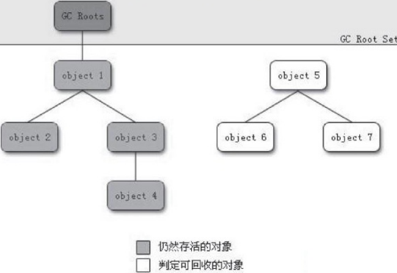
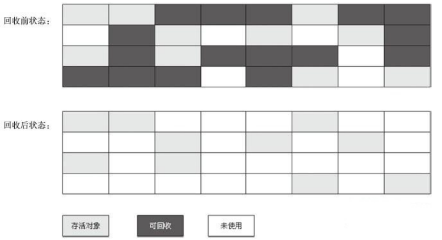
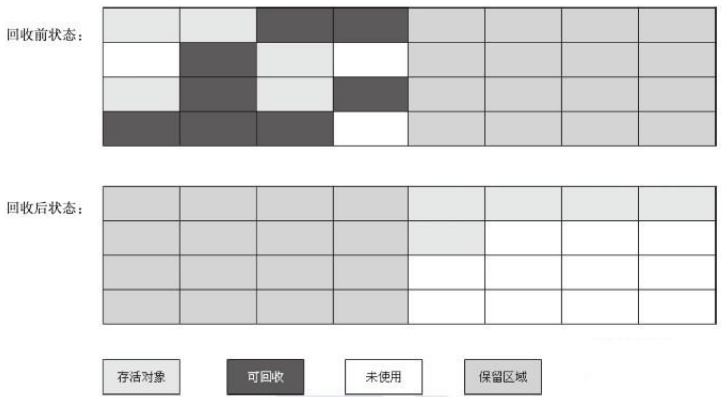
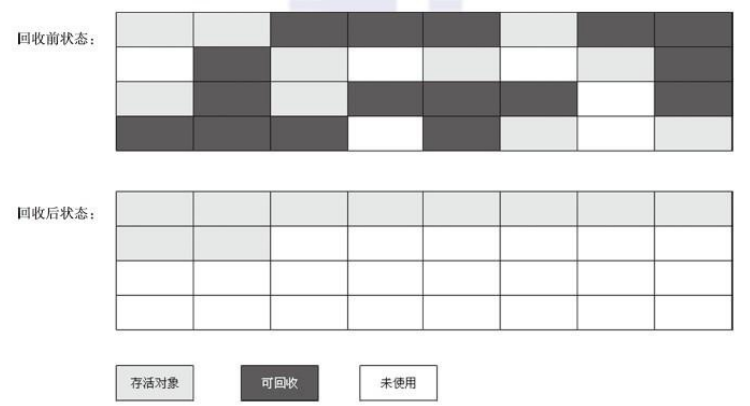
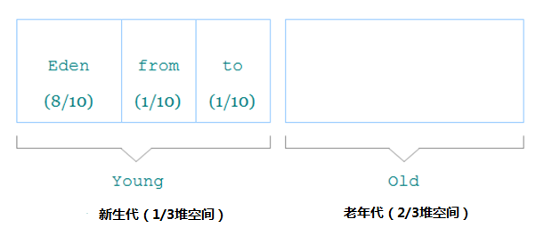
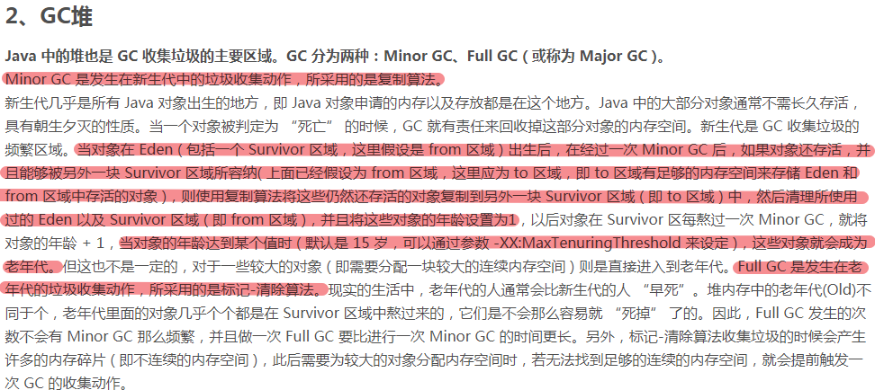

GC要完成3件事：
1. 哪些内存需要回收？
2. 什么时候回收？
3. 如何回收？

## 一、对象已死？
## 1. 引用计数算法
给对象中添加一个引用计数器，每当有一个地方应用它时，计数器值就加1；当引用失效时，计数器值就减1；任何时刻计数器值为零的对象就是不可能被使用的。

主流的Java虚拟机里面没有选用计数算法来管理内存，其中主要原因是它很难解决对象之间互相循环引用的问题。

## 2. 可达性算法
通过一系列的称为“GC Roots”的对象作为起始点，从这些节点开始向下搜索，搜索所走过的路径称为引用链（Reference Chain）,当一个对象到GC Roots没有任何引用链相连时，则证明此对象是不可用的。

在Java语言中，可作为GC Roots的对象包括下面几种：
 1. 虚拟机栈（栈帧中的本地变量表）中引用的对象。
 2. 方法区中类静态属性引用的对象。
 3. 方法区中常量引用的对象。
 4. 本地方法栈中JNI（即一般说的Native方法）引用的对象。

## 2.1 引用
Java对引用的概念进行了扩充，将引用分为强引用（Strong Reference）、软引用（SoftReference）、弱引用（Weak Reference）、虚引用（Phantom Reference）4种，这4种引用强度依次逐渐减弱。

 - 强引用就是指在程序代码之中普遍存在的，类似“Object obj = new Object()”这类的引用，只要强引用还存在，垃圾收集器永远不会回收掉被引用的对象。
   
 - 软引用是用来描述一些还有用但并非必需的对象。对于软引用关联着的对象，在系统将要发生内存溢出异常之前，将会把这些对象列进回收范围之中进行第二次回收。如果这次回收还没有足够的内存，才会抛出内存溢出异常。在JDK1.2之后，提供了SoftReference类来实现软引用。
   
 - 弱引用也是用来描述非必需对象的，但是它的强度比软引用更弱一些，被弱引用关联的对象只能生存到下一次垃圾收集发生之前。当垃圾收集器工作时，无论当前内存是否足够，都会回收掉只被弱引用关联的对象。在JDK1.2之后，提供了WeakReference类来实现弱引用。
   
 - 虚引用也称为幽灵引用或者幻影引用，它是最弱的一种引用关系。一个对象是否有虚引用的存在，完全不会对其生存时间构成影响，也无法通过虚引用来取得一个对象实例。为一个对象设置虚引用关联的唯一目的就是能在这个对象被收集器回收时收到一个系统通知。在JDK1.2之后，提供了PhantomReference类来实现虚引用

## 3. 生存还是死亡

即使在可达性分析算法中不可达的对象，也并非是“非死不可”的，这时候它们暂时处于“缓刑”阶段，要真正宣告一个对象死亡，至少要经历两次标记过程：如果对象在进行可达性分析后发现没有与GC Roots相连接，那么它将会被第一次标记且进行一次刷选，刷选的条件是此对象是否有必要执行finalize方法。当对象没有覆盖finalize方法，或者finalize方法已经被虚拟机调用过，虚拟机将这两种情况都视为“没有必要执行”。

被判定有必要执行finalize方法的对象将被放置与F-Queue的队列中。并在稍后由一个虚拟机自动建立的、低优先级的Finalize线程去执行它。这个执行并不会等待其运行结束，防止阻塞和崩溃。finalize方法是对象逃过死亡命运的最后一次机会，稍后GC将对F-Queue中的对象进行第二次小规模的标记，如果对象要在finalize方法中拯救自己---只要重新与引用链上的任何一个对象建立关联即可。但是一个对象的finalize方法只能被执行一次。

finaliz能做的工作使用try-finally 或者其他方式能够做的更好，完全可以忘掉java语言中这个方法的存在。

## 4.回收方法区
方法区一般可以不回收，回收效率很低。在堆中，新生代的垃圾收集效率70%-90%，而永久代的垃圾回收效率远低于此。
永久代的垃圾回收主要回收两部分内容：废弃常量和无用的类。“废弃常量”判断比较简单，但是“无用的类”的判断复杂一些，需要满足下面3个条件：

- 该类所有的实例都已经被回收，也就是java堆中不存在该类的任何实例
- 加载该类的ClassLoader已经被回收
- 该类对应的Class对象没有在任何地方被引用，无法在任何地方通过反射访问该类的方法。

## 二、垃圾收集算法
## 1.标记-清除算法
算法分为标记和清除两个阶段：首先标记出所有需要回收的对象，在标记完成后统一回收所有被标记的对象，它的标记过程就是使用可达性算法进行标记的。
主要缺点有两个：
效率问题，标记和清除两个过程的效率都不高
空间问题，标记清除之后会产生大量不连续的内存碎片

## 2.复制算法
复制算法：将可用内存按照容量分为大小相等的两块，每次只使用其中的一块。当这一块的内存用完了，就将还存活着的对象复制到另一块上面，然后把已使用过的内存空间一次清理掉。
内存分配时不用考虑内存碎片问题，只要一动堆顶指针，按顺序分配内存即可，实现简单，运行高效。代价是将内存缩小为原来的一半。

## 3.标记-整理算法
标记整理算法（Mark-Compact），标记过程仍然和“标记-清除”一样，但后续不走不是直接对可回收对象进行清理，而是让所有存活对象向一端移动，然后直接清理掉端边界以外的内存。
根据对象存活周期的不同将内存分为几块。一般把Java堆分为新生代和老年代，根据各个年代的特点采用最合适的收集算法。在新生代中，每次垃圾收集时有大批对象死去，只有少量存活，可以选用复制算法。而老年代对象存活率高，使用标记清理或者标记整理算法。

## 4.分代收集算法
根据对象存活周期的不同将内存分为几块。一般把Java堆分为新生代和老年代，根据各个年代的特点采用最合适的收集算法。在新生代中，每次垃圾收集时有大批对象死去，只有少量存活，可以选用复制算法。而老年代对象存活率高，使用标记清理或者标记整理算法。

## 三、内存分配与回收策略
对象的内存分配，往大方向讲，就是在堆上分配（但也可能经过JIT编译后被拆散为标量类型并间接地栈上分配），对象主要分配在新生代的Eden区上，如果启动了本地线程分配缓冲，将按线程优先在TLAB上分配。少数情况下也可能会直接分配在老年代中，分配的规则并不是百分之百固定的，其细节取决于当前使用的是哪一种垃圾收集器组合，还有虚拟机中与内存相关的参数的设置。

在 Java 中，堆被划分成两个不同的区域：新生代 ( Young )、老年代 ( Old )。新生代 ( Young ) 又被划分为三个区域：Eden、From Survivor、To Survivor。 

## 1.对象优先在Eden分配
大多数情况下，对象在新生代Eden区中分配。当Eden区没有足够空间进行分配时，虚拟机将发起一次Minor GC。

Minor GC和Full GC有什么不一样吗？
新生代GC（Minor GC）：指发生在新生代的垃圾收集动作，因为Java对象大多都具备朝生夕灭的特性，所以Minor GC非常频繁，一般回收速度也比较快。
老年代GC（Major GC / Full GC）：指发生在老年代的GC，出现了Major GC，经常会伴随至少一次的Minor GC（但非绝对的，在Parallel Scavenge收集器的收集策略里就有直接进行Major GC的策略选择过程）。Major GC的速度一般会比Minor GC慢10倍以上。

## 2.大对象直接进入老年代
所谓的大对象是指，需要大量连续内存空间的Java对象，最典型的大对象就是那种很长的字符串以及数组（笔者列出的例子中的byte[]数组就是典型的大对象）。大对象对虚拟机的内存分配来说就是一个坏消息（替Java虚拟机抱怨一句，比遇到一个大对象更加坏的消息就是遇到一群“朝生夕灭”的“短命大对象”，写程序的时候应当避免），经常出现大对象容易导致内存还有不少空间时就提前触发垃圾收集以获取足够的连续空间来“安置”它们。垃圾收集器与内存分配策略虚拟机提供了一个-XX:PretenureSizeThreshold参数，令大于这个设置值的对象直接在老年代分配。这样做的目的是避免在Eden区及两个Survivor区之间发生大量的内存复制（新生代采用复制算法收集内存）。

## 3.长期存活的对象将进入老年代
既然虚拟机采用了分代收集的思想来管理内存，那么内存回收时就必须能识别哪些对象应放在新生代，哪些对象应放在老年代中。为了做到这点，虚拟机给每个对象定义了一个对象年龄（Age）计数器。如果对象在Eden出生并经过第一次MinorGC后仍然存活，并且能被Survivor容纳的话，将被移动到Survivor空间中，并且对象年龄设为1。对象在Survivor区中垃圾收集器与内存分配策略每“熬过”一次MinorGC，年龄就增加1岁，当它的年龄增加到一定程度（默认为15岁），就将会被晋升到老年代中。对象晋升老年代的年龄阈值，可以通过参数XX:MaxTenuringThreshold设置。

## 4.动态对象年龄判定
为了能更好地适应不同程序的内存状况，虚拟机并不是永远地要求对象的年龄必须达到了MaxTenuringThreshold才能晋升老年代，如果在Survivor空间中相同年龄所有对象大小的总和大于Survivor空间的一半，年龄大于或等于该年龄的对象就可以直接进入老年代，无须等到垃圾收集器与内存分配策略MaxTenuringThreshold中要求的年龄。

## 5.空间分配担保
在发生Minor GC之前，虚拟机会先检查老年代最大可用的连续空间是否大于新生代所有对象总空间，如果这个条件成立，那么MinorGC可以确保是安全的。如果不成立，则虚拟机会查看HandlePromotionFailure设置值是否允许担保失败。如果允许，那么会继续检查老年代最大可用的连续空间是否大于历次晋升到老年代对象的平均大小，如果大于，将尝试着进行一次MinorGC，尽管这次MinorGC是有风险的；如果小于，或者HandlePromotionFailure设置不允许冒险，那这时也要改为进行一次Full GC。

下面解释一下“冒险”是冒了什么风险，前面提到过，新生代使用复制收集算法，但为了内存利用率，只使用其中一个Survivor空间来作为轮换备份，因此当出现大量对象在MinorGC后仍然存活的情况（最极端的情况就是内存回收后新生代中所有对象都存活），就需要老年代进行分配担保，把Survivor无法容纳的对象直接进入老年代。与生活中的贷款担保类似，老年代要进行这样的担保，前提是老年代本身还有容纳这些对象的剩余空间，一共有多少对象会活下来在实际完成内存回收之前是无法明确知道的，所以只好取之前每一次回收晋升到老年代对象容量的平均大小值作为经验值，与老年代的剩余空间进行比较，决定是否进行Full GC来让老年代腾出更多空间。

取平均值进行比较其实仍然是一种动态概率的手段，也就是说，如果某次Minor GC存活后的对象突增，远远高于平均值的话，依然会导致担保失败（Handle Promotion Failure）。如果出现了HandlePromotionFailure失败，那就只好在失败后重新发起一次Full GC。虽然担保失败时绕的圈子是最大的，但大部分情况下都还是会将HandlePromotionFailure开关打开，避免Full GC过于频繁。

https://blog.csdn.net/gyqjn/article/details/49848473

http://zyouwei.com/%E6%8A%80%E6%9C%AF%E7%AC%94%E8%AE%B0/Java/Java-Memory-Model.html