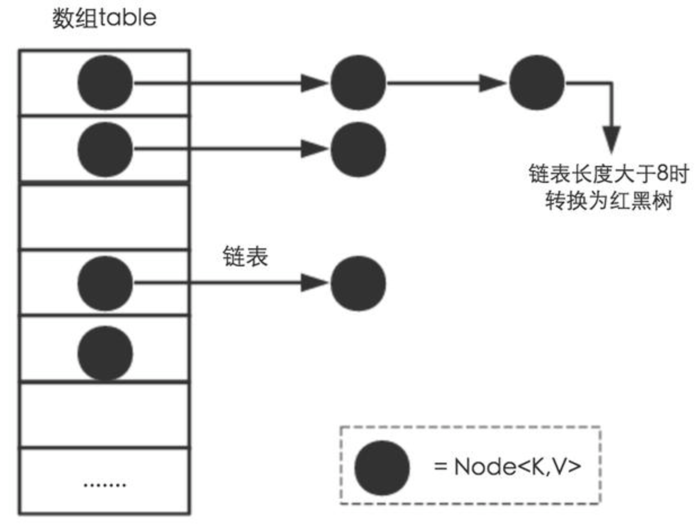
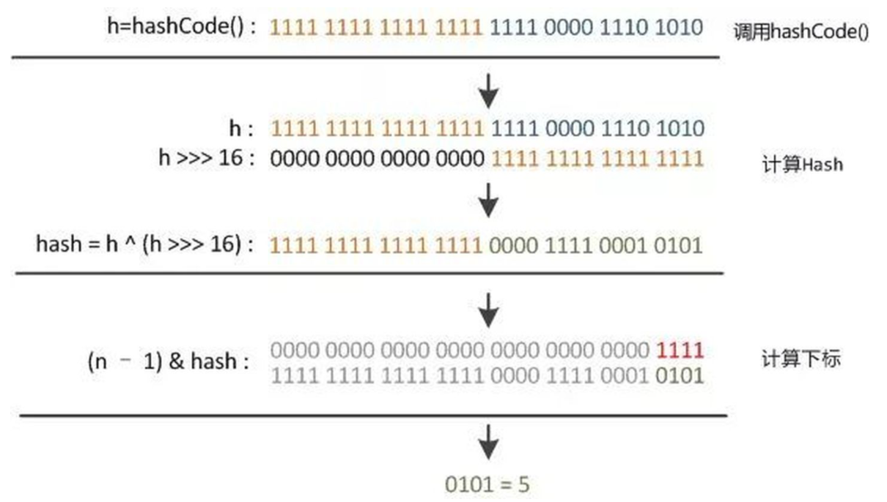
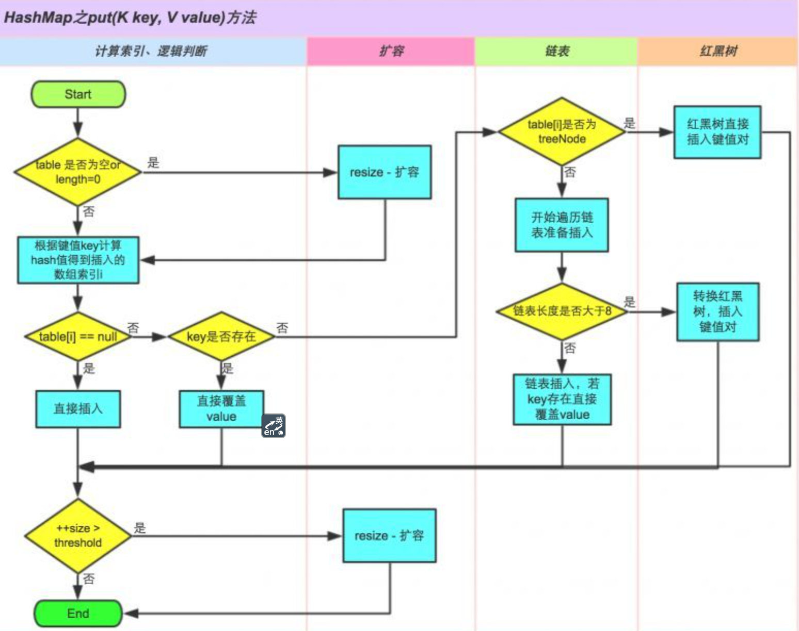

# HashMap

HashMap是Java程序员使用频率最高的用于映射(键值对)处理的数据类型。现在我们就来学习一下HashMap数据结构和功能原理，基于JDK8。

# 一、数据结构

HashMap使用的数据结构是**数组 （这个数组通常被称为称为哈希桶或table）+ 链表**，链表长度大于8时，链表升级为红黑树（JDK8新增），



元素存储使用的数据结构是Node，Node是HashMap的一个内部类，实现了Map.Entry接口，本质是就是一个映射(键值对)。

```java
public class HashMap<K,V> extends AbstractMap<K,V>
    implements Map<K,V>, Cloneable, Serializable {	
  
  // 默认的数组大小
  static final int DEFAULT_INITIAL_CAPACITY = 1 << 4; // aka 16
  // 数组最大容量
  static final int MAXIMUM_CAPACITY = 1 << 30;
  // 负载因子
  static final float DEFAULT_LOAD_FACTOR = 0.75f;
  // 树化阈值，链表长度
  static final int TREEIFY_THRESHOLD = 8;
  // 树降级为链表阈值
  static final int UNTREEIFY_THRESHOLD = 6;
  // 树化的另一个约束阈值，数组长度超过64，2个参数要同时满足，
  // 这个MIN_TREEIFY_CAPACITY的值至少是TREEIFY_THRESHOLD的4倍。
  static final int MIN_TREEIFY_CAPACITY = 64;
  
  // hash表
  transient Node<K,V>[] table;
  // hash表中Node个数
  transient int size;
  // 结构修改次数（插入或删除元素时+1，替换不变）
  transient int modCount;
  // 扩容阈值    
  int threshold;
  // 用于计算扩容阈值，threshold = capacity * loadFactor
  final float loadFactor;
  
  static class Node<K,V> implements Map.Entry<K,V> {
      final int hash; // key 的hash值
      final K key; //键
      V value; // 值
      Node<K,V> next; // 链表的下一个节点

      Node(int hash, K key, V value, Node<K,V> next) {
          this.hash = hash;
          this.key = key;
          this.value = value;
          this.next = next;
      }
     //...
  }
}
```

HashMap 基本工作原理是插入数据时，计算key的hash，再经过位与运算计算出索引，插入到数组中；当新插入的key的index和已有的冲突时，将新节点插入到已有节点的后面，构成链表；当链表长度大于8时，将链表转化为红黑树。

# 二、Hash规则

HashMap的增删改查，定位到哈希桶数组的位置都是很关键的第一步。如果 HashMap 里面的元素位置分布均匀，每个位置上的元素数量只有一个或少个，就能大大优化查找key的效率。

```java
// 方法1
static final int hash(Object key) {
    int h;
    // 1.h = key.hashCode()，取hashCode
    // 2.h ^ (h >>> 16)，高位参与运算
    return (key == null) ? 0 : (h = key.hashCode()) ^ (h >>> 16);
}

// 方法2
static int indexFor(int h, int length) { //jdk1.7的源码，jdk1.8没有这个方法，但是实现原理一样的
		return h & (length-1); // 3.位与运算（取模运算），使索引落到[0,length - 1]之间
}
```

通过一张图来分析下。



Java中，Object类是所有类的父类，所有的对象，包括数组，都实现了在`Object`类中定义的方法。Object类hashCode方法返回值是int类型，int为4个字节，1个字节是8位，4个字节就是32位。

```java
h = key.hashCode()) ^ (h >>> 16)
```

右位移 16 位，正好是 32位的一半，高半区和低半区做异或，就是为了混合原始hashCode的高位和低位，以此来加大低位的随机性。而且混合后的低位掺杂了高位的部分特征，这样高位的信息也被变相保留下来。相当于hash算法增加了更多的因子，能够更好的均匀散列，减少碰撞，进一步降低hash冲突的几率。

# 三、put的原理

put的原理如下：



1. hashMap使用的是懒加载，只有在执行put操作时才会创建数组。若table=null或size=0则创建table（通过扩容逻辑）。
2. 对key的hashCode()高低16位异或，位与(table.length - 1)计算index（第二节介绍过了）;
3. 如果index没碰撞直接插到table里；
4. 如果碰撞了，有三种情况：
   - 若头元素的key和插入key相同则替换；
   - 若头元素是个TreeNode，则将Node插入到红黑树中；
   - 以上2种情况都不满足，说明是个链表且头元素的key和插入的不相同，遍历链表，若链表中存在相同key的Node，替换该节点值；否则，插入到链表尾，并且判断链表是否需要转换成红黑树。
5. 容量 ++ ，若容量达到扩容阈值，进行扩容。

```java
public V put(K key, V value) {
    return putVal(hash(key), key, value, false, true);
}

final V putVal(int hash, K key, V value, boolean onlyIfAbsent,
               boolean evict) {
    Node<K,V>[] tab; Node<K,V> p; int n, i;
    // 1.table未初始化时或者初始化大小=0，reSize操作
    if ((tab = table) == null || (n = tab.length) == 0)
        n = (tab = resize()).length;
   // 2.table的hash不存在时，头元素不存在，创建新Node
    if ((p = tab[i = (n - 1) & hash]) == null)
        tab[i] = newNode(hash, key, value, null);
    else {
        Node<K,V> e; K k;
        // 3.头元素相同,进行替换
        if (p.hash == hash &&
            ((k = p.key) == key || (key != null && key.equals(k))))
            e = p;
        // 4.相同hash的节点不存在，且当前桶位是链表情况
        else if (p instanceof TreeNode)
            e = ((TreeNode<K,V>)p).putTreeVal(this, tab, hash, key, value);
        else {
            //5.相同hash的table是链表结构
            for (int binCount = 0; ; ++binCount) {
                //5.1 遍历到最后也没有相同节点则插入
                if ((e = p.next) == null) {
                    p.next = newNode(hash, key, value, null);
                    // 循环从0开始，满足这个条件时，已经循环了TREEIFY_THRESHOLD次
                    if (binCount >= TREEIFY_THRESHOLD - 1) // -1 for 1st
                         // 链表长度大于TREEIFY_THRESHOLD时，进行树化
                        treeifyBin(tab, hash);
                    break;
                }
                // 5.3 找到相同值
                if (e.hash == hash &&
                    ((k = e.key) == key || (key != null && key.equals(k))))
                    break;
                p = e;
            }
        }
        if (e != null) { // existing mapping for key
            V oldValue = e.value;
            if (!onlyIfAbsent || oldValue == null)
                // 赋值替换
                e.value = value;
            afterNodeAccess(e);
            return oldValue;
        }
    }
    // 修改的次数，替换不算
    ++modCount;
    // 插入元素个数+1 > 
    if (++size > threshold)
        resize();
    afterNodeInsertion(evict);
    return null;
}
```

# 四、resize

扩容原理主要步骤有：


```java
final Node<K,V>[] resize() {
    Node<K,V>[] oldTab = table;
    int oldCap = (oldTab == null) ? 0 : oldTab.length;
    int oldThr = threshold;
    int newCap, newThr = 0;
    // ====== 容量和扩容阈值调整逻辑 begin ======
    if (oldCap > 0) {
        // 容量达到最大，不再扩容
        if (oldCap >= MAXIMUM_CAPACITY) {
            threshold = Integer.MAX_VALUE;
            return oldTab;
        }
        // 容量先翻倍，若oldCap >=16 && newCap < max 扩容阈值也翻倍
        else if ((newCap = oldCap << 1) < MAXIMUM_CAPACITY &&
                 oldCap >= DEFAULT_INITIAL_CAPACITY)
            newThr = oldThr << 1; // double threshold
    } 
    // oldCap == 0
    else if (oldThr > 0) // initial capacity was placed in threshold
        newCap = oldThr;
    // oldCap == 0  
    else {               // zero initial threshold signifies using defaults
        newCap = DEFAULT_INITIAL_CAPACITY; // 16 
        newThr = (int)(DEFAULT_LOAD_FACTOR * DEFAULT_INITIAL_CAPACITY); // 12
    }
    // oldCap <16 或者 使用非无参构造函数初始化后，再计算下扩容阈值
    if (newThr == 0) {
        float ft = (float)newCap * loadFactor;
        newThr = (newCap < MAXIMUM_CAPACITY && ft < (float)MAXIMUM_CAPACITY ?
                  (int)ft : Integer.MAX_VALUE);
    }
    threshold = newThr;
    // ====== 容量和扩容阈值调整逻辑 end ======
    
    @SuppressWarnings({"rawtypes","unchecked"})
    // 创建newCap大小容量
    Node<K,V>[] newTab = (Node<K,V>[])new Node[newCap];
    table = newTab;
    if (oldTab != null) {
        for (int j = 0; j < oldCap; ++j) {
            Node<K,V> e;//  当前node节点
            if ((e = oldTab[j]) != null) {
                // 回收
                oldTab[j] = null;
                // 当前桶位只有单个元素，计算新的元素
                if (e.next == null)
                    newTab[e.hash & (newCap - 1)] = e;
                // 红黑树
                else if (e instanceof TreeNode)
                    ((TreeNode<K,V>)e).split(this, newTab, j, oldCap);
                else { // preserve order
                    //桶位形成了链表    
                    
                    //低位链表，扩容前后，下标不变
                    Node<K,V> loHead = null, 
                    loTail = null; //低位链表表尾指针
                    
                    // 高位链表，扩容后，下标变为当前数组位置 + 扩容前数组长度
                    Node<K,V> hiHead = null, 
                    //hiTail = null;//高位链表的表头指针
                    
                    Node<K,V> next;
                    do {
                        next = e.next;
                        if ((e.hash & oldCap) == 0) { // 放入低位链表中的元素
                            if (loTail == null)// 首个元素赋值到表头
                                loHead = e;
                            else
                                loTail.next = e;
                            loTail = e; //指向链尾元素 
                        }
                        else {
                            if (hiTail == null)
                                hiHead = e;
                            else
                                hiTail.next = e;
                            hiTail = e; 
                        }
                    } while ((e = next) != null);
                    
                    // 将新链表放到对应的数组里
                    if (loTail != null) {
                        loTail.next = null;
                        newTab[j] = loHead;
                    }
                    if (hiTail != null) {
                        hiTail.next = null;
                        newTab[j + oldCap] = hiHead;
                    }
                }
            }
        }
    }
    return newTab;
}
```

## 4.5、remove

```java
public V remove(Object key) {
    Node<K,V> e;
    return (e = removeNode(hash(key), key, null, false, true)) == null ?
        null : e.value;
}

/**
 * Implements Map.remove and related methods.
 *
 * @param hash hash for key
 * @param key the key
 * @param value the value to match if matchValue, else ignored
 * @param matchValue if true only remove if value is equal
 * @param movable if false do not move other nodes while removing
 * @return the node, or null if none
 */
final Node<K,V> removeNode(int hash, Object key, Object value,
                           boolean matchValue, boolean movable) {
    Node<K,V>[] tab; Node<K,V> p; int n, index;
    if ((tab = table) != null && (n = tab.length) > 0 &&
        (p = tab[index = (n - 1) & hash]) != null) {
        Node<K,V> node = null, e; K k; V v;
        if (p.hash == hash &&
            ((k = p.key) == key || (key != null && key.equals(k))))
            node = p;
        else if ((e = p.next) != null) {
            if (p instanceof TreeNode)
                node = ((TreeNode<K,V>)p).getTreeNode(hash, key);
            else {
                do {
                    if (e.hash == hash &&
                        ((k = e.key) == key ||
                         (key != null && key.equals(k)))) {
                        node = e;
                        break;
                    }
                    p = e;
                } while ((e = e.next) != null);
            }
        }
        if (node != null && (!matchValue || (v = node.value) == value ||
                             (value != null && value.equals(v)))) {
            if (node instanceof TreeNode)
                ((TreeNode<K,V>)node).removeTreeNode(this, tab, movable);
            else if (node == p)
                tab[index] = node.next;
            else
                p.next = node.next;
            ++modCount;
            --size;
            afterNodeRemoval(node);
            return node;
        }
    }
    return null;
}
```


```java
public V get(Object key) {
    Node<K,V> e;
    return (e = getNode(hash(key), key)) == null ? null : e.value;
}

final Node<K,V> getNode(int hash, Object key) {
    Node<K,V>[] tab; Node<K,V> first, e; int n; K k;
    if ((tab = table) != null && (n = tab.length) > 0 &&
        (first = tab[(n - 1) & hash]) != null) {
        if (first.hash == hash && // always check first node
            ((k = first.key) == key || (key != null && key.equals(k))))
            return first;
        if ((e = first.next) != null) {
            if (first instanceof TreeNode)
                return ((TreeNode<K,V>)first).getTreeNode(hash, key);
            do {
                if (e.hash == hash &&
                    ((k = e.key) == key || (key != null && key.equals(k))))
                    return e;
            } while ((e = e.next) != null);
        }
    }
    return null;
}
```