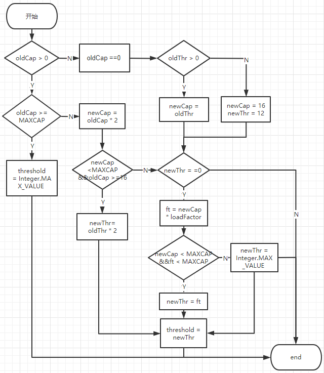
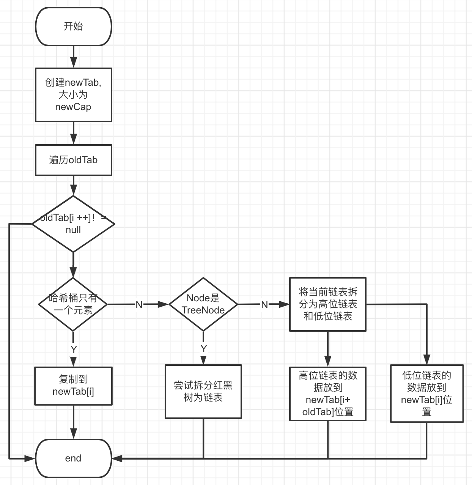
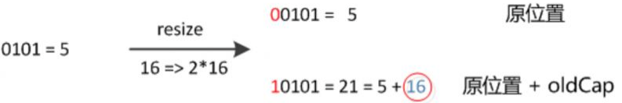

# HashMap

HashMap是Java程序员使用频率最高的用于映射(键值对)处理的数据类型。现在我们就来学习一下HashMap数据结构和功能原理，基于JDK8。

# 一、数据结构

HashMap使用的数据结构是**数组 （这个数组通常被称为称为哈希桶或table）+ 链表**，链表长度大于8时，链表升级为红黑树（JDK8新增）。


元素存储使用的数据结构是Node，Node是HashMap的一个内部类，实现了Map.Entry接口，本质是就是一个映射(键值对)。

```java
public class HashMap<K,V> extends AbstractMap<K,V>
    implements Map<K,V>, Cloneable, Serializable {	
  
  // 默认的数组大小
  static final int DEFAULT_INITIAL_CAPACITY = 1 << 4; // aka 16
  // 数组最大容量
  static final int MAXIMUM_CAPACITY = 1 << 30;
  // 负载因子
  static final float DEFAULT_LOAD_FACTOR = 0.75f;
  // 树化阈值，链表长度
  static final int TREEIFY_THRESHOLD = 8;
  // 树降级为链表阈值
  static final int UNTREEIFY_THRESHOLD = 6;
  // 树化的另一个约束阈值，数组长度超过64，2个参数要同时满足，
  // 这个MIN_TREEIFY_CAPACITY的值至少是TREEIFY_THRESHOLD的4倍。
  static final int MIN_TREEIFY_CAPACITY = 64;
  
  // hash表
  transient Node<K,V>[] table;
  // hash表中Node个数
  transient int size;
  // 结构修改次数（插入或删除元素时+1，替换不变）
  transient int modCount;
  // 扩容阈值    
  int threshold;
  // 用于计算扩容阈值，threshold = capacity * loadFactor
  final float loadFactor;
  
  static class Node<K,V> implements Map.Entry<K,V> {
      final int hash; // key 的hash值
      final K key; //键
      V value; // 值
      Node<K,V> next; // 链表的下一个节点

      Node(int hash, K key, V value, Node<K,V> next) {
          this.hash = hash;
          this.key = key;
          this.value = value;
          this.next = next;
      }
     //...
  }
}
```

HashMap 基本工作原理是插入数据时，计算key的hash，再经过位与运算计算出索引，插入到数组中；当新插入的key的index和已有的冲突时，将新节点插入到已有节点的后面，构成链表；当链表长度大于8时，将链表转化为红黑树。

# 二、Hash规则

HashMap的增删改查，定位到哈希桶数组的位置都是很关键的第一步。如果 HashMap 里面的元素位置分布均匀，每个位置上的元素数量只有一个或少个，就能大大优化查找key的效率。

```java
// 方法1
static final int hash(Object key) {
    int h;
    // 1.h = key.hashCode()，取hashCode
    // 2.h ^ (h >>> 16)，异或运算，高位参与
    return (key == null) ? 0 : (h = key.hashCode()) ^ (h >>> 16);
}

// 方法2
static int indexFor(int h, int length) { //jdk1.7的源码，jdk1.8没有这个方法，但是实现原理一样的
		return h & (length-1); // 3.位与运算  ，使索引落到[0,length - 1]之间
}
```

通过一张图来分析下。


Java中，Object类是所有类的父类，所有的对象，包括数组，都实现了在`Object`类中定义的方法。Object类hashCode方法返回值是int类型，int为4个字节，1个字节是8位，4个字节就是32位。

```java
h = key.hashCode()) ^ (h >>> 16)
```

右位移 16 位，正好是 32位的一半，高半区和低半区做异或，就是为了混合原始hashCode的高位和低位，以此来加大低位的随机性。而且混合后的低位掺杂了高位的部分特征，这样高位的信息也被变相保留下来。**总结下：key的hash值并不是key的hashCode而是经过位移和异或得到的新值，hash算法增加了更多的因子，能够更好的均匀散列，减少碰撞，进一步降低hash冲突的几率**。

# 三、put

HashMap中核心方法是增加元素的put和扩容resize，我们先来看下put。

## 3.1、put的过程


1. hashMap使用的是懒加载，只有在执行put操作时才会创建数组。若table=null或size=0则创建table（通过扩容逻辑）。
2. 对key的hashCode()高低16位异或，位与(table.length - 1)计算出要插入到table的index（第二节介绍过了）;
3. 如果index没碰撞直接插到table里；
4. 如果碰撞了，有三种情况：
   - 若头元素的key和插入key相同则替换；
   - 若头元素是个TreeNode，则将Node插入到红黑树中，先遍历，再插入，再平衡；若相同则替换。
   - 以上2种情况都不满足，说明是个链表且头元素的key和插入的不相同，遍历链表，若链表中存在相同key的Node，替换该节点值；否则，插入到链表尾，并且判断链表是否需要转换成红黑树（树化下一小节讲）。
5. 容量 ++ ，若容量达到扩容阈值，进行扩容。

```java
public V put(K key, V value) {
    return putVal(hash(key), key, value, false, true);
}

final V putVal(int hash, K key, V value, boolean onlyIfAbsent,
               boolean evict) {
    Node<K,V>[] tab; Node<K,V> p; int n, i;
    // 1.table未初始化时或者初始化大小=0，reSize操作
    if ((tab = table) == null || (n = tab.length) == 0)
        n = (tab = resize()).length;
   // 2.table的hash不存在时，头元素不存在，创建新Node
    if ((p = tab[i = (n - 1) & hash]) == null)
        tab[i] = newNode(hash, key, value, null);
    else {
        Node<K,V> e; K k;
        // 3.头元素相同,进行替换
        if (p.hash == hash &&
            ((k = p.key) == key || (key != null && key.equals(k))))
            e = p;
        // 4.相同hash的节点不存在，且当前桶位是链表情况
        else if (p instanceof TreeNode)
            e = ((TreeNode<K,V>)p).putTreeVal(this, tab, hash, key, value);
        else {
            //5.相同hash的table是链表结构
            for (int binCount = 0; ; ++binCount) {
                //5.1 遍历到最后也没有相同节点则插入
                if ((e = p.next) == null) {
                    p.next = newNode(hash, key, value, null);
                    // 循环从0开始，满足这个条件时，已经循环了TREEIFY_THRESHOLD次
                    if (binCount >= TREEIFY_THRESHOLD - 1) // -1 for 1st
                         // 链表长度大于TREEIFY_THRESHOLD时，进行树化
                        treeifyBin(tab, hash);
                    break;
                }
                // 5.3 找到相同值
                if (e.hash == hash &&
                    ((k = e.key) == key || (key != null && key.equals(k))))
                    break;
                p = e;
            }
        }
        if (e != null) { // existing mapping for key
            V oldValue = e.value;
            if (!onlyIfAbsent || oldValue == null)
                // 赋值替换
                e.value = value;
            afterNodeAccess(e);
            return oldValue;
        }
    }
    // 修改的次数，替换不算
    ++modCount;
    // 插入元素个数+1 > threshold 进行扩容
    if (++size > threshold)
        resize();
    afterNodeInsertion(evict);
    return null;
}
```

## 3.2、树化

上面我们讲了树化的条件是：table的某个桶位插入节点后size>6.

树化步骤如下：

1. 将单链表先转化为一个双向链表，节点数据结构变为TreeNode
2. 将双向链表转换为红黑树

**也就是说树化后的哈希桶既是一个红黑树，也是一个双向链表**

```java
final void treeifyBin(Node<K,V>[] tab, int hash) {
    int n, index; Node<K,V> e;
    if (tab == null || (n = tab.length) < MIN_TREEIFY_CAPACITY) //1. table== null 或长度小于64，进行初始化或扩容
        resize();
    else if ((e = tab[index = (n - 1) & hash]) != null) {
        TreeNode<K,V> hd = null,//hd 是头节点
        tl = null;// tl指向上一个节点
        do {// 2.do while 将单链表先转化为一个双向链表
            TreeNode<K,V> p = replacementTreeNode(e, null); // p 是当前TreeNode节点,将Node转化为TreeNode
            if (tl == null)
                hd = p;
            else {
                p.prev = tl;
                tl.next = p;
            }
            tl = p;
        } while ((e = e.next) != null); 
        if ((tab[index] = hd) != null)
            hd.treeify(tab); // 3.真正的树化是TreeNode的代码
    }
}
```

真正的树化 TreeNode.treeify，主要步骤有：

1. 遍历链表，若红黑树的root节点还未创建，将链表第一个节点作为root
2. 遍历剩余节点，根据这些节点的hash值和key计算出dir，若dir<=0 遍历红黑树的左子树，否则遍历红黑树的右子树，插入到叶子节点的位置。
3. 插入节点后，平衡红黑树，注意是在for循环中，每插入一次都会平衡一下；
4. 调整双向链表顺序，将红黑树的root节点作为当前hash桶的头节点，将当前头节点的元素作为root的下一个节点。

```java
final void treeify(Node<K,V>[] tab) {
    TreeNode<K,V> root = null;
    for (TreeNode<K,V> x = this, next; x != null; x = next) { // for循环，遍历双向链表
        // x 表示当前要插入的节点
        
        // next是x的下一个节点
        next = (TreeNode<K,V>)x.next;
        x.left = x.right = null;// 将x的左右子树节点置空
        
        if (root == null) { // 将第一个节点作为头节点
            x.parent = null;
            x.red = false;
            root = x;
        }
        else { //遍历其他节点
            K k = x.key; // x节点的key
            int h = x.hash; // x节点的hash
            Class<?> kc = null;
            for (TreeNode<K,V> p = root;;) { // 遍历这颗红黑树，p指向当前节点
                int dir // dir < 0,插入左子树;> 0 插入右子树
                    , ph; // p节点的hash
                K pk = p.key; // p节点的key
                if ((ph = p.hash) > h) // 比较节点的hash，同一个hash桶位的节点index相同，hash值不一定相同，index 取 tablelength 长度的低位。
                    dir = -1;
                else if (ph < h)
                    dir = 1;
                else if ((kc == null && // hash值相同的情况，key也相等
                          (kc = comparableClassFor(k)) == null) ||
                         (dir = compareComparables(kc, k, pk)) == 0)
                    dir = tieBreakOrder(k, pk);// 比较keyclass 和 key 的identityHashCode，不用太细究

                TreeNode<K,V> xp = p; // 下面的遍历过程中 xp指的是p的父节点
                // 拆分成2个逻辑看:
           		// p = dir < 0 ? p.left ：p.right,第一步根据dir遍历节点左子树或右子树
                // p == null //只到找到叶子节点 
                if ((p = (dir <= 0) ? p.left : p.right) == null) { 
                    x.parent = xp; // 将x节点插入到xp后
                    if (dir <= 0)
                        xp.left = x; // < 0是左节点 
                    else
                        xp.right = x; // >0 是右节点
                    root = balanceInsertion(root, x);//插入后,再平衡
                    break;
                }
            }
        }
    }
    moveRootToFront(tab, root); //将 root节点放到table[i],作为当前hash桶的第一个元素，同时调整双向链表。
}
```

# 四、resize

resize主要是put元素过程中，处理扩容，触发扩容的条件是size(节点数) > threshold 且 数组长度 >64。 

扩容原理主要步骤有2步：

1. 容量和扩容阈值调整
2. 数据迁移。

先来看下容量和扩容阈值调整

## 4.1、容量和扩容阈值调整



步骤如下：

1. oldCap > 0 说明table已经初始化过，扩容时有2种情况

   - oldCap >= MAXIMUM_CAPACITY，table数组容量达到最大，不可再扩容
   - oldCap < MAXIMUM_CAPACITY，新容量newCap扩大oldCap的2倍。接着再判断（newCap < MAXIMUM_CAPACITY） && oldCap>= 16，则将扩容阈值调整为原来的2倍。一般情况下newCap < MAXIMUM_CAPACITY都是成立的，主要看第二个条件，oldCap是否大于16。也就是说除非我们的oldCap容量 <16, 正常扩容时容量和扩容阈值都会翻倍。<16时，最终threshold = cap * factor（0.75）。

2. oldCap == 0，说明table还未初始化或者未添加元素情况，也有2种：

   - oldThr > 0 说明使用的是非无参的构造方法（有3个入口）：

     ```java
     public HashMap(int initialCapacity) {
         this(initialCapacity, DEFAULT_LOAD_FACTOR);
     }
     
     public HashMap(int initialCapacity, float loadFactor) {
         // ...
         this.loadFactor = loadFactor;
         this.threshold = tableSizeFor(initialCapacity);
     }
     
     public HashMap(Map<? extends K, ? extends V> m) {
         this.loadFactor = DEFAULT_LOAD_FACTOR;
         putMapEntries(m, false);
     }
     
     ```

     以上3个构造方法，都会使得threshold被tableSizeFor赋值，结果为大于且最接近cap的2的n次方；最终这个值又会被赋值到 newCap = oldThr；**也就是说table的容量永远都是2的n次方。**

     ```java
     static final int tableSizeFor(int cap) {
         int n = cap - 1;
         n |= n >>> 1;
         n |= n >>> 2;
         n |= n >>> 4;
         n |= n >>> 8;
         n |= n >>> 16;
         return (n < 0) ? 1 : (n >= MAXIMUM_CAPACITY) ? MAXIMUM_CAPACITY : n + 1;
     }
     ```

   - oldThr == 0，说明使用的hashMap的无参构造方法，也就是我们最常用的构造方法。

     ```java
     public HashMap() {
         this.loadFactor = DEFAULT_LOAD_FACTOR; // all other fields defaulted
     }
     ```

​              仅初始化负载因子为0.75；如果是这种情况，那么newCap = 16，newThr = 12。

   3. 经过以上2步，新table的容量newCap的值就被确定了，接下来就是调整扩容阈值。满足newThr == 0，有2种情况：

      - 扩容的oldCap <16；

      - 使用**非无参构造函数初始化**的hashMap。这2种情况是有联系的，只有使用非无参构造函数初始化的cap才可能小于16，当它再次扩容时出现第一种情况。

        ```java
         if (newThr == 0) {
             float ft = (float)newCap * loadFactor;
             newThr = (newCap < MAXIMUM_CAPACITY && ft < (float)MAXIMUM_CAPACITY ?
                       (int)ft : Integer.MAX_VALUE);
         }
         threshold = newThr;
        ```

        跟进loadFactor和newCap计算扩容阈值，如果newCap < MAXIMUM_CAPACITY 且ft < (float)MAXIMUM_CAPACITY,那么说明扩容阈值有效，否则说明table容量达到最大，为Integer.MAX_VALUE。最后再将计算完的扩容阈值赋值给threshold。

**代码如下：**

```java
final Node<K,V>[] resize() {
    Node<K,V>[] oldTab = table;
    // 当前容量
    int oldCap = (oldTab == null) ? 0 : oldTab.length;
    // 当前扩容阈值
    int oldThr = threshold;
    int newCap, newThr = 0;
    
    if (oldCap > 0) {
        // 容量达到最大，不再扩容
        if (oldCap >= MAXIMUM_CAPACITY) {
            threshold = Integer.MAX_VALUE;
            return oldTab;
        }
        // 容量先翻倍，若oldCap >=16 && newCap < max 扩容阈值也翻倍
        else if ((newCap = oldCap << 1) < MAXIMUM_CAPACITY &&
                 oldCap >= DEFAULT_INITIAL_CAPACITY)
            newThr = oldThr << 1; // double threshold
    } 
    // oldCap == 0
    else if (oldThr > 0) // initial capacity was placed in threshold
        newCap = oldThr;
    // oldCap == 0  
    else {               // zero initial threshold signifies using defaults
        newCap = DEFAULT_INITIAL_CAPACITY; // 16 
        newThr = (int)(DEFAULT_LOAD_FACTOR * DEFAULT_INITIAL_CAPACITY); // 12
    }
    // oldCap <16 或者 使用非无参构造函数初始化后，再计算下扩容阈值
    if (newThr == 0) {
        float ft = (float)newCap * loadFactor;
        newThr = (newCap < MAXIMUM_CAPACITY && ft < (float)MAXIMUM_CAPACITY ?
                  (int)ft : Integer.MAX_VALUE);
    }
    threshold = newThr;
}
```

## 4.2、数据迁移



步骤如下：

1. 创建数组newTab，大小为newCab,newCap的大小逻辑，我们刚才已经介绍过了。

2. 遍历oldTab，开始数据迁移，假设当前位置索引为 i ，当前Node 为 e：

   - e.next == null，说明哈希桶只有一个元素，复制到newTab[i]；

   - e 是一个treeNode，尝试将当前索引位置的红黑树进行拆分，下一节分析；

   - 以上2种情况都不满足，说明是一个链表，将链表中的所有Node插入到新列表中。介绍下扩容插入的原理。

     我们知道table形成链表，说明index = h & (length-1)得到了相同的值。假设length = 16 ，length - 1相应的二进制是  0b1111，index若相同说明h的低4位是相同；扩容后length = 32，length - 1的表示为二进制为 0b11111，也就是说取 h 的低5位。假设我们要迁移节点的 index = 0b 0101，迁移时要取的 h 的低五位，此时 h 的第五位有2种情况 0x10101 或 0x00101（这2种情况，若取低4位index相同即扩容前），经过计算后新的index 就有2种情况，转换为10 进制 newIndex = index 或 newIndex = index + oldCap。

    

   

   ​         这也是为什么要扩容的原因，扩容后相同hash的链表长度会变短，分布的更加均匀，查找效率更高。 

   - 还是上面的例子，oldCap表示为二进制0b 10000，e.hash & oldCap == 0说明是高位为0，扩容完的索引与原数组相同；e.hash & oldCap == 1说明是高位为1，计算出的newTab的 nexIndex = [index + newCap]；

```java
final Node<K,V>[] resize() {
   // ...
	@SuppressWarnings({"rawtypes","unchecked"})
    // 创建newCap大小容量
    Node<K,V>[] newTab = (Node<K,V>[])new Node[newCap];
    table = newTab;
    if (oldTab != null) {
        for (int j = 0; j < oldCap; ++j) {
            Node<K,V> e;//  当前node节点
            if ((e = oldTab[j]) != null) {
                // 回收
                oldTab[j] = null;
                // 当前桶位只有单个元素，计算新的元素
                if (e.next == null)
                    newTab[e.hash & (newCap - 1)] = e;
                // 尝试将红黑树拆分为2个链表
                else if (e instanceof TreeNode)
                    ((TreeNode<K,V>)e).split(this, newTab, j, oldCap);
                else { // preserve order
                    //桶位形成了链表    
                    
                    //低位链表，扩容前后，下标不变
                    Node<K,V> loHead = null, 
                    loTail = null; //低位链表表尾指针
                    
                    // 高位链表，扩容后，下标变为当前数组位置 + 扩容前数组长度
                    Node<K,V> hiHead = null, 
                    //hiTail = null;//高位链表的表头指针
                    
                    Node<K,V> next;
                    do {
                        next = e.next;
                        if ((e.hash & oldCap) == 0) { // 说明是低位链表，放入低位链表中
                            if (loTail == null)// 首个元素赋值到表头
                                loHead = e;
                            else
                                loTail.next = e;
                            loTail = e; //指向链尾元素 
                        }
                        else {
                            if (hiTail == null)
                                hiHead = e;
                            else
                                hiTail.next = e;
                            hiTail = e; 
                        }
                    } while ((e = next) != null);
                    
                    // 将新链表放到对应的数组里
                    if (loTail != null) {
                        loTail.next = null;
                        newTab[j] = loHead;
                    }
                    if (hiTail != null) {
                        hiTail.next = null; // 必要炒作，原Node还有
                        newTab[j + oldCap] = hiHead;
                    }
                }
            }
        }
    }
    return newTab;
}
```

## 4.3、红黑树的拆分

我们知道，扩容时oldTab相同index的可能放到newTab数组下标是index或index + oldCap的位置，如果oldTab[index]存放的是红黑树，那么扩容完的2个位置哈希桶的元素个数可能就不足8个，此时就需要对红黑树进行拆分。拆分步骤如下：

1. 类似拆分链表，先将当前红黑树拆分为2个双向链表，高位链表hi 和 低位链表li
2.  如果低位单链表不为空，此时有2种情况，假设低位链表长度为lc
   - 若lc <= 6 则将低位红黑树转为单链表；
   - 若 lc > 6 时，如果hiHead == null，高位链表为空，说明原链表的所有元素都在低位链表中，不需要再进行树化；否则要对链表进行树化。
3. 如果高位链表不为空，类似低位链表的处理，<=6 转换为单链表，大于6 且 低位链表为空，不需要做任何操作；否则要对链表进行树化。

```java
final void split(HashMap<K,V> map, Node<K,V>[] tab, int index, int bit) {
    TreeNode<K,V> b = this;
    // Relink into lo and hi lists, preserving order
    TreeNode<K,V> loHead = null, loTail = null;
    TreeNode<K,V> hiHead = null, hiTail = null;
    int lc = 0, // 低位链表长度
    hc = 0; // 高位链表长度
    // 1. 当前红黑树拆分为2个双向链表
    for (TreeNode<K,V> e = b, next; e != null; e = next) {
        next = (TreeNode<K,V>)e.next;
        e.next = null;
        if ((e.hash & bit) == 0) {
            if ((e.prev = loTail) == null)
                loHead = e;
            else
                loTail.next = e;
            loTail = e;
            ++lc;
        }
        else {
            if ((e.prev = hiTail) == null)
                hiHead = e;
            else
                hiTail.next = e;
            hiTail = e;
            ++hc;
        }
    }

    if (loHead != null) {
        if (lc <= UNTREEIFY_THRESHOLD) // 若lc <= 6 则将低位红黑树转为单链表
            tab[index] = loHead.untreeify(map);
        else {
            // 若 lc > 6 时，如果hiHead == null，高位链表为空，说明原链表的所有元素都在低位链表中，不需要再进行树化；否则要对链表进行树化。
            tab[index] = loHead; 
            if (hiHead != null) // (else is already treeified)
                loHead.treeify(tab);
        }
    }
    if (hiHead != null) {
        if (hc <= UNTREEIFY_THRESHOLD)
            tab[index + bit] = hiHead.untreeify(map);
        else {
            tab[index + bit] = hiHead;
            if (loHead != null)
                hiHead.treeify(tab);
        }
    }
}
```

# 五、其他方法

## 5.1、get

步骤如下：

1. 计算key的hash，再根据hash得出哈希桶的index
2. 取头结点不为空，判断头节点的key和需要的key是否相同，相同直接返回，
3. 是否是ThreeNode，遍历红黑树获取
4. 以上都不满足说明是链表，遍历链表后获取

```java
public V get(Object key) {
    Node<K,V> e;
    return (e = getNode(hash(key), key)) == null ? null : e.value;
}

final Node<K,V> getNode(int hash, Object key) {
    Node<K,V>[] tab; Node<K,V> first, e; int n; K k;
    if ((tab = table) != null && (n = tab.length) > 0 &&
        (first = tab[(n - 1) & hash]) != null) {
        if (first.hash == hash && // always check first node
            ((k = first.key) == key || (key != null && key.equals(k))))
            return first;
        if ((e = first.next) != null) {
            if (first instanceof TreeNode)
                return ((TreeNode<K,V>)first).getTreeNode(hash, key);
            do {
                if (e.hash == hash &&
                    ((k = e.key) == key || (key != null && key.equals(k))))
                    return e;
            } while ((e = e.next) != null);
        }
    }
    return null;
}
```

## 5.2、remove

remove 比较简单，

```java
public V remove(Object key) {
    Node<K,V> e;
    return (e = removeNode(hash(key), key, null, false, true)) == null ?
        null : e.value;
}

/**
 * Implements Map.remove and related methods.
 *
 * @param hash hash for key
 * @param key the key
 * @param value the value to match if matchValue, else ignored
 * @param matchValue if true only remove if value is equal
 * @param movable if false do not move other nodes while removing
 * @return the node, or null if none
 */
final Node<K,V> removeNode(int hash, Object key, Object value,
                           boolean matchValue, boolean movable) {
    Node<K,V>[] tab; Node<K,V> p; //p是头节点
    int n, index;
    
    if ((tab = table) != null && (n = tab.length) > 0 &&
        (p = tab[index = (n - 1) & hash]) != null) {
        Node<K,V> node = null, // Node是待删除的节点
        e; K k; V v;
        if (p.hash == hash &&
            ((k = p.key) == key || (key != null && key.equals(k))))
            node = p; //p是头节点
        else if ((e = p.next) != null) {
            if (p instanceof TreeNode) // p是ThreeNode
                node = ((TreeNode<K,V>)p).getTreeNode(hash, key);
            else { // 链表的处理
                do {
                    if (e.hash == hash &&
                        ((k = e.key) == key ||
                         (key != null && key.equals(k)))) {
                        node = e;// 查找要删除的节点
                        break;
                    }
                    p = e;// p 更新为要删除节点的上一个节点
                } while ((e = e.next) != null);
            }
        }
        if (node != null && (!matchValue || (v = node.value) == value ||
                             (value != null && value.equals(v)))) {
            if (node instanceof TreeNode)
                ((TreeNode<K,V>)node).removeTreeNode(this, tab, movable);
            else if (node == p) // node是头结点
                tab[index] = node.next;
            else //删除node节点
                p.next = node.next;
            ++modCount; // 修改次数 ++ 
            --size;
            afterNodeRemoval(node);
            return node;
        }
    }
    return null;
}
```


# 六、JDK1.7

## 6.1、数据结构

 与1.8的 HashMap的区别为数据结构为数组加链表

## 6.2、Hash规则

hash规则与1.8 基本一致，通过高低位异或使得数据hash值更均匀。

```java
final int hash(Object k) {
    int h = hashSeed;
    if (0 != h && k instanceof String) {
        return sun.misc.Hashing.stringHash32((String) k);
    }

    h ^= k.hashCode();

    // This function ensures that hashCodes that differ only by
    // constant multiples at each bit position have a bounded
    // number of collisions (approximately 8 at default load factor).
    h ^= (h >>> 20) ^ (h >>> 12);
    return h ^ (h >>> 7) ^ (h >>> 4);
}
```

节点的table索引计算规则不变

```java
static int indexFor(int h, int length) {
    // assert Integer.bitCount(length) == 1 : "length must be a non-zero power of 2";
    return h & (length-1);
}
```

## 6.3、put

put方法采用的是头插法。

```java
public V put(K key, V value) {
    if (table == EMPTY_TABLE) {
        inflateTable(threshold);
    }
    if (key == null)
        return putForNullKey(value);
    int hash = hash(key);
    int i = indexFor(hash, table.length);
    for (Entry<K,V> e = table[i]; e != null; e = e.next) {
        Object k;
        if (e.hash == hash && ((k = e.key) == key || key.equals(k))) {
            V oldValue = e.value;
            e.value = value;
            e.recordAccess(this);
            return oldValue;
        }
    }

    modCount++;
    addEntry(hash, key, value, i);
    return null;
}

void addEntry(int hash, K key, V value, int bucketIndex) {
    if ((size >= threshold) && (null != table[bucketIndex])) {
        resize(2 * table.length);
        hash = (null != key) ? hash(key) : 0;
        bucketIndex = indexFor(hash, table.length);
    }
    createEntry(hash, key, value, bucketIndex);
}

void createEntry(int hash, K key, V value, int bucketIndex) {
    // 头插法插入
    Entry<K,V> e = table[bucketIndex];
    // 这里很关键，插入时新节点的的next -> 头节点
    // 将新节点放到原头节点的位置
    table[bucketIndex] = new Entry<>(hash, key, value, e);
    size++;
}
```

6.2、resize 扩容

resize 扩容的核心算法是transfer，采用的是头插法，扩容后的链表顺序会翻转，

```java
void resize(int newCapacity) {
    Entry[] oldTable = table;
    int oldCapacity = oldTable.length;
    if (oldCapacity == MAXIMUM_CAPACITY) {
        threshold = Integer.MAX_VALUE;
        return;
    }

    Entry[] newTable = new Entry[newCapacity];
    transfer(newTable, initHashSeedAsNeeded(newCapacity));
    table = newTable;
    threshold = (int)Math.min(newCapacity * loadFactor, MAXIMUM_CAPACITY + 1);
}

/**
 * Transfers all entries from current table to newTable.
 */
void transfer(Entry[] newTable, boolean rehash) {
    int newCapacity = newTable.length;
    for (Entry<K,V> e : table) { //遍历并转移
        while(null != e) {
            Entry<K,V> next = e.next;
            if (rehash) {
                e.hash = null == e.key ? 0 : hash(e.key);
            }
            int i = indexFor(e.hash, newCapacity);
            // 扩容时采用头插法，列表被逆转
            e.next = newTable[i];
            newTable[i] = e;
            e = next;
        }
    }
}
```


## 参考

https://www.bilibili.com/video/BV1LJ411W7dP?p=3

https://www.bilibili.com/video/BV1uy4y1k7Uf