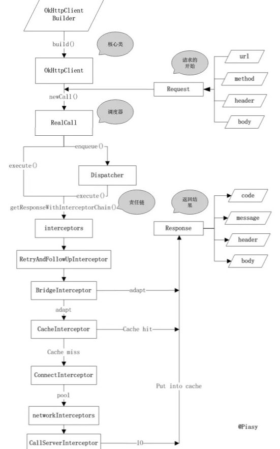
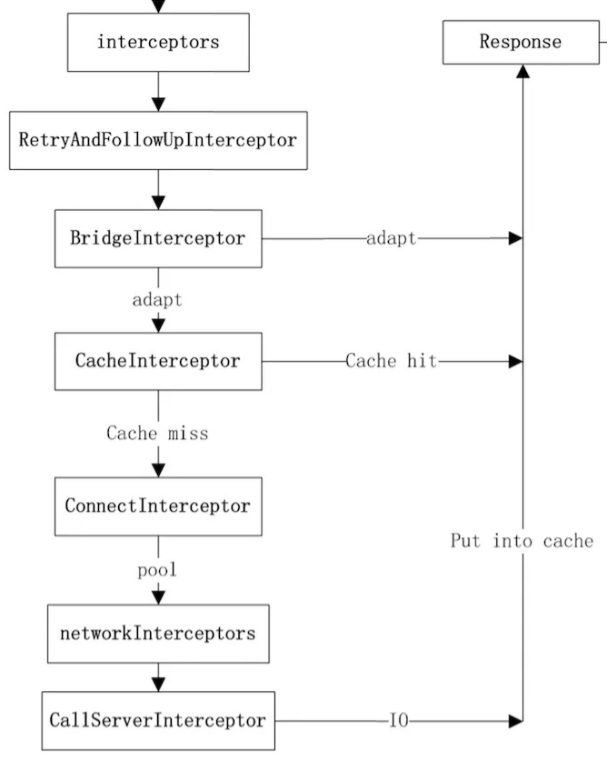
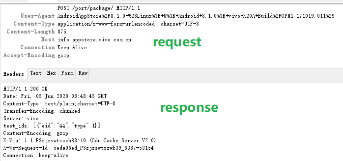

- # OKHTTP源码分析


[TOC]

# 一、请求流程

常见的OKHttp的请求如下:

```
Request request = new Request.Builder().url(url).build();
OkHttpClient client = new OkHttpClient();
Call call = client.newCall(request);
Response response = call.execute();
```

请求过程中内部调用逻辑如下：




涉及到的几个核心类：

**OkHttpClient**：OkHttp的核心管理类，所有的内部逻辑和对象归OkHttpClient统一来管理，可以通过Builder构造器生成。

**Request 和 Response**：Request是我们发送请求封装类，内部有url, header , method，body等常见的参数；Response是请求的结果，包含code, message, header,body ；这两个类的定义是完全符合Http协议所定义的请求内容和响应内容。

**Call 和 RealCall** ：

- Call 是一个接口，是请求的抽象描述，具体实现类是 RealCall，通过Call.Factory 创建。
- RealCall负责请求的调度（同步的话走当前线程发送请求，异步的话则使用OkHttp内部的线程池进行）；同时负责构造内部逻辑责任链，并执行责任链相关的逻辑，直到获取结果。虽然OkHttpClient是整个OkHttp的核心管理类，但是真正发出请求并且组织逻辑的是RealCall类，它同时肩负了调度和责任链组织的两大重任.

**Dispatcher：**控制每一个 Call 的执行顺序和生命周期。它内部维护了三个队列：

- readyAsyncCalls：等待的异步请求队列
- runningAsyncCalls：正在运行的异步请求队列
- runningSyncCalls：正在运行的同步请求队列

对于同步请求，由于它是即时运行的， Dispatcher 只需要运行前请求前存储到 runningSyncCalls，请求结束后从 runningSyncCalls 中移除即可。

对于异步请求，Dispatcher 是通过启动 ExcuteService 执行，线程池的最大并发量 64，异步请求先放置在 readyAsyncCalls，可以执行时放到 runningAsyncCalls 中，执行结束从runningAsyncCalls 中移除。

OKHttp支持是同步和异步请求的，下面分析下同步和异步请求的执行过程。

## 1、同步请求

同步请求调用的是RealCall.execute()方法。

```
@Override public Response execute() throws IOException {
  synchronized (this) {
    if (executed) throw new IllegalStateException("Already Executed");
    executed = true;
  }
  transmitter.timeoutEnter();
  transmitter.callStart();
  try {
    client.dispatcher().executed(this);
    return getResponseWithInterceptorChain();
  } finally {
    client.dispatcher().finished(this);
  }
}
```

9行：将请求加入到同步队列runningSyncCalls 中

10行：获取请求结果

12行：将 call 从 runningSyncCalls 队列中移除

## 2、请求和结果

getResponseWithInterceptorChain 是真正发出请求以及请求返回的处理都在这个方法中，是OkHttp的核心方法。

```
Response getResponseWithInterceptorChain() throws IOException {
  // Build a full stack of interceptors.
  List<Interceptor> interceptors = new ArrayList<>();
  interceptors.addAll(client.interceptors());
  interceptors.add(new RetryAndFollowUpInterceptor(client));
  interceptors.add(new BridgeInterceptor(client.cookieJar()));
  interceptors.add(new CacheInterceptor(client.internalCache()));
  interceptors.add(new ConnectInterceptor(client));
  if (!forWebSocket) {
    interceptors.addAll(client.networkInterceptors());
  }
  interceptors.add(new CallServerInterceptor(forWebSocket));
  Interceptor.Chain chain = new RealInterceptorChain(interceptors, transmitter, null, 0,
      originalRequest, this, client.connectTimeoutMillis(),
      client.readTimeoutMillis(), client.writeTimeoutMillis());
  boolean calledNoMoreExchanges = false;
  try {
    Response response = chain.proceed(originalRequest);
    if (transmitter.isCanceled()) {
      closeQuietly(response);
      throw new IOException("Canceled");
    }
    return response;
  } catch (IOException e) {
    calledNoMoreExchanges = true;
    throw transmitter.noMoreExchanges(e);
  } finally {
    if (!calledNoMoreExchanges) {
      transmitter.noMoreExchanges(null);
    }
  } 
}
```

3 - 12 行：添加拦截器

13行：创建RealInterceptorChain对象

18行：执行RealInterceptorChain 的 proceed方法

拦截器执行是递归执行的，每个拦截器有2个作用：

- 拦截上一层拦截器封装好的 Request，然后自身对这个 Request 进行处理，处理后向下传递。
- 接收下一层拦截器传递回来的 Response，然后自身对 Response 进行处理，返回给上一层。

## 3、异步请求

异步请求调用的是 RealCall.enqueue()方法。

```
@Override public void enqueue(Callback responseCallback) {
  synchronized (this) {
    if (executed) throw new IllegalStateException("Already Executed");
    executed = true;
  }
  transmitter.callStart();
  client.dispatcher().enqueue(new AsyncCall(responseCallback));
}

void enqueue(AsyncCall call) {
  synchronized (this) {
    readyAsyncCalls.add(call);
    // Mutate the AsyncCall so that it shares the AtomicInteger of an existing running call to
    // the same host.
    if (!call.get().forWebSocket) {
      AsyncCall existingCall = findExistingCallWithHost(call.host());
      if (existingCall != null) call.reuseCallsPerHostFrom(existingCall);
    }
  }
  promoteAndExecute();
}

private boolean promoteAndExecute() {
  assert (!Thread.holdsLock(this));
  List<AsyncCall> executableCalls = new ArrayList<>();
  boolean isRunning;
  synchronized (this) {
    for (Iterator<AsyncCall> i = readyAsyncCalls.iterator(); i.hasNext(); ) {
      AsyncCall asyncCall = i.next();
      if (runningAsyncCalls.size() >= maxRequests) break; // Max capacity.
      if (asyncCall.callsPerHost().get() >= maxRequestsPerHost) continue; // Host max capacity.
      i.remove();
      asyncCall.callsPerHost().incrementAndGet();
      executableCalls.add(asyncCall);
      runningAsyncCalls.add(asyncCall);
    }
    isRunning = runningCallsCount() > 0;
  }
  for (int i = 0, size = executableCalls.size(); i < size; i++) {
    AsyncCall asyncCall = executableCalls.get(i);
    asyncCall.executeOn(executorService());
  }
  return isRunning;
}
```

- 先将任务加入到异步等待队列中，
- 从准备异步请求的队列中取出可以执行的请求（正在运行的异步请求不得超过64，同一个host下的异步请求不得超过5个），加入到 executableCalls 列表中。
- 循环 executableCalls 取出请求 AsyncCall 对象，调用其 executeOn 方法。

```
void executeOn(ExecutorService executorService) {
  assert (!Thread.holdsLock(client.dispatcher()));
  boolean success = false;
  try {
    executorService.execute(this);
    success = true;
  } catch (RejectedExecutionException e) {
    InterruptedIOException ioException = new InterruptedIOException("executor rejected");
    ioException.initCause(e);
    transmitter.noMoreExchanges(ioException);
    responseCallback.onFailure(RealCall.this, ioException);
  } finally {
    if (!success) {
      client.dispatcher().finished(this); // This call is no longer running!
    }
  }
}
```

5行：执行AsyncCall的Run方法，最终会调用到AsyncCall的execute方法。

```
@Override protected void execute() {
  boolean signalledCallback = false;
  transmitter.timeoutEnter();
  try {
    Response response = getResponseWithInterceptorChain();
    signalledCallback = true;
    responseCallback.onResponse(RealCall.this, response);
  } catch (IOException e) {
    if (signalledCallback) {
      // Do not signal the callback twice!
      Platform.get().log(INFO, "Callback failure for " + toLoggableString(), e);
    } else {
      responseCallback.onFailure(RealCall.this, e);
    }
  } finally {
    client.dispatcher().finished(this);
  }
}
```

第5行：可以看到这里又调用了getResponseWithInterceptorChain方法，所以同步和异步请求的底层逻辑是一致的。

# 二、拦截器

## 1、执行顺序




## 2、拦截器分析

### 1.RetryAndFollowUpInterceptor

重试和重定向拦截器

RetryAndFollowUpInterceptor开启了一个while(true)的循环，并在循环内部完成两个重要的判定：

1. 当请求内部抛出异常时，判定是否需要重试
2. 当响应结果是3xx重定向时，构建新的请求并发送请求


异常时重试的逻辑相对复杂，有如下的判定逻辑：

1. client的retryOnConnectionFailure参数设置为false，不进行重试
2. 请求的body已经发出，不进行重试
3. 特殊的异常类型不进行重试（如ProtocolException，SSLHandshakeException等）
4. 没有更多的route（包含proxy和inetaddress），不进行重试。

```java
private boolean recover(IOException e, Transmitter transmitter,
    boolean requestSendStarted, Request userRequest) {
  // The application layer has forbidden retries.
  if (!client.retryOnConnectionFailure()) return false;

  // We can't send the request body again.
  if (requestSendStarted && requestIsOneShot(e, userRequest)) return false;

  // This exception is fatal.
  if (!isRecoverable(e, requestSendStarted)) return false;

  // No more routes to attempt.
  if (!transmitter.canRetry()) return false;

  // For failure recovery, use the same route selector with a new connection.
  return true;
}
```

### 2.BridgeInterceptor

请求时为Requsest拼接必要的HEADER属性；服务器响应返回后，对响应进行gzip解压。


主要流程：

1. 设置请求和响应报文HEADER信息，User-Agent，Content-Type，Host，Keep-Alive等等。
2. 添加和保存cookie
3. 若请求时设置了gzip压缩，则在接收内容后进行解压。




### 3.CacheInterceptor

负责缓存数据的读取、解析和更新。

#### 3.1 处理流程


#### 3.2 Http缓存

再介绍Okttp的缓存读取逻辑前，需要先补充一些Http头字段中和缓存相关的知识，在阅读源码时能够更好的理解缓存的一些策略。

**Cache-Control**

Cache-control是由服务器返回的Response中添加的头信息，它的目的是告诉客户端是要从本地读取缓存还是直接从服务器摘取消息。它有不同的值，每一个值有不同的作用。

OkHttp中可以使用CacheControl属性针对不同的Request设置相应的缓存策略。

- **max-age：**这个参数告诉浏览器将页面缓存多长时间，超过这个时间后才再次向服务器发起请求检查页面是否有更新。对于静态的页面，比如图片、CSS、Javascript，一般都不大变更，因此通常我们将存储这些内容的时间设置为较长的时间，这样浏览器会不会向浏览器反复发起请求，也不会去检查是否更新了。
- **max-stale**：指示客户机可以接收超出超时期间的响应消息。如果指定max-stale消息的值，那么客户机可以接收超出超时期指定值之内的响应消息。
- **no-cache**：不做缓存。
- **no-store**：数据不在硬盘中临时保存，这对需要保密的内容比较重要。
- s-maxage：这个参数告诉缓存服务器(proxy，如Squid)的缓存页面的时间。如果不单独指定，缓存服务器将使用max-age。对于动态内容(比如文档的查看页面)，我们可告诉浏览器很快就过时了(max-age=0)，并告诉缓存服务器(Squid)保留内容一段时间(比如，s-maxage=7200)。一旦我们更新文档，我们将告诉Squid清除老的缓存版本。
- must-revalidate：这告诉浏览器，一旦缓存的内容过期，一定要向服务器询问是否有新版本。
- proxy-revalidate：proxy上的缓存一旦过期，一定要向服务器询问是否有新版本。
- public：告诉缓存服务器, 即便是对于不该缓存的内容也缓存起来，比如当用户已经认证的时候。所有的静态内容(图片、Javascript、CSS等)应该是public的。
- private：告诉proxy不要缓存，但是浏览器可使用private cache进行缓存。一般登录后的个性化页面是private的。
- no-transform： 告诉proxy不进行转换，比如告诉手机浏览器不要下载某些图片。

**expires**
expires的效果等同于Cache-Control，不过它是Http 1.0的内容，它的作用是告诉浏览器缓存的过期时间，在此时间内浏览器不需要直接访问服务器地址直接用缓存内容就好了。
expires最大的问题在于如果服务器时间和本地浏览器相差过大的问题。那样误差就很大。所以基本上用Cache-Control:max-age=多少秒的形式代替。

**Last-Modified/If-Modified-Since**

这个需要配合Cache-Control使用，

- Last-Modified：标示这个响应资源的最后修改时间。web服务器在响应请求时，告诉浏览器资源的最后修改时间。

- If-Modified-Since：当资源过期时（使用Cache-Control标识的max-age），发现资源具有Last-Modified声明，则再次向web服务器请求时带上头 If-Modified-Since，表示请求时间。web服务器收到请求后发现有头If-Modified-Since 则与被请求资源的最后修改时间进行比对。若最后修改时间较新，说明资源又被改动过，则响应整片资源内容（写在响应消息包体内），HTTP 200；若最后修改时间较旧，说明资源无新修改，则响应HTTP 304 (无需包体，节省浏览)，告知浏览器继续使用所保存的cache。

**Etag/If-None-Match**
这个也需要配合Cache-Control使用

- Etag对应请求的资源在服务器中的唯一标识（具体规则由服务器决定），比如一张图片，它在服务器中的标识为ETag: W/”ACXbWXd1n0CGMtAd65PcoA==”。
- If-None-Match 如果浏览器在Cache-Control:max-age=60设置的时间超时后，发现消息头中还设置了Etag值。然后，浏览器会再次向服务器请求数据并添加In-None-Match消息头，它的值就是之前Etag值。服务器通过Etag来定位资源文件，根据它是否更新的情况给浏览器返回200或者是304。

**Etag机制比Last-Modified精确度更高，如果两者同时设置的话，Etag优先级更高。**

**Pragma**
Pragma头域用来包含实现特定的指令，最常用的是Pragma:no-cache。

在HTTP/1.1协议中，它的含义和Cache- Control:no-cache相同。

#### 3.3 缓存读取的流程

OkHttp缓存保存到本地时使用的是DiskLrucache，仅限于GET请求才能使用。若要对POST请求进行缓存，需要通过自定义拦截器的方式实现。下面先介绍下OkHttp推荐的缓存拦截器配置和使用方式。

##### 1.CacheControl

可以针对每个请求设置不同的缓存策略：

1. 网络访问请求的资源是文本信息，如新闻列表，这类信息经常变动，一天更新好几次，它们用的缓存时间应该就很短。

2. 网络访问请求的资源是图片或者视频，它们变动很少，或者是长期不变动，那么它们用的缓存时间就应该很长

1、定义缓存文件

```
private static final long MAX_SIZE = 10 * 1024 * 1024;
private static final File CACHE_FILE = new File(AppStoreTestApplication.getInstance().getCacheDir().getAbsolutePath() + "/webCache");
 OkHttpClient.Builder okHttpClient = new OkHttpClient.Builder().cache(new Cache(CACHE_FILE, MAX_SIZE));
```

2、使用CacheControl.Builder

CacheControl是针对Request的，所以它可以针对每个请求设置不同的缓存策略。CacheControl.Builder有如下方法可配置。

```
noCache();//不使用缓存，用网络请求
noStore();//不使用缓存，也不存储缓存
onlyIfCached();//只使用缓存
noTransform();//禁止转码
maxAge(10, TimeUnit.MILLISECONDS);//设置超时时间为10ms。
maxStale(10, TimeUnit.SECONDS);//超时之外的超时时间为10s minFresh(10, TimeUnit.SECONDS);//超时时间为当前时间加上10秒钟
```

3、创建request并且设置请求策略

```
CacheControl cacheControl = new CacheControl.Builder()
    .maxAge(60, TimeUnit.MILLISECONDS)
    .build();
Request request = new Request.Builder()
    .url(url)
    .cacheControl(cacheControl
    ).build();
... 省略请求过程    
```

4、强制缓存和禁止缓存

CacheControl中定义了2个常量分别是FORCE_CACHE -- 强制缓存以及FORCE_NETWORK -- 禁止缓存。

```
// 强制缓存
public static final CacheControl FORCE_CACHE = new Builder()
      .onlyIfCached()
      .maxStale(Integer.MAX_VALUE, TimeUnit.SECONDS)
      .build();

// 禁止缓存
public static final CacheControl FORCE_NETWORK = new Builder().noCache().build();
```

禁止缓存还有一种方式就是将maxAge设置为0

```
Request request = new Request.Builder()
            .url(url)
            .cacheControl(new CacheControl.Builder()
            .maxAge(0, TimeUnit.SECONDS))
            .build();
```

##### 2.自定义缓存拦截器

推荐的缓存拦截器只能对GET请求进行拦截，如果是POST请求该如何进行拦截呢，这就需要用到自定义拦截器了。

1、请求和响应的消息头中增加缓存配置

控制缓存的消息头往往是服务端返回的信息中添加的如”Cache-Control:max-age=60”。所以，会有两种情况。
1. 客户端和服务端开发能够很好沟通，按照达成一致的协议，服务端按照规定添加缓存相关的消息头。
2. 客户端与服务端的开发根本就不是同一家公司，没有办法也不可能要求服务端按照客户端的意愿进行开发。

第一种办法当然很好，只要服务器在返回消息的时候添加好Cache-Control相关的消息便好。

第二种情况，就很麻烦，你真的无法左右别人的行为。怎么办呢？好在OKHTTP能够很轻易地处理这种情况。那就是定义一个拦截器，人为地添加Response中的消息头，然后再传递给用户，这样用户拿到的Response就有了我们理想当中的消息头Headers，从而达到控制缓存的意图，正所谓移花接木。

```
class CacheInterceptor implements Interceptor {
    @Override
    public Response intercept(Chain chain) throws IOException {
        Response originResponse = chain.proceed(chain.request());
        //设置缓存时间为60秒，并移除了pragma消息头，移除它的原因是因为pragma也是控制缓存的一个消息头属性
        return originResponse.newBuilder().removeHeader("pragma")
            .header("Cache-Control","max-age=60").build();
    }
}

private void testCacheInterceptor(){
        //缓存文件夹
        File cacheFile = new File(getExternalCacheDir().toString(),"cache");
        //缓存大小为10M
        int cacheSize = 10 * 1024 * 1024;
        //创建缓存对象
        final Cache cache = new Cache(cacheFile,cacheSize);

        OkHttpClient client = new OkHttpClient.Builder()
                .addNetworkInterceptor(new CacheInterceptor())
                .cache(cache)
                .build();
        // 请求头中增加缓存信息，貌似没必要？？？        
        Request request = new Request.Builder().url(url).header("Cache-Control", "max-age=60").build();
        .......
}
```

### 4.ConnectInterceptor

负责了Dns解析和Socket连接（包括tls连接）。

#### 1.连接过程

ConnectInterceptor 的核心方法是：

```
Exchange exchange = transmitter.newExchange(chain, doExtensiveHealthChecks);
```

负责整个网络连接建立的过程，包括dns以及socket连接过程。


用的时序图，梳理出关键步骤：

1. ConnectInterceptor调用transmitter.newExchange
2. Transmitter先调用ExchangeFinder的find()获得ExchangeCodec
3. ExchangeFinder调用自身的findHealthConnectio获得RealConnection
4. ExchangeFinder通过刚才获取的RealConnection的codec()方法获得ExchangeCodec
5. Transmitter获取到了ExchangeCodec，然后new了一个ExChange，将刚才的ExchangeCodec包含在内

通过以上5步，最终获取到一个ExChange对象。


ExChange这个对象中最重要的2个属性为RealConnection和ExchangeCodec。RealConnection是一个Socket连接的包装类，ExchangeCode是对Request和Response的封装，它有两个实现，一个是Http1ExchangeCodec，一个是Http2Exchangecodec，分别对应的是Http1协议和Http2协议。

获取socket和dns过程都是在findConnection()方法中，详细的过程在后面再进行分析，这里ConnectionInterceptor的任务已经完成了。

另外还需要注意的一点是，在执行完ConnectInterceptor之后，其实添加了自定义的网络拦截器networkInterceptors，按照顺序执行的规定，所有的networkInterceptor执行时，socket连接其实已经建立了，可以通过realChain拿到socket做一些事情了，这也就是为什么称之为network Interceptor的原因。

#### 2.socket连接

通过前面的分析知道，Socket连接和Dns过程都是在ConnecInterceptor中通过Transmitter和ExchangeFinder来完成的，而在前面的时序图中可以看到，最终建立Socket连接的方法是通过ExchangeFinder的findConnection来完成的。


#### 3.DNS连接


#### 4.连接池复用

#### 


### 5.CallServerInterceptor

传输http的头部和body数据。

### 6.interceptors（ApplicationInterceptors）


### 7.networkInterceptors