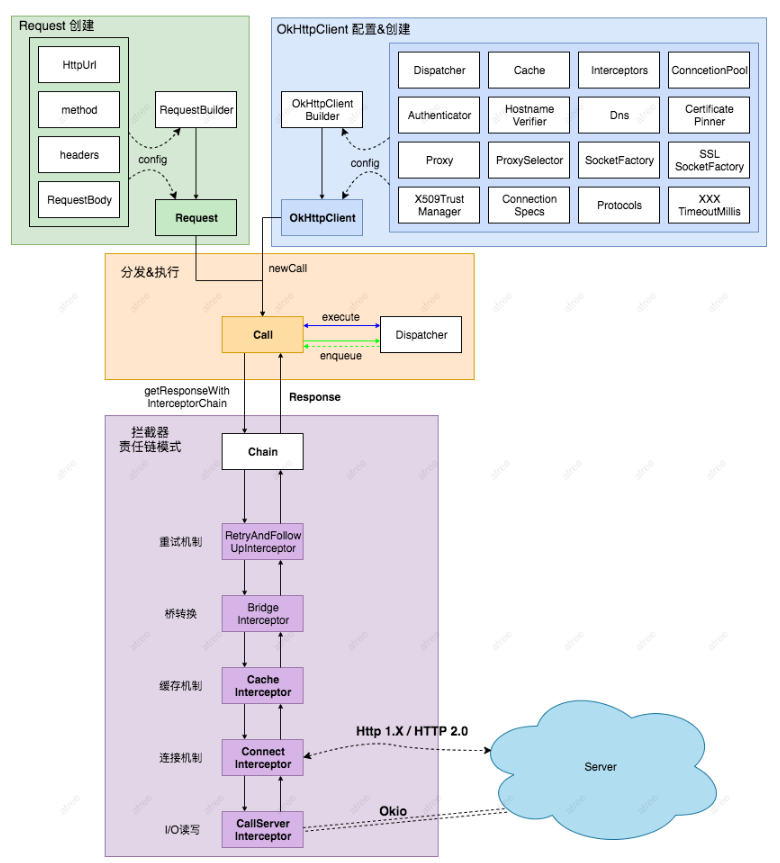
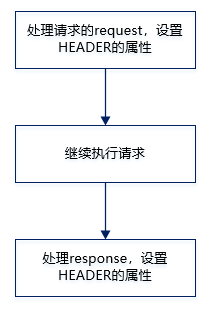
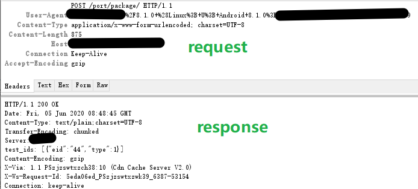
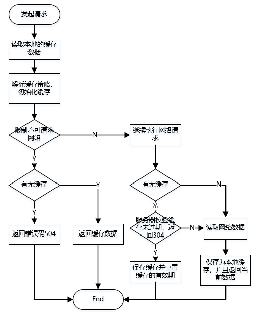
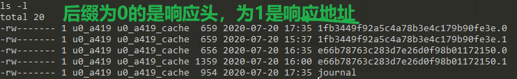
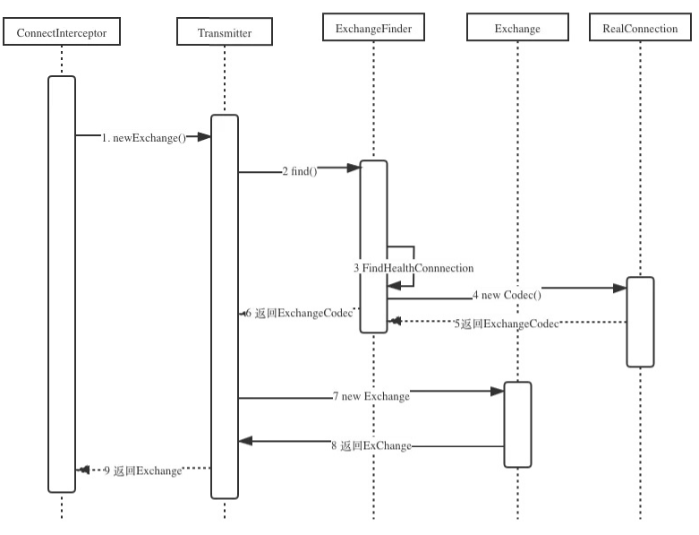
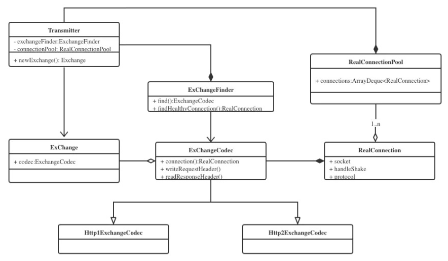
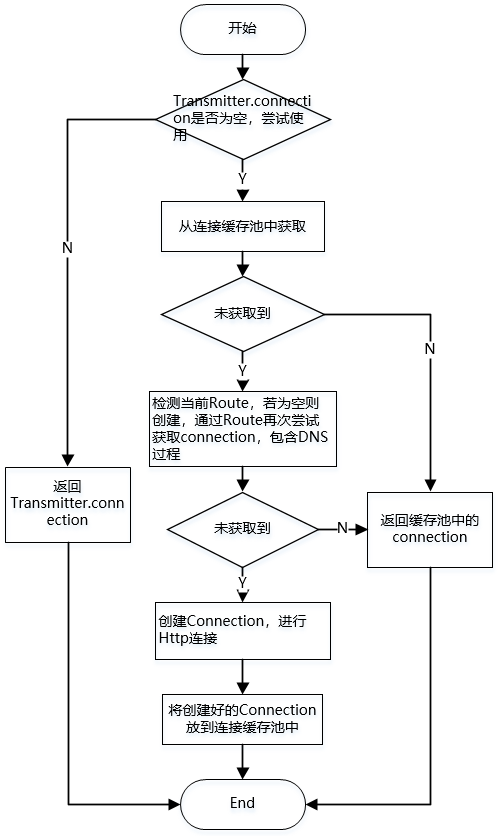
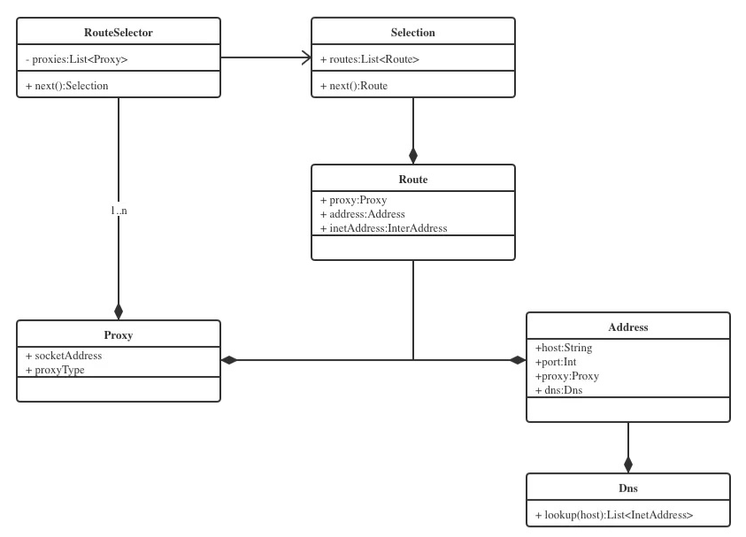
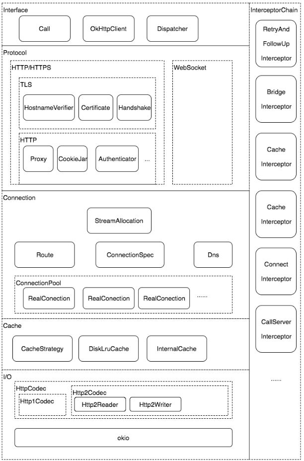

- # OKHTTP源码分析


[TOC]

OkHttp 作为目前Android平台上广泛使用的开源库，很多没有看过源码的同学可能都是知道怎么用，但是不知道具体的原理。这边文章主要通过分析源码，使大家可以对OkHttp有一个完整和深入的了解。本文会从Okttp的请求流程，拦截器以及架构角度对OkHttp进行总结。选用的Okttp版本是 3.14.x。

[OkHttp]: https://github.com/square/okhttp

# 一、请求流程

常见的OKHttp的请求如下:

```java
Request request = new Request.Builder().url(url).build();
OkHttpClient client = new OkHttpClient.Builder().build();
Call call = client.newCall(request);
Response response = call.execute();
```

请求过程中内部调用逻辑：



涉及到的几个核心类：

**OkHttpClient**：OkHttp的核心管理类，所有的内部逻辑和对象归OkHttpClient统一来管理，可以通过Builder构造器生成。

**Request 和 Response**：Request是我们发送请求封装类，内部有url, header , method，body等常见的参数；Response是请求的结果，包含code, message, header,body ；这两个类的定义是完全符合Http协议所定义的请求内容和响应内容。

**Call 和 RealCall** ：

- Call 是一个接口，是请求的抽象描述，具体实现类是 RealCall，通过Call.Factory 创建。
- RealCall负责请求的调度（同步的话走当前线程发送请求，异步的话则使用OkHttp内部的线程池进行）；同时负责构造内部逻辑责任链，并执行责任链相关的逻辑，直到获取结果。虽然OkHttpClient是整个OkHttp的核心管理类，但是真正发出请求并且组织逻辑的是RealCall类，它同时肩负了调度和责任链组织的两大重任.

**Dispatcher：**控制每一个 Call 的执行顺序和生命周期。它内部维护了三个队列：

- readyAsyncCalls：等待的异步请求队列
- runningAsyncCalls：正在运行的异步请求队列
- runningSyncCalls：正在运行的同步请求队列

对于同步请求，由于它是即时运行的， Dispatcher 只需要运行前请求前存储到 runningSyncCalls，请求结束后从 runningSyncCalls 中移除即可。

对于异步请求，Dispatcher 是通过启动 ExcuteService 执行，线程池的最大并发量 64，异步请求先放置在 readyAsyncCalls，可以执行时放到 runningAsyncCalls 中，执行结束从runningAsyncCalls 中移除。

OKHttp支持是同步和异步请求的，下面分析下同步和异步请求的执行过程。

## 1.同步请求

同步请求调用的是RealCall.execute()方法。

```java
@Override 
public Response execute() throws IOException {
  synchronized (this) {
    if (executed) throw new IllegalStateException("Already Executed");
    executed = true;
  }
  transmitter.timeoutEnter();
  transmitter.callStart();
  try {
    client.dispatcher().executed(this);
    return getResponseWithInterceptorChain();
  } finally {
    client.dispatcher().finished(this);
  }
}
```

9行：将请求加入到同步队列runningSyncCalls 中

10行：获取请求结果

12行：将 call 从 runningSyncCalls 队列中移除

## 2.请求和结果

getResponseWithInterceptorChain 是真正发出请求以及请求返回的处理都在这个方法中，是OkHttp的核心方法。

```java
Response getResponseWithInterceptorChain() throws IOException {
  // Build a full stack of interceptors.
  List<Interceptor> interceptors = new ArrayList<>();
  interceptors.addAll(client.interceptors());
  interceptors.add(new RetryAndFollowUpInterceptor(client));
  interceptors.add(new BridgeInterceptor(client.cookieJar()));
  interceptors.add(new CacheInterceptor(client.internalCache()));
  interceptors.add(new ConnectInterceptor(client));
  if (!forWebSocket) {
    interceptors.addAll(client.networkInterceptors());
  }
  interceptors.add(new CallServerInterceptor(forWebSocket));
  Interceptor.Chain chain = new RealInterceptorChain(interceptors, transmitter, null, 0,
      originalRequest, this, client.connectTimeoutMillis(),
      client.readTimeoutMillis(), client.writeTimeoutMillis());
  boolean calledNoMoreExchanges = false;
  try {
    Response response = chain.proceed(originalRequest);
    if (transmitter.isCanceled()) {
      closeQuietly(response);
      throw new IOException("Canceled");
    }
    return response;
  } catch (IOException e) {
    calledNoMoreExchanges = true;
    throw transmitter.noMoreExchanges(e);
  } finally {
    if (!calledNoMoreExchanges) {
      transmitter.noMoreExchanges(null);
    }
  } 
}
```

3 - 12 行：添加拦截器

13行：创建RealInterceptorChain对象

18行：执行RealInterceptorChain 的 proceed方法

拦截器执行是**递归执行**的，每个拦截器有2个作用：

- 拦截上一层拦截器封装好的 Request，然后自身对这个 Request 进行处理，处理后向下传递。
- 接收下一层拦截器传递回来的 Response，然后自身对 Response 进行处理，返回给上一层。

## 3.异步请求

异步请求调用的是 RealCall.enqueue()方法。

```java
@Override 
public void enqueue(Callback responseCallback) {
  synchronized (this) {
    if (executed) throw new IllegalStateException("Already Executed");
    executed = true;
  }
  transmitter.callStart();
  client.dispatcher().enqueue(new AsyncCall(responseCallback));
}

void enqueue(AsyncCall call) {
  synchronized (this) {
    readyAsyncCalls.add(call);
    // Mutate the AsyncCall so that it shares the AtomicInteger of an existing running call to
    // the same host.
    if (!call.get().forWebSocket) {
      AsyncCall existingCall = findExistingCallWithHost(call.host());
      if (existingCall != null) call.reuseCallsPerHostFrom(existingCall);
    }
  }
  promoteAndExecute();
}

private boolean promoteAndExecute() {
  assert (!Thread.holdsLock(this));
  List<AsyncCall> executableCalls = new ArrayList<>();
  boolean isRunning;
  synchronized (this) {
    for (Iterator<AsyncCall> i = readyAsyncCalls.iterator(); i.hasNext(); ) {
      AsyncCall asyncCall = i.next();
      if (runningAsyncCalls.size() >= maxRequests) break; // Max capacity.
      if (asyncCall.callsPerHost().get() >= maxRequestsPerHost) continue; // Host max capacity.
      i.remove();
      asyncCall.callsPerHost().incrementAndGet();
      executableCalls.add(asyncCall);
      runningAsyncCalls.add(asyncCall);
    }
    isRunning = runningCallsCount() > 0;
  }
  for (int i = 0, size = executableCalls.size(); i < size; i++) {
    AsyncCall asyncCall = executableCalls.get(i);
    asyncCall.executeOn(executorService());
  }
  return isRunning;
}
```

- 先将任务加入到异步等待队列中
- 从准备异步请求的队列中取出可以执行的请求（正在运行的异步请求不得超过64，同一个host下的异步请求不得超过5个），加入到 executableCalls 列表中
- 循环 executableCalls 取出请求 AsyncCall 对象，调用其 executeOn 方法

```java
void executeOn(ExecutorService executorService) {
  assert (!Thread.holdsLock(client.dispatcher()));
  boolean success = false;
  try {
    executorService.execute(this);
    success = true;
  } catch (RejectedExecutionException e) {
    InterruptedIOException ioException = new InterruptedIOException("executor rejected");
    ioException.initCause(e);
    transmitter.noMoreExchanges(ioException);
    responseCallback.onFailure(RealCall.this, ioException);
  } finally {
    if (!success) {
      client.dispatcher().finished(this); // This call is no longer running!
    }
  }
}
```

5行：调用AsyncCall的execute方法

```java
@Override protected void execute() {
  boolean signalledCallback = false;
  transmitter.timeoutEnter();
  try {
    Response response = getResponseWithInterceptorChain();
    signalledCallback = true;
    responseCallback.onResponse(RealCall.this, response);
  } catch (IOException e) {
    if (signalledCallback) {
      // Do not signal the callback twice!
      Platform.get().log(INFO, "Callback failure for " + toLoggableString(), e);
    } else {
      responseCallback.onFailure(RealCall.this, e);
    }
  } finally {
    client.dispatcher().finished(this);
  }
}
```

第5行：可以看到这里又调用了getResponseWithInterceptorChain方法，所以同步和异步请求的底层逻辑是一致的。

# 二、拦截器

## 1.执行顺序

拦截器的执行属性是getResponseWithInterceptorChain() 方法中添加的顺序，依次为：

- client.Interceptors
- RetryAndFollowUpInterceptor
- BridgeInterceptor
- CacheInterceptor
- ConnectInterceptor
- client.networkInterceptors
- CallServerInterceptor

## 2.拦截器分析

### 1.RetryAndFollowUpInterceptor 

**重试和重定向拦截器**

RetryAndFollowUpInterceptor开启了一个while(true)的循环，并在循环内部完成两个重要的判定：

1. **当请求内部抛出异常时，判定是否需要重试**
2. **当响应结果是3xx重定向时，构建新的请求并发送请求**


Route或IO异常时重试的逻辑相对复杂，有如下的判定逻辑：

```java
private boolean recover(IOException e, Transmitter transmitter,
    boolean requestSendStarted, Request userRequest) {
  // The application layer has forbidden retries.
  if (!client.retryOnConnectionFailure()) return false;

  // We can't send the request body again.
  if (requestSendStarted && requestIsOneShot(e, userRequest)) return false;

  // This exception is fatal.
  if (!isRecoverable(e, requestSendStarted)) return false;

  // No more routes to attempt.
  if (!transmitter.canRetry()) return false;

  // For failure recovery, use the same route selector with a new connection.
  return true;
}
```

1. client的retryOnConnectionFailure参数设置为false，不进行重试
2. 请求的body已经发出，不进行重试
3. 特殊的异常类型不进行重试（如ProtocolException，SSLHandshakeException等）
4. 没有更多的route（包含proxy和inetaddress），不进行重试。

### 2.BridgeInterceptor

**请求时为Requsest拼接必要的Header属性；服务器响应返回后，对响应进行gzip解压。**



1. 设置请求和响应报文HEADER信息，User-Agent，Content-Type，Host，Keep-Alive等等。
2. 添加和保存cookie
3. 若请求时设置了gzip压缩，则在接收内容后进行解压。



最佳实践：

通过自定义拦截器将公共参数统一管理，对于异步请求，拦截器的参数添加都是在线程里的，降低可能的耗时操作

### 3.CacheInterceptor

**负责缓存数据的读取、解析和更新。**

#### 3.1 处理流程




#### 3.2 Http缓存

在介绍Okttp的缓存读取逻辑前，需要先补充一些Http头字段中和缓存相关的知识。

[OKHTTP之缓存配置详解]: https://blog.csdn.net/briblue/article/details/52920531

#### 3.3 缓存读取

缓存读取逻辑比较复杂，核心的逻辑其实就是3.2中Http缓存的规则。

```java
/** Returns a strategy to use assuming the request can use the network. */
private CacheStrategy getCandidate() {
  // No cached response.
  if (cacheResponse == null) {
    return new CacheStrategy(request, null);
  }

  // Drop the cached response if it's missing a required handshake.
  if (request.isHttps() && cacheResponse.handshake() == null) {
    return new CacheStrategy(request, null);
  }

  // If this response shouldn't have been stored, it should never be used
  // as a response source. This check should be redundant as long as the
  // persistence store is well-behaved and the rules are constant.
  if (!isCacheable(cacheResponse, request)) {
    return new CacheStrategy(request, null);
  }

  CacheControl requestCaching = request.cacheControl();
  if (requestCaching.noCache() || hasConditions(request)) {
    return new CacheStrategy(request, null);
  }

  CacheControl responseCaching = cacheResponse.cacheControl();

  long ageMillis = cacheResponseAge();
  long freshMillis = computeFreshnessLifetime();

  if (requestCaching.maxAgeSeconds() != -1) {
    freshMillis = Math.min(freshMillis, SECONDS.toMillis(requestCaching.maxAgeSeconds()));
  }

  long minFreshMillis = 0;
  if (requestCaching.minFreshSeconds() != -1) {
    minFreshMillis = SECONDS.toMillis(requestCaching.minFreshSeconds());
  }

  long maxStaleMillis = 0;
  if (!responseCaching.mustRevalidate() && requestCaching.maxStaleSeconds() != -1) {
    maxStaleMillis = SECONDS.toMillis(requestCaching.maxStaleSeconds());
  }

  if (!responseCaching.noCache() && ageMillis + minFreshMillis < freshMillis + maxStaleMillis) {
    Response.Builder builder = cacheResponse.newBuilder();
    if (ageMillis + minFreshMillis >= freshMillis) {
      builder.addHeader("Warning", "110 HttpURLConnection \"Response is stale\"");
    }
    long oneDayMillis = 24 * 60 * 60 * 1000L;
    if (ageMillis > oneDayMillis && isFreshnessLifetimeHeuristic()) {
      builder.addHeader("Warning", "113 HttpURLConnection \"Heuristic expiration\"");
    }
    return new CacheStrategy(null, builder.build());
  }

  // Find a condition to add to the request. If the condition is satisfied, the response body
  // will not be transmitted.
  String conditionName;
  String conditionValue;
  if (etag != null) {
    conditionName = "If-None-Match";
    conditionValue = etag;
  } else if (lastModified != null) {
    conditionName = "If-Modified-Since";
    conditionValue = lastModifiedString;
  } else if (servedDate != null) {
    conditionName = "If-Modified-Since";
    conditionValue = servedDateString;
  } else {
    return new CacheStrategy(request, null); // No condition! Make a regular request.
  }

  Headers.Builder conditionalRequestHeaders = request.headers().newBuilder();
  Internal.instance.addLenient(conditionalRequestHeaders, conditionName, conditionValue);

  Request conditionalRequest = request.newBuilder()
      .headers(conditionalRequestHeaders.build())
      .build();
  return new CacheStrategy(conditionalRequest, cacheResponse);
}
```

#### 3.4 实践

OkHttp缓存保存到本地时使用的是DiskLrucache，仅限于**GET请求**才能使用。常见的配置和使用方式有2种分别是okHttp推荐的CacheControl和自定义拦截器的方式。下面先介绍下CahceControl。

##### 1.CacheControl 配置缓存

可以针对每个请求设置不同的缓存策略：

1. 网络访问请求的资源是文本信息，如新闻列表，这类信息经常变动，一天更新好几次，它们用的缓存时间应该就很短；

2. 网络访问请求的资源是图片或者视频，它们变动很少，或者是长期不变动，那么它们用的缓存时间就应该很长。

1、定义缓存文件

```java
private static final long MAX_SIZE = 10 * 1024 * 1024;
private static final File CACHE_FILE = new File(AppStoreTestApplication.getInstance().getCacheDir().getAbsolutePath() + "/webCache");
 OkHttpClient.Builder okHttpClient = new OkHttpClient.Builder().cache(new Cache(CACHE_FILE, MAX_SIZE));
```

2、使用CacheControl.Builder

CacheControl是针对Request的，所以它可以针对每个请求设置不同的缓存策略。CacheControl.Builder有如下方法可配置。

```java
noCache();//不使用缓存，用网络请求
noStore();//不使用缓存，也不存储缓存
onlyIfCached();//只使用缓存
noTransform();//禁止转码
maxAge(10, TimeUnit.MILLISECONDS);//设置超时时间为10ms。
maxStale(10, TimeUnit.SECONDS);//超时之外的超时时间为10s minFresh(10, TimeUnit.SECONDS);//超时时间为当前时间加上10秒钟
```

3、创建request并且设置请求策略

```java
CacheControl cacheControl = new CacheControl.Builder()
    .maxAge(60, TimeUnit.MILLISECONDS)
    .build();
Request request = new Request.Builder()
    .url(url)
    .cacheControl(cacheControl)
    .build();
... 省略请求过程    
```

4、强制缓存和禁止缓存

CacheControl中定义了2个常量分别是FORCE_CACHE -- 强制缓存以及FORCE_NETWORK -- 禁止缓存。

```java
// 强制缓存
public static final CacheControl FORCE_CACHE = new Builder()
      .onlyIfCached()
      .maxStale(Integer.MAX_VALUE, TimeUnit.SECONDS)
      .build();

// 禁止缓存
public static final CacheControl FORCE_NETWORK = new Builder().noCache().build();
```

禁止缓存还有一种方式就是将maxAge设置为0

```java
Request request = new Request.Builder()
            .url(url)
            .cacheControl(new CacheControl.Builder()
            .maxAge(0, TimeUnit.SECONDS))
            .build();
```

##### 2.自定义缓存拦截器

推荐的缓存拦截器只能对GET请求进行拦截，对于其他方式的请求是不支持的，比如Post，还有一种情况就是客户端和服务器没有约定好协议，比如控制缓存的消息头往往是服务端返回的信息中添加的如”Cache-Control:max-age=60”。所以，会有两种情况。

1. 客户端和服务端开发能够很好沟通，按照达成一致的协议，服务端按照规定添加缓存相关的消息头。
2. 客户端与服务端的开发根本就不是同一家公司，没有办法也不可能要求服务端按照客户端的意愿进行开发。

第一种办法当然很好，只要服务器在返回消息的时候添加好Cache-Control相关的消息便好。

第二种情况，就很麻烦，你真的无法左右别人的行为。怎么办呢？那就需要自定义一个拦截器，为返回Response添加消息头，然后再传递给用户，这样用户拿到的Response就有了我们理想当中的消息头Headers，从而达到控制缓存的意图，正所谓移花接木。

```java
class CacheInterceptor implements Interceptor {
    @Override
    public Response intercept(Chain chain) throws IOException {
        Response originResponse = chain.proceed(chain.request());
        //设置缓存时间为60秒，并移除了pragma消息头，移除它的原因是因为pragma也是控制缓存的一个消息头属性
        return originResponse.newBuilder().removeHeader("pragma")
            .header("Cache-Control","max-age=60").build();
    }
}

private void testCacheInterceptor(){
        //缓存文件夹
        File cacheFile = new File(getExternalCacheDir().toString(),"cache");
        //缓存大小为10M
        int cacheSize = 10 * 1024 * 1024;
        //创建缓存对象
        final Cache cache = new Cache(cacheFile,cacheSize);

        OkHttpClient client = new OkHttpClient.Builder()
                .addNetworkInterceptor(new CacheInterceptor())
                .cache(cache)
                .build();
         // Request 中不要去设置禁止缓存，否则缓存就不生效了
        Request request = new Request.Builder().url(url).build();
        .......
}
```

#### 3.5 缓存保存

缓存保存采用的是DiskLruCache，key是请求的url，一个请求缓存到本地的文件有2个，分别是响应头以及响应内容。




### 4.ConnectInterceptor

**负责了Dns解析和Socket连接。**

https://segmentfault.com/a/1190000014044351

#### 1.整体流程

ConnectInterceptor 的核心方法是：

```java
Exchange exchange = transmitter.newExchange(chain, doExtensiveHealthChecks);
```



关键步骤：

1. ConnectInterceptor调用transmitter.newExchange
2. Transmitter先调用ExchangeFinder的find()获得ExchangeCodec
3. **ExchangeFinder调用自身的findHealthConnectio获得RealConnection**
4. **ExchangeFinder通过刚才获取的RealConnection的codec()方法获得ExchangeCodec**
5. Transmitter获取到了ExchangeCodec，然后new了一个ExChange，将刚才的ExchangeCodec包含在内

通过以上5步，最终获取到一个ExChange对象。



ExChange这个对象中最重要的2个属性为RealConnection和ExchangeCodec。RealConnection是一个Socket连接的包装类，ExchangeCode是对Request和Response的封装，它有两个实现，一个是Http1ExchangeCodec，一个是Http2Exchangecodec，分别对应的是Http1协议和Http2协议。

获取socket和dns过程都是在findConnection()方法中，详细的过程在后面再进行分析，这里ConnectionInterceptor的任务已经完成了。

#### 2.findConnection

Dns解析和Socket连接都在findConnection方法中，除此之外，这里还涉及到连接池的复用，总结了一个流程图



findConnection这个方法做了以下几件事：

1. 检查当前exchangeFinder所保存的Connection是否满足此次请求
2. 检查当前连接池ConnectionPool中是否满足此次请求的Connection
3. 检查当前RouteSelector列表中，是否还有可用Route(Route是proxy,IP地址的包装类)，如果没有就发起DNS请求
4. **通过DNS获取到新的Route之后**，第二次从ConnectionPool查找有无可复用的Connection，否则就创建新的RealConnection
5. **用RealConnection进行TCP和TLS连接**，连接成功后保存到ConnectionPool

#### 3.DNS连接

Dns的过程隐藏在了findConnection的Route检查中，整个过程在findConnection方法中写的比较散，可能不是特别好理解，但是只要搞明白了RouteSelector, RouteSelection，Route这三个类的关系，其实就比较容易理解了。




```java
// findConnection Route检查
...
boolean newRouteSelection = false;
if (selectedRoute == null && (routeSelection == null || !routeSelection.hasNext())) {
	newRouteSelection = true;
	routeSelection = routeSelector.next();
}
...

public Selection next() throws IOException {
  if (!hasNext()) {
    throw new NoSuchElementException();
  }

  // Compute the next set of routes to attempt.
  List<Route> routes = new ArrayList<>();
  while (hasNextProxy()) {
    // Postponed routes are always tried last. For example, if we have 2 proxies and all the
    // routes for proxy1 should be postponed, we'll move to proxy2. Only after we've exhausted
    // all the good routes will we attempt the postponed routes.
    Proxy proxy = nextProxy();
    for (int i = 0, size = inetSocketAddresses.size(); i < size; i++) {
      Route route = new Route(address, proxy, inetSocketAddresses.get(i));
      if (routeDatabase.shouldPostpone(route)) {
        postponedRoutes.add(route);
      } else {
        routes.add(route);
      }
    }

    if (!routes.isEmpty()) {
      break;
    }
  }

  if (routes.isEmpty()) {
    // We've exhausted all Proxies so fallback to the postponed routes.
    routes.addAll(postponedRoutes);
    postponedRoutes.clear();
  }

  return new Selection(routes);
}
```

RouteSelector的next方法获取到的是Selection，Selection中封装了一个Route的列表，Route中持有proxy、address和InetSocketAddress，Route中的Proxy和InetSocketAddress（IP地址）是配对的，同一个Proxy，address会和多个IP配对。

hasNextProxy()方法内部会调用到resetNextInetSocketAddress()方法 ，然后通过address.dns.lookup获取InetSocketAddress，也就是IP地址。

```java
/** Prepares the socket addresses to attempt for the current proxy or host. */
private void resetNextInetSocketAddress(Proxy proxy) throws IOException {
  // Clear the addresses. Necessary if getAllByName() below throws!
  inetSocketAddresses = new ArrayList<>();

  String socketHost;
  int socketPort;
  // 判断代理的类型
  if (proxy.type() == Proxy.Type.DIRECT || proxy.type() == Proxy.Type.SOCKS) {
    socketHost = address.url().host();
    socketPort = address.url().port();
  } else {
   // 得到代理的地址
    SocketAddress proxyAddress = proxy.address();
    if (!(proxyAddress instanceof InetSocketAddress)) {
      throw new IllegalArgumentException(
          "Proxy.address() is not an " + "InetSocketAddress: " + proxyAddress.getClass());
    }
    // 得到代理的地址
    InetSocketAddress proxySocketAddress = (InetSocketAddress) proxyAddress;
    socketHost = getHostString(proxySocketAddress);
    socketPort = proxySocketAddress.getPort();
  }
 //判断端口号是否合合法
  if (socketPort < 1 || socketPort > 65535) {
    throw new SocketException("No route to " + socketHost + ":" + socketPort
        + "; port is out of range");
  }

  // 这里是关键，如果代理的类型是Socks，不适用DNS
  if (proxy.type() == Proxy.Type.SOCKS) {
    inetSocketAddresses.add(InetSocketAddress.createUnresolved(socketHost, socketPort));
  } else {
    eventListener.dnsStart(call, socketHost);

    // Try each address for best behavior in mixed IPv4/IPv6 environments.
    List<InetAddress> addresses = address.dns().lookup(socketHost);
    if (addresses.isEmpty()) {
      throw new UnknownHostException(address.dns() + " returned no addresses for " + socketHost);
    }

    eventListener.dnsEnd(call, socketHost, addresses);

    for (int i = 0, size = addresses.size(); i < size; i++) {
      InetAddress inetAddress = addresses.get(i);
      inetSocketAddresses.add(new InetSocketAddress(inetAddress, socketPort));
    }
  }
}
```

37行：IP地址最终是通过address的dns获取到的，而这个dns又是怎么构建的呢？

address的dns是**transmitter.prepareToConnect**时，将内置的client.dns传递进来，而client.dns是OkHttpclient的构建过程中传递进来Dns.System，里面的lookup是通InetAddress.getAllByName 方法获取到对应域名的IP，也就是默认的Dns实现。

```java
public void prepareToConnect(Request request) {
  ...
  // 构造ExchangeFinder
  this.exchangeFinder = new ExchangeFinder(this, connectionPool, createAddress(request.url()),
      call, eventListener);
}

private Address createAddress(HttpUrl url) {
    SSLSocketFactory sslSocketFactory = null;
    HostnameVerifier hostnameVerifier = null;
    CertificatePinner certificatePinner = null;
    if (url.isHttps()) {
      sslSocketFactory = client.sslSocketFactory();
      hostnameVerifier = client.hostnameVerifier();
      certificatePinner = client.certificatePinner();
    }
	// 此处传入client的dns
    return new Address(url.host(), url.port(), client.dns(), client.socketFactory(),
        sslSocketFactory, hostnameVerifier, certificatePinner, client.proxyAuthenticator(),
        client.proxy(), client.protocols(), client.connectionSpecs(), client.proxySelector());
}
```

**由于默认的LocalDNS 可能出现被劫持，调度不准确的问题，OkHttp的DNS是支持自定义的DNS的。目前比较成熟解决方案是在构建HttpClient时，通过OkHttpBuilder进行设置HttpDns**。

```java
new OkHttpClient.Builder().dns(new HttpDnsImpl())
```

关于HTTPDNS，请移步[使用 HTTPDNS 优化 DNS，从原理到 OkHttp 集成](https://juejin.im/post/5c98482c5188252d9559247e)

#### 4.Socket连接过程

上一步中通过Dns获得Connectoin之后，下一步就是建立连接的过程。

```java
// findConnection 中调用连接
// Do TCP + TLS handshakes. This is a blocking operation.
result.connect(connectTimeout, readTimeout, writeTimeout, pingIntervalMillis,
        connectionRetryEnabled, call, eventListener);
...

public void connect(int connectTimeout, int readTimeout, int writeTimeout,
    int pingIntervalMillis, boolean connectionRetryEnabled, Call call,
    EventListener eventListener) {
...
  while (true) {
    try {
       // 1. https协议使用了HTTP代理,使用隧道
      if (route.requiresTunnel()) {
        connectTunnel(connectTimeout, readTimeout, writeTimeout, call, eventListener);
        if (rawSocket == null) {
          // We were unable to connect the tunnel but properly closed down our resources.
          break;
        }
      } else {
        connectSocket(connectTimeout, readTimeout, call, eventListener);
      }
       // 2.在建立连接之后要进行握手
      establishProtocol(connectionSpecSelector, pingIntervalMillis, call, eventListener);
      eventListener.connectEnd(call, route.socketAddress(), route.proxy(), protocol);
      break;
    } catch (IOException e) {
   	  //...
      if (routeException == null) {
        routeException = new RouteException(e);
      } else {
        routeException.addConnectException(e);
      }

      if (!connectionRetryEnabled || !connectionSpecSelector.connectionFailed(e)) {
        throw routeException;
      }
    }
  }
 ....
}
```

关键的步骤有2步：

**1.根据是否需要建立隧道调用不同的方法建立socket连接，[深究OKHttp之隧道](https://juejin.im/post/5d9cc1cff265da5bb86abc8e)**

**2.连接后进行握手，establishProtocol 会调用到connectTls方法进行**

```java
private void establishProtocol(ConnectionSpecSelector connectionSpecSelector,
    int pingIntervalMillis, Call call, EventListener eventListener) throws IOException {
  if (route.address().sslSocketFactory() == null) {
   // 非HTTPS，支持HTTP2，优先走HTTP2
    if (route.address().protocols().contains(Protocol.H2_PRIOR_KNOWLEDGE)) {
      socket = rawSocket;
      protocol = Protocol.H2_PRIOR_KNOWLEDGE;
      startHttp2(pingIntervalMillis);
      return;
    }

    socket = rawSocket;
    protocol = Protocol.HTTP_1_1;
    return;
  }

  eventListener.secureConnectStart(call);
  // tls连接
  connectTls(connectionSpecSelector);
  eventListener.secureConnectEnd(call, handshake);

  if (protocol == Protocol.HTTP_2) {
    startHttp2(pingIntervalMillis);
  }
}
```

到此OkHttp的连接就完成了，关于SSL/TLS握手请移步[SSL/TLS 握手过程详解](https://www.jianshu.com/p/7158568e4867)，详细的连接过程见 [okHttp连接流程](https://blog.csdn.net/fengrui_sd/article/details/79004826)

#### 5.连接池复用

OkHttp的连接复用其实是通过ConnectionPool来实现的，内部有一个connections的ArrayDeque对象就是用来保存缓存的连接池。findConnection中做了两次复用检查，对应调用的方法是transmitterAcquirePooledConnection。

```java
boolean transmitterAcquirePooledConnection(Address address, Transmitter transmitter,
    @Nullable List<Route> routes, boolean requireMultiplexed) {
  assert (Thread.holdsLock(this));
  for (RealConnection connection : connections) {
    if (requireMultiplexed && !connection.isMultiplexed()) continue;
    if (!connection.isEligible(address, routes)) continue;
    transmitter.acquireConnectionNoEvents(connection);
    return true;
  }
  return false;
}
```

ConnectionPool中通过一个cleanup任务维护缓存大小，在每次新增缓存时触发。

```java
long cleanup(long now) {
    int inUseConnectionCount = 0;
    int idleConnectionCount = 0;
    RealConnection longestIdleConnection = null;
    long longestIdleDurationNs = Long.MIN_VALUE;

    // Find either a connection to evict, or the time that the next eviction is due.
    synchronized (this) {
      for (Iterator<RealConnection> i = connections.iterator(); i.hasNext(); ) {
        RealConnection connection = i.next();

        // If the connection is in use, keep searching.
        if (pruneAndGetAllocationCount(connection, now) > 0) {
          inUseConnectionCount++;
          continue;
        }

        idleConnectionCount++;

        // If the connection is ready to be evicted, we're done.
        long idleDurationNs = now - connection.idleAtNanos;
        if (idleDurationNs > longestIdleDurationNs) {
          longestIdleDurationNs = idleDurationNs;
          longestIdleConnection = connection;
        }
      }

      if (longestIdleDurationNs >= this.keepAliveDurationNs
          || idleConnectionCount > this.maxIdleConnections) {
        // We've found a connection to evict. Remove it from the list, then close it below (outside
        // of the synchronized block).
        connections.remove(longestIdleConnection);
      } else if (idleConnectionCount > 0) {
        // A connection will be ready to evict soon.
        return keepAliveDurationNs - longestIdleDurationNs;
      } else if (inUseConnectionCount > 0) {
        // All connections are in use. It'll be at least the keep alive duration 'til we run again.
        return keepAliveDurationNs;
      } else {
        // No connections, idle or in use.
        cleanupRunning = false;
        return -1;
      }
    }

    closeQuietly(longestIdleConnection.socket());

    // Cleanup again immediately.
    return 0;
  }
```

总结下流程：

1. 遍历所有连接，查询每个连接的引用数量，如果大于 0，表示连接正在使用，无需清理，执行下一次循环。
2. 如果找到了一个可以被清理的连接，会尝试去寻找闲置时间最久的连接来释放。
3. 如果空闲连接超过 5 个或者 keepalive 时间大于 5 分钟，则将该连接清理。
4. 闲置的连接的数量大于 0，返回该连接的到期时间（等会儿将其清理掉，现在还不是时候）。
5. 全部都是活跃连接，5 分钟后再进行清理。
6. 没有任何连接，跳出循环。

若检测发现没有可复用的连接，那么就会创建一个新的Connection，这里涉及到DNS过程。

### 5.CallServerInterceptor

**传输http的头部和body数据。**

完成socket连接和tls连接后，下一步就是传输http的头部和body数据了，主要步骤如下：

1. 写请求头
2. 创建请求体
3. 写请求体
4. 完成请求写入
5. 读取响应头
6. 返回响应结果

主要实现根据ConnectInterceptor 中返回的ExchangeCodec协议执行Http2或Http1协议。

### 6.ApplicationInterceptor 和 NetWorkInterceptor

前面提到，在OkHttpClient.Builder的构造方法有两个参数，使用者可以通过addInterceptor 和 addNetworkdInterceptor 添加自定义的拦截器，分析完 RetryAndFollowUpInterceptor 我们就可以知道这两种自动拦截器的区别了。

从前面添加拦截器的顺序可以知道 Interceptors 和 networkInterceptors 刚好一个在 RetryAndFollowUpInterceptor 的前面，一个在后面。

结合前面的责任链调用图可以分析出来，假如一个请求在 RetryAndFollowUpInterceptor 这个拦截器内部重试或者重定向了 N 次，那么其内部嵌套的所有拦截器也会被调用N次，同样 networkInterceptors 自定义的拦截器也会被调用 N 次。而相对的 Interceptors 则一个请求只会调用一次，所以在OkHttp的内部也将其称之为 Application Interceptor。 

另外还需要注意的一点是，在执行完ConnectInterceptor之后，其实添加了自定义的网络拦截器networkInterceptors，按照顺序执行的规定，所有的networkInterceptor执行时，socket连接其实已经建立了，可以通过realChain拿到socket做一些事情了，这也就是为什么称之为network Interceptor的原因。

# 三、总结

OkHttp的整体架构如图，请求构建时使用了**Builder模式**，可配置了OkHttpClient属性和Request属性；核心的请求过程应用了**职责链模式**，最重要的拦截器分别是负责连接的ConnectInterceptor和负责缓存的CacheInterceptor；连接过程中采用了连接池复用，避免频繁的请求和断开；IO传输时使用的是OkIo，提升传输效率。




# 四、参考

[OkHttp 4源码](https://juejin.im/post/5e324e68f265da3e1e0579a8)

[OkHttp源码深度解析](https://zhuanlan.zhihu.com/p/116777864)