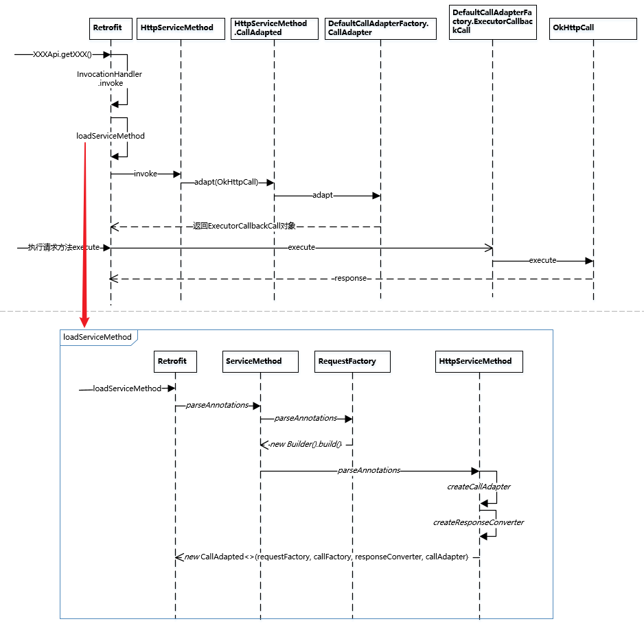

# Retrofit源码解析

# 一、基本用法

## 1.1、gradle依赖

```java
implementation 'com.squareup.retrofit2:retrofit:2.9.0'
implementation 'com.squareup.retrofit2:converter-gson:2.9.0'
// 配合RxJava
implementation 'com.squareup.retrofit2:adapter-rxjava3:2.9.0'
// RxAndroid的依赖包
implementation 'io.reactivex.rxjava3:rxandroid:3.0.0'
```

## 1.2、定义接口

```
interface GetApi {
    /**
     * 获取用户信息
     * @return
     * @Query 注解
     */
    @GET("api/getUserInfo")
    Call<UserInfo> getUserInfo(@Query("id") List<String> userId);
 }
```

## 1.3、创建retrofit发送请求

```
Retrofit retrofit = new Retrofit.Builder().baseUrl(URL1).addConverterFactory(GsonConverterFactory.create()).build();

GetApi getApi = retrofit.create(GetApi.class);

List<String> params = new ArrayList<>();
params.add("1234");
getApi.getUserInfo(params).enqueue(new Callback<UserInfo>() {
    @Override
    public void onResponse(Call<UserInfo> call, Response<UserInfo> response) {
          String tag = response.raw().request().tag().toString();
          Log.d(TAG, "tag = " + tag);
        UserInfo userInfo = response.body();
        Log.d(TAG, "userinfo = " + userInfo + " thread " +  Thread.currentThread().getName());
    }
    @Override
    public void onFailure(Call<UserInfo> call, Throwable t) {
        Log.i(TAG, "onFailure: " + t);
    }
  });
```

# 二、注解介绍

## 2.1、请求方法

| 注解名  | 参数说明                                                     |
| ------- | ------------------------------------------------------------ |
| HTTP    | **method：**表示请求的方法GET POST等；**path ：**表示路径  ；**hasBody：**表示请求体。HTTP注解可以代替以下的所有注解。 |
| GET     | value : 通常表示对应的接口，要和baseUrl结合使用              |
| POST    | 同GET                                                        |
| PUT     | 同GET                                                        |
| PATCH   | 同GET                                                        |
| DELETE  | 同GET                                                        |
| OPTIONS | 同GET                                                        |

[HTTP请求方法](https://itbilu.com/other/relate/EkwKysXIl.html)

## 2.2、标记类

| 注解名         | 参数                                                         |
| -------------- | ------------------------------------------------------------ |
| FormUrlEncoded | 用于POST请求，表示请求体是一个Form表单，常见的网址登录就是这种类型，对应的HEAD参数是Content-Type：application/x-www-form-urlencoded，[HTTP content-type](https://www.runoob.com/http/http-content-type.html) |
| Multipart      | 用于POST请求，表单上传文件时使用                             |
| Streaming      | 表示响应体的数据使用流的方式返回处理，主要用于文件下载       |

## 2.3、参数类

### 2.3.1、注解说明

| 注解名    | 说明                                                         |
| --------- | ------------------------------------------------------------ |
| Url       | 参数里带了Url注解的会替换掉baseUrl                           |
| Path      | 替换Url中的某个路径参数                                      |
| Headers   | 多个请求头，作用于方法，**不可作为参数**                     |
| Header    | 单个请求头                                                   |
| HeaderMap | 多个请求头                                                   |
| Query     | GET请求，请求参数，**支持数组或集合**，例如 Call<UserInfo> getUserInfo(@Query("id") String[] userId); |
| QueryMap  | GET请求，多个同类型请求参数                                  |
| Field     | Post请求，请求参数，和FormUrlEncoded一起使用，**支持数组或集合** |
| FieldMap  | Post请求，多个同类型请求参数，和FormUrlEncoded一起使用       |
| Part      | 文件上传，和注解Multipart一起使用，**支持数组或集合**        |
| PartMap   | 文件上传，和注解Multipart一起使用                            |
| Body      | 多个不同类型的参数，使用对象包裹参数，包括文件上传时需要的参数，**不能和FormUrlEncoded及Multipart同时使用** |
| Tag       | 给这次请求打个Tag，https://stackoverflow.com/questions/42066885/retrofit-adding-tag-to-the-original-request-object |

### 2.3.2、文件上传

通常使用Part和PartMap 配合Multipart使用；还有一种方式直接使用Body实现，此时不能增加Multipart。文件上传这里还是比较复杂的，有时间再仔细讲讲。

[Retrofit学习之文件和参数上传](https://www.jianshu.com/p/74b7da380855)

# 三、Retrofit构建过程

```java
Retrofit retrofit = new Retrofit.Builder().baseUrl(URL1).addConverterFactory(GsonConverterFactory.create()).build()
```

Retrofit中主要的几个对象和作用：

```java
public final class Retrofit {
  private final Map<Method, ServiceMethod<?>> serviceMethodCache = new ConcurrentHashMap<>(); //包含所有网络请求信息的对象

  final okhttp3.Call.Factory callFactory; //网络请求工厂
  final HttpUrl baseUrl; //网络请求的url地址
  final List<Converter.Factory> converterFactories; //数据转换器工厂的集合
  final List<CallAdapter.Factory> callAdapterFactories; //网络请求适配器工厂的集合
  final @Nullable Executor callbackExecutor; //回调方法执行器
  //...
}
```

Retrofit使用了Builder模式，通过build方法默认创建的对象。

```java
public Retrofit build() {
  if (baseUrl == null) {
    throw new IllegalStateException("Base URL required.");
  }

  okhttp3.Call.Factory callFactory = this.callFactory;
  if (callFactory == null) {
    // 1、callFactory 为 OkHttpClient
    callFactory = new OkHttpClient();
  }

  Executor callbackExecutor = this.callbackExecutor;
  if (callbackExecutor == null) {
    // 2、创建默认回调执行器，paltform = Android
    callbackExecutor = platform.defaultCallbackExecutor();
  }

  // Make a defensive copy of the adapters and add the default Call adapter.
  // 3、创建默认请求适配器
  List<CallAdapter.Factory> callAdapterFactories = new ArrayList<>(this.callAdapterFactories);
  callAdapterFactories.addAll(platform.defaultCallAdapterFactories(callbackExecutor));

  // Make a defensive copy of the converters.
  // 4、创建默认的数据解析器
  List<Converter.Factory> converterFactories =
      new ArrayList<>(
          1 + this.converterFactories.size() + platform.defaultConverterFactoriesSize());

  // Add the built-in converter factory first. This prevents overriding its behavior but also
  // ensures correct behavior when using converters that consume all types.
  converterFactories.add(new BuiltInConverters());
  converterFactories.addAll(this.converterFactories);
  converterFactories.addAll(platform.defaultConverterFactories());

  return new Retrofit(
      callFactory,
      baseUrl,
      unmodifiableList(converterFactories),
      unmodifiableList(callAdapterFactories),
      callbackExecutor,
      validateEagerly);
}
```

## 3.1、请求执行器

负责真正发送请求，其实就是OkHttpClient

```java
 callFactory = new OkHttpClient();
```

## 3.2、请求适配器

**负责请求的执行以及回调结果**，默认添加的请求适配器如下，关于。

```java
  List<CallAdapter.Factory> callAdapterFactories = new ArrayList<>(this.callAdapterFactories);
  callAdapterFactories.addAll(platform.defaultCallAdapterFactories(callbackExecutor));
```

## 3.2、数据转换器

Converter用于构建数据转换器，主要有2个作用：1、将Response转换成我们需要的返回数据类型；2、将输入的请求参数转换为ResquestBody或String。默认添加的converterFactory如下，关于数据转换器的详细说明，后面再介绍：

```java
  List<Converter.Factory> converterFactories =
      new ArrayList<>(
          1 + this.converterFactories.size() + platform.defaultConverterFactoriesSize());

  // Add the built-in converter factory first. This prevents overriding its behavior but also
  // ensures correct behavior when using converters that consume all types.
  converterFactories.add(new BuiltInConverters());
  converterFactories.addAll(this.converterFactories);
  converterFactories.addAll(platform.defaultConverterFactories());
```

注意一下以上添加的请求适配器和请求转化器都是xxxFactory对象。

## 3.4、回调执行器

Executor，用于回调网络请求的执行结果，Android中默认是通过创建一个主线程Handler将结果post出来，对于Retrofit的异步请求来说，回调结果是在主线程中的。

```java
static final class Android extends Platform {
  Android() {
    super(Build.VERSION.SDK_INT >= 24);
  }

  @Override
  public Executor defaultCallbackExecutor() {
    return new MainThreadExecutor();
  }

  @Nullable
  @Override
  Object invokeDefaultMethod(
      Method method, Class<?> declaringClass, Object object, Object... args) throws Throwable {
    if (Build.VERSION.SDK_INT < 26) {
      throw new UnsupportedOperationException(
          "Calling default methods on API 24 and 25 is not supported");
    }
    return super.invokeDefaultMethod(method, declaringClass, object, args);
  }

  static final class MainThreadExecutor implements Executor {
    // 主线程的Handler
    private final Handler handler = new Handler(Looper.getMainLooper());
	// 结果post到主线程
    @Override
    public void execute(Runnable r) {
      handler.post(r);
    }
  }
}
```

经过以上几步，retrofit执行时需要的组件基本都添加完毕了。

# 四、ServiceMethod创建

## 4.1、创建接口代理对象

Retrofit.create，使用动态代理方式创建接口的代理对象，InvocationHandler中定义了代理的规则，在调用到接口时，解析接口方法的注解参数，生成对应的ServiceMethod对象，并在调用到方法时，执行方法的参数。

```java
public <T> T create(final Class<T> service) {
  validateServiceInterface(service);
  return (T)
      Proxy.newProxyInstance(
          service.getClassLoader(),
          new Class<?>[] {service},
          new InvocationHandler() {
            private final Platform platform = Platform.get();
            private final Object[] emptyArgs = new Object[0];

            @Override
            public @Nullable Object invoke(Object proxy, Method method, @Nullable Object[] args)
                throws Throwable {
              // If the method is a method from Object then defer to normal invocation.
              // 1、Object 类的方法直接调用
              if (method.getDeclaringClass() == Object.class) {
                return method.invoke(this, args);
              }
              args = args != null ? args : emptyArgs;
              // 2、平台的默认方法直接调用
              return platform.isDefaultMethod(method)
                  ? platform.invokeDefaultMethod(method, service, proxy, args)
                  : loadServiceMethod(method).invoke(args);
            }
          });
}
```

## 4.2、loadServiceMethod

loadServiceMethod，根据方法的相关注解，生成对应的ServiceMethod对象。

```java
ServiceMethod<?> loadServiceMethod(Method method) {
  // 1、方法缓存中有直接取缓存
  ServiceMethod<?> result = serviceMethodCache.get(method);
  if (result != null) return result;

  synchronized (serviceMethodCache) {
    result = serviceMethodCache.get(method);
    if (result == null) {
      // 2、解析注解，生成对应的ServiceMethod
      result = ServiceMethod.parseAnnotations(this, method);
      serviceMethodCache.put(method, result);
    }
  }
  return result;
}
```

loadService有2个入口，一个是在InvocationHandler中，另一个是在上一步的validateServiceInterface中。

若validateEagerly参数为true，那么在生成接口的动态代理对象时，解析接口中所有的方法，生成ServiceMethod对象；否则只会在调用到具体方法时才生成相关的对象。

```java
private void validateServiceInterface(Class<?> service) {
  // ...
  // 提前初始化
  if (validateEagerly) {
    Platform platform = Platform.get();
    // 解析接口中所有的方法，生成ServiceMethod对象
    for (Method method : service.getDeclaredMethods()) {
      if (!platform.isDefaultMethod(method) && !Modifier.isStatic(method.getModifiers())) {
        loadServiceMethod(method);
      }
    }
  }
}
```

parseAnnotations 中主要的方法有2个，作用分别是解析方法注解（包含方法参数注解）以及生成对应的请求适配器和网络数据转换器。

```java
static <T> ServiceMethod<T> parseAnnotations(Retrofit retrofit, Method method) {
    // 1、负责解析注解中请求时需要的相关参数
    RequestFactory requestFactory = RequestFactory.parseAnnotations(retrofit, method);

    Type returnType = method.getGenericReturnType();
    if (Utils.hasUnresolvableType(returnType)) {
      throw methodError(
          method,
          "Method return type must not include a type variable or wildcard: %s",
          returnType);
    }
    if (returnType == void.class) {
      throw methodError(method, "Service methods cannot return void.");
    }
    // 2、生成ServiceMethod对象
    return HttpServiceMethod.parseAnnotations(retrofit, method, requestFactory);
  }
```

### 4.2.1、创建RequestFactory

RequestFactory，负责构造请求参数。通过解析方法注解和方法中的参数注解生成一个RequestFactory对象，**包含请求设定的参数**。我们先看一下RequestFactory中有哪些对象。

```java
RequestFactory(Builder builder) {
  method = builder.method;//要解析的方法
  baseUrl = builder.retrofit.baseUrl;//请求地址
  httpMethod = builder.httpMethod;//请求方式
  relativeUrl = builder.relativeUrl;//相对地址
  headers = builder.headers;//header参数
  contentType = builder.contentType;
  hasBody = builder.hasBody;
  isFormEncoded = builder.isFormEncoded;
  isMultipart = builder.isMultipart;
  parameterHandlers = builder.parameterHandlers;//方法参数解析器
  isKotlinSuspendFunction = builder.isKotlinSuspendFunction;
}
```

可以看到RequestFactory中的对象和接口的方法注解对象（Http协议参数）基本是一一对应的，RequestFactory创建时使用了Builder模式。

```java
static RequestFactory parseAnnotations(Retrofit retrofit, Method method) {
  return new Builder(retrofit, method).build();
}

RequestFactory build() {
  // 1、解析方法中的注解
  for (Annotation annotation : methodAnnotations) {
    parseMethodAnnotation(annotation);
  }

  if (httpMethod == null) {
    throw methodError(method, "HTTP method annotation is required (e.g., @GET, @POST, etc.).");
  }

  // Body不能和Multipart及FormUrlEncoded同时使用
  if (!hasBody) {
    if (isMultipart) {
      throw methodError(
          method,
          "Multipart can only be specified on HTTP methods with request body (e.g., @POST).");
    }
    if (isFormEncoded) {
      throw methodError(
          method,
          "FormUrlEncoded can only be specified on HTTP methods with "
              + "request body (e.g., @POST).");
    }
  }
  
  // 2、解析方法中参数的注解
  int parameterCount = parameterAnnotationsArray.length;
  parameterHandlers = new ParameterHandler<?>[parameterCount];
  for (int p = 0, lastParameter = parameterCount - 1; p < parameterCount; p++) {
    parameterHandlers[p] =
        parseParameter(p, parameterTypes[p], parameterAnnotationsArray[p], p == lastParameter);
  }
  
  // 3、限制分成2部分的主要原因是，部分注解比如Filed是在参数中的，所以只有解析完参数后才能获取到
  // 规则1：方法注解中的相对路径和方法参数中的绝对路径不能同时为空  
  if (relativeUrl == null && !gotUrl) {
    throw methodError(method, "Missing either @%s URL or @Url parameter.", httpMethod);
  }
  // 规则2：参数注解中有body的时候（上传表单数据），方法注解中不能包含 FormEncoded，Multipart，hasbody不能为false，
  // hasbody的规则是通过请求方法来识别的，比如GET是false，POST是true
  if (!isFormEncoded && !isMultipart && !hasBody && gotBody) {
    throw methodError(method, "Non-body HTTP method cannot contain @Body.");
  }
  // 规则3：方法注解中包含FormUrlEncoded时，参数中必须包含至少一个Field注解的参数
  if (isFormEncoded && !gotField) {
    throw methodError(method, "Form-encoded method must contain at least one @Field.");
  }
  // 规则4：方法注解中包含FormUrlEncoded时，参数中必须包含Part参数
  if (isMultipart && !gotPart) {
    throw methodError(method, "Multipart method must contain at least one @Part.");
  }

  return new RequestFactory(this);
}
```

#### 1、解析**方法注解**

​      parseMethodAnnotation，**解析方法注解**，主要是请求方式，HEADER参数等。

```java
private void parseMethodAnnotation(Annotation annotation) {
  // 1、解析请求方法
  if (annotation instanceof DELETE) {
    parseHttpMethodAndPath("DELETE", ((DELETE) annotation).value(), false);
  } else if (annotation instanceof GET) {
    parseHttpMethodAndPath("GET", ((GET) annotation).value(), false);
  } else if (annotation instanceof HEAD) {
    parseHttpMethodAndPath("HEAD", ((HEAD) annotation).value(), false);
  } else if (annotation instanceof PATCH) {
    parseHttpMethodAndPath("PATCH", ((PATCH) annotation).value(), true);
  } else if (annotation instanceof POST) {
    parseHttpMethodAndPath("POST", ((POST) annotation).value(), true);
  } else if (annotation instanceof PUT) {
    parseHttpMethodAndPath("PUT", ((PUT) annotation).value(), true);
  } else if (annotation instanceof OPTIONS) {
    parseHttpMethodAndPath("OPTIONS", ((OPTIONS) annotation).value(), false);
  } else if (annotation instanceof HTTP) {
    HTTP http = (HTTP) annotation;
    parseHttpMethodAndPath(http.method(), http.path(), http.hasBody());
  } else if (annotation instanceof retrofit2.http.Headers) {
    // 2、处理HEADER
    String[] headersToParse = ((retrofit2.http.Headers) annotation).value();
    if (headersToParse.length == 0) {
      throw methodError(method, "@Headers annotation is empty.");
    }
    headers = parseHeaders(headersToParse);
  } else if (annotation instanceof Multipart) {
    // 3、限制FormUrlEncoded 和 Multipart 同时使用
    if (isFormEncoded) {
      throw methodError(method, "Only one encoding annotation is allowed.");
    }
    isMultipart = true;
  } else if (annotation instanceof FormUrlEncoded) {
    if (isMultipart) {
      throw methodError(method, "Only one encoding annotation is allowed.");
    }
    isFormEncoded = true;
  }
}

private void parseHttpMethodAndPath(String httpMethod, String value, boolean hasBody) {
      if (this.httpMethod != null) {
        throw methodError(
            method,
            "Only one HTTP method is allowed. Found: %s and %s.",
            this.httpMethod,
            httpMethod);
      }
      // 1、请求方法赋值
      this.httpMethod = httpMethod;
      this.hasBody = hasBody;

      if (value.isEmpty()) {
        return;
      }
       
      // 2、url中不能同时出现？和{}占位符
      // Get the relative URL path and existing query string, if present.
      int question = value.indexOf('?');
      if (question != -1 && question < value.length() - 1) {
        // Ensure the query string does not have any named parameters.
        String queryParams = value.substring(question + 1);
        Matcher queryParamMatcher = PARAM_URL_REGEX.matcher(queryParams);
        if (queryParamMatcher.find()) {
          throw methodError(
              method,
              "URL query string \"%s\" must not have replace block. "
                  + "For dynamic query parameters use @Query.",
              queryParams);
        }
      }

      this.relativeUrl = value;
      // 3、解析path的占位符参数，在后面解析到方法参数进行匹配
      this.relativeUrlParamNames = parsePathParameters(value);
    }
```

#### 2、解析方法参数注解

parseParameterAnnotation, 解析方法参数注解，生成对应的**ParameterHandler**；在执行请求时，通过ParameterHandler将相关参数值转化为请求参数；负责转化请求参数的是converter。

```java
private ParameterHandler<?> parseParameterAnnotation(
    int p, Type type, Annotation[] annotations, Annotation annotation) {
  if (annotation instanceof Url) {
      //省略...
      return new ParameterHandler.RelativeUrl(method, p);
  } else if (annotation instanceof Path) {
    validateResolvableType(p, type);
    //...
    return new ParameterHandler.Path<>(method, p, name, converter, path.encoded());
  } else if (annotation instanceof Query) {
    //...  
    return new ParameterHandler.Query<>(name, converter, encoded).iterable();
  }
  // ...
  return null; // Not a Retrofit annotation.
}
```

现在看下Query参数ParameterHandler的创建，

```java
// 省略... 
else if (annotation instanceof QueryName) {
  validateResolvableType(p, type);
  QueryName query = (QueryName) annotation;
  boolean encoded = query.encoded();

  Class<?> rawParameterType = Utils.getRawType(type);
  gotQueryName = true;
  // 1、集合类型
  if (Iterable.class.isAssignableFrom(rawParameterType)) {
    if (!(type instanceof ParameterizedType)) {
      throw parameterError(
          method,
          p,
          rawParameterType.getSimpleName()
              + " must include generic type (e.g., "
              + rawParameterType.getSimpleName()
              + "<String>)");
    }
    ParameterizedType parameterizedType = (ParameterizedType) type;
    Type iterableType = Utils.getParameterUpperBound(0, parameterizedType);
    // String converter
    Converter<?, String> converter = retrofit.stringConverter(iterableType, annotations);
    return new ParameterHandler.QueryName<>(converter, encoded).iterable();
    // 2、数组类型
  } else if (rawParameterType.isArray()) {
    Class<?> arrayComponentType = boxIfPrimitive(rawParameterType.getComponentType());
    Converter<?, String> converter =
        retrofit.stringConverter(arrayComponentType, annotations);
    return new ParameterHandler.QueryName<>(converter, encoded).array();
  } else {
    // 3、其他
    Converter<?, String> converter = retrofit.stringConverter(type, annotations);
    return new ParameterHandler.QueryName<>(converter, encoded);
  }
// 省略...
```

通过以上源码可以清晰的看到，1、Query参数是支持集合和数组；2、Query参数默认的数据转换器StringConverter，将入参全部装换为String，以字符串的方式拼接到请求里。

### 4.2.2、创建HttpServiceMethod

HttpServiceMethod继承了ServiceMethod， parseAnnotations 负责创建请求适配器 、数据转化器 、 请求执行器。

```java
static <ResponseT, ReturnT> HttpServiceMethod<ResponseT, ReturnT> parseAnnotations(
    Retrofit retrofit, Method method, RequestFactory requestFactory) {
  // 1.确定接口的返回类型，这个参数很重要
  adapterType = method.getGenericReturnType();
  // 2.根据网络请求接口方法的返回类型和注解类型创建请求适配器
  CallAdapter<ResponseT, ReturnT> callAdapter =
      createCallAdapter(retrofit, method, adapterType, annotations);
  Type responseType = callAdapter.responseType();

  // 3.根据网络请求接口方法的响应类型从Retrofit对象中获取对应的数据转换器 
  Converter<ResponseBody, ResponseT> responseConverter =
      createResponseConverter(retrofit, method, responseType); 
  // 4.执行请求OkHttpClient
  okhttp3.Call.Factory callFactory = retrofit.callFactory;
 
  return new CallAdapted<>(requestFactory, callFactory, responseConverter, callAdapter);
}
```

6行：createCallAdapter，默认情况下返回的是初始化时的**DefaultCallAdapterFactory**对象

```java
private static <ResponseT, ReturnT> CallAdapter<ResponseT, ReturnT> createCallAdapter(
    Retrofit retrofit, Method method, Type returnType, Annotation[] annotations) {
  try {
    //noinspection unchecked
    return (CallAdapter<ResponseT, ReturnT>) retrofit.callAdapter(returnType, annotations);
  } catch (RuntimeException e) { // Wide exception range because factories are user code.
    throw methodError(method, e, "Unable to create call adapter for %s", returnType)
  }
}
```

11行：创建数据解析器，默认情况下使用的是传入的BuiltInConverters。

```java
private static <ResponseT> Converter<ResponseBody, ResponseT> createResponseConverter(
    Retrofit retrofit, Method method, Type responseType) {
  Annotation[] annotations = method.getAnnotations();
  try {
    return retrofit.responseBodyConverter(responseType, annotations);
  } catch (RuntimeException e) { // Wide exception range because factories are user code.
    throw methodError(method, e, "Unable to create converter for %s", responseType);
  }
}
```

16行：经过以上几步，我们得到一个CallAdapted对象，这个CallAdapted其实是继承自HttpServiceMethod，CallAdapted.adapt方法会返回一个Call对象，用于执行请求。

```java
new CallAdapted<>(requestFactory, callFactory, responseConverter, callAdapter);
```

可以看到CallAdapted的构造方法中包含了请求过程的需要的所有对象。

## 4.3、HttpServiceMethod.invoke

动态代理方法执行时会调用到invoke()方法，看下HttpServiceMethod.invoke的具体实现：

```java
/** Adapts an invocation of an interface method into an HTTP call. */
abstract class HttpServiceMethod<ResponseT, ReturnT> extends ServiceMethod<ReturnT> {  
  // 省略...
  @Override
  final @Nullable ReturnT invoke(Object[] args) {
    // 1、传入OkHttpCall对象
    Call<ResponseT> call = new OkHttpCall<>(requestFactory, args, callFactory, responseConverter);
    return adapt(call, args);
  }

  static final class CallAdapted<ResponseT, ReturnT> extends HttpServiceMethod<ResponseT, ReturnT> {
    private final CallAdapter<ResponseT, ReturnT> callAdapter;

    CallAdapted(
        RequestFactory requestFactory,
        okhttp3.Call.Factory callFactory,
        Converter<ResponseBody, ResponseT> responseConverter,
        CallAdapter<ResponseT, ReturnT> callAdapter) {
      super(requestFactory, callFactory, responseConverter);
      this.callAdapter = callAdapter;
    }

    @Override
    protected ReturnT adapt(Call<ResponseT> call, Object[] args) {
      // 2、传入OkHttpCall对象
      return callAdapter.adapt(call);
    }
  }
}
```

7-8行：构造OkHttpCall对象，调用adapt方法，最终调用到第26行 callAdapter.adapt，传入的参数是OkHttpCall。这里的callAdapter默认是DefaultCallAdapterFactory，结合3.3节的内容，最终请求执行时调用的是OkHttpCall的方法。

# 五、请求执行过程

OkHttpCall是Retrofit中封装的用于执行请求的对象，请求过程就是和OkHttp请求过程基本一致，以同步请求为例。

```java
public Response<T> execute() throws IOException {
  okhttp3.Call call;

  synchronized (this) {
    if (executed) throw new IllegalStateException("Already executed.");
    executed = true;
	// 1、创建请求
    call = getRawCall();
  }
   
  if (canceled) {
    call.cancel();
  }
  // 2、执行请求并返回结果
  return parseResponse(call.execute());
}
```

## 5.1、创建请求对象

createRawCall，创建**RealCall** 并利用前面创建的RequestFactory生成具体的request请求参数。

```java
private okhttp3.Call createRawCall() throws IOException {
  //callFactory是OkHttpClient，callFactory.newCall 
  okhttp3.Call call = callFactory.newCall(requestFactory.create(args));
  if (call == null) {
    throw new NullPointerException("Call.Factory returned null.");
  }
  return call;
}
```

RequestFactory.create的核心逻辑是利用ParameterHandler解析方法中请求参数的值，最终返回的是一个OkHttp的**Request**对象

```java
okhttp3.Request create(Object[] args) throws IOException {
  @SuppressWarnings("unchecked") // It is an error to invoke a method with the wrong arg types.
  ParameterHandler<Object>[] handlers = (ParameterHandler<Object>[]) parameterHandlers;
    
  int argumentCount = args.length;
    
  RequestBuilder requestBuilder =
      new RequestBuilder(
          httpMethod,
          baseUrl,
          relativeUrl,
          headers,
          contentType,
          hasBody,
          isFormEncoded,
          isMultipart);
  
  // 1、使用ParameterHandler解析请求参数
  List<Object> argumentList = new ArrayList<>(argumentCount);
  for (int p = 0; p < argumentCount; p++) {
    argumentList.add(args[p]);
    handlers[p].apply(requestBuilder, args[p]);
  }
  // 2、返回OkHttpRequest对象
  return requestBuilder.get().tag(Invocation.class, new Invocation(method, argumentList)).build();
}
```

## 5.2、请求执行

call.execute()，同步请求的执行，这里的call是RealCall，内部的执行其实就是OkHttp的同步请求过程。

## 5.3、处理请求结果

处理请求结果，通过responseConverter解析对象。

```java
Response<T> parseResponse(okhttp3.Response rawResponse) throws IOException {
  ResponseBody rawBody = rawResponse.body();

  // Remove the body's source (the only stateful object) so we can pass the response along.
  rawResponse =
      rawResponse
          .newBuilder()
          .body(new NoContentResponseBody(rawBody.contentType(), rawBody.contentLength()))
          .build();

  // 1、请求失败的处理
  int code = rawResponse.code();
  if (code < 200 || code >= 300) {
    try {
      // Buffer the entire body to avoid future I/O.
      ResponseBody bufferedBody = Utils.buffer(rawBody);
      return Response.error(bufferedBody, rawResponse);
    } finally {
      rawBody.close();
    }
  }

  // 2、204 205 代表请求成功，但是没有资源可返回
  if (code == 204 || code == 205) {
    rawBody.close();
    return Response.success(null, rawResponse);
  }

  ExceptionCatchingResponseBody catchingBody = new ExceptionCatchingResponseBody(rawBody);
  try {
   // 3、请求成功，解析请求返回的数据
    T body = responseConverter.convert(catchingBody);
    return Response.success(body, rawResponse);
  } catch (RuntimeException e) {
    // If the underlying source threw an exception, propagate that rather than indicating it was
    // a runtime exception.
    catchingBody.throwIfCaught();
    throw e;
  }
}
```

# 六、重要对象解析

## 6.1、请求适配器

请求适配器CallAdapter.Factory，数据转换器涉及到2个类分别是CallAdapter 和 CallAdapter.Factory，看下它的核心方法。

```java
public interface CallAdapter<R, T> {

  // 返回值类型
  Type responseType();

  // 执行请求  
  T adapt(Call<R> call);

  abstract class Factory {
	
    // 根据returnType返回相应的CallAdapter
    public abstract @Nullable CallAdapter<?, ?> get(
        Type returnType, Annotation[] annotations, Retrofit retrofit);
  }
  // 省略...
}
```

### 6.1.1、DefaultCallAdapterFactory

DefaultCallAdapterFactory是Retrofit默认添加的请求适配器，看下它的源码。

```java
final class DefaultCallAdapterFactory extends CallAdapter.Factory {
  private final @Nullable Executor callbackExecutor;

  DefaultCallAdapterFactory(@Nullable Executor callbackExecutor) {
    this.callbackExecutor = callbackExecutor;
  }

  @Override
  public @Nullable CallAdapter<?, ?> get(
      Type returnType, Annotation[] annotations, Retrofit retrofit) {
    final Type responseType = Utils.getParameterUpperBound(0, (ParameterizedType) returnType);

    final Executor executor =
        Utils.isAnnotationPresent(annotations, SkipCallbackExecutor.class)
            ? null
            : callbackExecutor;

    return new CallAdapter<Object, Call<?>>() {
      @Override
      public Type responseType() {
        return responseType;
      }

      @Override
      public Call<Object> adapt(Call<Object> call) {
        // 执行请求
        return executor == null ? call : new ExecutorCallbackCall<>(executor, call);
      }
    };
  }
```

26行：**ExecutorCallbackCall，**具体处理请求的执行以及callback回调。

```java
static final class ExecutorCallbackCall<T> implements Call<T> {
  final Executor callbackExecutor;
  final Call<T> delegate;

  ExecutorCallbackCall(Executor callbackExecutor, Call<T> delegate) {
    this.callbackExecutor = callbackExecutor;
    this.delegate = delegate;
  }

  @Override
  public void enqueue(final Callback<T> callback) {
    Objects.requireNonNull(callback, "callback == null");

    delegate.enqueue(
        new Callback<T>() {
          @Override
          public void onResponse(Call<T> call, final Response<T> response) {
            callbackExecutor.execute(
                () -> {
                  if (delegate.isCanceled()) {
                    // Emulate OkHttp's behavior of throwing/delivering an IOException on
                    // cancellation.
                    callback.onFailure(ExecutorCallbackCall.this, new IOException("Canceled"));
                  } else {
                    callback.onResponse(ExecutorCallbackCall.this, response);
                  }
                });
          }

          @Override
          public void onFailure(Call<T> call, final Throwable t) {
            callbackExecutor.execute(() -> callback.onFailure(ExecutorCallbackCall.this, t));
          }
        });
  }

  @Override
  public Response<T> execute() throws IOException {
    return delegate.execute();
  }
  // ... 省略
}
```

14行：异步请求的执行，执行的是传入call对象的enqueue方法；

18行/31行：分别是请求成功和失败时，通过回调执行器进行回调；

38行：同步请求的执行，执行的是传入call对象的execute方法。

总结下：**CallAdapter负责请求的执行以及回调结果，通过自定义CallAdapter可以方便处理回调结果。**Retrofit通常都是和RxJava组合使用，利用RxJavaXXXAdapter接口的返回结果改为 Observable对象，这里就不过多介绍了，网上资料很多。

## 6.2、数据转换器

数据转换器涉及到2个类分别是Converter 和 Converter.Factory，Converter.Factory是converter的工厂类。常见的Converter如下：


Converter.Factory 中定义了这2种转换方式的接口：

```java
public interface Converter<F, T> {
  @Nullable
  T convert(F value) throws IOException;
    
  abstract class Factory {
      
    // 将ReponseBody转换为对象
    public @Nullable Converter<ResponseBody, ?> responseBodyConverter(
        Type type, Annotation[] annotations, Retrofit retrofit) {
      return null;
    }

     // 将对象转换为RequestBody
    public @Nullable Converter<?, RequestBody> requestBodyConverter(
        Type type,
        Annotation[] parameterAnnotations,
        Annotation[] methodAnnotations,
        Retrofit retrofit) {
      return null;
    }

    // 将对象转换为String
    public @Nullable Converter<?, String> stringConverter(
        Type type, Annotation[] annotations, Retrofit retrofit) {
      return null;
    }
    // 省略...
  }
}
```

也就是说一个Retrofit请求通常会有2个converter分别是**RequestBodyConverter**和**ResponseBodyConverter**，顾名思义，一个负责请求数据的转换，一个负责返回数据的转换。

### 6.2.1、RequestBodyConverter

先来看下RequestBodyConverter，RequestBodyConverter创建的地方是在解析方法注解生成ParameterHandler时，通过Retrofit.stringConverter生成。

```java
public <T> Converter<T, String> stringConverter(Type type, Annotation[] annotations) {
  Objects.requireNonNull(type, "type == null");
  Objects.requireNonNull(annotations, "annotations == null");

  for (int i = 0, count = converterFactories.size(); i < count; i++) {
    Converter<?, String> converter =
        converterFactories.get(i).stringConverter(type, annotations, this);
    if (converter != null) {
      //noinspection unchecked
      return (Converter<T, String>) converter;
    }
  }

  // Nothing matched. Resort to default converter which just calls toString().
  //noinspection unchecked
  return (Converter<T, String>) BuiltInConverters.ToStringConverter.INSTANCE;
}
```

6-8行：遍历所有的converter，根据请求的参数类型，匹配到相应的converter，保底返回的是BuiltInConverters.ToStringConverter，ToStringConverter多用于转换注解 @Header, @HeaderMap, @Path, @Query 和 @QueryMap 标记的参数。

```java
static final class ToStringConverter implements Converter<Object, String> {
  static final ToStringConverter INSTANCE = new ToStringConverter();

  @Override
  public String convert(Object value) {
    return value.toString();
  }
}
```

### 6.2.2、ResponseBodyConverter

ResponseBodyConverter，是在ServiceMethod解析注解过程中创建的（4.3.2），HttpServiceMethod.createResponseConverter经过一系列的调用，最终调用到的是nextResponseBodyConverter。

```java
public <T> Converter<ResponseBody, T> nextResponseBodyConverter(
      @Nullable Converter.Factory skipPast, Type type, Annotation[] annotations) {
    Objects.requireNonNull(type, "type == null");
    Objects.requireNonNull(annotations, "annotations == null");

    int start = converterFactories.indexOf(skipPast) + 1;
    for (int i = start, count = converterFactories.size(); i < count; i++) {
      Converter<ResponseBody, ?> converter =
          converterFactories.get(i).responseBodyConverter(type, annotations, this);
      if (converter != null) {
        //noinspection unchecked
        return (Converter<ResponseBody, T>) converter;
      }
    }
```

7-12行：根据responseType匹配到对应的converter，这些converter在构造Retrofit时都初始化好了。

### 6.2.3、BuiltInConverters

BuiltInConverters是Retrofit中默认提供的转换器，分析下源码：

```java
final class BuiltInConverters extends Converter.Factory {

  @Override
  public @Nullable Converter<ResponseBody, ?> responseBodyConverter(
      Type type, Annotation[] annotations, Retrofit retrofit) {
  //方法返回值类型type必须为ResponseBody或者Void，转化后的类型为ResponseBody。
  //返回相应的Converter实例，其他的类型都处理不了，直接返回null
    if (type == ResponseBody.class) {
      return Utils.isAnnotationPresent(annotations, Streaming.class)
          ? StreamingResponseBodyConverter.INSTANCE
          : BufferingResponseBodyConverter.INSTANCE;
    }
    if (type == Void.class) {
      return VoidResponseBodyConverter.INSTANCE;
    }
    return null;
  }

  @Override
  public @Nullable Converter<?, RequestBody> requestBodyConverter(
      Type type,
      Annotation[] parameterAnnotations,
      Annotation[] methodAnnotations,
      Retrofit retrofit) {
    // 要求方法的请求参数type必须为RequestBody类型，得到的类型也是RequestBody，没有做任何类型转换，
    // 回相应的Converter实例，其他的类型都处理不了，直接返回null  
    if (RequestBody.class.isAssignableFrom(Utils.getRawType(type))) {
      return RequestBodyConverter.INSTANCE;
    }
    return null;
  }

  static final class RequestBodyConverter implements Converter<RequestBody, RequestBody> {
    static final RequestBodyConverter INSTANCE = new RequestBodyConverter();

    @Override
    public RequestBody convert(RequestBody value) {
      return value;
    }
  }

  static final class StreamingResponseBodyConverter
      implements Converter<ResponseBody, ResponseBody> {
    static final StreamingResponseBodyConverter INSTANCE = new StreamingResponseBodyConverter();

    @Override
    public ResponseBody convert(ResponseBody value) {
      return value;
    }
  }
    
  // 多用于请求参数转化，结合5.2.1节RequestBodyConverter理解
  static final class ToStringConverter implements Converter<Object, String> {
    static final ToStringConverter INSTANCE = new ToStringConverter();

    @Override
    public String convert(Object value) {
      return value.toString();
    }
  }
}
```

通过以上源码我们可以解释很多Retrofit2的行为，例如 1：如果不添加自定义Converter，我们在定义方法时方法的入参的类型只能是RequestBody或者String，而返回值的泛型参数类型也只能是RequestBody 或者Void的现象。 2：如果不使用@Stream 注解标识方法，那么下载大文件时会发生OOM的问题，因为其会将返回数据一次性载入内存中。

如果是仅仅使用默认的Converter的话Retrofit2的使用将会受到极大的限制，可以通过自定义converter的方式来满足我们的不同数据转换需求，这也是Retrofit的核心功能之一。

## 6.3、ParameterHandler详解

### 6.3.1、介绍

ParameterHandler对象是在RequestFactory创建时生成的，参考4.3.1节；在请求Request对象创建过程中，使用ParameterHandler.apply 解析方法参数列表，不同的ParameterHandler负责对应类型参数的解析。主要的ParameterHandler类型有如下几种：


### 6.3.2、分析

ParameterHandler是一个抽象类，定义的抽象方法是：

```java
abstract void apply(RequestBuilder builder, @Nullable T value) throws IOException;
```

此外还有2个方法分别用于解析集合和数组类型参数，通过遍历的方式使用apply解析方法参数。

```java
abstract class ParameterHandler<T> {
  // 方法参数解析
  abstract void apply(RequestBuilder builder, @Nullable T value) throws IOException;

  // 集合类型参数ParameterHandler的解析
  final ParameterHandler<Iterable<T>> iterable() {
    return new ParameterHandler<Iterable<T>>() {
      @Override
      void apply(RequestBuilder builder, @Nullable Iterable<T> values) throws IOException {
        if (values == null) return; // Skip null values.

        for (T value : values) {
          ParameterHandler.this.apply(builder, value);
        }
      }
    };
  }
 // 数组类型多个参数的解析
  final ParameterHandler<Object> array() {
    return new ParameterHandler<Object>() {
      @Override
      void apply(RequestBuilder builder, @Nullable Object values) throws IOException {
        if (values == null) return; // Skip null values.

        for (int i = 0, size = Array.getLength(values); i < size; i++) {
          //noinspection unchecked
          ParameterHandler.this.apply(builder, (T) Array.get(values, i));
        }
      }
    };
  }
    
  static final class Header<T> extends ParameterHandler<T> {
    private final String name;
    private final Converter<T, String> valueConverter;

    Header(String name, Converter<T, String> valueConverter) {
      this.name = Objects.requireNonNull(name, "name == null");
      this.valueConverter = valueConverter;
    }

    @Override
    void apply(RequestBuilder builder, @Nullable T value) throws IOException {
      if (value == null) return; // Skip null values.
      // 1、使用对应的converter解析注解参数
      String headerValue = valueConverter.convert(value);
      if (headerValue == null) return; // Skip converted but null values.
      // 2、将参数添加到requestBuilder中
      builder.addHeader(name, headerValue);
    }
  }
 //...
 }
```

所有类型的ParameterHandler都定义在ParameterHandler中，以Header注解的解析器为例介绍下参数解析过程。

46 - 49 行，解析过程中有2个关键步骤：1、使用Converter解析注解参数；2、将参数添加到RequestBuilder中。

总结一下，**ParameterHandler的作用就是将方法参数值转换为Request中相应的请求参数**。

# 七、整体框架

## 7.1、整体框架


## 7.2、接口调用过程



参考：

https://segmentfault.com/a/1190000005638577

https://yeungeek.github.io/2019/07/25/Network-Retrofit/#Retrofit%E4%B8%AD%E7%9A%84HTTP%E5%AE%9E%E7%8E%B0

https://blog.csdn.net/carson_ho/article/details/73732076)