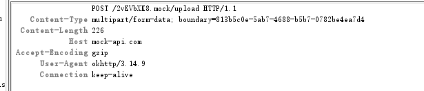

# Retrofit

# 1、基本用法

  

# 2、注解介绍

## 2.1、请求

#### 1、请求方法

| 注解名  | 参数说明                                                     |
| ------- | ------------------------------------------------------------ |
| HTTP    | **method：**表示请求的方法GET POST等；**path ：**表示路径  ；**hasBody：**表示请求体。HTTP注解可以代替以下的所有注解。 |
| GET     | value : 通常表示对应的接口，要和baseUrl结合使用              |
| POST    | 同GET                                                        |
| PUT     | 同GET                                                        |
| PATCH   | 同GET                                                        |
| DELETE  | 同GET                                                        |
| OPTIONS | 同GET                                                        |

[HTTP请求方法](https://itbilu.com/other/relate/EkwKysXIl.html)

#### 2、标记类

| 注解名         | 参数                                                         |
| -------------- | ------------------------------------------------------------ |
| FormUrlEncoded | 用于POST请求，表示请求体是一个Form表单，常见的网址登录就是这种类型，对应的HEAD参数是Content-Type：application/x-www-form-urlencoded |
| Multipart      | 用于POST请求，表单上传文件时使用                             |
| Streaming      | 表示响应体的数据使用流的方式返回处理，主要用于文件下载       |

[HTTP content-type](https://www.runoob.com/http/http-content-type.html)

#### 3、参数类

| 注解名    | 说明                                                         |
| --------- | ------------------------------------------------------------ |
| Url       | 参数里带了Url注解的会替换掉baseUrl                           |
| Path      | 替换Url中的某个路径参数                                      |
| Headers   | 多个请求头，作用于方法，**不可作为参数**                     |
| Header    | 单个请求头                                                   |
| HeaderMap | 多个请求头                                                   |
| Query     | GET请求，请求参数                                            |
| QueryMap  | GET请求，多个同类型请求参数                                  |
| Field     | Post请求，请求参数，和FormUrlEncoded一起使用                 |
| FieldMap  | Post请求，多个同类型请求参数，和FormUrlEncoded一起使用       |
| Part      | 文件上传，和注解Multipart一起使用                            |
| PartMap   | 文件上传，和注解Multipart一起使用                            |
| Body      | 多个不同类型的参数，使用对象包裹参数，包括文件上传时需要的参数，**不能和FormUrlEncoded同时使用** |

文件上传时有2种方式 RequestBody  和 MultiPart使用？？？

[这是一份很详细的 Retrofit 2.0 使用教程](https://blog.csdn.net/carson_ho/article/details/73732076)

[Retrofit学习之文件和参数上传](https://www.jianshu.com/p/74b7da380855)

# 3、调用流程

# 4、RequestFactory

# 5、Converter.Factory

# 6、CallAdapter.Factory