# 数据结构和算法之美

# 一、入门

## 1.1 核心数据结构和算法

10 个数据结构：数组、链表、栈、队列、散列表、二叉树、堆、跳表、图、Trie 树；

10 个算法：递归、排序、二分查找、搜索、哈希算法、贪心算法、分治算法、回溯算法、动态规划、字符串匹配算法。

1. 边学边练，适度刷题
2. 多问、多思考、多互动
3. 打怪升级学习法
4. 知识需要沉淀，不要想试图一下子掌握所有


## 1.2 复杂度分析

### 1、时间复杂度

大 O 时间复杂度实际上并不具体表示代码真正的执行时间，而是表示代码执行时间随数据规模增长的变化趋势，所以，也叫作渐进时间复杂度（asymptotic time complexity），简称时间复杂度。

1. 只关注循环执行次数最多的一段代码

2. 加法法则：总复杂度等于量级最大的那段代码的复杂度

3. 乘法法则：嵌套代码的复杂度等于嵌套内外代码复杂度的乘积

### 2、几种常见时间复杂度实例分析

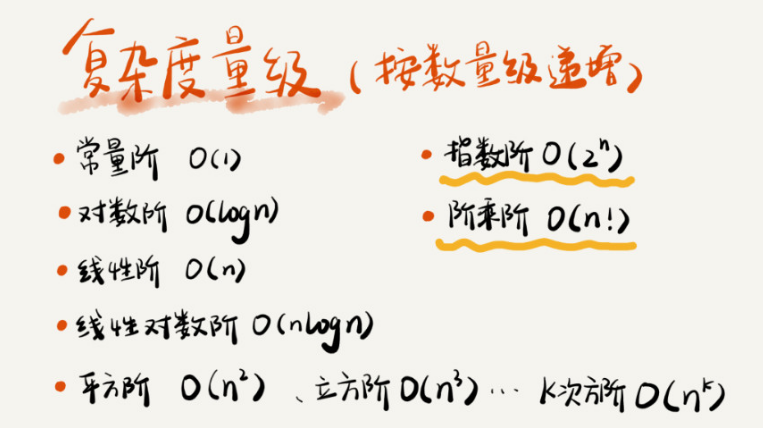

对于刚罗列的复杂度量级，我们可以粗略地分为两类，多项式量级和非多项式量级。其中，非多项式量级只有两个：O(2n) 和 O(n!)。

我们把时间复杂度为非多项式量级的算法问题叫作 NP（Non-Deterministic Polynomial，非确定多项式）问题。

当数据规模 n 越来越大时，非多项式量级算法的执行时间会急剧增加，求解问题的执行时间会无限增长。所以，非多项式时间复杂度的算法其实是非常低效的算法。因此，关于 NP 时间复杂度我就不展开讲了。我们主要来看几种常见的多项式时间复杂度。

#### 1. O(1)

首先你必须明确一个概念，O(1) 只是常量级时间复杂度的一种表示方法，并不是指只执行了一行代码。比如这段代码，即便有 3 行，它的时间复杂度也是 O(1），而不是 O(3)。

```
 int i = 8;
 int j = 6;
 int sum = i + j;
```

我稍微总结一下，只要代码的执行时间不随 n 的增大而增长，这样代码的时间复杂度我们都记作 O(1)。或者说，一般情况下，只要算法中不存在循环语句、递归语句，即使有成千上万行的代码，其时间复杂度也是Ο(1)。

#### 2. O(logn)、O(nlogn)

对数阶时间复杂度非常常见，同时也是最难分析的一种时间复杂度。

```
 i=1;
 while (i <= n)  {
   i = i * 2;
 }
```

变量 i 的取值就是一个等比数列，
$$
2^x = n
$$
所以，这段代码的时间复杂度就是 
$$
O(log_2n）
$$
如果你理解了我前面讲的 O(logn)，那 O(nlogn) 就很容易理解了。还记得我们刚讲的乘法法则吗？**如果一段代码的时间复杂度是 O(logn)，我们循环执行 n 遍，时间复杂度就是 O(nlogn) 了。**而且，O(nlogn) 也是一种非常常见的算法时间复杂度。比如，归并排序、快速排序的时间复杂度都是 O(nlogn)。

#### 3. O(m+n)、O(m*n)

我们再来讲一种跟前面都不一样的时间复杂度，代码的复杂度由两个数据的规模来决定。

```java
int cal(int m, int n) {
  int sum_1 = 0;
  int i = 1;
  for (; i < m; ++i) {
    sum_1 = sum_1 + i;
  }

  int sum_2 = 0;
  int j = 1;
  for (; j < n; ++j) {
    sum_2 = sum_2 + j;
  }

  return sum_1 + sum_2;
}
```

### 3、空间复杂度分析

空间复杂度全称就是渐进空间复杂度（asymptotic space complexity），表示算法的存储空间与数据规模之间的增长关系。

```
void print(int n) {
  int i = 0;
  int[] a = new int[n];
  for (i; i <n; ++i) {
    a[i] = i * i;
  }

  for (i = n-1; i >= 0; --i) {
    print out a[i]
  }
}
```

跟时间复杂度分析一样，我们可以看到，第 2 行代码中，我们申请了一个空间存储变量 i，但是它是常量阶的，跟数据规模 n 没有关系，所以我们可以忽略。第 3 行申请了一个大小为 n 的 int 类型数组，除此之外，剩下的代码都没有占用更多的空间，所以整段代码的空间复杂度就是 O(n)。

我们常见的空间复杂度就是 O(1)、O(n)、O(n2 )，像 O(logn)、O(nlogn) 这样的对数阶复杂度平时都用不到。而且，空间复杂度分析比时间复杂度分析要简单很多。所以，对于空间复杂度，掌握刚我说的这些内容已经足够了。


### 4.最好、最坏、平均、均摊时间复杂度

#### 1.最好、最坏情况时间复杂度

```
// n表示数组array的长度
int find(int[] array, int n, int x) {
  int i = 0;
  int pos = -1;
  for (; i < n; ++i) {
    if (array[i] == x) pos = i;
  }
  return pos;
}
```

该可以看出来，这段代码要实现的功能是，在一个无序的数组（array）中，查找变量 x 出现的位置。如果没有找到，就返回 -1。按照上节课讲的分析方法，这段代码的复杂度是 O(n)，其中，n 代表数组的长度。

我们在数组中查找一个数据，并不需要每次都把整个数组都遍历一遍，因为有可能中途找到就可以提前结束循环了。但是，这段代码写得不够高效。我们可以这样优化一下这段查找代码。

```
// n表示数组array的长度
int find(int[] array, int n, int x) {
  int i = 0;
  int pos = -1;
  for (; i < n; ++i) {
    if (array[i] == x) {
       pos = i;
       break;
    }
  }
  return pos;
}
```

这个时候，问题就来了。我们优化完之后，这段代码的时间复杂度还是 O(n) 吗？如果数组中第一个元素正好是要查找的变量 x，那就不需要继续遍历剩下的 n-1 个数据了，那时间复杂度就是 O(1)。但如果数组中不存在变量 x，那我们就需要把整个数组都遍历一遍，时间复杂度就成了 O(n)。所以，不同的情况下，这段代码的时间复杂度是不一样的。

为了表示代码在不同情况下的不同时间复杂度，我们需要引入三个概念：**最好情况时间复杂度、最坏情况时间复杂度和平均情况时间复杂度**。顾名思义，最好情况时间复杂度就是，在最理想的情况下，执行这段代码的时间复杂度。就像我们刚刚讲到的，在最理想的情况下，要查找的变量 x 正好是数组的第一个元素，这个时候对应的时间复杂度就是最好情况时间复杂度。同理，最坏情况时间复杂度就是，在最糟糕的情况下，执行这段代码的时间复杂度。就像刚举的那个例子，如果数组中没有要查找的变量 x，我们需要把整个数组都遍历一遍才行，所以这种最糟糕情况下对应的时间复杂度就是最坏情况时间复杂度。

#### 2. 平均情况时间复杂度 &  期望时间复杂度

平均时间复杂度又该怎么分析呢？我还是借助刚才查找变量 x 的例子来给你解释。要查找的变量 x 在数组中的位置，有 n+1 种情况：在数组的 0～n-1 位置中和不在数组中。我们把每种情况下，查找需要遍历的元素个数累加起来，然后再除以 n+1，就可以得到需要遍历的元素个数的平均值，即：
$$
\frac{1+2+3+n+n}{n+1} =\frac{n(n+3)/2}{(n+1)}
$$
我们知道，时间复杂度的大 O 标记法中，可以省略掉系数、低阶、常量，所以，咱们把刚刚这个公式简化之后，得到的平均时间复杂度就是 O(n)。

这个结论虽然是正确的，但是计算过程稍微有点儿问题。究竟是什么问题呢？我们刚讲的这 n+1 种情况，出现的概率并不是一样的。我带你具体分析一下。

我们知道，要查找的变量 x，要么在数组里，要么就不在数组里。这两种情况对应的概率统计起来很麻烦，为了方便你理解，我们假设在数组中与不在数组中的概率都为 1/2。另外，要查找的数据出现在 0～n-1 这 n 个位置的概率也是一样的，为 1/n。所以，根据概率乘法法则，要查找的数据出现在 0～n-1 中任意位置的概率就是 1/(2n)。

因此，前面的推导过程中存在的最大问题就是，没有将各种情况发生的概率考虑进去。如果我们把每种情况发生的概率也考虑进去，那平均时间复杂度的计算过程就变成了这样：


**这个值就是概率论中的加权平均值，也叫作期望值，所以平均时间复杂度的全称应该叫加权平均时间复杂度或者期望时间复杂度。**

在大多数情况下，我们并不需要区分最好、最坏、平均情况时间复杂度三种情况。像我们上一节课举的那些例子那样，很多时候，我们使用一个复杂度就可以满足需求了。只有同一块代码在不同的情况下，时间复杂度有量级的差距，我们才会使用这三种复杂度表示法来区分。

#### 3. 均摊时间复杂度

均摊时间复杂度，听起来跟平均时间复杂度有点儿像。对于初学者来说，这两个概念确实非常容易弄混。我前面说了，大部分情况下，我们并不需要区分最好、最坏、平均三种复杂度。平均复杂度只在某些特殊情况下才会用到，而均摊时间复杂度应用的场景比它更加特殊、更加有限。

```java
 // array表示一个长度为n的数组
 // 代码中的array.length就等于n
 int[] array = new int[n];
 int count = 0;
 
 void insert(int val) {
    if (count == array.length) {
       int sum = 0;
       for (int i = 0; i < array.length; ++i) {
          sum = sum + array[i];
       }
       array[0] = sum;
       count = 1;
    }

    array[count] = val;
    ++count;
 }
```

码实现了一个往数组中插入数据的功能。当数组满了之后，也就是代码中的 count == array.length 时，我们用 for 循环遍历数组求和，并清空数组，将求和之后的 sum 值放到数组的第一个位置，然后再将新的数据插入。但如果数组一开始就有空闲空间，则直接将数据插入数组。

那这段代码的时间复杂度是多少呢？你可以先用我们刚讲到的三种时间复杂度的分析方法来分析一下。最理想的情况下，数组中有空闲空间，我们只需要将数据插入到数组下标为 count 的位置就可以了，所以最好情况时间复杂度为 O(1)。最坏的情况下，数组中没有空闲空间了，我们需要先做一次数组的遍历求和，然后再将数据插入，所以最坏情况时间复杂度为 O(n)。那平均时间复杂度是多少呢？答案是 O(1)。我们还是可以通过前面讲的概率论的方法来分析。

假设数组的长度是 n，根据数据插入的位置的不同，我们可以分为 n 种情况，每种情况的时间复杂度是 O(1)。除此之外，还有一种“额外”的情况，就是在数组没有空闲空间时插入一个数据，这个时候的时间复杂度是 O(n)。而且，这 n+1 种情况发生的概率一样，都是 1/(n+1)。所以，根据加权平均的计算方法，我们求得的平均时间复杂度就是：


至此为止，前面的最好、最坏、平均时间复杂度的计算，理解起来应该都没有问题。但是这个例子里的平均复杂度分析其实并不需要这么复杂，不需要引入概率论的知识。这是为什么呢？我们先来对比一下这个 insert() 的例子和前面那个 find() 的例子，你就会发现这两者有很大差别。

首先，find() 函数在极端情况下，复杂度才为 O(1)。但 insert() 在大部分情况下，时间复杂度都为 O(1)。只有个别情况下，复杂度才比较高，为 O(n)。这是 insert()第一个区别于 find() 的地方。

我们再来看第二个不同的地方。对于 insert() 函数来说，O(1) 时间复杂度的插入和 O(n) 时间复杂度的插入，出现的频率是非常有规律的，而且有一定的前后时序关系，一般都是一个 O(n) 插入之后，紧跟着 n-1 个 O(1) 的插入操作，循环往复。

所以，针对这样一种特殊场景的复杂度分析，我们并不需要像之前讲平均复杂度分析方法那样，找出所有的输入情况及相应的发生概率，然后再计算加权平均值。针对这种特殊的场景，我们引入了一种更加简单的分析方法：摊还分析法，通过摊还分析得到的时间复杂度我们起了一个名字，叫均摊时间复杂度。

究竟如何使用摊还分析法来分析算法的均摊时间复杂度呢？我们还是继续看在数组中插入数据的这个例子。每一次 O(n) 的插入操作，都会跟着 n-1 次 O(1) 的插入操作，所以把耗时多的那次操作均摊到接下来的 n-1 次耗时少的操作上，均摊下来，这一组连续的操作的均摊时间复杂度就是 O(1)。这就是均摊分析的大致思路。你都理解了吗？

均摊时间复杂度和摊还分析应用场景比较特殊，所以我们并不会经常用到。为了方便你理解、记忆，我这里简单总结一下它们的应用场景。如果你遇到了，知道是怎么回事儿就行了。对一个数据结构进行一组连续操作中，大部分情况下时间复杂度都很低，只有个别情况下时间复杂度比较高，而且这些操作之间存在前后连贯的时序关系，这个时候，我们就可以将这一组操作放在一块儿分析，看是否能将较高时间复杂度那次操作的耗时，平摊到其他那些时间复杂度比较低的操作上。而且，在能够应用均摊时间复杂度分析的场合，一般均摊时间复杂度就等于最好情况时间复杂度。

尽管很多数据结构和算法书籍都花了很大力气来区分平均时间复杂度和均摊时间复杂度，但其实我个人认为，**均摊时间复杂度就是一种特殊的平均时间复杂度**，我们没必要花太多精力去区分它们。你最应该掌握的是它的分析方法，摊还分析。至于分析出来的结果是叫平均还是叫均摊，这只是个说法，并不重要。

# 二、线性表

## 2.1 数组

数组是一种线性表，存储时是**连续的**内存空间和相同类型的数据。

### 1、插入和删除

数组插入和删除过程中均需要搬移数据。

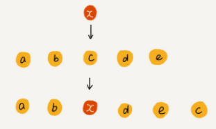

平均的搬移次数为 :
$$
（n-i）/2
$$
i 表示插入的位置。

### 2、容器vs数组

- ArrayList 的优势：就是可以将很多数组操作的细节封装起来。比如前面提到的数组插入、删除数据时需要搬移其他数据等。另外，它还有一个优势，就是支持动态扩容。
- 数组的优势：1.Java ArrayList 无法存储基本类型，比如 int、long，需要封装为 Integer、Long 类，而 Autoboxing、Unboxing 则有一定的性能消耗，所以如果特别关注性能，或者希望使用基本类型，就可以选用数组。2.如果数据大小事先已知，并且对数据的操作非常简单，用不到 ArrayList 提供的大部分方法，也可以直接使用数组。3.要表示多维数组时，用数组往往会更加直观。比如 Object[][] array；而用容器的话则需要这样定义：ArrayList <ArrayList<Object>>


## 2.2 链表

线性表，具有非连续的存储空间。存储单元除了存储元素信息外，还需存储后继节点的地址。

### 1、类型

- 单链表： 每个链表的结点除了存储数据之外，还需要记录链上的下一个结点的地址，尾结点的指针指向null。
- 双向链表：支持两个方向，每个结点不止有一个后继指针 next 指向后面的结点，还有一个前驱指针 prev 指向前面的结点。

- 循环链表：能通过任何一个节点找到其他所有的节点，将两种(双向/单向)链表的最后一个结点指向第一个结点从而实现循环。

### 2、插入和删除

#### 单链表

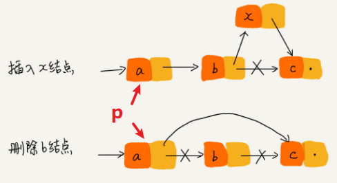

```c
p->next = x;  // 将p的next指针指向x结点；
x->next = p->next;  // 将x的结点的next指针指向b结点；
```

插入时这两句话的顺序不可交换，否则第二行代码的 x->next = p->next（x）；x->next 指向了自己，整个列表断裂开来。

对于删除：

```
p -> next = p->next ->next;
```

#### 双向链表

插入时：

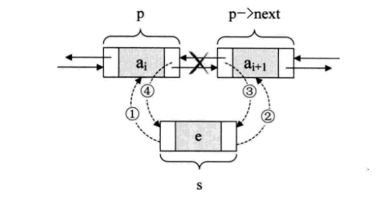

```
s->pre = p; // s的前驱
s->next = p->next; // s的后继
p->next->pre = s; // p的后继的前驱 = s
p->next = s; // p的后继 = s
```

删除时：

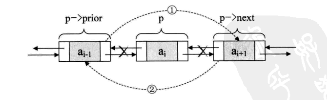

```
p->next->pre = p->pre; // p的后继的前驱 = p的前驱
p->pre->next = p->next; // p的前驱的后继 = p的后继
```

**指针的理解：**将某个变量赋值给指针，实际上就是将这个变量的地址赋值给指针**，或者反过来说，指针中存储了这个变量的内存地址，指向了这个变量，通过指针就能找到这个变量。

### 3、头结点vs头指针

头指针：链表的第一个节点称为头指针。

头结点：为方便对单链表进行操作，通常会在单链表第一个节点前附设一个节点称为头结点。头节点的数据域可以不存储任何元素也可以存储链表的大小。**使用头结点可以简化插入第一个节点以及删除最后一个节点时的操作。**

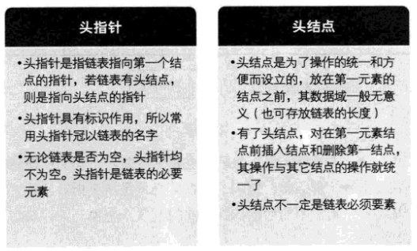

### 4、链表vs数组性能

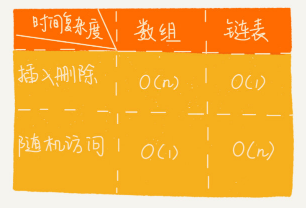


# 三、栈与队列

## 3.1  栈

限定仅在表尾进行插入和删除操作的线性表，元素具有后进先出（LIFO）的特性。

那栈可以用来解决哪些问题呢？

### 1、递归

我们先看一个经典的递归例子，斐波那契数列数列。兔子出生2个月后，就有繁殖能力，一对兔子每个月能生一对小兔子，不考虑死亡的情况下，一年能有多少对对兔子？

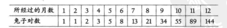

转换成数学公式就是：

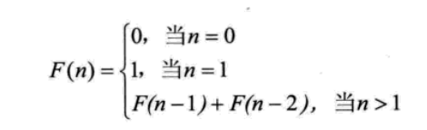

使用递归实现：

```java
int f(int n) { 
	if (n == 0) 
		return 1;
	if (n == 1) 
		return 1; 
	return f(n-1) + f(n-2);
}
```

### 2、四则运算
平时我们所用的四则表达式又称为中辍表达式，除了加减乘除等符号外还有括号等等，能够改变运算符执行优先级，导致很难转换成合适的计算指令。如果要通过机器计算，常见的方法是将中缀表达式转化为后缀表达式（逆波兰），去除原来表达式中的括号，因为括号只指示运算顺序，不是实际参与计算的元素。同时使得运算顺序有规律可寻，计算机能编写出代码完成计算。比如 9 + (3 - 1) * 2 + 10 / 2 转换成后缀表达式就是 9 3 1 - 3 * + 10 2 / +。

- 中缀表达式转化后缀表达式规则：从左到右遍历中缀表达式的每个数字和符号，若是数字就输出，即成为后缀表达式的一部分；若是符号，则判断其与栈顶符号的优先级，是右括号或优先级低于栈顶符号（乘除优先加减）则栈顶元素依次出栈并输出（右括号匹配到左括号），并将当前符号进栈，一直到最终输出后缀表达式为止。
- 后缀表达式计算法：从左到右遍历表达式的每个数字和符号，遇到数字就进栈，遇到符号就将处于栈顶的两个数字出栈，一直到最终获得结果。

将以上2步结合起来的规则如下：

先建立两个栈，一个保存操作数的栈，另一个是保存运算符的栈。从左向右遍历表达式，当遇到数字，我们就直接压入操作数栈；

当遇到运算符，就与运算符栈的栈顶元素进行比较；如果比运算符栈顶元素的优先级高，就将当前运算符压入栈；如果比运算符栈顶元素的优先级低或者相同，从运算符栈中取栈顶运算符，从操作数栈的栈顶取 2 个操作数，然后进行计算，再把计算完的结果压入操作数栈，继续比较。

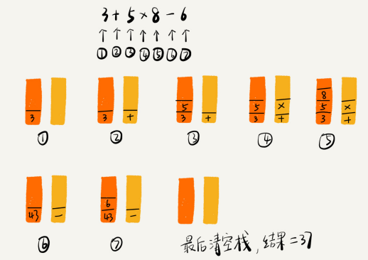

## 3.2 队列

限定在一端进行插入，而在另一端进行删除操作的线性表，具有FIFO特性。

### 1、顺序队列

使用数组实现的队列，队头和队尾分别用2个指针表示，font指队头的第一个元素，rear指队尾的下一个元素。在入队和出队的过程中通过指针移动来查找元素。

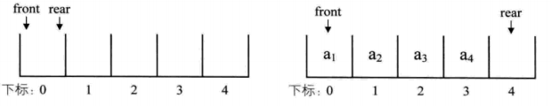

此种方式存在的问题：1.队满时，rear指针数组越界；2.队满时，队列存在空闲元素，假溢出情况。

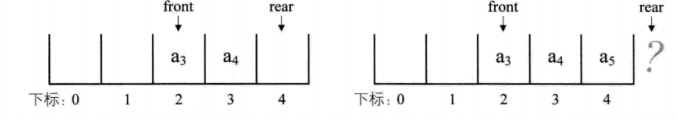

对于这个问题其中的一种解决方案是在队满时进行整体搬移。

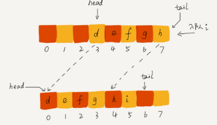


这种方案会导致入队的最坏时间复杂度变成O(n)，更好的解决方案是采用循环队列。

### 2、循环队列

将队列的头尾相接。

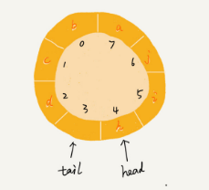

对于循环队列，队空的条件是：rear == front；**队满条件为：(rear +1)%n=front。**对应的入队和出队操作如下：

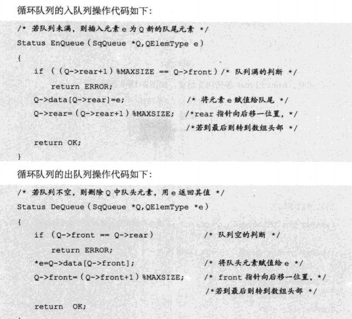

### 3、链式队列

#### 1、入队

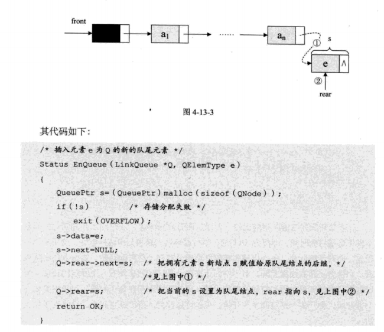

#### 2、出队

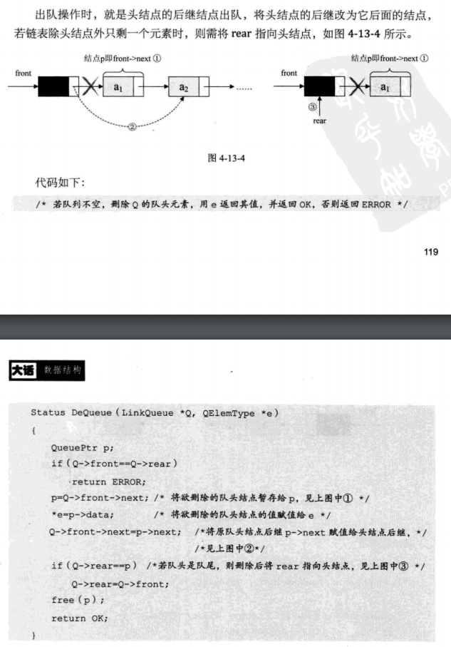

# 四、串

由0个或多个字符组成的有限序列，又称为字符串。

下面主要讲下串的匹配算法。

### 1、朴素模式

#### 1、原理

**对主串的每一个字符作为开头，与要匹配的字符串进行匹配。对主串做大循环，每个字符开头做T长度的小循环，直到匹配成功或者全部遍历完成为止。**

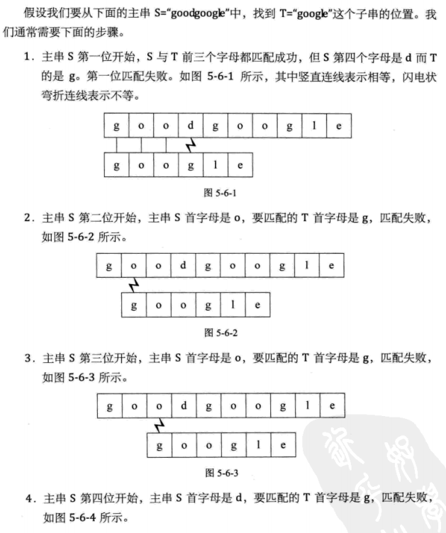

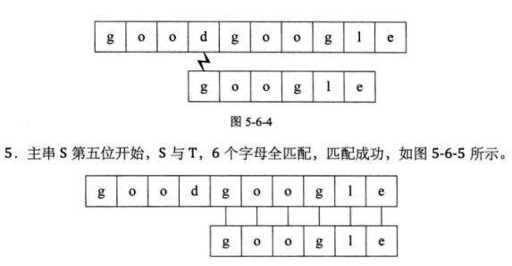


#### 2、实现

```java
public static void match(String source, String match) {
        char[] sourceArr = source.toCharArray();
        char[] matchArr = match.toCharArray();

        int index = -1;
        for (int i = 0; i < sourceArr.length; i++) {
            // 如果第一位相等了，就迭代里面循环
            if (sourceArr[i] == matchArr[0]) {
                // 开始比较第二位到最后一位
                int j = 1;
                while (j < matchArr.length) {
                    // 当出现不相当的情况时，提前终止循环
                    if (sourceArr[i + j] != matchArr[j]) {
                        break;
                    }
                    j++;
                }
                // 若子串比较到最后，没有提前退出循环，说明匹配成功
                if (j ==  matchArr.length) {
                    index = i;
                    break;
                }
            }
        }

        if (index >= 0) {
            System.out.println("matched, from source index " + index);
        } else {
            System.out.println("not matched ");
        }
    }
```

### 2、KMP匹配(再理解一下)

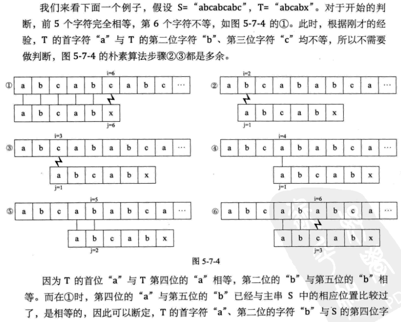

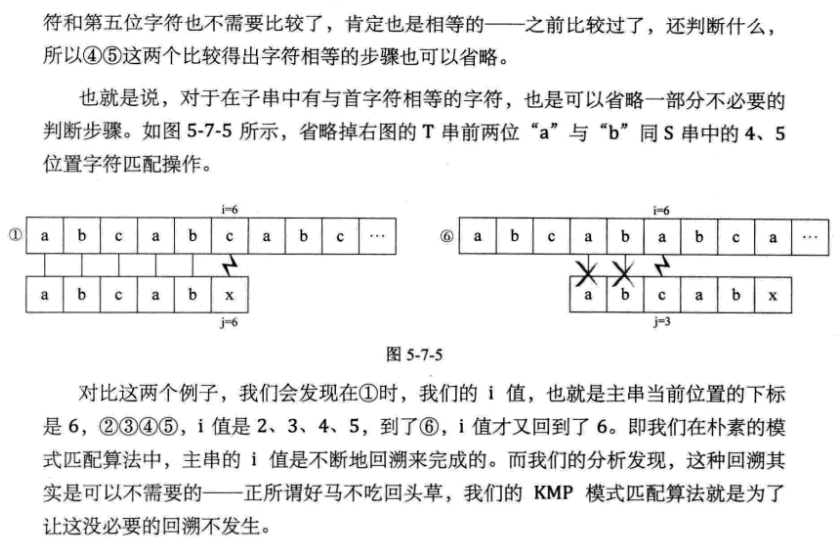


#### 1、原理

KMP算法通过寻找子串字符的规律，与主串匹配过程中，若发现失配，将子串回溯到合适位置，重新适配，直至匹配到主串结束或者匹配到子串。 

https://wiki.jikexueyuan.com/project/kmp-algorithm/define.html

#### 2、部分匹配表（pmt） & next数组

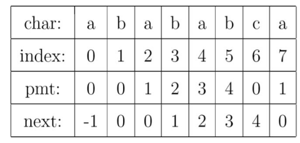

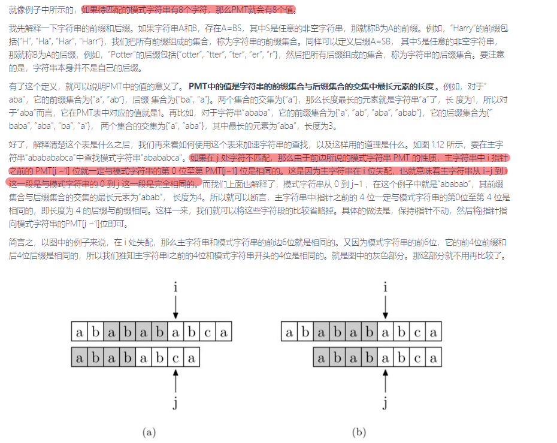

总结下：

- 失配时，模式串向右移动的距离 = 失配字符所在位置 - 失配字符对应的next值，也就是说jj回溯的距离 = j - next[j]；相当于索引从 j 变为了 next[j]。
- next表 = 部分匹配表整体右移一位；

[KMP算法理解及java实现](https://www.cnblogs.com/Yintianhao/p/9996524.html)

#### 3、next数组实现

```
 private static int[] getNext(char[] match) {
        int size = match == null ? 0 : match.length;
        if (size == 0) {
            return new int[]{0};
        }
        int[] next = new int[size];
        next[0] = -1;
        int k = -1;
        int i = 0;
        while (i < size - 1) {
            if (k == -1 || next[i] == next[k]) {
                i++;
                k++;
                next[i] = k;
            } else {
                k = next[k];
            }
        }
        return next;
    }
```

#### 4、next数组优化

```
private static int[] getNextMore(char[] match) {
    int size = match == null ? 0 : match.length;
    if (size == 0) {
        return new int[]{0};
    }
    int[] next = new int[size];
    next[0] = -1;
    int k = -1; // k代表前缀
    int j = 0; // j代表后缀
    while (j < size - 1) {
        if (k == -1 || match[k] == match[j]) {
            j++;
            k++;
            if (match[k] != match[j]) {
                next[j] = k;
            } else {
                // 前缀和后缀相同情况下，那么当前后缀的回溯==前缀的回溯
                next[j] = next[k];
            }
        } else {
            k = next[k];
        }
    }
    return next;
}
```

#### 5、KMP实现

```java
int[] next = getNext(matchArr);

int i = 0;
int j = 0;
while (i < sourceArr.length && j < matchArr.length) {
    // j == -1 表示的是第一个字符
    // 当字符串相同时，继续遍历
    if (j == -1 || sourceArr[i] == matchArr[j]) {
        i++;
        j++;
    } else {
        // 字符串不同时子串索引j开始回溯
        j = next[j];
    }
}

// 若子串迭代结束到最后，说明匹配到了
if (j == matchArr.length) {
    System.out.println("matched, from source index" + (i - j));
} else {
    System.out.println("not matched");
}
```

#### 6、性能

所以，如果文本串的长度为 n，模式串的长度为 m，那么匹配过程的时间复杂度为 O(n)，算上计算 next 的 O(m) 时间，KMP 的整体时间复杂度为 O(m + n)。

### 3、BM算法


# 五、树(0907-0916)

## 5.1 树的定义

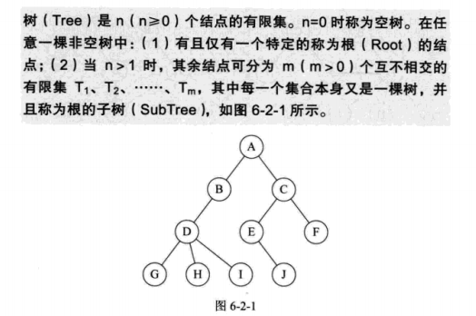

### 1、度

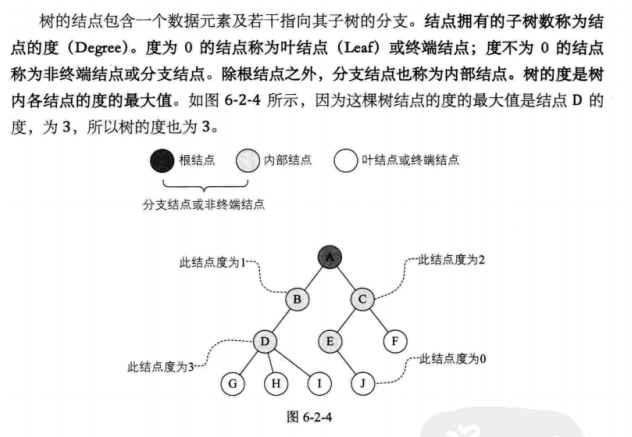

### 2、深度和层次

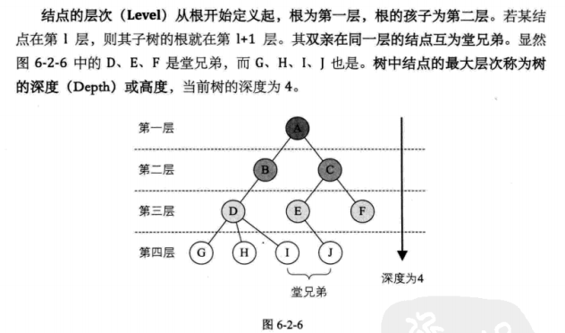

## 5.2 二叉树

二叉树，顾名思义，每个节点最多有两个“叉”，也就是两个子节点，分别是左子节点和右子节点。不过，二叉树并不要求每个节点都有两个子节点，有的节点只有左子节点，有的节点只有右子节点。

### 1、二叉树的类型

#### 1、满二叉树

除了叶子节点之外，每个节点都有左右两个子节点，这种二叉树就叫做满二叉树。

#### 2、完全二叉树

最后一层的叶子节点都靠左排列，并且除了最后一层，其他层的节点个数都要达到最大，这种二叉树叫做完全二叉树。

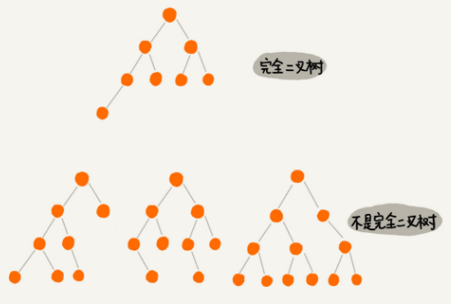

#### 3、斜树

所有节点都只有左子树或者右子树。所有节点都只有左子树的二叉树叫左斜树，所有节点只有右子树二叉树叫斜树。

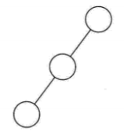

### 2、二叉树的性质

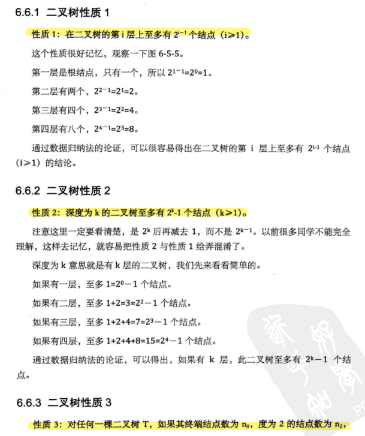

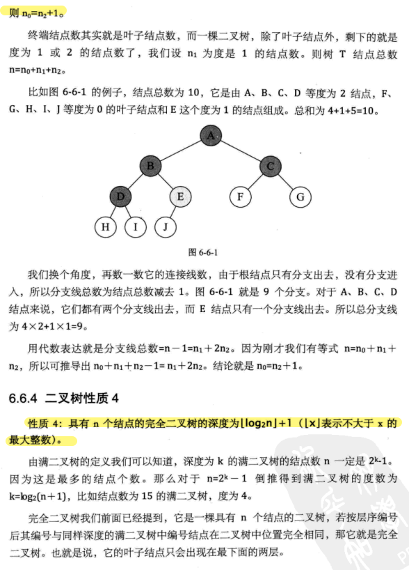

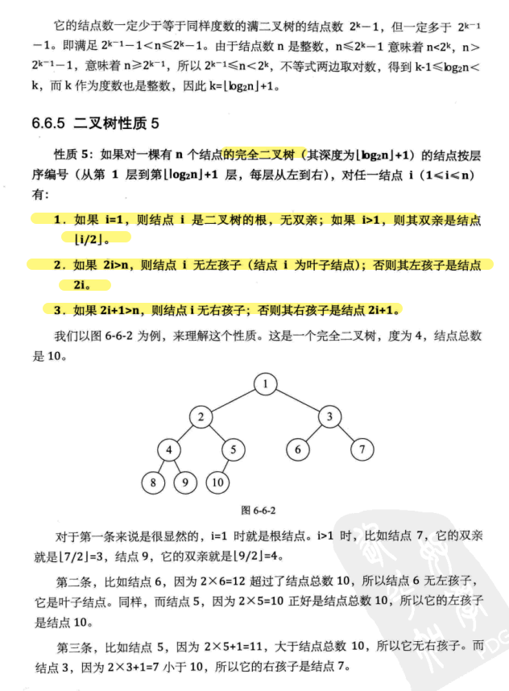

### 3、二叉树的存储

存储一棵二叉树，有两种方法，一种是基于指针或者引用的二叉链式存储法，一种是基于数组的顺序存储法。

#### 1、链式存储

我们只要拎住根节点，就可以通过左右子节点的指针，把整棵树都串起来。这种存储方式我们比较常用。大部分二叉树代码都是通过这种结构来实现的。

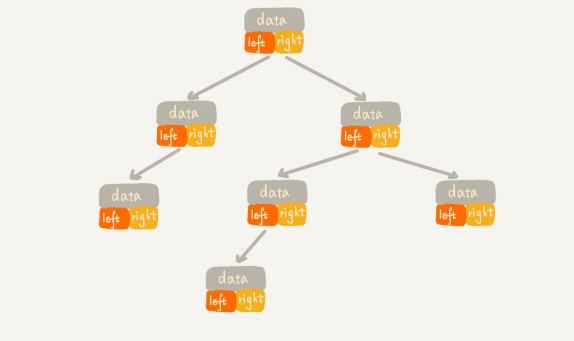


#### 2、顺序存储

基于数组的顺序存储法。我们把根节点存储在下标 i = 1 的位置，**那左子节点存储在下标 2 * i = 2 的位置，右子节点存储在 2 * i + 1** = 3 的位置。以此类推，B 节点的左子节点存储在 2 * i = 2 * 2 = 4 的位置，右子节点存储在 2 * i + 1 = 2 * 2 + 1 = 5 的位置。

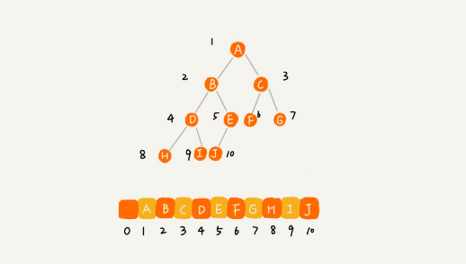

如果某棵二叉树是一棵完全二叉树，那用数组存储无疑是最节省内存的一种方式。因为数组的存储方式并不需要像链式存储法那样，要存储额外的左右子节点的指针。

### 4、二叉树的遍历

如何将所有节点都遍历打印出来呢？经典的方法有三种，前序遍历、中序遍历和后序遍历。其中，前、中、后序，表示的是节点与它的左右子树节点遍历打印的先后顺序。

- 前序遍历是指，对于树中的任意节点来说，先打印这个节点，然后再打印它的左子树，最后打印它的右子树。

  ABDGHCEIF

  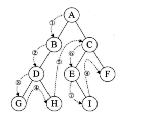

- 中序遍历是指，对于树中的任意节点来说，先打印它的左子树，然后再打印它本身，最后打印它的右子树。

  GDHBAEICF

  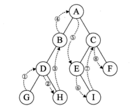

- 后序遍历是指，对于树中的任意节点来说，先打印它的左子树，然后再打印它的右子树，最后打印这个节点本身。GHDBIEFCA

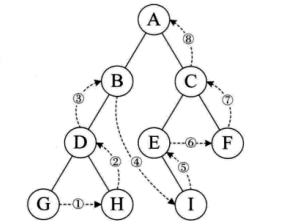

此外还有一种遍历方式叫层序遍历，顾名思义，从上至下，一层一层遍历。ABCDEFGHI

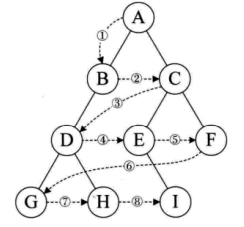

### 5、遍历顺序复原二叉树

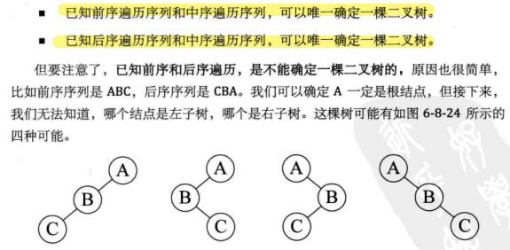


## 5.3 树、森林与二叉树的转换

### 1、树转换为二叉树

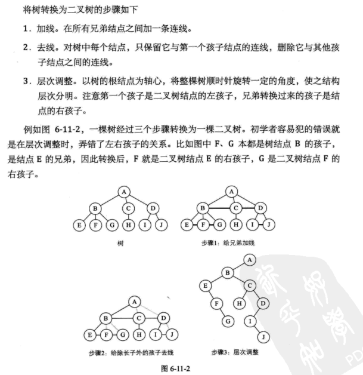

### 2、森林转换为二叉树

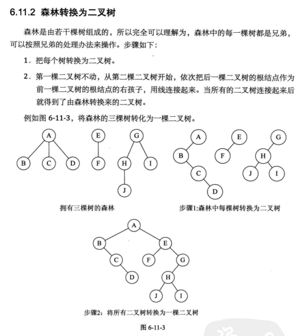

### 3、二叉树转换为树

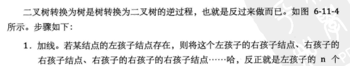

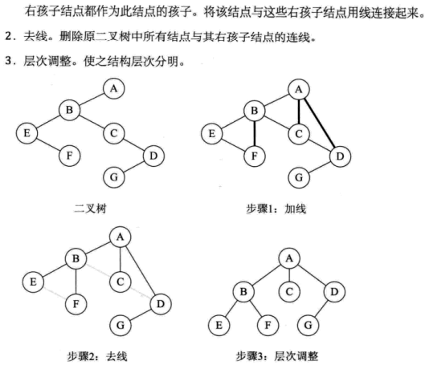

### 4、二叉树转化为森林

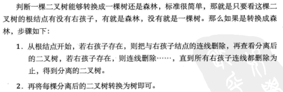

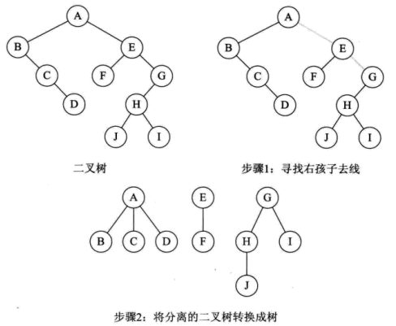


## 5.5 赫夫曼树

带权路径和最短的树，提升排序和查找的效率。

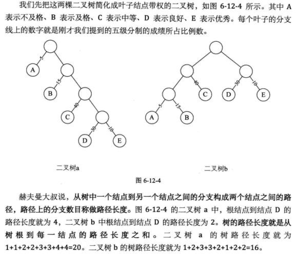

### 1、哈夫曼树的构造

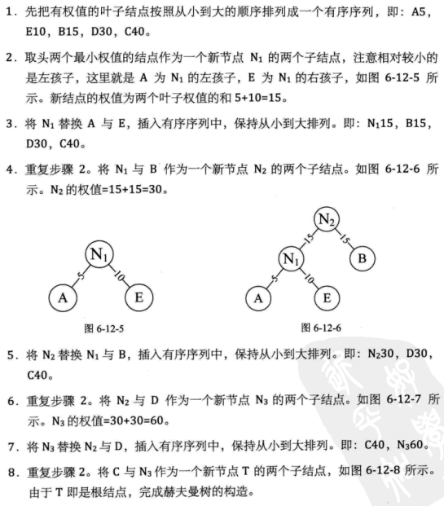

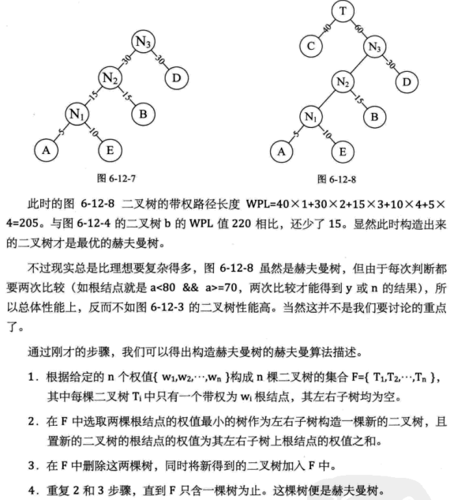

### 2、哈夫曼编码

哈夫曼树的应用很广，哈夫曼编码就是其在电讯通信中的应用之一。广泛地用于数据文件压缩的十分有效的编码方法。其压缩率通常在20%～90%之间。在电讯通信业务中，通常用二进制编码来表示字母或其他字符，并用这样的编码来表示字符序列。 

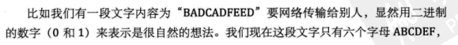

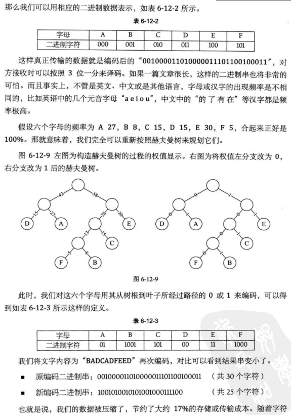

# 六、图(0917 - 0924)

## 6.1 图

### 1、定义

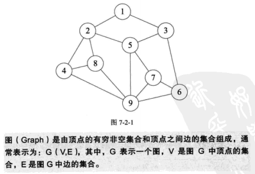

#### 1、无向图和有向图

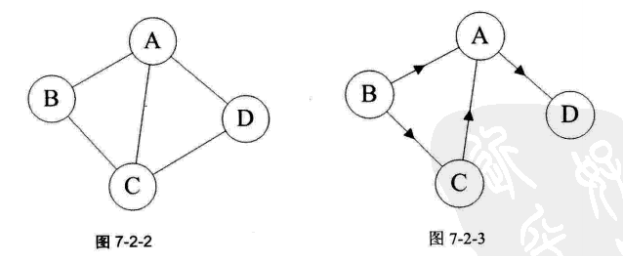

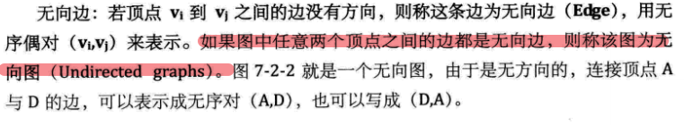

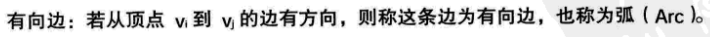

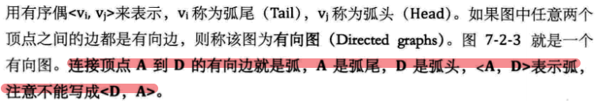

#### 2、网

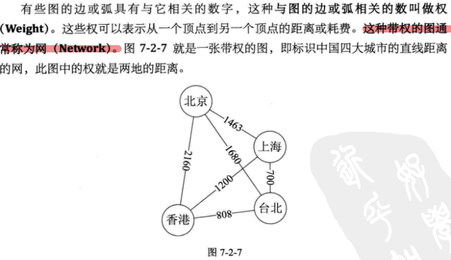

#### 3、环

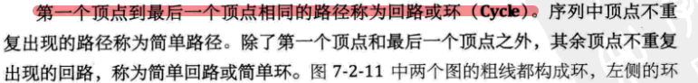

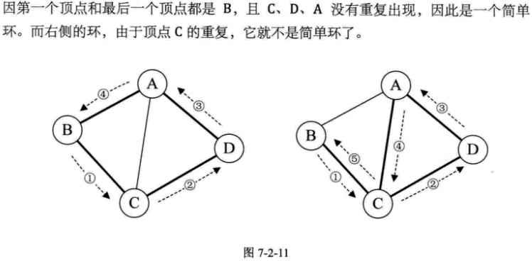

### 2、存储结构

#### 1、邻接矩阵

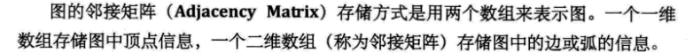

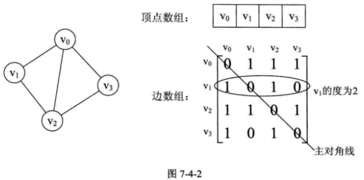

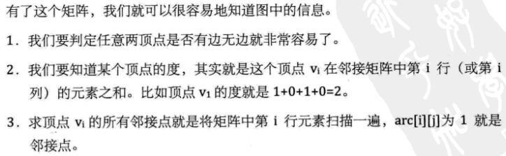

邻接矩阵在边数相对较少的情况下，存在存储空间浪费的情况。

#### 2、邻接表

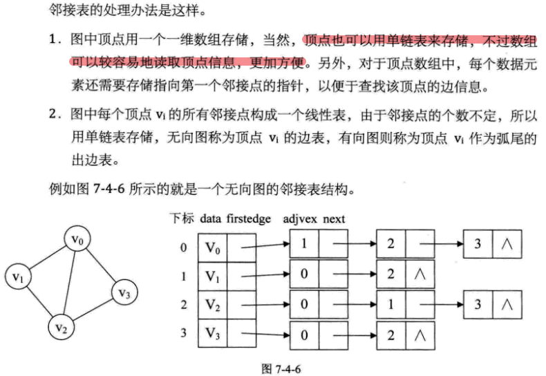

对于有向图，邻接表是顶点作为弧尾来存储边表，这样可以很容易的确定顶点的出度；有时为了更方便的确定顶点的入度，会采用逆领接表的方式存储数据。

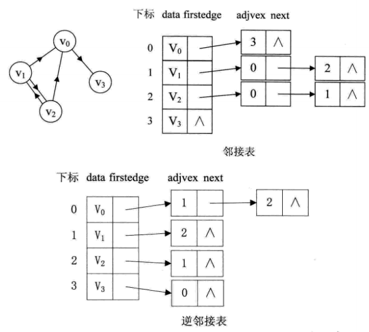

### 3 、遍历

从图的某一个顶点出发访遍图中的其余顶点，且使每一个顶点仅被访问一次，这一过程就叫做图的遍历。

#### 1、深度优先遍历DFS

每次遍历当前访问顶点的临界点，一直到访问的顶点没有未被访问过的临界点为止。然后采用依次回退的方式，查看来的路上每一个顶点是否有其它未被访问的临界点。访问完成后，判断图中的顶点是否已经全部遍历完成，如果没有，以未访问的顶点为起始点，重复上述过程。

#### 2、广度优先遍历BFS

广度优先搜索类似于树的层次遍历。从图中的某一顶点出发，遍历每一个顶点时，依次遍历其所有的邻接点，然后再从这些邻接点出发，同样依次访问它们的邻接点。按照此过程，直到图中所有被访问过的顶点的邻接点都被访问到。

## 6.2 最小生成树

构造连通网的最小代价生成树称为最小生成树。找到连通网的最小树，通常有2种做法分别是：

1. Prim算法是以点为对象，挑选与点相连的最短边来构成最小生成树。
2. Kruskal算法是以边为对象，不断地加入新的不构成环路的最短边来构成最小生成树。

### 1、Prim算法

基本原理：

1. 从某个点开始，查找当前点可以访问的所有边；
2. 找到离当前顶点权值最小的边，并且将该顶点加入到集合V[]。
3. 寻找当前集合可以访问的所有边，重复2过程，直到没有新的点可以加入。

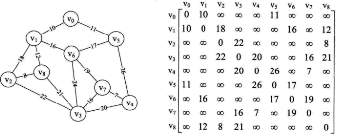


```
public static final int INF = 65535;
public static void miniTree(int[][] arr) {
    int n = arr.length;
    // 边的集合,访问过的顶点标记为0
    // 初始化为第0行的数组
    int[] lowCost = arr[0];
    // 记录访问的节点顺序
    int[] path = new int[n];
    // 路径长度
    int sum = 0;
    // 默认从第一个顶点开始查找
    int k = 0;
    // 记录查找到的顶点
    lowCost[k] = 0;
    path[k] = 0;
    for (int i = 1; i < n; i++) {
        int min = INF;
        // 查找当前lowest中的最小值即最短边
        for (int j = 1; j < n; j++) {
            if (lowCost[j] != 0 && lowCost[j] < min) {
                min = lowCost[j];
                k = j;
            }
        }
        //标记节点为已访问
        lowCost[k] = 0;
        path[i] = k;
        // 节点路径权值和
        sum += min;
        // 更新最短路径的边，[k,j] 新加入的节点到其余未访问节点的权值
        for (int j = 1; j < n; j++) {
            if (lowCost[j] != 0 && arr[k][j] < lowCost[j]) {
                lowCost[j] = arr[k][j];
            }
        }
    }
    System.out.println(sum);
    for (int i : path) {
        System.out.println(i);
    }
}
```

### 2、Kruskal 算法

基本原理：

1. 将边的权值从小到大排序
2. 选择最小权重的边，判断是否其在当前的生成树中形成了一个环路。如果环路没有形成，则将该边加入树中，否则放弃。
3. 重复步骤2，直到有n-1条边（n表示顶点数）

```
   public static void miniTree(int[][] graph) {
        int len = graph.length;
        //1.生成边的列表
        ArrayList<Edge> edgeList = getEdges(graph, len);
        //2.对边进行排序
        sortEdge(edgeList);
        //3.初始化的parent数组值都为0，理解为顶点都是根节点
        int[] parent = new int[len];

        //3.对边进行遍历，权值从低到高
        int edgeCount = 0;
        for (Edge edge : edgeList) {
            int root1 = findRoot(parent, edge.from);
            int root2 = findRoot(parent, edge.to);
            if (root1 != root2) { // 判断是否形成了环
                parent[root2] = root1; // 两个顶点组成树
                System.out.println("edge from = " + edge.from + ", to = " + edge.to + ", weight = " + edge.weight);
                edgeCount++;
            }
            if (edgeCount == len - 1) {// 当边的个数 = 顶点数 - 1时，构造完成
                break;
            }
        }
    }

    private static int findRoot(int[] parent, int n) {
        while (parent[n] > 0) { // 查找根节点的过程
            n = parent[n];
        }
        return n;
    }

    private static ArrayList<Edge> getEdges(int[][] arr, int len) {
        ArrayList<Edge> edgeList = new ArrayList<>();
        for (int i = 0; i < len; i++) {
            for (int j = i + 1; j < len; j++) {
                if (arr[i][j] != INF) {
                    edgeList.add(new Edge(i, j, arr[i][j]));
                }
            }
        }
        return edgeList;
    }

    private static void sortEdge(ArrayList<Edge> edgeList) {
        edgeList.sort(new Comparator<Edge>() {
            @Override
            public int compare(Edge o1, Edge o2) {
                return o1.weight - o2.weight;
            }
        });

//        for (Edge edge : edgeList) {
//            System.out.println(edge);
//        }
    }

    static class Edge {
        int from;
        int to;
        int weight;

        public Edge(int from, int to, int weight) {
            this.from = from;
            this.to = to;
            this.weight = weight;
        }

        @Override
        public String toString() {
            return "Edge{" +
                    "from=" + from +
                    ", to=" + to +
                    ", weight=" + weight +
                    '}';
        }
    }
```

## 6.3 最短路径

### 1、Dijkstra算法

### 2、Floyd算法

###   

# 七、查找(0925 - 1007)

# 八、排序（08 31 - 0904 补充完善）

1. 算法的执行效率：

   算法的时间复杂度。排序时主要关注的是比较和移动的次数。

2. 算法的稳定性：

   如果待排序的序列中存在值相等的元素，经过排序之后，相等元素之间原有的先后顺序不变。我通过一个例子来解释一下。比如我们有一组数据 2，9，3，4，8，3，按照大小排序之后就是 2，3，3，4，8，9。这组数据里有两个 3。经过某种排序算法排序之后，如果两个 3 的前后顺序没有改变，那我们就把这种排序算法叫作稳定的排序算法；如果前后顺序发生变化，那对应的排序算法就叫作不稳定的排序算法。当存在多个排序因子时，比如订单要根据金额和下单时间排序，稳定和不稳定的结果差异很大。

3. 算法的内存消耗：

   算法的空间复杂度，即进行排序时所需要的的辅助存储空间。

## 8.1 冒泡排序

**两两比较相邻记录的顺序**，如果反序则交换，直到没有反序记录为止，从小到大排。

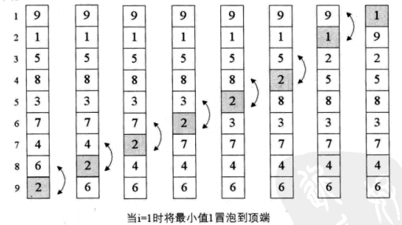

### 1、冒泡的三种实现

冒泡初级版，严格意义上非冒泡排序，只是将最小值放到这一轮的第一位，更准确的描述应该是交换排序。

```java
public static void sort0(int[] source) {
    int len = source == null ? 0 : source.length;
    if (len == 0 || len == 1) {
        System.out.println("element less 1");
        return;
    }

    for (int i = 0; i < len - 1; i++) {
        for (int j = i + 1; j < len; j++) {
            // 当前元素大于后续的元素，则进行交换，
            // 这样的结果就是每轮结束时，会找到当前轮最小的元素放到当前轮的第一位
            if (source[i] > source[j]) {
                int temp = source[i];
                source[i] = source[j];
                source[j] = temp;
            }
        }
        dump(source);
    }
    dump(source);
}

private static void dump(int[] source) {
    StringBuilder builder = new StringBuilder();
    for (int element : source) {
        builder.append(element).append(", ");
    }
    System.out.println(builder.toString());
}

```

改进版1，标准冒泡排序：第一种方式严格来讲并不是冒泡排序，不是两两相邻进行比较，每次只是比较这一轮的“第一位”和其余位置，若是逆序则交换**。两两比较过程中，会将其余位置较小的元素也往前移动。**

```java
// 冒泡排序，两两相邻比较并交换
public static void sort1(int[] source) {
    int len = source == null ? 0 : source.length;
    if (len == 0 || len == 1) {
        System.out.println("element less 1");
        return;
    }

    for (int i = 0; i < len; i++) {
        for (int j = len - 1; j > i; j--) { // 从后往前遍历
            // 前 > 后时，交换元素
            if (source[j - 1] > source[j]) {
                int temp = source[j];
                source[j] = source[j - 1];
                source[j - 1] = temp;
            }
        }
        dump(source);
    }
    dump(source);
}
```

试想一下，冒泡排序过程中，某一轮如果没有发生任何交换，那么就说明此时序列已经是有序的，就不需要再进行比较了，也就是说可以再进一步优化下。

```java
// 优化2
public static void sort2(int[] source) {
    int len = source == null ? 0 : source.length;
    if (len == 0 || len == 1) {
        System.out.println("element less 1");
        return;
    }
    for (int i = 0; i < len; i++) {
        boolean flag = false;
        for (int j = len - 1; j > i; j--) { // 从后往前遍历
            // 前 > 后时，交换元素
            if (source[j - 1] > source[j]) {
                int temp = source[j];
                source[j] = source[j - 1];
                source[j - 1] = temp;
                flag = true;
            }
        }

        // 如果某一轮没有发生元素交换，说明已经排好序了
        if (!flag) {
            break;
        }
        dump(source);
    }
    dump(source);
}
```

### 2、性能分析

- 时间复杂度

  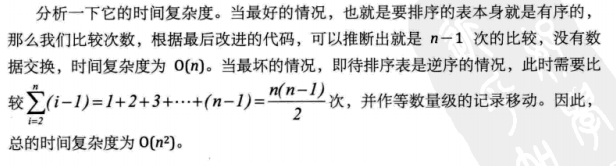

- 稳定性

  在冒泡排序中，只有交换才可以改变两个元素的前后顺序。为了保证冒泡排序算法的稳定性，当有相邻的两个元素大小相等的时候，我们不做交换，相同大小的数据在排序前后不会改变顺序，所以冒泡排序是稳定的排序算法。

- 空间复杂度

  冒泡的过程只涉及相邻数据的交换操作，只需要常量级的临时空间，所以它的空间复杂度为 O(1)。

## 8.2 选择排序

数组中的数据分为两个区间，已排序区间和未排序区间，通过n-1次遍历，每次找到未排序区间的最小元素，将其放到已排序区间末尾。

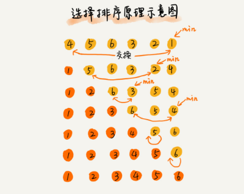

### 1、实现

```java
public static void sort0(int[] source) {
    int len = source == null ? 0 : source.length;
    if (len == 0 || len == 1) {
        System.out.println("element less 1");
        return;
    }

    for (int i = 0; i < len - 1; i++) {
        int minIndex = i;
        for (int j = i + 1; j < len; j++) {
            if (source[minIndex] > source[j]) {
                minIndex = j;
            }
        }
        if (minIndex != i) {
            int temp = source[minIndex];
            source[minIndex] = source[i];
            source[i] = temp;
        }
        SortHelper.dump(source);
    }
    SortHelper.dump(source);
}
```

### 2、性能

- 时间复杂度：

  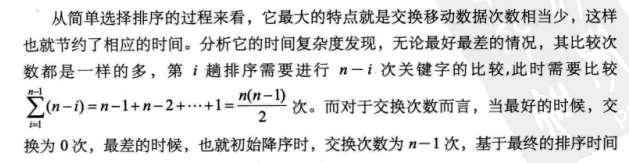

  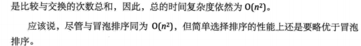

  

- 稳定性：

  选择排序是一种不稳定的排序算法。从前面画的那张图中可以看出来，选择排序每次都要找剩余未排序元素中的最小值，并和前面的元素交换位置，这样破坏了稳定性。

- 空间复杂度：O(1)

​       相比于冒泡排序，选择排序的性能略好，因为元素交换的次数较少，但是不具备稳定性。

## 8.3 插入排序

数组中的数据分为两个区间，**已排序区间和未排序区间**，初始已排序区间只有一个元素，就是数组的第一个元素。插入算法的核心思想是取未排序区间中的元素，在已排序区间中找到合适的插入位置将其插入，并保证已排序区间数据一直有序。

### 1、实现

```java
public static void sort0(int[] source) {
    int len = source == null ? 0 : source.length;
    if (len == 0 || len == 1) {
        System.out.println("element less 1");
        return;
    }
    for (int i = 1; i < len; i++) { // 从第二位开始
        int j = i;
        int temp = source[j]; //记录当前位置，若移位，当前位置会被覆盖
        for (; j > 0 && source[j - 1] > temp; j--) { // 从后往前遍历，查找插入的位置
            //若前一位值大于当前位置，前一位向后移动一位
            source[j] = source[j - 1];
        }
        source[j] = temp; // 将值插入到合适的位置
        SortHelper.dump(source);
    }
    SortHelper.dump(source);
}

// 移位判断使用while循环，更好理解一点
public static void sort1(int[] source) {
    int len = source == null ? 0 : source.length;
    if (len == 0 || len == 1) {
        System.out.println("element less 1");
        return;
    }
    for (int i = 1; i < len; i++) { // 从第二位开始
        int j = i;
        int temp = source[j];
        // 查找并移位置
        while (j > 0 && source[j - 1] > temp) {
            source[j] = source[j - 1];
            j--;
        }
        // 如果j！=i ，说明移动过了位置
        if (j != i) {
            source[j] = temp;
        }
        SortHelper.dump(source);
    }
    SortHelper.dump(source);
}
```

### 2、性能

- 时间复杂度

  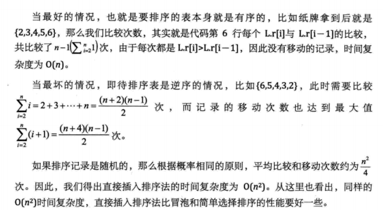

- 稳定性

  在插入排序中，对于值相同的元素，我们可以选择将后面出现的元素，插入到前面出现元素的后面，这样就可以保持原有的前后顺序不变，所以插入排序是稳定的排序算法。

- 空间复杂度：O(1)

## 8.4 希尔排序

希尔排序是将待排序的数组元素 按下标的一定增量分组 ，分成多个子序列，然后对各个子序列进行直接插入排序算法排序；然后依次缩减增量再进行排序，直到增量为1时，进行最后一次直接插入排序，排序结束。

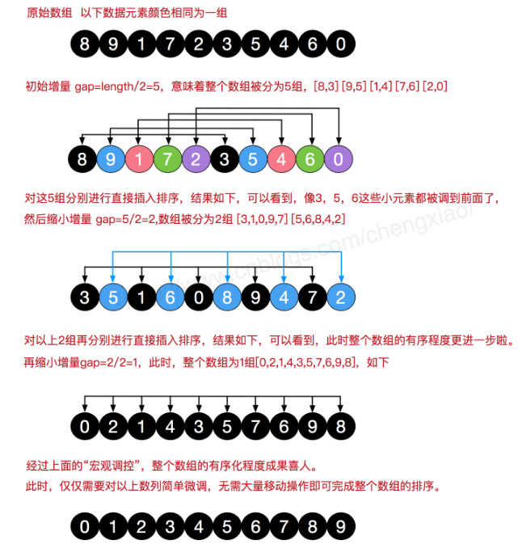

### 1、实现

```java
  public static void sort0(int[] source) {
        int len = source.length;
        // 步长循环直到1
        for (int step = len / 2; step >= 1; step /= 2) {
            // 间隔为step的插入排序
            for (int i = step; i < len; i++) {
                int temp = source[i];
                // j表示向前间隔多少位
                int j = i - step;
                // 从小到大排序，前面的数 > 后面的数，向后移动
                while (j >= 0 && source[j] > temp) {
                    source[j + step] = source[j];
                    j -= step;
                }
                //  优化，没有发生移动时，尾部不需要再赋值
                if ( j != i - step) {
                    source[j + step] = temp;
                }
            }
            SortHelper.dump(source);
        }
    }
```

### 2、性能

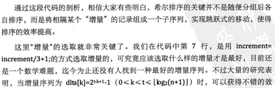

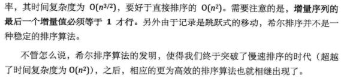

由于多次插入排序，我们知道一次插入排序是稳定的，不会改变相同元素的相对顺序，但在不同的插入排序过程中，相同的元素可能在各自的插入排序中移动，最后其稳定性就会被打乱，**所以希尔排序是不稳定的**。

## 8.5 堆排序

将待排序的序列构造成一个大顶堆，整个序列的最大值就是堆顶的根节点。将其移动到队尾，然后继续对剩余的元素进行构造，保证剩余元素也具有大顶堆的特性。

### 1、实现

```
public static void sort0(int[] source) {
    int n = source.length;
    // 建堆，从中间节点开始，中间节点必有子节点
    // 建堆的过程先自下而上，在自上而下（递归）
    for (int i = n / 2 - 1; i >= 0; i--) {
        heapify(source, n, i);
    }
    // 排序，最大值在堆顶（索引为0）
    for (int j = n - 1; j > 0; j--) {
        // 将最大值放到末尾
        swap(source, j, 0);
        // 对剩余元素继续维护堆的性质
        heapify(source, j, 0);
    }
    SortHelper.dump(source);
}

/**
 * 维护堆的算法
 *
 * @param source
 * @param n      数组长度
 * @param target      待维护节点下标
 */
private static void heapify(int[] source, int n, int target) {
    // large 表示当前最大值索引
    int large = target;
    int leftSon = target * 2 + 1;
    int rightSon = target * 2 + 2;

    if (leftSon < n && source[leftSon] > source[large]) {
        large = leftSon;
    }

    if (rightSon < n && source[rightSon] > source[large]) {
        large = rightSon;
    }
    // 若父节点小于左节点或者小于右节点，那么就要交换父子节点的值，
    // 交换完毕后，还需要对新的子节点进行维护
    if (large != target) {
        swap(source, target, large);
        // large 指向的是被交换子节点的索引，交换后索引位置的值发生了变化，需要重新维护有序性
        heapify(source, n, large);
    }
}

private static void swap(int[] source, int left, int right) {
    int temp = source[left];
    source[left] = source[right];
    source[right] = temp;
}
```

### 2、性能

第1步，把无序数组构建成二叉堆，这一步的时间复杂度是O(n) 。
第2步，需要进行n-1次循环。每次循环调用一次heapify方法，所以 第2步的计算规模是 (n-1)×logn ，时间复杂度为O(nlogn) 。 两个步骤是并列关系，所以整体的时间复杂度是O(nlogn) 。

## 8.6 归并排序

如果要排序一个数组，我们先把数组从中间分成前后两部分，然后对前后两部分分别排序，再将排好序的两部分合并在一起，这样整个数组就都有序了。

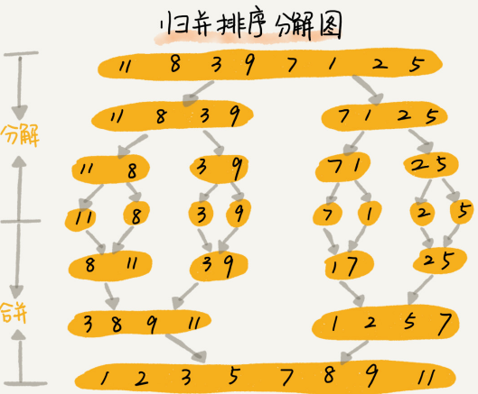

### 1、递归实现

```
public static void sort0(int[] source) {
    sort(source, 0, source.length - 1);
    SortHelper.dump(source);
}

private static void sort(int[] source, int left, int right) {
    if (left >= right) {
        return;
    }
    int center = (left + right) / 2;
    sort(source, left, center);
    sort(source, center + 1, right);
    merge(source, left, center, right);
}

private static void merge(int[] source, int left, int center, int right) {
    int[] tmp = new int[right - left + 1];
    int k = 0;
    int i = left;
    int j = center + 1;
    // 从小到大排，取较小值放到tmp数组里
    while (i <= center && j <= right) {
        if (source[i] < source[j]) {
            tmp[k++] = source[i++];
        } else {
            tmp[k++] = source[j++];
        }
    }
    // 多的元素放到末尾
    while (i <= center) {
        tmp[k++] = source[i++];
    }
    // 多的元素放到末尾
    while (j <= right) {
        tmp[k++] = source[j++];
    }
    // 将排序好的数组替换原数组相同位置
    for (int i1 = 0; i1 < tmp.length; i1++) {
        source[left + i1] = tmp[i1];
    }
}
```

### 2、迭代实现


### 3、性能

时间复杂度是 O(nlogn)，稳定的排序算法

## 8.7 快速排序

通过一趟排序将待排记录分割成独立的两部分，其中一部分的记录的关键字均比另一个部分关键字小，则可对这两部分记录进行排序，以达到整个序列有序的目的。

### 1、实现

```
private static void sort(int[] source, int left, int right) {
    if (left >= right) {
        return;
    }
    int pivot = partition(source, left, right);
    SortHelper.dump(source);
    sort(source, left, pivot - 1);
    sort(source, pivot + 1, right);
}

private static int partition(int[] source, int left, int right) {
    int pivot = source[left];
    // 从两端同时向中间遍历，将较小的数放到左边，较大的数放到右边
    while (left < right) {
        if (source[left] < pivot) {
            left ++;
        }
        if (source[right] > pivot) {
            right --;
        }
        // 左右查找到不合规则的数据时，进行交换
        swap(source,left, right);
    }
    // 当left >= right时说明，左右的数均已划分好了
    source[left] = pivot;
    return left;
}

private static void swap(int[] source, int left, int right) {
    int temp = source[left];
    source[left] = source[right];
    source[right] = temp;
}
```

### 2、优化

1. 选取合适的基准点
2. 小数组时使用插入排序
3. 尾递归优化

## 8.8 小结

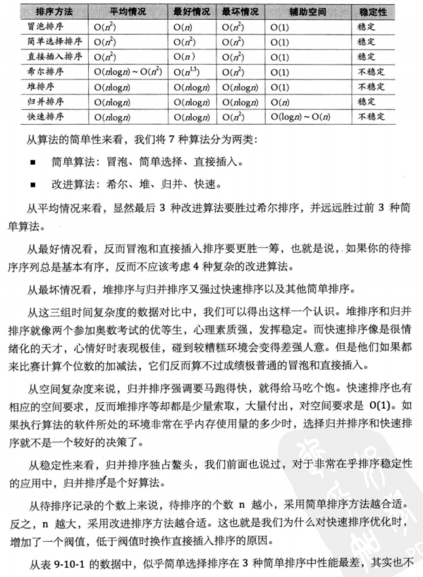

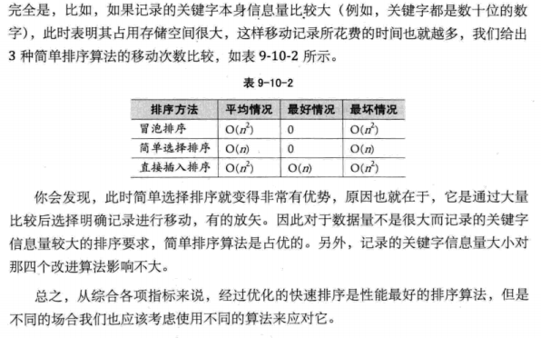